--- 
title: Guía Instalación NextCloud con Docker
description: Práctica guiada de instalación de NextCloud mediante Docker Docker por Francisco Javier Hernández Illán. Gestión de recursos compartidos en NextCloud utilizando Volúmenes persistentes. 
---

<figure style="float: right;">
    
</figure>

# NEXTCLOUD con DOCKER

- **NextCloud** Hace referencia al conjunto de herramientas software de **código abierto** con arquitectura **cliente-servidor**, que permiten la creación de **servicios de alojamiento de archivos** en servidores privados.
- Puede desempeñar un papel significativo en la **integración de sistemas operativos** al actuar como una plataforma de colaboración y gestión de archivos que opera de manera uniforme en entornos mixtos. Aquí tienes su relevancia en este contexto:

* * * * *

**1\. Plataforma Multiplataforma**

-   Nextcloud funciona en **Linux**, **Windows** y **macOS**, además de tener clientes para dispositivos móviles como Android e iOS.
-   Facilita el acceso centralizado a archivos y servicios desde cualquier sistema operativo, eliminando barreras de compatibilidad.

* * * * *

**2\. Interoperabilidad de Archivos**

-   Proporciona acceso a sistemas de archivos compartidos a través de protocolos como **WebDAV**, compatible con la mayoría de los sistemas operativos.
-   Se integra con servicios como **Samba** o **NFS**, permitiendo que los recursos compartidos en redes Windows o Linux se gestionen directamente desde Nextcloud.

!!! note "Nota"
    **WebDAV** es un grupo de trabajo del **Internet Engineering Task Force (IETF)**. El término significa **"Autoría y versionado distribuidos por Web" (Web Distributed Authoring and Versioning)**, y **se refiere al protocolo** (más precisamente, a la extensión del protocolo) que el grupo definió. Este protocolo proporciona funcionalidades para **crear, cambiar y mover documentos en un servidor remoto** (típicamente un servidor web).

* * * * *

**3\. Extensibilidad mediante Aplicaciones**

-   Las aplicaciones de Nextcloud permiten integrar otros servicios, como editores de documentos (OnlyOffice o Collabora), que operan de manera nativa en cualquier SO con un navegador.
-   A través de complementos, puede interactuar con herramientas como LDAP o Active Directory, facilitando la autenticación unificada entre distintos sistemas.

* * * * *

**4\. Sincronización Multidispositivo**

-   Permite la sincronización bidireccional de archivos entre sistemas operativos distintos, ya sean servidores, escritorios o móviles, manteniendo todo actualizado.
-   Ideal para entornos donde los usuarios trabajan con diferentes SOs, como Windows en oficinas y Linux en servidores.

<!-- ### Características

- Los archivos Nextcloud **son almacenados en estructuras de directorio convencionales** y se pueden acceder a través del protocolo **WebDAV** si es necesario.
- Los archivos son **encriptados** en la transmisión y opcionalmente durante el almacenamiento.
- Los usuarios pueden manejar **calendarios** (CalDAV), **contactos** (CardDAV), **tareas programadas** y reproducir **contenido multimedia** (Ampache).
- Permite la administración de usuarios y grupos de usuarios (vía OpenID o LDAP) y definir permisos de acceso.
- Posibilidad de añadir aplicaciones (de un solo clic) y conexiones con **Dropbox**, **Google Drive** y **Amazon S3**.
- Disponibilidad de acceso a diferentes **bases de datos** mediante SQLite, MariaDB, MySQL, Oracle Database, y PostgreSQL. -->


## Instalación contenedor NextCloud sin volumen persistente.

La instalación del contenedor se puede consultar en [Imagen oficial NextCloud Docker Hub](https://hub.docker.com/_/nextcloud)

1. Se instala y ejecuta el contenedor:

- Código para la instalación NextCloud:

``` bash
docker run -d -p 8080:80 nextcloud
```

- Resultado:

<figure>
  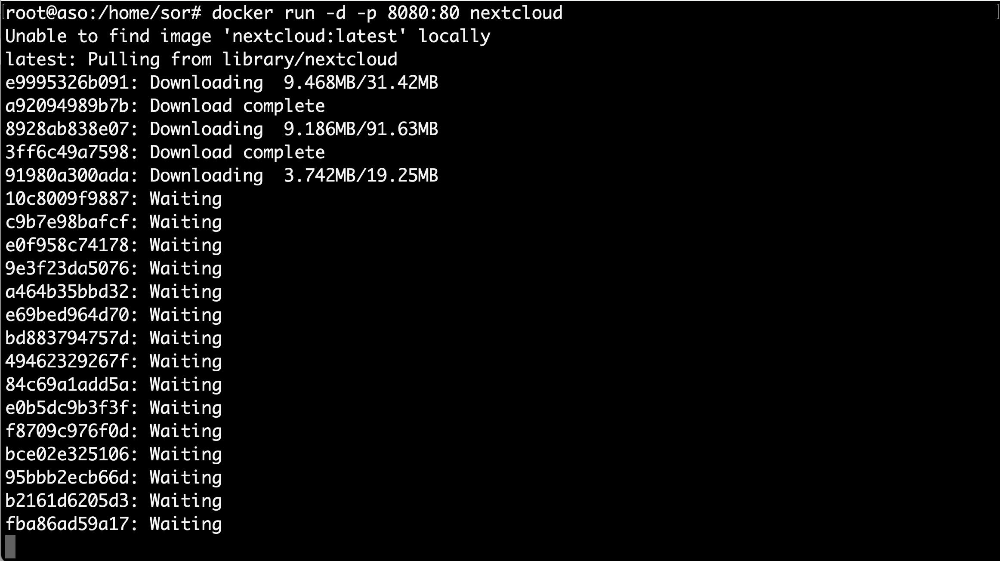
  <figcaption>Instalación y ejecución del contenedor de NextCloud</figcaption>
</figure>

<div style="page-break-before:always;"></div>

2. Comprobación de instalación correcta del contenedor NextCloud:

- Se introduce en un navegador **http://"IPmáquinaVirtual":8080** debe aparecer el inicio de NextCloud para crear una cuenta de administrador, como se muestra en la siguiente figura:

!!! warning
    La guía está realizada en el supuesto que la MV de Ubuntu server estuviera configurada en Adaptador puente, como en nuestro caso va estar configurada en Red NAT, tendremos que configurar el reenvió de puertos necesario para poder acceder a la aplicación.

<figure>
  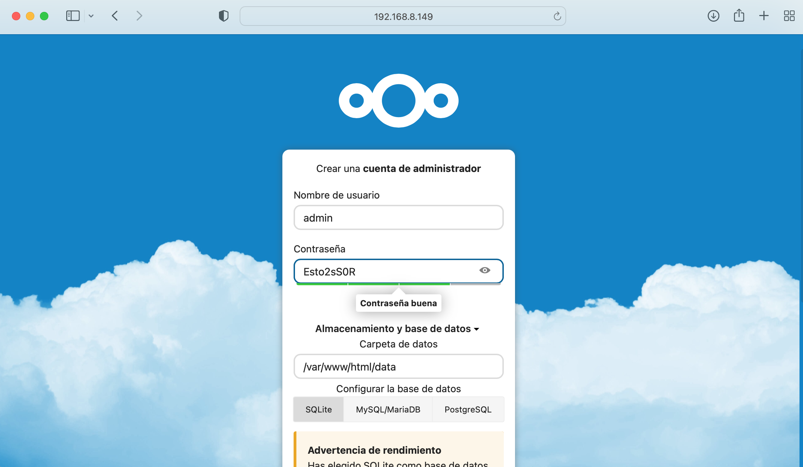
  <figcaption>Instalación de NextCloud</figcaption>
</figure>

- Probamos a subir un archivo para ver donde se guardan:

<figure>
  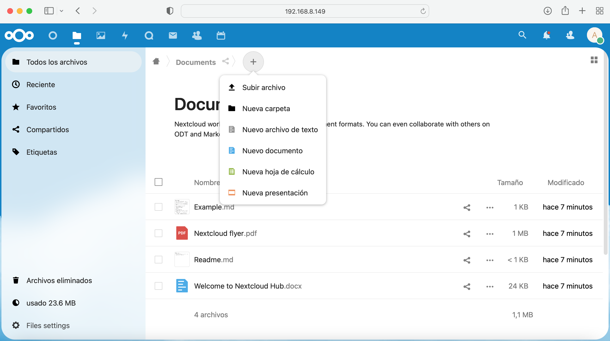
  <figcaption>Subir archivo NextCloud</figcaption>
</figure>

<div style="page-break-before:always;"></div>

- Se comprueba en el GUI de NextCloud que esta subido:

<figure>
  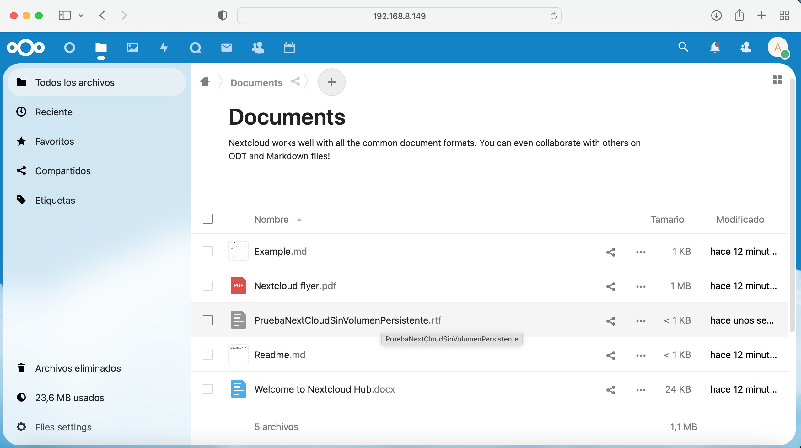
  <figcaption>Comprobación subido el archivo en el GUI de NextCloud</figcaption>
</figure>

- Se comprueba en el bash del contenedor de NextCloud que esta subido:

<figure>
  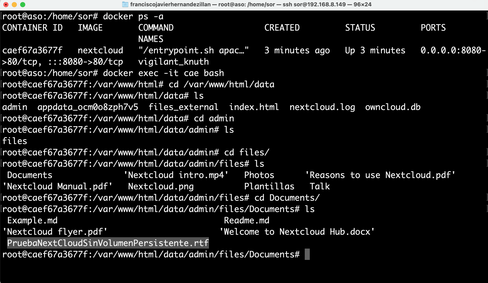
  <figcaption>Comprobación subido el archivo en el contenedor de NextCloud</figcaption>
</figure>

<div style="page-break-before:always;"></div>

- Si borramos el contenedor y lo volvemos a crear se comprueba que se ha perdido el fichero:

<figure>
  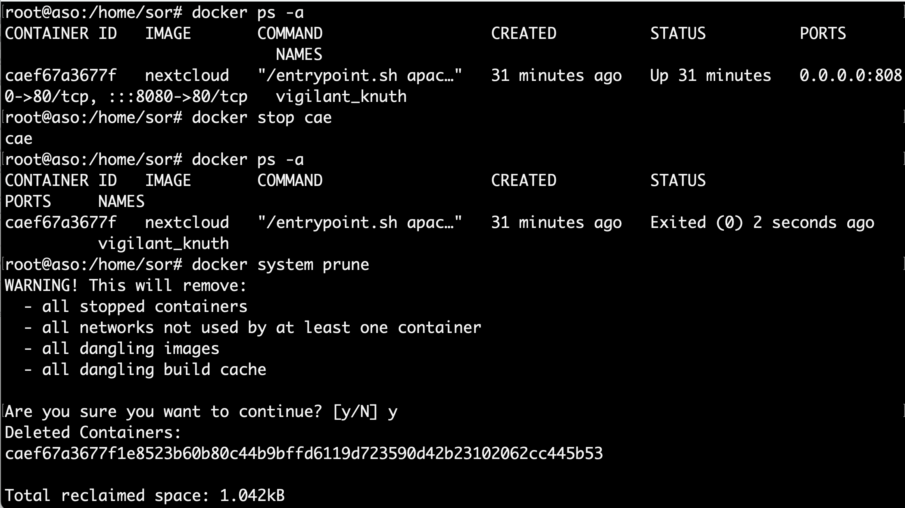
  <figcaption>Borrado del contenedor</figcaption>
</figure>

<figure>
  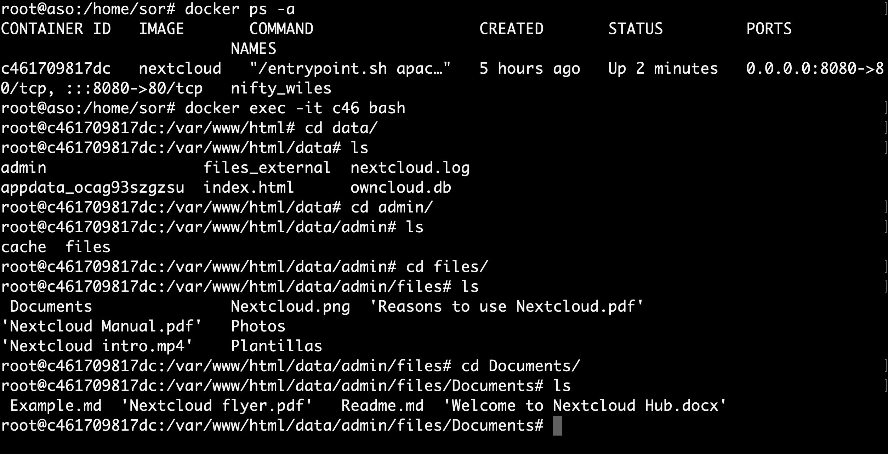
  <figcaption>Comprobación del fichero borrado</figcaption>
</figure>

<div style="page-break-before:always;"></div>

## Instalación contenedor NextCloud con volumen persistente y red interna

- Siguiendo los apuntes en el punto 3 se describen los volúmenes y la importancia de los mismos para salvaguardar los datos si el contenedor se corrompe, o incluso utilizarlo para un segundo contenedor de docker. El ejemplo 3.3 es una buena guía para realizar este punto.

- Por lo tanto el código a ejecutar para que el volumen se llame **"volNextCloud"** podría ser:

``` bash
sudo docker run -d --name nextcloud --ip 192.168.20.2 --mount type=volume,source=volNextCloud,target=/var/www/html/data -p 80:80 nextcloud
```

<figure>
  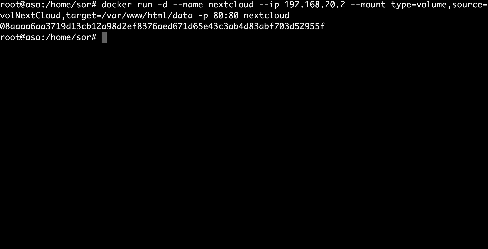
  <figcaption>Creación NextCloud con Persistent Data y red interna</figcaption>
</figure>

<div style="page-break-before:always;"></div>

### Comprobación NextCloud con volumen persistente

1. Se sube un fichero como el caso anterior.

<figure>
  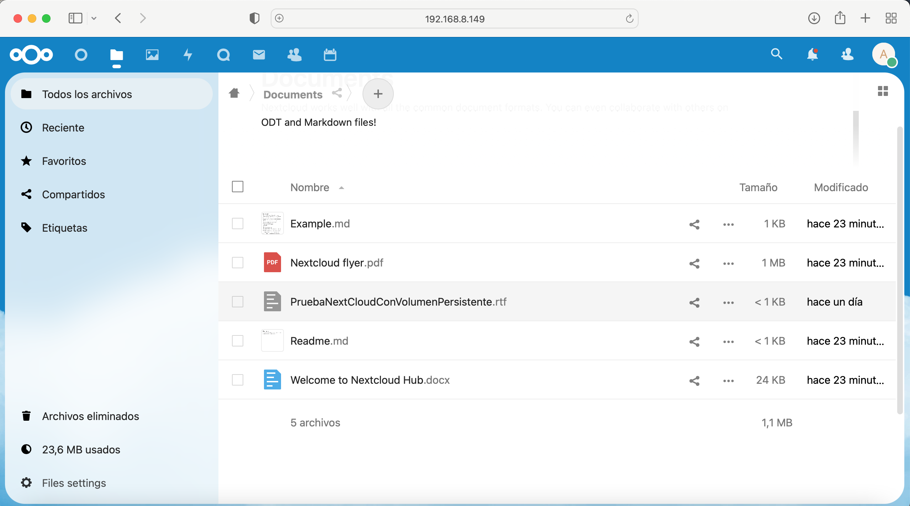
  <figcaption>Subimos fichero</figcaption>
</figure>

2. Se comprueba que esta en el contenedor.

<figure>
  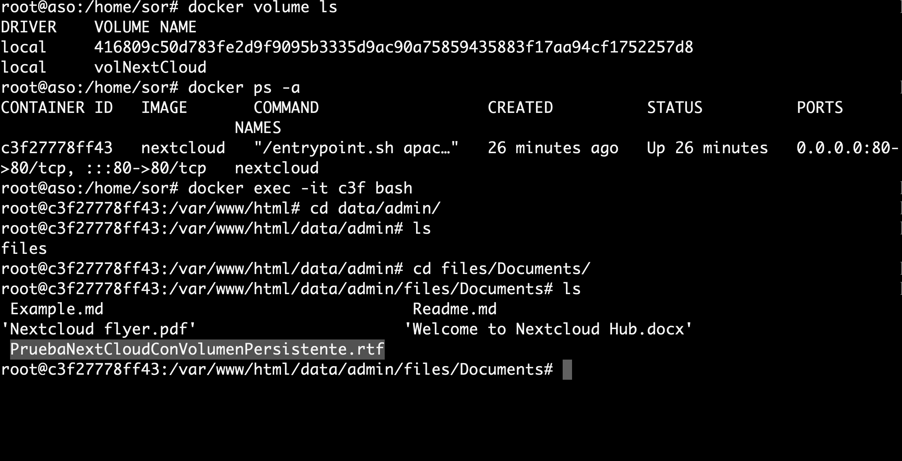
  <figcaption>El archivo existe en el path del volumen</figcaption>
</figure>

<div style="page-break-before:always;"></div>

3. Se borra el contenedor, se crea uno nuevo apuntando al volumen y se comprueba que el fichero perdura.

<figure>
  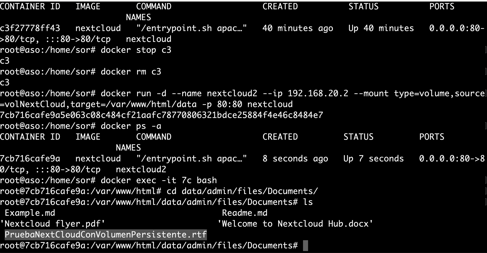
  <figcaption>Comprobación fichero existe, después de borrar contenedor y volver a crear uno nuevo</figcaption>
</figure>

## Network

- Se observa en el código del apartado anterior en el mismo comando se ha estado introduciendo la IP del enunciado. Para que dicha IP se refleje en el contenedor además debe existir una red creada previamente y apuntar a ella. en los siguientes pasos se muestra.

1. Crear red:

``` bash
sudo docker network create --driver=bridge --subnet=192.168.20.0/24 nextCloudNet
```

2. Referenciamos contenedor a la red creada.

``` bash
sudo docker run -d --name nextcloud --network nextCloudNet --ip 192.168.20.2 --mount type=volume,source=volNextCloud,target=/var/www/html/data -p 80:80 nextcloud
```

<div style="page-break-before:always;"></div>

3. Confirmamos la IP.

``` bash
docker inspect -f '{{range.NetworkSettings.Networks}} {{.IPAddress}}{{end}}' CONTAINER_ID
```

### Comprobación IP

- En la siguiente figura se muestra la comprobación de la red y la IP del contenedor:

<figure>
  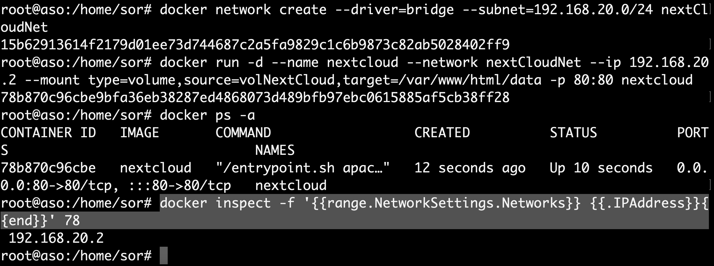
  <figcaption>Contenedor en la IP del enunciado</figcaption>
</figure>