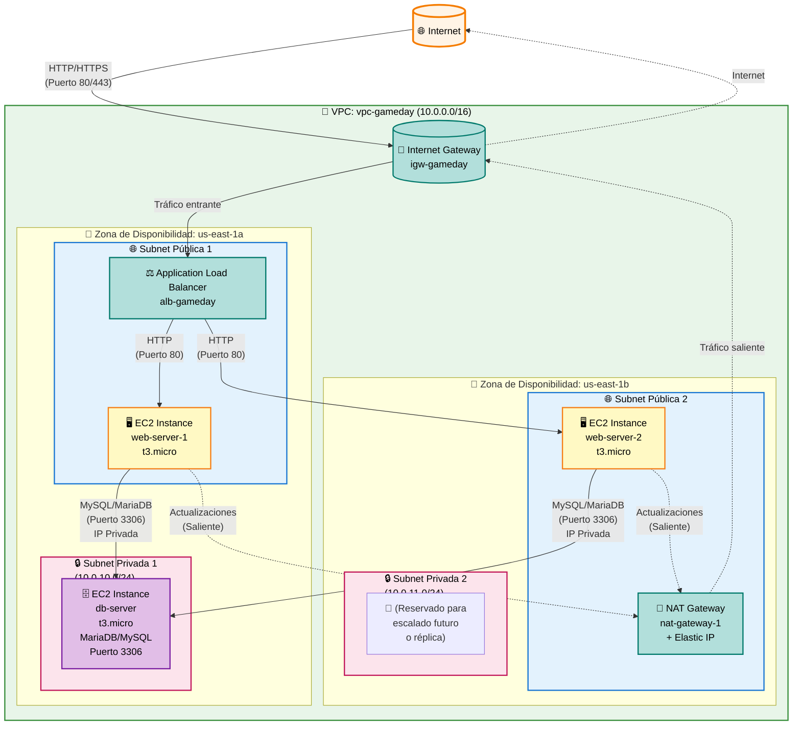
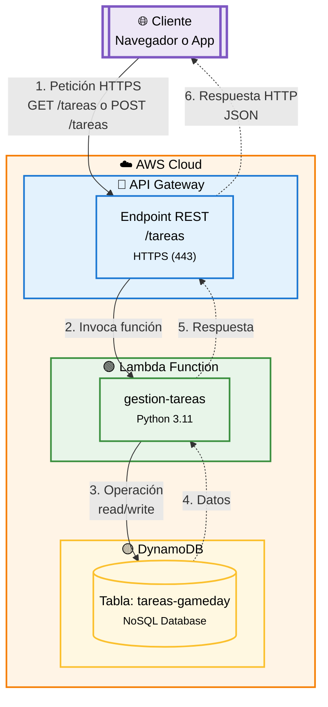

# Preparación AWS GameDay 2025

## Introducción

El **Campeonato Nacional AWS GameDay 2025** es una competición práctica donde los equipos aplican conocimientos reales en la nube AWS para resolver retos técnicos en un entorno controlado. Este documento te ayudará a prepararte para la competición, cubriendo los conceptos fundamentales de **AWS Cloud Practitioner** y **AWS Architecting**.

**Sitio web oficial:** [https://gameday2025.com](https://gameday2025.com)

!!! info "Guía de Laboratorio"
    Se proporcionará un laboratorio para realizar las prácticas paso a paso, con instrucciones claras y directas para su ejecución.

### Información importante

- **Fecha de clasificación virtual:** 26 de noviembre de 2025 (09:30 - 12:30)
- **Final presencial:** 18 de diciembre de 2025 (09:00 - 14:30)
- **Requisito:** Estar conectado a las 09:30 para las instrucciones de inicio
- **Formato:** Se proporcionará un enlace de conexión antes del evento

!!! tip "Estrategia para el GameDay"
    Durante la competición, distribuye las tareas entre los miembros del equipo. Cada acción correcta genera puntos, mientras que los errores pueden restar puntos. El leaderboard se actualiza en tiempo real.

## Conceptos clave: AWS Cloud Practitioner

### Servicios fundamentales de AWS

#### Computación (Compute)

**EC2 (Elastic Compute Cloud)**

EC2 es el servicio fundamental de computación en la nube de AWS. Proporciona capacidad de cómputo escalable en forma de instancias virtuales (máquinas virtuales). Permite lanzar servidores virtuales con diferentes sistemas operativos y configuraciones según tus necesidades. Es ideal para aplicaciones que requieren control total sobre el sistema operativo y el software instalado.

**Características principales:**

- Máquinas virtuales en la nube con control completo
- Diferentes tipos de instancias según necesidades (uso general, computación optimizada, memoria optimizada, almacenamiento optimizado)
- Facturación flexible: On-Demand (pago por uso), Reserved (descuento por compromiso 1-3 años), Spot (hasta 90% descuento, pero pueden interrumpirse)
- AMI (Amazon Machine Image): plantilla preconfigurada para crear instancias rápidamente
- Escalado vertical (cambiar tamaño) y horizontal (añadir más instancias)

**Lambda**

Lambda es un servicio de computación serverless que permite ejecutar código sin aprovisionar o gestionar servidores. Ejecutas código solo cuando es necesario y pagas únicamente por el tiempo de computación consumido. Es ideal para procesamiento de eventos, creación de APIs, transformación de datos en tiempo real y automatización de tareas.

**Características principales:**

- Servicio serverless: sin gestión de servidores
- Ejecución en respuesta a eventos (HTTP requests, cambios en S3, mensajes en SQS, etc.)
- Ideal para procesamiento de eventos, APIs, transformación de datos, automatización
- Pago solo por el tiempo de ejecución (en milisegundos)
- Escalado automático desde algunas invocaciones hasta miles por segundo
- Soporta múltiples lenguajes: Python, Node.js, Java, Go, Ruby, .NET, etc.

**Elastic Beanstalk**

Elastic Beanstalk es una plataforma como servicio (PaaS) que simplifica el despliegue y gestión de aplicaciones web. Solo subes tu código y Elastic Beanstalk se encarga automáticamente del aprovisionamiento de capacidad, balanceo de carga, escalado automático y monitoreo de la salud de la aplicación. Es perfecto para desarrolladores que quieren desplegar rápidamente sin preocuparse por la infraestructura.

**Características principales:**

- Plataforma para desplegar aplicaciones web fácilmente sin gestionar infraestructura
- Despliegue automático de recursos (EC2, ALB, Auto Scaling, etc.)
- Soporta múltiples lenguajes y frameworks: Java, .NET, PHP, Node.js, Python, Ruby, Go, Docker
- Gestión automática de parches, actualizaciones y escalado
- Ideal para aplicaciones web y APIs tradicionales

**ECS (Elastic Container Service)**

ECS es un servicio de orquestación de contenedores Docker completamente gestionado. Permite ejecutar aplicaciones contenedorizadas sin necesidad de instalar y operar tu propio clúster de orquestación de contenedores. Es ideal para aplicaciones que ya utilizan contenedores Docker y necesitan escalabilidad y alta disponibilidad.

**Características principales:**

- Servicio de orquestación de contenedores Docker gestionado
- **Fargate:** ejecuta contenedores sin gestionar servidores (modo serverless)
- **EC2 Launch Type:** gestionas tus propias instancias EC2 para los contenedores
- Integración con otros servicios AWS (ALB, ECR, CloudWatch, etc.)
- Ideal para arquitecturas de microservicios y aplicaciones contenedorizadas

#### Almacenamiento (Storage)

**S3 (Simple Storage Service)**

S3 es un servicio de almacenamiento de objetos diseñado para almacenar y recuperar cualquier cantidad de datos desde cualquier lugar. Es altamente escalable, durable y ofrece disponibilidad prácticamente ilimitada. Es ideal para almacenar archivos estáticos, backups, datos de análisis, contenido multimedia y hosting de sitios web estáticos.

**Características principales:**

- Almacenamiento de objetos escalable y duradero (99.999999999% de durabilidad - 11 nueves)
- Clases de almacenamiento optimizadas para diferentes casos de uso:
  - **Standard:** acceso frecuente
  - **Intelligent-Tiering:** optimización automática de costes
  - **Glacier:** archivado a largo plazo (muy económico, recuperación en horas)
- Características avanzadas: versionado, cifrado, lifecycle policies, transferencia acelerada
- Uso común: almacenar archivos estáticos, backups, hosting de sitios web estáticos, data lakes
- Acceso mediante API REST, permite integración con cualquier aplicación

**EBS (Elastic Block Store)**

EBS proporciona volúmenes de almacenamiento en bloque de alto rendimiento y baja latencia para usar con instancias EC2. Estos volúmenes se comportan como discos duros físicos que puedes adjuntar a tus instancias. Son persistentes e independientes del ciclo de vida de la instancia, lo que significa que los datos persisten aunque termines la instancia.

**Características principales:**

- Volúmenes de almacenamiento en bloque persistentes para instancias EC2
- Tipos optimizados para diferentes cargas de trabajo:
  - **gp3:** uso general, balance entre precio y rendimiento
  - **io1/io2:** alta IOPS (operaciones de entrada/salida por segundo) para bases de datos
  - **st1/sc1:** optimizados para throughput, ideal para big data y data warehousing
- Soporte para snapshots (copias de seguridad incrementales)
- Capacidad de redimensionar volúmenes sin tiempo de inactividad

**EFS (Elastic File System)**

EFS proporciona un sistema de archivos elástico, escalable y compartido para instancias EC2 usando el protocolo NFS (Network File System). A diferencia de EBS, múltiples instancias EC2 pueden acceder simultáneamente al mismo sistema de archivos, lo que lo hace ideal para aplicaciones que necesitan compartir archivos entre múltiples servidores.

**Características principales:**

- Sistema de archivos compartido (NFS v4) accesible desde múltiples instancias EC2 simultáneamente
- Escalado automático: crece y se reduce automáticamente según el uso
- Alta disponibilidad y durabilidad integradas
- Ideal para aplicaciones web que comparten contenido, análisis de datos, sistemas de gestión de contenido (CMS)
- Acceso desde múltiples Availability Zones en una región

#### Base de datos (Databases)

**RDS (Relational Database Service)**

RDS es un servicio de base de datos relacional completamente gestionado que facilita la configuración, operación y escalado de bases de datos en la nube. AWS se encarga de tareas administrativas como aprovisionamiento de hardware, configuración de bases de datos, parches, backups y replicación, permitiéndote enfocarte en tu aplicación.

**Características principales:**

- Servicio gestionado para bases de datos relacionales tradicionales
- Motores soportados: MySQL, PostgreSQL, MariaDB, Oracle, SQL Server, Aurora
- Características avanzadas:
  - Backups automáticos con punto de recuperación (Point-in-Time Recovery)
  - Réplicas de lectura para mejorar el rendimiento de consultas
  - Multi-AZ para alta disponibilidad (réplica automática en otra AZ)
  - Escalado automático de almacenamiento
  - Encryption en tránsito y en reposo
- Ideal para aplicaciones que requieren transacciones ACID y datos estructurados

**DynamoDB**

DynamoDB es una base de datos NoSQL completamente gestionada que proporciona rendimiento de milisegundos a cualquier escala. Es una base de datos clave-valor y de documentos que permite construir aplicaciones modernas sin preocuparse por el aprovisionamiento, configuración o mantenimiento de servidores de base de datos. Perfecta para aplicaciones móviles, web, gaming, IoT y muchas otras.

**Características principales:**

- Base de datos NoSQL gestionada (clave-valor y documentos JSON)
- Rendimiento escalable automáticamente sin aprovisionamiento manual
- Latencia de milisegundos incluso con millones de peticiones por segundo
- Ideal para aplicaciones que requieren baja latencia, escalabilidad masiva y alta disponibilidad
- Modo On-Demand: pago solo por lo que usas, sin planificación de capacidad
- Modo Provisioned: control preciso sobre la capacidad aprovisionada
- Soporte para transacciones ACID para aplicaciones que las necesitan

**Aurora**

Amazon Aurora es un motor de base de datos relacional compatible con MySQL y PostgreSQL, diseñado para la nube. Combina el rendimiento y disponibilidad de bases de datos comerciales de alta gama con la simplicidad y rentabilidad de bases de datos open source. Es hasta 5 veces más rápido que MySQL estándar y 3 veces más rápido que PostgreSQL.

**Características principales:**

- Motor de base de datos relacional compatible con MySQL y PostgreSQL
- Rendimiento superior: hasta 5 veces más rápido que MySQL, 3 veces más rápido que PostgreSQL
- Alta disponibilidad automática con replicación continua en 6 copias de datos en 3 Availability Zones
- Escalabilidad automática hasta 128 TB por instancia de base de datos
- Hasta 15 réplicas de lectura para escalar las consultas
- Backups continuos en S3 sin impacto en el rendimiento

#### Redes (Networking)

**VPC (Virtual Private Cloud)**

VPC te permite aprovisionar una sección aislada lógicamente de la nube AWS donde puedes lanzar recursos AWS en una red virtual que definas. Tienes control completo sobre tu entorno de red virtual, incluyendo la selección de tu propio rango de direcciones IP, creación de subredes y configuración de tablas de rutas y gateways de red. Es fundamental para crear arquitecturas seguras y aisladas.

**Características principales:**

- Red virtual privada y aislada dentro de AWS donde despliegas tus recursos
- Componentes principales:
  - **Subnets:** subdivisiones de la VPC en Availability Zones
  - **Internet Gateway:** conexión bidireccional a Internet para subnets públicas
  - **NAT Gateway:** permite a recursos en subnets privadas acceder a Internet de forma segura
  - **Security Groups:** firewall a nivel de instancia
  - **NACLs:** firewall a nivel de subnet
- Permite control granular sobre la red: rangos IP, tablas de rutas, gateways
- Puedes conectar tu VPC a tu datacenter local mediante VPN o Direct Connect

**Route 53**

Route 53 es un servicio web de DNS (Sistema de Nombres de Dominio) altamente disponible y escalable. Traduce nombres de dominio legibles por humanos (como www.ejemplo.com) a direcciones IP numéricas que los equipos usan para conectarse entre sí. Además, incluye funcionalidades avanzadas de enrutamiento de tráfico y verificación de salud.

**Características principales:**

- Servicio de DNS gestionado y altamente disponible
- Políticas de enrutamiento avanzadas:
  - **Simple:** enrutamiento estándar a un recurso
  - **Weighted:** distribuye tráfico según pesos asignados
  - **Latency-based:** enruta a la región con menor latencia
  - **Failover:** conmutación automática ante fallos (activo/pasivo)
  - **Geolocation:** enrutamiento basado en la ubicación del usuario
  - **Geoproximity:** enrutamiento basado en proximidad geográfica
- Registro de dominios y gestión de DNS en un solo lugar
- Integración con otros servicios AWS para enrutamiento automático

**CloudFront**

CloudFront es un servicio de CDN (Content Delivery Network) global que acelera la entrega de sitios web, APIs, contenido de video y otras aplicaciones web. Distribuye contenido desde ubicaciones cercanas a los usuarios finales, reduciendo la latencia y mejorando la experiencia del usuario. También proporciona protección DDoS integrada y cifrado de extremo a extremo.

**Características principales:**

- CDN (Content Delivery Network) global con más de 400 puntos de presencia (edge locations) en todo el mundo
- Acelera la entrega de contenido estático (imágenes, CSS, JavaScript) y dinámico (APIs, contenido personalizado)
- Integración nativa con S3, EC2, Elastic Load Balancing y Lambda
- Características de seguridad:
  - Protección DDoS integrada (AWS Shield Standard)
  - Cifrado en tránsito (HTTPS) y en reposo
  - Integración con AWS WAF para protección contra ataques web
- Cache configurable para optimizar rendimiento y reducir costes
- Ideal para sitios web con usuarios globales, streaming de video y aplicaciones móviles

**ELB (Elastic Load Balancer)**

Elastic Load Balancing distribuye automáticamente el tráfico de aplicaciones entrante entre múltiples destinos, como instancias EC2, contenedores, direcciones IP y funciones Lambda, en una o más Availability Zones. Aumenta la disponibilidad y tolerancia a fallos de tus aplicaciones y mejora su capacidad para manejar variaciones en el tráfico.

**Características principales:**

- Distribuye el tráfico entre múltiples instancias o recursos para alta disponibilidad
- Tipos de Load Balancers:
  - **Application Load Balancer (ALB):** para aplicaciones HTTP/HTTPS, enrutamiento a nivel de aplicación
  - **Network Load Balancer (NLB):** para cargas de trabajo de ultra baja latencia, enrutamiento a nivel de red (capa 4)
  - **Classic Load Balancer (CLB):** legado, para aplicaciones básicas
- Health checks automáticos: detecta instancias no saludables y redirige el tráfico
- Escalado automático según la demanda
- Terminación SSL/TLS para simplificar el cifrado

#### Seguridad e identidad

**IAM (Identity and Access Management)**

IAM es el servicio de AWS que te ayuda a controlar de forma segura el acceso a los recursos de AWS. Permite gestionar usuarios, grupos de usuarios y usar permisos para permitir o denegar acceso a recursos de AWS. Es fundamental para la seguridad en la nube, siguiendo el principio de menor privilegio (solo los permisos necesarios).

**Características principales:**

- Gestión centralizada de usuarios, grupos, roles y políticas de permisos
- **Usuarios:** identidades que representan personas o aplicaciones
- **Grupos:** colección de usuarios que comparten permisos
- **Roles:** identidades que pueden asumir servicios AWS o usuarios para permisos temporales
- **Políticas:** documentos JSON que definen permisos (qué acciones están permitidas/denegadas sobre qué recursos)
- Principio de menor privilegio: conceder solo los permisos mínimos necesarios
- MFA (Multi-Factor Authentication): autenticación de dos factores para mayor seguridad
- Integración con servicios corporativos mediante federación de identidades

**Security Groups**

Los Security Groups actúan como un firewall virtual que controla el tráfico entrante y saliente para instancias EC2, bases de datos RDS y otros recursos. Son fundamentales para proteger tus recursos de acceso no autorizado. A diferencia de un firewall tradicional, son stateful (con estado), lo que simplifica significativamente su configuración.

**Características principales:**

- Firewall virtual a nivel de instancia o recurso (EC2, RDS, Lambda, etc.)
- **Stateful (con estado):** si permites tráfico entrante, automáticamente permite la respuesta saliente (no necesitas regla explícita)
- Por defecto: todo el tráfico saliente permitido, todo el tráfico entrante denegado
- Reglas basadas en protocolo (TCP, UDP, ICMP), puerto y origen/destino (IP o Security Group)
- Puedes asociar múltiples Security Groups a un recurso
- Las reglas solo pueden ser permisivas (allow), no hay reglas de denegación explícitas

**NACLs (Network Access Control Lists)**

Las NACLs son una capa adicional de seguridad opcional que actúa como firewall para las subredes de tu VPC. A diferencia de los Security Groups, las NACLs son stateless (sin estado) y funcionan a nivel de subnet, no de instancia. Son útiles para añadir una capa adicional de seguridad o para cumplir con requisitos de compliance.

**Características principales:**

- Firewall a nivel de subnet (no de instancia)
- **Stateless (sin estado):** debes definir reglas explícitas tanto para tráfico entrante como saliente
- Procesan reglas en orden numérico (número de regla más bajo primero)
- Pueden tener reglas de denegación explícitas (a diferencia de Security Groups)
- Útiles para añadir una capa adicional de seguridad y para cumplimiento normativo
- Por defecto, permiten todo el tráfico (aunque luego puedes restringirlo)

**AWS Shield**

AWS Shield es un servicio de protección DDoS (Distributed Denial of Service) gestionado que protege las aplicaciones que se ejecutan en AWS. Proporciona protección continua y automática contra ataques DDoS sin necesidad de intervención manual. Está integrado con otros servicios de AWS como CloudFront, Route 53 y Elastic Load Balancing.

**Características principales:**

- Protección DDoS (Denial of Service) automática y continua
- **Shield Standard:** incluido sin coste adicional, protección básica contra ataques comunes
- **Shield Advanced:** servicio de pago con protección adicional:
  - Protección contra ataques DDoS más sofisticados
  - Detección y mitigación en tiempo real
  - Protección de costes (reembolso por uso de escala durante ataques)
  - Dashboard de visibilidad y notificaciones
  - Acceso a un equipo de respuesta DDoS 24/7

**WAF (Web Application Firewall)**

AWS WAF es un firewall de aplicaciones web que te ayuda a proteger tus aplicaciones web contra vulnerabilidades web comunes que podrían afectar la disponibilidad, comprometer la seguridad o consumir recursos en exceso. Te permite controlar cómo el tráfico llega a tus aplicaciones creando reglas de seguridad que bloquean patrones de ataque comunes.

**Características principales:**

- Protección para aplicaciones web contra vulnerabilidades comunes (OWASP Top 10)
- Puede asociarse a CloudFront, Application Load Balancer (ALB) o API Gateway
- Reglas personalizables basadas en:
  - Direcciones IP, países/regiones
  - Headers HTTP, cuerpos de solicitud, cadenas de consulta
  - Patrones SQL injection, Cross-Site Scripting (XSS)
  - Reglas predefinidas de AWS Managed Rules
- Reglas de rate limiting (limitación de velocidad) para prevenir abuso
- Dashboard y logs detallados para análisis y depuración

#### Monitoreo y gestión

**CloudWatch**

Amazon CloudWatch es un servicio de monitoreo y observabilidad para recursos y aplicaciones que se ejecutan en AWS. Proporciona datos y perspectivas accionables para monitorear tus aplicaciones, responder a cambios en el rendimiento del sistema y optimizar el uso de recursos. Es esencial para mantener la salud y el rendimiento de tus aplicaciones en producción.

**Características principales:**

- Monitoreo y observabilidad en tiempo real de recursos y aplicaciones AWS
- **Métricas:** recopila y rastrea métricas de servicios AWS y aplicaciones personalizadas
- **Logs:** centraliza logs de aplicaciones y servicios para análisis y búsqueda
- **Alarmas:** notificaciones automáticas cuando las métricas superan umbrales definidos
- **Dashboards:** visualización personalizada de métricas clave en un solo lugar
- **Eventos (EventBridge):** programación y automatización basada en eventos
- **Insights:** análisis automático de logs para identificar problemas y patrones

**CloudTrail**

AWS CloudTrail es un servicio que permite la gobernanza, el cumplimiento, la auditoría operativa y la auditoría de riesgo de tu cuenta de AWS. Registra y entrega un historial de eventos de llamadas a la API para tu cuenta, incluyendo llamadas realizadas desde la consola de AWS, SDKs, herramientas de línea de comandos y otros servicios de AWS. Es fundamental para auditoría y seguridad.

**Características principales:**

- Registro de auditoría de llamadas API a servicios AWS
- Rastrea: quién hizo qué acción, cuándo se hizo, desde dónde (IP) y si la llamada fue exitosa
- Historial de cambios en recursos y configuraciones
- Integración con CloudWatch Logs para alertas y análisis
- Capacidad de enviar logs a S3 para almacenamiento a largo plazo
- Habilitado por defecto en todas las cuentas AWS (eventos de gestión)
- Útil para cumplimiento normativo, seguridad, resolución de problemas y análisis de uso

**AWS Config**

AWS Config es un servicio que proporciona un inventario de recursos de AWS, registra cambios de configuración y notifica sobre relaciones no deseadas entre recursos. Te ayuda a evaluar, auditar y evaluar las configuraciones de tus recursos de AWS para facilitar el cumplimiento normativo y la gobernanza. Es esencial para mantener la conformidad y la seguridad de tu infraestructura.

**Características principales:**

- Inventario continuo de recursos AWS y sus configuraciones
- Registro de cambios de configuración a lo largo del tiempo
- **Reglas de conformidad:** evaluación automática de si las configuraciones cumplen con políticas definidas
- Notificaciones cuando los recursos no cumplen con las reglas
- Visualización de relaciones entre recursos
- Dashboard de cumplimiento para ver el estado de conformidad de tu cuenta
- Ideal para auditorías, análisis de impacto y cumplimiento normativo (PCI-DSS, HIPAA, etc.)

#### Facturación y pricing

**Modelos de facturación:**

- **On-Demand:** Pago por uso sin compromiso
- **Reserved Instances:** Descuento por compromiso (1-3 años)
- **Spot Instances:** Instancias no utilizadas a precio reducido (pueden interrumpirse)
- **Savings Plans:** Descuento flexible por compromiso de uso

**AWS Free Tier:**

- Algunos servicios gratuitos durante 12 meses
- Servicios siempre gratuitos (con límites)

### Arquitectura bien diseñada (Well-Architected Framework)

AWS define 6 pilares para construir arquitecturas robustas:

1. **Excelencia operativa (Operational Excellence)**

   - Automatización, documentación, mejora continua

2. **Seguridad (Security)**

   - Protección de datos, controles de acceso, detección de amenazas

3. **Confiabilidad (Reliability)**

   - Recuperación ante fallos, alta disponibilidad, pruebas de recuperación ante desastres

4. **Eficiencia de rendimiento (Performance Efficiency)**

   - Selección adecuada de recursos, monitoreo, revisión y optimización

5. **Optimización de costes (Cost Optimization)**

   - Evitar costes innecesarios, optimizar según necesidades

6. **Sostenibilidad (Sustainability)**

   - Minimizar impacto ambiental, eficiencia energética

### Principios de diseño en AWS

1. **Escalar horizontalmente** en lugar de verticalmente
2. **Diseñar para fallos** (asumir que los componentes fallarán)
3. **Separación de responsabilidades** (loosely coupled)
4. **Seguridad en todas las capas** (defense in depth)
5. **Automatización** cuando sea posible
6. **Desacoplar los componentes** de la aplicación

## Conceptos clave: AWS Architecting

### Patrones arquitectónicos comunes

#### Arquitectura de 3 capas (3-Tier Architecture)

```
┌─────────────────┐
│   Web Tier      │  (ALB + EC2 o S3 + CloudFront)
│  (Presentación) │
└────────┬────────┘
         │
┌────────▼────────┐
│ Application Tier│  (EC2 Auto Scaling Group)
│    (Lógica)     │
└────────┬────────┘
         │
┌────────▼────────┐
│   Data Tier     │  (RDS con Multi-AZ)
│   (Base datos)  │
└─────────────────┘
```

**Componentes típicos:**

- Web Tier: Application Load Balancer + Auto Scaling Group de EC2, o S3 + CloudFront
- Application Tier: EC2 en Auto Scaling Group con Application Load Balancer
- Data Tier: RDS con Multi-AZ para alta disponibilidad

#### Arquitectura serverless

```
API Gateway → Lambda → DynamoDB
     ↓
  CloudFront
     ↓
     S3
```

**Ventajas:**

- Sin gestión de servidores
- Escalado automático
- Pago solo por uso
- Alta disponibilidad integrada

#### Alta disponibilidad (High Availability)

**Estrategias:**

- **Multi-AZ:** Replicación en múltiples zonas de disponibilidad dentro de la misma región
- **Multi-Region:** Replicación entre regiones (para disaster recovery)
- **Auto Scaling:** Escalar automáticamente según demanda
- **Health Checks:** Route 53 y ELB verifican el estado de los recursos

### Servicios avanzados

#### Automatización e Infraestructura como Código

**CloudFormation**

AWS CloudFormation te permite modelar y aprovisionar recursos de AWS y de terceros de forma declarativa usando templates. Puedes crear, actualizar y eliminar una colección de recursos de forma predecible y repetible, tratando la infraestructura como código. Esto facilita la gestión de versiones, el rollback en caso de problemas y la replicación de infraestructura en múltiples entornos.

**Características principales:**

- Definir infraestructura como código usando templates YAML o JSON
- Gestión de versiones de la infraestructura (control de cambios)
- Rollback automático en caso de error durante la creación o actualización
- Reutilización de templates para crear múltiples entornos (dev, staging, prod)
- Sincronización: CloudFormation mantiene los recursos alineados con el template
- Stack: colección de recursos gestionados como una sola unidad
- Ideal para DevOps, CI/CD y entornos multi-región

**AWS Systems Manager (SSM)**

AWS Systems Manager es un servicio que te ayuda a automatizar tareas operativas en tus recursos AWS. Proporciona una vista unificada de tus recursos y te permite automatizar operaciones como la aplicación de parches, la gestión de configuración, el inventario de recursos y el acceso seguro a instancias sin necesidad de abrir puertos SSH o RDP.

**Características principales:**

- Gestión centralizada de instancias EC2 y recursos on-premises
- **Patch Manager:** automatiza la aplicación de parches y actualizaciones de seguridad
- **Parameter Store:** almacenamiento seguro y jerárquico de configuración y secretos
- **Session Manager:** acceso seguro a instancias sin necesidad de puertos abiertos o bastion hosts
- **State Manager:** mantener la configuración deseada de instancias de forma consistente
- **Run Command:** ejecutar comandos de forma remota y segura en múltiples instancias
- **Inventory:** recopilar metadatos sobre tus recursos (software instalado, configuraciones, etc.)

#### Integración y mensajería

**SQS (Simple Queue Service)**

Amazon SQS es un servicio de colas de mensajes completamente gestionado que te permite desacoplar y escalar microservicios, sistemas distribuidos y aplicaciones sin servidor. SQS elimina la complejidad y sobrecarga asociadas con la gestión y operación de middleware orientado a mensajes, y no requiere mantenimiento de infraestructura.

**Características principales:**

- Cola de mensajes desacoplada y completamente gestionada
- Patrón de diseño: Productor → Cola → Consumidor (desacoplamiento entre componentes)
- **Cola estándar:** throughput ilimitado, ordenación de "mejor esfuerzo"
- **Cola FIFO:** ordenamiento garantizado, procesamiento exactamente una vez
- Escalable automáticamente sin necesidad de aprovisionar capacidad
- Mensajes pueden persistir hasta 14 días
- Visibilidad de mensajes configurable para evitar procesamiento duplicado
- Ideal para arquitecturas de microservicios, procesamiento asíncrono y balanceo de carga

**SNS (Simple Notification Service)**

Amazon SNS es un servicio de notificaciones push totalmente gestionado que te permite enviar mensajes individuales o a múltiples destinatarios. Utiliza el modelo de publicación/suscripción (Pub/Sub) donde los publicadores envían mensajes a un "tópico" y los suscriptores reciben notificaciones sobre los temas a los que se han suscrito. Ideal para alertas, notificaciones en tiempo real y mensajería de aplicación.

**Características principales:**

- Notificaciones push bajo el modelo Pub/Sub (Publicación/Suscripción)
- Puede notificar a múltiples endpoints simultáneamente:
  - Email, SMS, HTTP/HTTPS endpoints
  - Funciones Lambda, colas SQS
  - Aplicaciones móviles (push notifications)
- Tópicos: canales de comunicación a los que los suscriptores se suscriben
- Filtrado de mensajes basado en atributos de mensaje
- Fan-out pattern: un mensaje a un tópico puede ser entregado a múltiples suscriptores
- Ideal para alertas de sistemas, notificaciones de aplicaciones y arquitecturas event-driven

**API Gateway**

Amazon API Gateway es un servicio completamente gestionado que facilita a los desarrolladores crear, publicar, mantener, monitorear y asegurar APIs REST y WebSocket a cualquier escala. Actúa como un punto de entrada único para todas las solicitudes de API y maneja tareas como autenticación, throttling, transformación de requests/responses y enrutamiento.

**Características principales:**

- Creación, publicación y gestión de APIs RESTful y WebSocket
- Punto de entrada único para tus APIs backend
- **Throttling:** limitación de velocidad para proteger backends contra sobrecarga
- **Autenticación:** integración con IAM, Cognito, OAuth, API keys
- Transformación de requests/responses (mapping templates)
- Cache de respuestas para reducir carga en backends
- Integración con Lambda, EC2, otros servicios HTTP y servicios AWS
- Monitoreo y logging integrado con CloudWatch
- Ideal para crear APIs serverless, microservicios y aplicaciones móviles

#### Migración y transferencia

**Database Migration Service (DMS)**

AWS Database Migration Service (DMS) ayuda a migrar bases de datos a AWS de forma rápida y segura. La base de datos fuente permanece completamente operativa durante la migración, minimizando el tiempo de inactividad para aplicaciones que dependen de la base de datos. DMS soporta migraciones homogéneas (mismo motor de base de datos) y heterogéneas (diferentes motores).

**Características principales:**

- Migrar bases de datos a AWS con tiempo de inactividad mínimo
- Soporta migraciones continuas (CDC - Change Data Capture) para mantener sincronización durante la migración
- Migraciones homogéneas: mismo motor (ej: MySQL a MySQL en RDS)
- Migraciones heterogéneas: diferentes motores (ej: Oracle a Aurora PostgreSQL)
- Replicación continua para mantener bases de datos sincronizadas
- Soporta múltiples motores: Oracle, MySQL, PostgreSQL, SQL Server, MongoDB, etc.
- Ideal para migraciones a la nube, consolidación de bases de datos y replicación continua

**DataSync**

AWS DataSync es un servicio que simplifica, automatiza y acelera la copia de datos entre sistemas de almacenamiento locales y AWS Storage Services. Transfiere datos hasta 10 veces más rápido que las herramientas tradicionales mediante el uso de un protocolo optimizado y paralelización. Es ideal para migraciones de datos, transferencias periódicas y sincronización continua.

**Características principales:**

- Transferencia de datos a gran escala entre sistemas de almacenamiento locales y AWS
- Velocidades hasta 10 veces más rápidas que herramientas tradicionales
- Automatización de transferencias programadas o continuas
- Verificación de integridad de datos durante y después de la transferencia
- Soporte para NFS, SMB, S3, EFS, FSx para Windows File Server
- Encriptación en tránsito y en reposo
- Ideal para migraciones de datos, backups, disaster recovery y sincronización de datos

### Seguridad avanzada

**KMS (Key Management Service)**

AWS Key Management Service (KMS) es un servicio gestionado que facilita la creación y el control de claves de cifrado utilizadas para cifrar tus datos. KMS está integrado con otros servicios de AWS para facilitar el cifrado de datos que almacenas en estos servicios y el control de acceso a las claves que cifran los datos. Las claves están protegidas por módulos de seguridad de hardware validados bajo FIPS 140-2.

**Características principales:**

- Servicio gestionado para crear y controlar claves de cifrado (encriptación)
- Integración nativa con servicios AWS para cifrado transparente (S3, EBS, RDS, etc.)
- **CMK (Customer Master Keys):** claves maestras que puedes crear y gestionar
- **AWS Managed Keys:** claves gestionadas automáticamente por AWS
- Control granular de acceso mediante políticas IAM
- Auditoría completa del uso de claves mediante CloudTrail
- Soporte para cifrado asimétrico (RSA, ECC) y simétrico (AES-256)
- Cifrado de datos en reposo y en tránsito
- Ideal para cumplimiento normativo, protección de datos sensibles y control de acceso

**Secrets Manager**

AWS Secrets Manager te ayuda a proteger los secretos necesarios para acceder a tus aplicaciones, servicios y recursos de TI. En lugar de hardcodear credenciales en código, puedes almacenarlas de forma segura en Secrets Manager y recuperarlas mediante una llamada a la API. Secrets Manager también puede rotar automáticamente secretos para reducir el riesgo de compromiso.

**Características principales:**

- Almacenar y gestionar secretos de forma segura (contraseñas, claves API, tokens, certificados)
- Rotación automática de secretos según programación (diaria, semanal, mensual)
- Integración con RDS para rotación automática de contraseñas de base de datos
- Control de acceso mediante políticas IAM
- Auditoría de acceso mediante CloudTrail
- Cifrado automático de secretos mediante KMS
- APIs para recuperar secretos programáticamente
- Ideal para eliminar credenciales hardcodeadas, cumplimiento normativo y gestión centralizada de secretos

**GuardDuty**

Amazon GuardDuty es un servicio de detección de amenazas que monitorea continuamente maliciosas o no autorizadas para ayudar a proteger tus cargas de trabajo de AWS. Utiliza inteligencia de amenazas, aprendizaje automático y anomalías de detección para identificar y priorizar amenazas potenciales. GuardDuty analiza eventos y logs de múltiples fuentes de AWS para detectar comportamientos sospechosos.

**Características principales:**

- Servicio de detección de amenazas inteligente y continuo
- Analiza múltiples fuentes de datos:
  - CloudTrail event logs (llamadas API sospechosas)
  - VPC Flow Logs (tráfico de red anómalo)
  - DNS logs (consultas DNS maliciosas)
- Detección de comportamientos como:
  - Instancias comprometidas, cuentas comprometidas
  - Actividad de minería de criptomonedas
  - Comunicación con direcciones IP maliciosas
- Alertas y hallazgos (findings) en CloudWatch Events
- Integración con AWS Security Hub para gestión centralizada
- Sin necesidad de instalar o gestionar agentes
- Ideal para seguridad proactiva, detección temprana de amenazas y cumplimiento de seguridad

### Optimización de costes

**Herramientas:**

- **AWS Cost Explorer:** Visualizar y analizar costes
- **AWS Budgets:** Establecer límites de coste
- **Trusted Advisor:** Recomendaciones para optimizar costes y seguridad
- **Reserved Instances:** Ahorro del 40-70% respecto a On-Demand
- **Spot Instances:** Hasta 90% de ahorro (con tolerancia a interrupciones)

## Práctica 1: Arquitectura web básica en AWS

### Diagrama de arquitectura (Práctica 1)

A continuación se presenta un diagrama lógico de alto nivel que representa la arquitectura web básica planteada en la práctica. Este diagrama muestra la distribución de recursos y la comunicación entre ellos en la VPC.



**Descripción de componentes:**

| Componente | Descripción | Ubicación |
|:-----------|:------------|:----------|
| **Internet Gateway** | Puerta de enlace que permite comunicación bidireccional entre la VPC e Internet | Nivel VPC |
| **Application Load Balancer** | Distribuye el tráfico HTTP/HTTPS entre las instancias EC2 | Subnet Pública 1 (AZ-a) |
| **EC2 Instances** | Servidores web que hospedan la aplicación | Subnets Públicas (AZ-a y AZ-b) |
| **NAT Gateway** | Permite que recursos en subnets privadas accedan a Internet (solo saliente) | Subnet Pública 2 (AZ-b) |
| **EC2 + MySQL (db-server)** | Instancia EC2 con MariaDB/MySQL instalado para base de datos relacional. Accesible solo desde instancias EC2 en la misma VPC mediante IP privada. | Subnet Privada 1 (AZ-a) |

**Flujos de tráfico:**

1. **Tráfico entrante (Inbound):** Internet → Internet Gateway → Application Load Balancer → Instancias EC2 (web-server-1 y web-server-2)
2. **Tráfico a base de datos:** Instancias EC2 web → MySQL/MariaDB en instancia EC2 `db-server` (en subnet privada, usando IP privada, puerto 3306)
3. **Tráfico saliente (Outbound):** Instancias EC2 web → NAT Gateway → Internet Gateway → Internet (para actualizaciones y descargas)
4. **Nota:** La instancia `db-server` no tiene acceso directo a Internet (está en subnet privada sin IP pública), pero puede acceder a Internet saliente a través del NAT Gateway si es necesario

<!-- !!! tip "Visualización del diagrama"
    Este diagrama utiliza Mermaid. Para una mejor visualización:

    - **MkDocs:** Se renderiza automáticamente si tienes la extensión Mermaid configurada
    - **VS Code:** Instala la extensión "Markdown Preview Mermaid Support"
    - **Online:** Copia el código en [Mermaid Live Editor](https://mermaid.live/) para verlo interactivamente -->

---


### Objetivo

Crear una arquitectura web básica de 3 capas utilizando servicios AWS: una aplicación web con balanceador de carga, instancias EC2 y una base de datos RDS.

### Conceptos clave antes de comenzar

Antes de iniciar la práctica, es importante entender brevemente los servicios AWS que vamos a utilizar:

**VPC (Virtual Private Cloud):**

- Red virtual privada y aislada dentro de AWS donde desplegarás tus recursos.
- Permite definir tu propio espacio de direcciones IP, subredes, tablas de rutas y gateways.
- Equivale a crear tu propia red privada en la nube.

**Subnets (Subredes):**

- Subdivisiones de la VPC que aíslan grupos de recursos.
- **Subnets públicas:** Tienen acceso directo a Internet a través de un Internet Gateway.
- **Subnets privadas:** No tienen acceso directo a Internet; requieren un NAT Gateway para salida a Internet.

**Internet Gateway:**

- Componente de la VPC que permite comunicación bidireccional entre Internet y recursos en subnets públicas.
- Actúa como el punto de entrada y salida a Internet para tu VPC.

**NAT Gateway:**

- Permite que recursos en subnets privadas (como bases de datos) accedan a Internet para actualizaciones, mientras permanecen inaccesibles desde Internet.
- Proporciona seguridad adicional aislando recursos sensibles.

**Security Groups:**

- Firewall virtual a nivel de instancia que controla tráfico entrante y saliente.
- Son **stateful**: si permites tráfico entrante, automáticamente permite la respuesta saliente.
- Se aplican a recursos individuales (instancias EC2, bases de datos RDS, etc.).

**EC2 (Elastic Compute Cloud):**

- Servicio que proporciona capacidad de computación en la nube (máquinas virtuales).
- Puedes lanzar instancias con diferentes sistemas operativos y configuraciones.
- Se factura por el tiempo de uso (por hora o segundo, según el tipo).

**Application Load Balancer (ALB):**

- Distribuye el tráfico de aplicaciones entre múltiples instancias EC2.
- Proporciona alta disponibilidad y escalabilidad.
- Detecta automáticamente instancias no saludables y redirige el tráfico solo a instancias saludables.

**Target Group:**

- Grupo de recursos (como instancias EC2) al que el ALB enruta el tráfico.
- Define el protocolo, puerto y health checks para los recursos.

**RDS (Relational Database Service):**

- Servicio gestionado para bases de datos relacionales (MySQL, PostgreSQL, etc.).
- AWS se encarga de backups, parches, alta disponibilidad y escalado.
- Ideal para datos estructurados que requieren transacciones ACID.

**DB Subnet Group:**

- Grupo de subnets donde RDS puede crear instancias de base de datos.
- Normalmente se usa en subnets privadas para mayor seguridad.

### Escenario

Una empresa quiere desplegar una aplicación web que debe:

- Ser accesible desde Internet
- Tener alta disponibilidad (al menos 2 instancias EC2)
- Almacenar datos en una base de datos relacional
- Ser escalable automáticamente según la carga

### Tareas a realizar

#### 1. Crear una VPC y configuración de red

**Pasos detallados:**

**Paso 1.1: Crear la VPC**

1. En la consola de AWS, ve a **VPC** → **Your VPCs** → **Create VPC**
2. Configuración:

   - **Name tag:** `vpc-gameday`
   - **IPv4 CIDR block:** `10.0.0.0/16`
   - **Tenancy:** Default (Shared)

3. Haz clic en **Create VPC**
4. Anota el **VPC ID** (ej: `vpc-0123456789abcdef0`)

**Paso 1.2: Crear subnets públicas**

1. Ve a **Subnets** → **Create subnet**
2. Configuración de la primera subnet pública:

   - **VPC ID:** Selecciona la VPC creada anteriormente
   - **Subnet name:** `public-subnet-1`
   - **Availability Zone:** Selecciona la primera AZ (ej: `us-east-1a`)
   - **IPv4 CIDR block:** `10.0.1.0/24`

3. Haz clic en **Create subnet**
4. Repite para crear la segunda subnet pública:

   - **Subnet name:** `public-subnet-2`
   - **Availability Zone:** Selecciona la segunda AZ (ej: `us-east-1b`)
   - **IPv4 CIDR block:** `10.0.2.0/24`

!!! warning "Error: Conflicto de CIDR"
    
    Si recibes el error **"The CIDR conflicts with another subnet"**, significa que ese rango de IPs ya está en uso. Esto puede ocurrir si:
    
    - Ya creaste las subnets previamente en un intento anterior
    - Hay recursos de otras prácticas en la misma VPC
    
    **Solución:** Asegúrate de empezar desde cero eliminando la VPC anterior (si existe) y creando una nueva VPC tal como se especifica en el Paso 1.1, o usa CIDRs diferentes que no se solapen (ej: `10.0.10.0/24`, `10.0.20.0/24`).

**Paso 1.3: Crear subnets privadas**

1. Crea la primera subnet privada:

   - **Subnet name:** `private-subnet-1`
   - **Availability Zone:** `us-east-1a` (misma que public-subnet-1)
   - **IPv4 CIDR block:** `10.0.10.0/24`

2. Crea la segunda subnet privada:

   - **Subnet name:** `private-subnet-2`
   - **Availability Zone:** `us-east-1b` (misma que public-subnet-2)
   - **IPv4 CIDR block:** `10.0.11.0/24`

!!! note "Diferencia de configuración entre subnets públicas y privadas"
    
    **Importante:** Al crear las subnets, ambas se crean de la misma forma (solo cambian el nombre y el CIDR). La diferencia entre pública y privada **no está en la creación de la subnet**, sino en su **configuración posterior** mediante las **tablas de rutas**.
    
    **Configuración de subnets públicas:**
    
    1. Se crea la subnet normalmente (como en el Paso 1.2)
    2. Se asocia a una **tabla de rutas** que contiene una ruta hacia el **Internet Gateway (IGW)**
    3. Esta ruta permite tráfico bidireccional con Internet (0.0.0.0/0 → IGW)
    4. Los recursos dentro pueden tener IPs públicas y ser accesibles desde Internet
    
    **Configuración de subnets privadas:**
    
    1. Se crea la subnet normalmente (como en el Paso 1.3)
    2. Se asocia a una **tabla de rutas diferente** que **NO tiene ruta al Internet Gateway**
    3. Esta tabla de rutas solo tiene rutas locales de la VPC (10.0.0.0/16)
    4. Si necesitan acceso saliente a Internet, se añade una ruta hacia un **NAT Gateway** (0.0.0.0/0 → NAT Gateway), pero NO pueden recibir tráfico entrante desde Internet
    
    **Resumen de la diferencia técnica:**
    
    - **Subnet pública:** Tabla de rutas con ruta `0.0.0.0/0 → Internet Gateway` → Acceso bidireccional a Internet
    - **Subnet privada:** Tabla de rutas sin ruta al Internet Gateway (o con ruta a NAT Gateway solo para tráfico saliente) → Sin acceso entrante desde Internet
    
    En los pasos siguientes verás cómo configurar estas tablas de rutas (Paso 1.5 para públicas, Paso 1.7 para privadas).

**Paso 1.4: Crear Internet Gateway**

1. Ve a **Internet Gateways** → **Create internet gateway**
2. **Name tag:** `igw-gameday`
3. Haz clic en **Create internet gateway**
4. Selecciona el IGW creado y haz clic en **Actions** → **Attach to VPC**
5. Selecciona tu VPC (`vpc-gameday`) y haz clic en **Attach internet gateway**

**Paso 1.5: Configurar tabla de rutas para subnets públicas**

1. Ve a **Route Tables**
2. Busca la tabla de rutas asociada a tu VPC (debería tener las subnets creadas)
3. Selecciona la tabla de rutas y ve a la pestaña **Routes**
4. Haz clic en **Edit routes** → **Add route**
5. Configuración:

   - **Destination:** `0.0.0.0/0`
   - **Target:** Selecciona el Internet Gateway creado

6. Haz clic en **Save changes**
7. Ve a la pestaña **Subnet associations** → **Edit subnet associations**
8. Marca las dos subnets públicas (`public-subnet-1` y `public-subnet-2`)
9.  Haz clic en **Save associations**

**Paso 1.6: Crear NAT Gateway**

1. Primero, necesitas asignar una o más Elastic IPs:

   - Ve a **Elastic IPs** → **Allocate Elastic IP address**
   - Haz clic en **Allocate** (deja la configuración por defecto)
   - Anota la **Elastic IP** asignada
   - Si vas a usar modo Regional, asigna al menos una Elastic IP por cada zona de disponibilidad que vayas a usar (normalmente 2, una para cada subnet pública)

2. Ve a **NAT Gateways** → **Create NAT gateway**
3. Configuración básica:

   - **Nombre (opcional):** `nat-gateway-1`

4. **Modo de disponibilidad:**

   **Opción A - Modo Regional (Recomendado para alta disponibilidad):**
   
   - Selecciona **"Regional - novedad"**
   - **VPC:** Selecciona tu VPC (`vpc-gameday`)
   - **Tipo de conectividad:** Selecciona **"Pública"**
   - **Método de asignación de IP elástica:** Selecciona **"Manual"**
   - En **"Asociación de IP elásticas":** Asocia una Elastic IP a cada zona de disponibilidad que vayas a usar:
     - Para `us-east-1a`: Selecciona una Elastic IP del dropdown
     - Para `us-east-1b`: Selecciona otra Elastic IP del dropdown
   - Si necesitas más Elastic IPs, haz clic en **"Asignar IP elástica"**

   **Opción B - Modo Zonal (Más simple, una sola AZ):**
   
   - Selecciona **"Zonal"**
   - **Subnet:** Selecciona `public-subnet-1`
   - **Tipo de conectividad:** Selecciona **"Pública"**
   - **Elastic IP allocation ID:** Selecciona la Elastic IP creada anteriormente

5. Haz clic en **"Crear gateway NAT"**
6. **IMPORTANTE:** Espera 2-3 minutos hasta que el estado cambie a **Available**

!!! tip "Modo Regional vs Zonal"
    - **Modo Regional:** Escala automáticamente en todas las zonas de disponibilidad. Mejor para producción y alta disponibilidad. Requiere Elastic IP por cada AZ.
    - **Modo Zonal:** Más simple, se despliega en una sola subnet/AZ. Adecuado para pruebas y entornos de desarrollo.

**Paso 1.7: Configurar tabla de rutas para subnets privadas**

1. Crea una nueva tabla de rutas para las subnets privadas:

   - Ve a **Route Tables** → **Create route table**
   - **Name:** `private-route-table`
   - **VPC:** Selecciona tu VPC

2. Configura la ruta por defecto:

   - Selecciona la tabla creada → **Routes** → **Edit routes** → **Add route**
   - **Destination:** `0.0.0.0/0`
   - **Target:** Selecciona el NAT Gateway creado

3. Asocia las subnets privadas:

   - **Subnet associations** → **Edit subnet associations**
   - Marca `private-subnet-1` y `private-subnet-2`
   - Haz clic en **Save associations**

!!! note "Verificación de la configuración de red"
    En este punto deberías tener:
    
    - 4 subnets (2 públicas, 2 privadas)
    - 1 Internet Gateway asociado a la VPC
    - 1 NAT Gateway en una subnet pública
    - 2 tablas de rutas configuradas (una para subnets públicas, otra para privadas)

#### 2. Configurar Security Groups

Los Security Groups actúan como un firewall virtual que controla el tráfico entrante y saliente. Vamos a crear tres Security Groups: uno para el ALB, otro para las instancias EC2 y otro para RDS.

**Paso 2.1: Security Group para ALB (Application Load Balancer)**

1. Ve a **Security Groups** → **Create security group**
2. Configuración básica:

   - **Security group name:** `alb-gameday-sg`
   - **Description:** `Security group for Application Load Balancer`
   - **VPC:** Selecciona `vpc-gameday`

3. Configuración de reglas de entrada (Inbound rules):

   - Haz clic en **Add rule**
   - **Type:** HTTP
   - **Source:** `0.0.0.0/0` (permite tráfico desde cualquier IP)
   - **Description:** `Allow HTTP from Internet`
   - (Opcional) Añade otra regla para HTTPS:
     - **Type:** HTTPS
     - **Source:** `0.0.0.0/0`
     - **Description:** `Allow HTTPS from Internet`

4. Las reglas de salida (Outbound rules) pueden quedarse por defecto (todo el tráfico permitido)
5. Haz clic en **Create security group**
6. **Anota el Security Group ID** (ej: `sg-0123456789abcdef0`)

**Paso 2.2: Security Group para EC2 (servidores web)**

1. Ve a **Security Groups** → **Create security group**
2. Configuración básica:

   - **Security group name:** `ec2-gameday-sg`
   - **Description:** `Security group for EC2 web servers`
   - **VPC:** Selecciona `vpc-gameday`

3. Configuración de reglas de entrada:
   
   - **Regla 1 - HTTP desde el ALB:**
   - **Type:** HTTP
   - **Source:** Selecciona "Custom" y luego busca el Security Group del ALB (`alb-gameday-sg`)
   - **Description:** `Allow HTTP from ALB`
   
   **Regla 2 - SSH para administración:**

   - Haz clic en **Add rule**
   - **Type:** SSH
   - **Source:** `My IP` (o introduce manualmente tu IP pública si no se detecta)
   - **Description:** `Allow SSH from my IP`

4. Haz clic en **Create security group**
5. **Anota el Security Group ID** del EC2

**Paso 2.3: Security Group para RDS**

1. Ve a **Security Groups** → **Create security group**
2. Configuración básica:

   - **Security group name:** `rds-gameday-sg`
   - **Description:** `Security group for RDS database`
   - **VPC:** Selecciona `vpc-gameday`

3. Configuración de reglas de entrada:

   - **Type:** MySQL/Aurora (puerto 3306)
   - **Source:** Selecciona el Security Group de EC2 (`ec2-gameday-sg`)
   - **Description:** `Allow MySQL from EC2 instances`

4. Haz clic en **Create security group**
5. **Anota el Security Group ID** de RDS

!!! note "Verificación de Security Groups"
    Asegúrate de que has creado los 3 Security Groups con sus reglas específicas:
    
    - Security Group para ALB con reglas HTTP/HTTPS entrantes
    - Security Group para EC2 con reglas HTTP desde ALB y SSH desde tu IP
    - Security Group para RDS con regla MySQL desde el Security Group de EC2

#### 3. Crear instancias EC2

Vamos a crear dos instancias EC2 que funcionarán como servidores web. Usaremos Amazon Linux 2023 para simplificar, aunque también puedes usar Ubuntu.

**Paso 3.1: Crear la primera instancia EC2**

1. Ve a **EC2** → **Instances** → **Launch instances**

2. **Paso 1 - Name and tags:**

   - **Name:** `web-server-1`

3. **Paso 2 - Application and OS Images (Amazon Machine Image):**

   - Selecciona **Amazon Linux 2023 AMI** (gratuita, Free Tier eligible)
   - Arquitectura: x86_64

4. **Paso 3 - Instance type:**

   - Selecciona **t3.micro** (gratuita en Free Tier)
   - Tiene 2 vCPU y 1 GB de RAM (suficiente para esta práctica)

5. **Paso 4 - Key pair (login):**

   - Si no tienes una key pair, crea una nueva:
     - Haz clic en **Create new key pair**
     - **Name:** `gameday-keypair`
     - **Key pair type:** RSA
     - **Private key file format:** `.pem` (para Linux/Mac) o `.ppk` (para Windows con PuTTY)
     - Haz clic en **Create key pair**
     - **IMPORTANTE:** Descarga y guarda el archivo `.pem` en un lugar seguro (lo necesitarás para conectarte por SSH)

6. **Paso 5 - Network settings:**

   - **VPC:** Selecciona `vpc-gameday`
   - **Subnet:** Selecciona `public-subnet-1`
   - **Auto-assign Public IP:** Enable (para que tenga IP pública)
   - **Firewall (security groups):** Selecciona "Select existing security group"
   - **Common security groups:** Selecciona `ec2-gameday-sg`
   - Haz clic en **Edit** en la sección de Security Groups para asegurarte de que solo está seleccionado `ec2-gameday-sg`

7. **Paso 6 - Configure storage:**

   - Deja los valores por defecto (8 GB gp3) - está dentro del Free Tier

8.  **Paso 7 - Advanced details:**

   - Desplázate hasta **User data** (al final)
   - Pega el siguiente script:
   ```bash
   #!/bin/bash
   yum update -y
   yum install -y httpd
   systemctl start httpd
   systemctl enable httpd
   echo "<h1>Servidor Web AWS GameDay 2025</h1><p>Instancia: $(hostname)</p><p>IP Privada: $(curl -s http://169.254.169.254/latest/meta-data/local-ipv4)</p>" > /var/www/html/index.html
   ```
   Este script instala Apache, lo inicia y crea una página HTML simple.

9.  Haz clic en **Launch instance**
10. Espera hasta que el estado sea **Running** (puede tardar 1-2 minutos)
11. Anota la **IP Pública** de la instancia

**Paso 3.2: Crear la segunda instancia EC2**

1. Repite el proceso anterior pero con estos cambios:

   - **Name:** `web-server-2`
   - **Subnet:** Selecciona `public-subnet-2` (la otra subnet pública, en diferente AZ)
   - **Key pair:** Usa la misma `gameday-keypair`
   - **Security Group:** Mismo `ec2-gameday-sg`
   - **User data:** Mismo script

2. Espera hasta que ambas instancias estén en estado **Running**

**Paso 3.3: Verificar que los servidores web funcionan**

1. Selecciona la primera instancia (`web-server-1`)
2. Copia la **IPv4 Public IP**
3. Abre un navegador y accede a `http://IP_PUBLICA` (ej: `http://54.123.45.67`)
4. Deberías ver la página HTML con el nombre de la instancia
5. Repite con la segunda instancia
6. Verifica que ambas muestran contenido diferente (diferentes nombres de host)

!!! warning "No puedo acceder a las páginas web directamente por IP pública"
    
    Si no puedes acceder a las páginas web usando la IP pública de las instancias, pero sí funciona cuando permites todo el tráfico en el Security Group, el problema es que falta una regla específica para HTTP.
    
    **Problema:**
    
    El Security Group `ec2-gameday-sg` que creamos tiene estas reglas:
    - HTTP desde el Security Group del ALB (para tráfico desde el Load Balancer)
    - SSH desde tu IP (para administración)
    
    Pero **NO tiene una regla que permita HTTP directamente desde Internet** (0.0.0.0/0), por eso no puedes acceder directamente a la IP pública.
    
    **Solución temporal para pruebas:**
    
    Si quieres acceder directamente a las instancias por su IP pública para verificar que funcionan antes de configurar el ALB, añade esta regla:
    
    1. Ve a **EC2** → **Security Groups** → Selecciona `ec2-gameday-sg`
    2. Pestaña **Inbound rules** → **Edit inbound rules**
    3. Haz clic en **Add rule**
    4. Configuración:
       - **Type:** HTTP
       - **Source:** `0.0.0.0/0` (o `::/0` para IPv6)
       - **Description:** `Allow HTTP from Internet for testing`
    5. Haz clic en **Save rules**
    6. Ahora deberías poder acceder a las IPs públicas directamente
    
    **Nota importante:**
    
    - Esta regla permite acceso HTTP desde cualquier lugar de Internet
    - Es útil para pruebas, pero en producción el acceso debería ser solo a través del ALB
    - Una vez configurado el ALB, puedes eliminar esta regla si quieres más seguridad (el acceso seguirá funcionando a través del ALB que ya tiene la regla correcta)

!!! tip "Verificación de servidores web"
    Verifica que ambas instancias EC2 responden correctamente:
    
    - Accede a la IP pública de cada instancia desde un navegador (puede requerir añadir regla HTTP desde Internet en el Security Group)
    - Deberías ver la página HTML con el nombre de la instancia
    - Cada instancia debe mostrar un hostname diferente
    - Una vez configurado el ALB, el acceso principal será a través del DNS del Load Balancer

#### 4. Crear Application Load Balancer (ALB)

El ALB distribuirá el tráfico HTTP entre nuestras dos instancias EC2, proporcionando alta disponibilidad.

**Paso 4.1: Crear el Target Group**

Primero creamos el Target Group, que define a dónde enviará el tráfico el ALB.

1. Ve a **EC2** → **Target Groups** → **Create target group**

2. **Paso 1 - Choose a target type:**

   - Selecciona **Instances**

3. **Paso 2 - Basic configuration:**

   - **Target group name:** `tg-web-servers`
   - **Protocol:** HTTP
   - **Port:** 80
   - **VPC:** Selecciona `vpc-gameday`

4. **Paso 3 - Health checks:**

   - **Health check protocol:** HTTP
   - **Health check path:** `/` (la página principal)
   - **Advanced health check settings** (opcional):
     - **Healthy threshold:** 2
     - **Unhealthy threshold:** 2
     - **Timeout:** 5 seconds
     - **Interval:** 30 seconds
     - **Success codes:** 200

5. Haz clic en **Next**
6. **Paso 4 - Register targets:**

   - En la sección de instancias, marca `web-server-1` y `web-server-2`
   - Haz clic en **Include as pending below**
   - Verifica que ambas instancias aparecen en la sección "Review targets"
   - Haz clic en **Create target group**

7. Espera unos segundos y verifica que el estado de salud (Health status) de ambas instancias sea **healthy** (puede tardar 1-2 minutos)

!!! note "Nota sobre el estado de las instancias en el Target Group"
    
    Si las instancias aparecen como **"unused"** o ves el error **"Target group is not configured to receive traffic from the load balancer"**, es normal si aún **no has creado el ALB** (Paso 4.2).
    
    **Solución:** Continúa siguiendo los pasos de la práctica. Una vez que crees el Application Load Balancer en el Paso 4.2 y configures el listener correctamente, estos mensajes desaparecerán y las instancias mostrarán su estado de salud (healthy/unhealthy).
    
    Si el ALB ya está creado y sigues viendo estos mensajes, verifica que el listener esté configurado para forward al Target Group `tg-web-servers`.

**Paso 4.2: Crear el Application Load Balancer**

1. Ve a **EC2** → **Load Balancers** → **Create Load Balancer**

2. Selecciona **Application Load Balancer** → **Create**

3. **Paso 1 - Basic configuration:**

   - **Load balancer name:** `alb-gameday`
   - **Scheme:** Internet-facing (accesible desde Internet)
   - **IP address type:** IPv4

4. **Paso 2 - Network mapping:**

   - **VPC:** Selecciona `vpc-gameday`
   - **Mappings:** Marca ambas Availability Zones y sus respectivas subnets públicas:
     - `us-east-1a` → `public-subnet-1`
     - `us-east-1b` → `public-subnet-2`

5. **Paso 3 - Security groups:**

   - Desmarca el grupo por defecto
   - Selecciona `alb-gameday-sg` (el que creamos anteriormente)

6. **Paso 4 - Listeners and routing:**

   - Este paso es **MUY IMPORTANTE** - aquí se configura el listener que enruta el tráfico al Target Group
   - **Listener:** Haz clic en el listener por defecto o en **Add listener**
   - **Protocol:** HTTP
   - **Port:** 80
   - **Default action:** 
     - Selecciona **Forward to** en el dropdown
     - En el siguiente dropdown, selecciona `tg-web-servers` (el Target Group que creaste en el Paso 4.1)
     - Si no ves el Target Group en el dropdown:
       - Verifica que lo hayas creado previamente en el Paso 4.1
       - Verifica que esté en la misma VPC (`vpc-gameday`)
       - Verifica que esté en la misma región
   - **IMPORTANTE:** Debe aparecer algo como "Forward to tg-web-servers" en la configuración del listener

7. Haz clic en **Create load balancer**
8. Espera 2-3 minutos hasta que el estado cambie a **Active**
9. **Verifica que el listener se creó:**
   - Ve a **EC2** → **Load Balancers** → Selecciona `alb-gameday`
   - Pestaña **Listeners** → Debe aparecer un listener HTTP en el puerto 80
   - Si no aparece, consulta la nota de solución de problemas más abajo

!!! warning "El listener no se creó o no está configurado correctamente"
    
    Si después de crear el ALB no puedes ver o acceder a las páginas web, es posible que el listener no se haya creado correctamente. Sigue estos pasos para crearlo manualmente:
    
    **Paso 1: Verificar si existe el listener**
    
    1. Ve a **EC2** → **Load Balancers** → Selecciona `alb-gameday`
    2. Ve a la pestaña **Listeners**
    3. Verifica si existe un listener en el puerto 80 (HTTP)
    4. Si **NO existe**, continúa con el siguiente paso para crearlo
    
    **Paso 2: Crear el listener manualmente**
    
    1. En la misma pestaña **Listeners** del ALB, haz clic en **Add listener** (o **Create listener**)
    2. Configuración del listener:
       - **Protocol:** HTTP
       - **Port:** 80
    3. En **Default action (actions):**
       - Selecciona **Forward to** en el dropdown
       - En **Target group**, selecciona `tg-web-servers` del dropdown
       - Si no aparece el Target Group, verifica que:
         - El Target Group existe (`tg-web-servers`)
         - El Target Group está en la misma VPC que el ALB (`vpc-gameday`)
         - El Target Group está en la misma región que el ALB
    4. Haz clic en **Save** (o **Add**)
    5. Espera 1-2 minutos para que el listener se configure
    
    **Paso 3: Verificar que el listener está activo**
    
    1. En la pestaña **Listeners**, verifica que aparece el listener HTTP (puerto 80)
    2. El estado debe mostrar que está activo
    3. En la columna **Default action**, debe aparecer `tg-web-servers`
    
    **Paso 4: Probar el acceso**
    
    1. Una vez creado el listener, vuelve a verificar el estado de las instancias en el Target Group
    2. El error "Target group is not configured to receive traffic from the load balancer" debería desaparecer
    3. Espera 2-3 minutos para que los health checks se completen
    4. Intenta acceder al DNS del ALB en tu navegador

**Paso 4.3: Obtener el DNS del Load Balancer**

1. Selecciona el ALB creado (`alb-gameday`)
2. En la pestaña **Details**, busca **DNS name**
3. Copia el DNS name (ej: `alb-gameday-1234567890.us-east-1.elb.amazonaws.com`)

**Paso 4.4: Verificar que el ALB distribuye el tráfico**

1. Abre un navegador y accede a la URL del ALB (el DNS name)
2. Deberías ver la página web de uno de los servidores
3. Recarga la página varias veces (F5 o Ctrl+R)
4. Observa que a veces muestra `web-server-1` y otras veces `web-server-2`
5. Esto demuestra que el ALB está distribuyendo el tráfico entre ambas instancias (load balancing)

!!! warning "No se puede acceder a las páginas web - Solución de problemas"
    
    Si no puedes acceder a las páginas web a través del ALB o directamente a las instancias EC2, sigue estos pasos de diagnóstico:
    
    **1. Verificar el estado del ALB:**
    
    - Ve a **EC2** → **Load Balancers** y verifica que el ALB esté en estado **Active** (no "Provisioning" o "Failed")
    - Si está en "Provisioning", espera 2-3 minutos más
    - Verifica que el DNS name del ALB esté disponible
    
    **2. Verificar el estado de las instancias en el Target Group:**
    
    - Ve a **EC2** → **Target Groups** → Selecciona `tg-web-servers`
    - En la pestaña **Targets**, verifica que ambas instancias estén marcadas como **healthy**
    - Si están **unhealthy**, verifica:
      - Que las instancias EC2 estén en estado **Running**
      - Que Apache esté funcionando (conecta por SSH y ejecuta `systemctl status httpd`)
      - Que el Security Group de EC2 permita tráfico HTTP desde el Security Group del ALB
    
    **3. Verificar Security Groups:**
    
    - **Security Group del ALB (`alb-gameday-sg`):** Debe permitir tráfico HTTP (puerto 80) desde `0.0.0.0/0` (Internet)
    - **Security Group de EC2 (`ec2-gameday-sg`):** Debe permitir tráfico HTTP (puerto 80) desde el Security Group del ALB (`alb-gameday-sg`)
    - Verifica en **Security Groups** → Selecciona cada grupo → Pestaña **Inbound rules**
    
    **4. Verificar que Apache esté funcionando:**
    
    - Conéctate por SSH a una instancia EC2
    - Ejecuta: `sudo systemctl status httpd` (debe estar "active (running)")
    - Si no está funcionando, ejecuta:
      ```bash
      sudo systemctl start httpd
      sudo systemctl enable httpd
      ```
    - Verifica que existe el archivo: `ls -la /var/www/html/index.html`
    - Si no existe, crea uno manualmente o verifica que el User Data se ejecutó correctamente
    
    **5. Verificar acceso directo a las instancias:**
    
    - Intenta acceder directamente a la IP pública de una instancia EC2: `http://[IP-PUBLICA]`
    - Si funciona directamente pero no a través del ALB, el problema está en la configuración del ALB o Target Group
    - Si no funciona directamente, el problema está en la instancia o Security Group
    
    **6. Verificar que las instancias estén en subnets públicas:**
    
    - Las instancias EC2 deben estar en `public-subnet-1` o `public-subnet-2`
    - Deben tener **Auto-assign Public IP** habilitado
    - Verifica en **EC2** → **Instances** → Selecciona una instancia → Pestaña **Networking**
    
    **7. Verificar tabla de rutas:**
    
    - Las subnets públicas deben tener una tabla de rutas que incluya una ruta `0.0.0.0/0` → Internet Gateway
    - Ve a **VPC** → **Route Tables** y verifica la tabla asociada a las subnets públicas

!!! tip "Verificación del Load Balancer"
    Para verificar que el ALB funciona correctamente:
    
    - El estado del ALB debe ser **Active** (no "Provisioning")
    - El Target Group debe mostrar ambas instancias como **healthy**
    - Al acceder al DNS del ALB, deberías ver las páginas web alternando entre las dos instancias
    - Si una instancia no está healthy, revisa los health checks y las reglas del Security Group

#### 5. Crear base de datos MySQL en instancia EC2

Vamos a crear una instancia EC2 con MySQL instalado en las subnets privadas. Esta es una alternativa común cuando RDS no está disponible en Learner Labs. La base de datos solo será accesible desde las instancias EC2.

**Paso 5.1: Crear instancia EC2 para la base de datos**

1. Ve a **EC2** → **Instances** → **Launch instances**

2. **Paso 1 - Name and tags:**

   - **Name:** `db-server`

3. **Paso 2 - Application and OS Images (Amazon Machine Image):**

   - Selecciona **Amazon Linux 2023 AMI** (gratuita, Free Tier eligible)
   - Arquitectura: x86_64

4. **Paso 3 - Instance type:**

   - Selecciona **t3.micro** (gratuita en Free Tier)
   - Tiene 2 vCPU y 1 GB de RAM

5. **Paso 4 - Key pair (login):**

   - Selecciona la key pair `gameday-keypair` que creaste anteriormente

6. **Paso 5 - Network settings:**

   - **VPC:** Selecciona `vpc-gameday`
   - **Subnet:** Selecciona `private-subnet-1` (subnet privada)
   - **Auto-assign Public IP:** Disable (no necesita IP pública, está en subnet privada)
   - **Firewall (security groups):** Selecciona "Select existing security group"
   - **Common security groups:** Selecciona `rds-gameday-sg` (el que creamos anteriormente)

7. **Paso 6 - Configure storage:**

   - Deja los valores por defecto (8 GB gp3) - está dentro del Free Tier

8. **Paso 7 - Advanced details:**

   - Desplázate hasta **User data** (al final)
   - Pega el siguiente script:

   ```bash
   #!/bin/bash
   # Actualizar el sistema
   yum update -y
   
   # Instalar MariaDB (servidor y cliente, compatible con MySQL)
   yum install -y mariadb-server mariadb
   
   # Iniciar MariaDB
   systemctl start mariadb
   systemctl enable mariadb
   
   # Esperar a que MariaDB esté completamente iniciado
   sleep 5
   
   # Configurar MariaDB para aceptar conexiones remotas
   # Verificar si el archivo existe y modificar o crear configuración
   if [ -f /etc/my.cnf.d/mariadb-server.cnf ]; then
       sed -i 's/^#bind-address/bind-address/' /etc/my.cnf.d/mariadb-server.cnf
       sed -i 's/^bind-address.*/bind-address = 0.0.0.0/' /etc/my.cnf.d/mariadb-server.cnf
   else
       echo -e "[mysqld]\nbind-address = 0.0.0.0" > /etc/my.cnf.d/mariadb-server.cnf
   fi
   
   # Reiniciar MariaDB para aplicar cambios de configuración
   systemctl restart mariadb
   sleep 3
   
   # Crear base de datos y usuario (MariaDB en Amazon Linux permite conexión root sin contraseña inicialmente)
   mysql -u root <<EOF
   CREATE DATABASE IF NOT EXISTS gameday_db;
   CREATE USER IF NOT EXISTS 'admin'@'%' IDENTIFIED BY 'GameDay2025!';
   GRANT ALL PRIVILEGES ON gameday_db.* TO 'admin'@'%';
   FLUSH PRIVILEGES;
   EOF
   ```

   Este script instala MariaDB (compatible con MySQL), crea una base de datos, un usuario y configura MySQL para aceptar conexiones desde otras instancias EC2.

9. Haz clic en **Launch instance**

10. Espera hasta que el estado sea **Running** (puede tardar 1-2 minutos)

**Paso 5.2: Esperar a que MySQL se instale**

El script de User Data puede tardar 2-3 minutos en ejecutarse completamente. Espera unos minutos antes de verificar la conexión.

**Paso 5.3: Obtener la IP privada de la instancia de base de datos**

1. Selecciona la instancia `db-server`
2. En la pestaña **Details**, busca **Private IPv4 addresses**
3. Anota la **IP privada** (ej: `10.0.10.25`)

**IMPORTANTE:** 

- La base de datos solo es accesible desde las instancias EC2 que están en la misma VPC
- No podrás conectarte desde tu máquina local porque la instancia está en una subnet privada y no tiene IP pública
- Usa la **IP privada** para conectarte desde las instancias EC2 web (en lugar de un endpoint de RDS)

!!! note "Verificación de la base de datos"
    Verifica que la instancia de base de datos está funcionando correctamente:
    
    - El estado de la instancia debe ser **Running**
    - Debe tener una IP privada asignada
    - Debe estar en la subnet privada `private-subnet-1`
    - El Security Group debe permitir conexiones MySQL (puerto 3306) desde las instancias EC2
    
    **Credenciales de la base de datos:**
    
    - **Usuario:** `admin`
    - **Contraseña:** `GameDay2025!`
    - **Base de datos:** `gameday_db`
    - **Puerto:** `3306`
    - **Host:** Usa la IP privada de la instancia `db-server` (ej: `10.0.10.25`)

#### 6. Verificación final

**Paso 6.1: Verificar el ALB y distribución de carga**

1. Abre un navegador y accede al DNS del ALB (ej: `http://alb-gameday-1234567890.us-east-1.elb.amazonaws.com`)
2. Verifica que la página web se carga correctamente
3. Recarga la página 10-15 veces y observa cómo cambia entre `web-server-1` y `web-server-2`
4. Esto confirma que el load balancing funciona correctamente

**Paso 6.2: Verificar estado de la instancia de base de datos**

Antes de probar la conexión, verifica que la instancia de base de datos está funcionando correctamente:

1. Ve a **EC2** → **Instances**

2. Busca la instancia `db-server` y verifica:

   - Estado debe ser **Running**
   - Status check debe ser **2/2 checks passed**
   - Debe tener una **Private IPv4 address** asignada (anótala si aún no lo has hecho)
   - Debe estar en la subnet `private-subnet-1`

3. Si el Status check no está completo, espera unos minutos más para que el script de User Data termine de ejecutarse.

**Paso 6.3: Verificar que MySQL está ejecutándose en db-server**

Para verificar que MySQL se instaló y está funcionando correctamente en la instancia de base de datos:

1. **Conectarse a la instancia db-server:**

   Como la instancia está en una subnet privada, necesitas conectarte desde una instancia web que está en una subnet pública. Tienes dos opciones:

   **Opción A: Usar SSH Agent Forwarding (Recomendado)**

   Esta opción permite usar tu clave local desde la instancia web sin copiarla:
   
   ```bash
   # Paso 1: Añadir la clave al SSH Agent en tu máquina local
   ssh-add gameday-keypair.pem
   
   # Paso 2: Conectar a la instancia web con Agent Forwarding
   ssh -A -i gameday-keypair.pem ec2-user@IP_PUBLICA_WEB_SERVER
   
   # Paso 3: Desde la instancia web, conectar a db-server (la clave se reenvía automáticamente)
   ssh ec2-user@IP_PRIVADA_DB_SERVER
   ```

   **Opción B: Copiar la clave a la instancia web**

   Si prefieres copiar la clave directamente:
   
   ```bash
   # Paso 1: Conectar a la instancia web
   chmod 400 gameday-keypair.pem
   ssh -i gameday-keypair.pem ec2-user@IP_PUBLICA_WEB_SERVER
   
   # Paso 2: Desde la instancia web, copiar la clave usando scp (desde otra terminal)
   # En una nueva terminal de tu máquina local:
   scp -i gameday-keypair.pem gameday-keypair.pem ec2-user@IP_PUBLICA_WEB_SERVER:~/.ssh/
   
   # Paso 3: Volver a la terminal conectada a la instancia web y conectarse a db-server
   chmod 400 ~/.ssh/gameday-keypair.pem
   ssh -i ~/.ssh/gameday-keypair.pem ec2-user@IP_PRIVADA_DB_SERVER
   ```

   **Opción C: Verificar MySQL sin SSH (Más simple)**

   Alternativamente, puedes verificar que MySQL funciona sin conectarte directamente a db-server, simplemente probando la conexión desde la instancia web:
   
   ```bash
   # Conectar a una instancia web
   ssh -i gameday-keypair.pem ec2-user@IP_PUBLICA_WEB_SERVER
   
   # Instalar cliente MySQL
   sudo yum install -y mariadb
   
   # Probar conexión directamente (esto verifica que MySQL está funcionando)
   mysql -h IP_PRIVADA_DB_SERVER -u admin -p
   # Contraseña: GameDay2025!
   ```

2. **Verificar que MySQL está ejecutándose:**

   ```bash
   sudo systemctl status mariadb
   ```

   Deberías ver que el estado es **active (running)**

3. **Verificar conectividad del puerto MySQL:**

   ```bash
   sudo ss -tlnp | grep 3306
   ```

   Deberías ver que el puerto 3306 está escuchando en `0.0.0.0:3306` (acepta conexiones de cualquier IP)

4. Sal de la instancia db-server: `exit`

**Paso 6.4: Verificar conectividad a la base de datos desde las instancias web**

Ahora verifica que las instancias web pueden conectarse a la base de datos:

1. **Desde la instancia web donde estás conectado (o conéctate a una si no lo estás):**

   ```bash
   ssh -i gameday-keypair.pem ec2-user@IP_PUBLICA_WEB_SERVER
   ```

2. **Instalar cliente MySQL en la instancia EC2:**

   En Amazon Linux 2023, el cliente MySQL está incluido en el paquete MariaDB (compatible con MySQL):
   
   ```bash
   sudo yum install -y mariadb
   ```

3. **Probar conexión a la base de datos:**

   Usa la IP privada de la instancia `db-server` que anotaste anteriormente:
   ```bash
   mysql -h IP_PRIVADA_DB_SERVER -u admin -p
   ```
   
   Cuando te pida la contraseña, introduce: `GameDay2025!`
   
   - Si la conexión es exitosa, verás el prompt de MySQL: `mysql>`
   - Escribe `SHOW DATABASES;` para ver las bases de datos disponibles
   - Deberías ver `gameday_db` en la lista
   - Escribe `USE gameday_db;` para usar la base de datos
   - Escribe `SHOW TABLES;` para ver las tablas (debería estar vacío por ahora)
   - Escribe `exit;` para salir

4. **Repetir la verificación desde la otra instancia web:**

   Para asegurarte de que ambas instancias web pueden conectarse:

   - Conéctate a `web-server-2` (la otra instancia)
   - Repite los pasos 2 y 3

5. **Verificar que la conexión funciona correctamente:**

   Si puedes conectarte desde ambas instancias web, significa que:
   
   - El Security Group `rds-gameday-sg` permite conexiones MySQL (puerto 3306) desde las instancias EC2
   - Las subnets están correctamente configuradas
   - El routing funciona correctamente entre las subnets públicas y privadas
   - MySQL está configurado para aceptar conexiones remotas desde cualquier IP (`bind-address = 0.0.0.0`)

**Paso 6.5: Verificar arquitectura completa**

!!! tip "Checklist de verificación de arquitectura"
    Revisa en la consola de AWS que todos los componentes están correctamente configurados:
    
    **Red y conectividad:**
    
    - VPC `vpc-gameday` creada con CIDR `10.0.0.0/16`
    - 4 subnets creadas (2 públicas, 2 privadas) en diferentes Availability Zones:
      - `public-subnet-1` (10.0.1.0/24) en us-east-1a
      - `public-subnet-2` (10.0.2.0/24) en us-east-1b
      - `private-subnet-1` (10.0.10.0/24) en us-east-1a
      - `private-subnet-2` (10.0.11.0/24) en us-east-1b
    - Internet Gateway asociado a la VPC
    - NAT Gateway en subnet pública (`public-subnet-2`) con Elastic IP asignada
    - Route Tables configuradas correctamente:
      - Tabla pública: ruta `0.0.0.0/0` → Internet Gateway
      - Tabla privada: ruta `0.0.0.0/0` → NAT Gateway
    
    **Security Groups:**
    
    - `alb-gameday-sg`: permite HTTP (puerto 80) desde `0.0.0.0/0`
    - `ec2-gameday-sg`: permite HTTP (puerto 80) desde `alb-gameday-sg` y SSH (puerto 22) desde tu IP
    - `rds-gameday-sg`: permite MySQL (puerto 3306) desde `ec2-gameday-sg`
    
    **Instancias EC2:**
    
    - `web-server-1`: estado **Running**, en `public-subnet-1`, Security Group `ec2-gameday-sg`
    - `web-server-2`: estado **Running**, en `public-subnet-2`, Security Group `ec2-gameday-sg`
    - `db-server`: estado **Running**, en `private-subnet-1`, Security Group `rds-gameday-sg`
    - Todas las instancias con Status check **2/2 checks passed**
    
    **Load Balancer:**
    
    - Application Load Balancer `alb-gameday` en estado **Active**
    - Listener configurado para HTTP (puerto 80)
    - Target Group con 2 instancias web registradas en estado **healthy**
    - DNS del ALB accesible y distribuyendo tráfico entre las instancias
    
    **Base de datos:**
    
    - Instancia `db-server` con MySQL (MariaDB) ejecutándose
    - Puerto 3306 escuchando y aceptando conexiones remotas
    - Base de datos `gameday_db` creada
    - Usuario `admin` creado con permisos
    - Conexión desde instancias web funcionando correctamente
    
    Si todos los componentes están correctamente configurados, toda la arquitectura debe estar funcionando y comunicándose correctamente.

### Preguntas de reflexión

1. ¿Qué pasaría si una de las instancias EC2 falla? ¿Cómo se comporta el ALB?
2. ¿Por qué la base de datos está en subnets privadas?
3. ¿Cómo podrías hacer esta arquitectura más robusta?

### Recursos adicionales

- [Documentación de VPC](https://docs.aws.amazon.com/vpc/)
- [Documentación de ALB](https://docs.aws.amazon.com/elasticloadbalancing/latest/application/)
- [Documentación de EC2](https://docs.aws.amazon.com/ec2/)
- [Documentación de MariaDB en Amazon Linux](https://docs.aws.amazon.com/AWSEC2/latest/UserGuide/ec2-lamp-amazon-linux-2023.html)

## Práctica 2: Arquitectura serverless con Lambda y DynamoDB

#### Diagrama de arquitectura serverless: Lambda + API Gateway + DynamoDB



**Descripción de componentes:**

| Componente                | Descripción                                                                 | Ubicación        |
|---------------------------|-----------------------------------------------------------------------------|------------------|
| **Cliente (navegador/app)** | El usuario envía peticiones HTTP (GET/POST) usando fetch/Axios o Postman   | Local/exterior   |
| **API Gateway**           | Expone un endpoint REST (por ejemplo `/tareas`) y enruta requests a Lambda  | Servicio AWS     |
| **Lambda Function**       | Ejecuta el código backend para procesar la petición y acceder a DynamoDB    | Servicio AWS     |
| **DynamoDB**              | Base de datos NoSQL para almacenar y consultar las tareas                    | Servicio AWS     |

**Flujo de operación típico:**

1. El cliente envía una petición (GET o POST) al endpoint expuesto por API Gateway.
2. API Gateway verifica la ruta y los permisos, e invoca la función Lambda correspondiente.
3. Lambda ejecuta el código, lee o escribe datos en la tabla `tareas-gameday` de DynamoDB según el método HTTP (GET: listar, POST: crear).
4. Lambda devuelve la respuesta a API Gateway, que la transforma en formato HTTP y la reenvía al cliente.

<!-- !!! tip "Visualización del diagrama"
    Este diagrama usa Mermaid. Puedes verlo mejor en VSCode con la extensión "Markdown Preview Mermaid Support", o copiando el bloque arriba en [Mermaid Live Editor](https://mermaid.live/). -->


### Objetivo

Crear una aplicación serverless que procese eventos mediante AWS Lambda y almacene datos en DynamoDB, utilizando API Gateway como punto de entrada.

### Conceptos clave antes de comenzar

Antes de iniciar la práctica, es importante entender brevemente los servicios AWS serverless que vamos a utilizar:

**Serverless:**

- Arquitectura de computación en la nube donde no gestionas servidores.
- El proveedor (AWS) se encarga automáticamente del aprovisionamiento, escalado y mantenimiento de la infraestructura.
- Pagas solo por el tiempo de ejecución real (no por servidores inactivos).

**DynamoDB:**

- Base de datos NoSQL (no relacional) totalmente gestionada por AWS.
- Almacena datos en formato clave-valor y documentos JSON.
- Escala automáticamente según la demanda sin necesidad de aprovisionar capacidad.
- Proporciona latencia de milisegundos incluso con millones de peticiones.
- Ideal para aplicaciones que requieren alta disponibilidad y escalabilidad masiva.

**Lambda:**

- Servicio de computación serverless que ejecuta código en respuesta a eventos.
- Solo pagas por las invocaciones y el tiempo de computación consumido (en milisegundos).
- Soporta múltiples lenguajes: Python, Node.js, Java, Go, Ruby, .NET, etc.
- Escala automáticamente desde algunas invocaciones hasta miles por segundo.
- Ideal para procesamiento de eventos, APIs, transformación de datos y automatización.

**IAM (Identity and Access Management):**

- Servicio de gestión de acceso y permisos en AWS.
- **Roles IAM:** Identidades que pueden asumir servicios AWS (como Lambda) para obtener permisos temporales.
- Los roles permiten a Lambda acceder a otros servicios (como DynamoDB) sin necesidad de almacenar credenciales.

**API Gateway:**

- Servicio completamente gestionado para crear, publicar, mantener, monitorear y asegurar APIs REST y WebSocket.
- Actúa como punto de entrada único para aplicaciones que consumen tus APIs.
- Maneja tareas como throttling (limitación de velocidad), autenticación, transformación de requests/responses y monitoreo.
- Se integra con Lambda para crear APIs serverless completas.

**CORS (Cross-Origin Resource Sharing):**

- Mecanismo de seguridad del navegador que permite que páginas web accedan a recursos de un dominio diferente.
- Cuando creas una API accesible desde navegadores web, debes configurar CORS para permitir solicitudes desde otros orígenes.

### Escenario

Crear una API RESTful simple para gestionar una lista de tareas (To-Do list) que:

- Permita crear, leer, actualizar y eliminar tareas
- Almacene los datos en DynamoDB
- Sea completamente serverless (sin servidores que gestionar)
- Escale automáticamente

### Tareas a realizar

#### 1. Crear tabla DynamoDB

DynamoDB es una base de datos NoSQL que almacenará nuestras tareas. Es totalmente gestionada y escalable automáticamente.

**Paso 1.1: Crear la tabla**

1. Ve a **DynamoDB** → **Tables** → **Create table**

2. **Paso 1 - Specify table details:**

   - **Table name:** `tareas-gameday`
   - **Partition key (Primary key):**
     - **Partition key:** `id`
     - **Type:** String
   - **Table settings:** Deja las opciones por defecto

3. **Paso 2 - Configure settings:**

   - **Read/Write capacity settings:**
     - Selecciona **On-demand** (pago por uso, sin necesidad de provisionar capacidad)
   - **Encryption:**
     - **Encryption type:** AWS owned keys (gratis) o AWS managed keys (recomendado para producción)
   - **Tags:** Opcional, puedes añadir tags para organizar recursos

4. Haz clic en **Create table**
5. Espera 30-60 segundos hasta que el estado sea **Active**

**Paso 1.2: Verificar la tabla**

1. Selecciona la tabla `tareas-gameday`
2. Anota la **ARN** de la tabla (la necesitarás para los permisos de Lambda)
3. Verifica que el estado es **Active**

!!! note "Verificación de la tabla DynamoDB"
    Confirma que la tabla está lista para usar:
    
    - El estado debe ser **Active** (no "Creating")
    - Debe tener la partition key `id` configurada como String
    - La capacidad debe estar configurada como **On-demand**
    - Anota el nombre de la tabla y la región para usarlo en las funciones Lambda

#### 2. Crear función Lambda para crear tareas

Lambda ejecutará código sin necesidad de gestionar servidores. Crearemos funciones que interactúen con DynamoDB.

**Paso 2.1: Crear el rol IAM para Lambda**

Primero necesitamos crear un rol IAM que permita a Lambda escribir en DynamoDB.

1. Ve a **IAM** → **Roles** → **Create role**

2. **Paso 1 - Select trusted entity:**

   - **Trusted entity type:** AWS service
   - **Use case:** Lambda
   - Haz clic en **Next**

3. **Paso 2 - Add permissions:**

   - En el buscador, escribe "DynamoDB"
   - Marca **AmazonDynamoDBFullAccess** (o para mayor seguridad, crea una política personalizada con solo permisos de escritura en la tabla específica)
   - Haz clic en **Next**

4. **Paso 3 - Name, review, and create:**

   - **Role name:** `lambda-dynamodb-role`
   - **Description:** `Role for Lambda functions to access DynamoDB`
   - Haz clic en **Create role**

**Paso 2.2: Crear la función Lambda para crear tareas**

1. Ve a **Lambda** → **Functions** → **Create function**

2. **Basic information:**

   - **Function name:** `crear-tarea`
   - **Runtime:** Python 3.11 (o la versión más reciente disponible)
   - **Architecture:** x86_64

3. **Change default execution role:**

   - **Execution role:** Selecciona "Use an existing role"
   - **Existing role:** Selecciona `lambda-dynamodb-role` (el creado anteriormente)

4. Haz clic en **Create function**

**Paso 2.3: Configurar el código de la función**

1. En la función creada, desplázate hasta la sección **Code source**

2. Borra el código por defecto y pega el siguiente código (Python):

   ```python
   import json
   import boto3
   import uuid
   from datetime import datetime
   
   dynamodb = boto3.resource('dynamodb')
   table = dynamodb.Table('tareas-gameday')
   
   def lambda_handler(event, context):
       try:
           # Obtener datos del body
           body = json.loads(event['body'])
           tarea = {
               'id': str(uuid.uuid4()),
               'titulo': body['titulo'],
               'descripcion': body.get('descripcion', ''),
               'completada': False,
               'fecha_creacion': datetime.now().isoformat()
           }
           
           # Guardar en DynamoDB
           table.put_item(Item=tarea)
           
           return {
               'statusCode': 201,
               'body': json.dumps({
                   'mensaje': 'Tarea creada exitosamente',
                   'tarea': tarea
               })
           }
       except Exception as e:
           return {
               'statusCode': 500,
               'body': json.dumps({'error': str(e)})
           }
   ```

3. Haz clic en **Deploy** para guardar el código

**Paso 2.4: Configurar parámetros básicos de Lambda**

1. Ve a la pestaña **Configuration** → **General configuration** → **Edit**

2. Configuración:

   - **Timeout:** 30 seconds (suficiente para operaciones simples de DynamoDB)
   - **Memory:** 256 MB (suficiente para este caso de uso)
   - **Ephemeral storage:** 512 MB (por defecto)

3. Haz clic en **Save**

**Paso 2.5: Verificar la función Lambda**

1. Ve a la pestaña **Test**
2. Crea un nuevo evento de prueba:

   - **Event name:** `test-crear-tarea`
   - **Event JSON:**
   ```json
   {
     "body": "{\"titulo\": \"Tarea de prueba\", \"descripcion\": \"Esta es una tarea de prueba\"}"
   }
   ```
3. Haz clic en **Test**
4. Revisa la respuesta en la consola
5. Ve a DynamoDB → `tareas-gameday` → **Explore table items** y verifica que se creó la tarea

!!! tip "Verificación de la función Lambda"
    Para verificar que la función Lambda funciona:
    
    - La función debe ejecutarse sin errores en la prueba
    - Revisa los logs en CloudWatch si hay algún error
    - Verifica en DynamoDB que se creó una nueva tarea con los datos enviados
    - Si falla, revisa que el rol IAM tiene permisos para escribir en DynamoDB
    - Verifica que el nombre de la tabla en el código coincide con la tabla creada

#### 3. Crear función Lambda para listar tareas

**Paso 3.1: Crear la función Lambda**

1. Ve a **Lambda** → **Functions** → **Create function**

2. **Basic information:**

   - **Function name:** `listar-tareas`
   - **Runtime:** Python 3.11
   - **Architecture:** x86_64
   - **Execution role:** Use an existing role → `lambda-dynamodb-role`

3. Haz clic en **Create function**

**Paso 3.2: Configurar el código**

1. En la sección **Code source**, borra el código por defecto
2. Pega el siguiente código (Python):

   ```python
   import json
   import boto3
   
   dynamodb = boto3.resource('dynamodb')
   table = dynamodb.Table('tareas-gameday')
   
   def lambda_handler(event, context):
       try:
           # Escanear todas las tareas
           response = table.scan()
           tareas = response['Items']
           
           return {
               'statusCode': 200,
               'body': json.dumps({
                   'tareas': tareas,
                   'total': len(tareas)
               })
           }
       except Exception as e:
           return {
               'statusCode': 500,
               'body': json.dumps({'error': str(e)})
           }
   ```

3. Haz clic en **Deploy** para guardar el código

**Paso 3.3: Configurar timeout y memoria**

1. Ve a **Configuration** → **General configuration** → **Edit**
2. **Timeout:** 30 seconds
3. **Memory:** 256 MB
4. Haz clic en **Save**

**Paso 3.4: Probar la función**

1. Ve a la pestaña **Test**
2. Crea un evento de prueba vacío:

   - **Event name:** `test-listar-tareas`
   - **Event JSON:** `{}`

3. Haz clic en **Test**
4. Revisa la respuesta - debería listar todas las tareas existentes en DynamoDB

!!! note "Verificación de la función de listado"
    Al probar la función `listar-tareas`:
    
    - Debe devolver un código de estado 200
    - El body de la respuesta debe contener un array de tareas
    - Si no hay tareas, debe devolver un array vacío
    - Si hay errores, revisa los permisos del rol IAM y los logs en CloudWatch

#### 4. Crear API Gateway REST API

API Gateway será el punto de entrada público para nuestra API. Recibirá las peticiones HTTP y las dirigirá a las funciones Lambda apropiadas.

**Paso 4.1: Crear la API REST**

1. Ve a **API Gateway** → **APIs** → **Create API**

2. **Choose an API type:**

   - Selecciona **REST API** → **Build**

3. **Create new API:**

   - **API name:** `api-tareas-gameday`
   - **Description:** `API RESTful para gestionar tareas - AWS GameDay 2025`
   - **Endpoint Type:** Regional (más económico para este caso)

4. Haz clic en **Create API**

**Paso 4.2: Crear el recurso `/tareas`**

1. En el panel izquierdo, verás un árbol de recursos
2. Selecciona el recurso raíz `/` (debería estar por defecto)
3. Haz clic en **Actions** → **Create Resource**
4. **New Child Resource:**

   - **Resource Name:** `tareas`
   - **Resource Path:** `/tareas` (se genera automáticamente)
   - **Enable API Gateway CORS:** Marca esta casilla (permite llamadas desde navegadores web)

5. Haz clic en **Create Resource**

**Paso 4.3: Crear el método POST para crear tareas**

1. Selecciona el recurso `/tareas` que acabas de crear
2. Haz clic en **Actions** → **Create Method**
3. En el menú desplegable, selecciona **POST** → haz clic en la marca de verificación ✓

4. **Setup:**

   - **Integration type:** Lambda Function
   - **Use Lambda Proxy integration:** Marca esta casilla (pasa toda la petición a Lambda)
   - **Lambda Region:** Selecciona tu región (ej: us-east-1)
   - **Lambda Function:** Escribe `crear-tarea` y debería aparecer en el autocompletado
   - Haz clic en **Save**
   - Aparecerá un mensaje pidiendo permiso para invocar la función Lambda → Haz clic en **OK**

**Paso 4.4: Crear el método GET para listar tareas**

1. Selecciona el recurso `/tareas`
2. Haz clic en **Actions** → **Create Method**
3. Selecciona **GET** → marca la verificación ✓

4. **Setup:**

   - **Integration type:** Lambda Function
   - **Use Lambda Proxy integration:** Marca esta casilla
   - **Lambda Function:** `listar-tareas`
   - Haz clic en **Save** → **OK** en el mensaje de permisos

**Paso 4.5: Habilitar CORS para ambos métodos**

1. Selecciona el recurso `/tareas`
2. Haz clic en **Actions** → **Enable CORS**
3. Configuración:

   - **Access-Control-Allow-Origin:** `*` (permite todas las origenes) o una URL específica
   - Deja los demás valores por defecto

4. Haz clic en **Enable CORS and replace existing CORS headers**
5. Confirma haciendo clic en **Yes, replace existing values**

**Paso 4.6: Desplegar la API**

1. En el panel izquierdo, haz clic en **Actions** → **Deploy API**
2. **Deployment stage:**

   - **Deployment stage:** [New Stage]
   - **Stage name:** `prod`
   - **Stage description:** `Production stage`
   - **Deployment description:** `Initial deployment`

3. Haz clic en **Deploy**
4. **IMPORTANTE:** Anota la **Invoke URL** que aparece (ej: `https://xxxxxxxxxx.execute-api.us-east-1.amazonaws.com/prod`)
5. Esta es la URL base de tu API. Los endpoints serán:

   - POST: `https://xxxxxxxxxx.execute-api.us-east-1.amazonaws.com/prod/tareas`
   - GET: `https://xxxxxxxxxx.execute-api.us-east-1.amazonaws.com/prod/tareas`

!!! tip "Verificación del despliegue de la API"
    Verifica que la API está correctamente desplegada:
    
    - El stage `prod` debe estar activo y desplegado
    - Debes tener una **Invoke URL** asignada
    - Los métodos POST y GET deben estar configurados en el recurso `/tareas`
    - CORS debe estar habilitado si planeas acceder desde un navegador
    - Si no puedes acceder, verifica que los métodos estén desplegados en el stage correcto

#### 5. Probar la API

Ahora vamos a probar nuestra API desde diferentes formas.

**Paso 5.1: Probar desde la consola de API Gateway (método más rápido)**

1. Ve a **API Gateway** → Selecciona tu API `api-tareas-gameday`
2. Selecciona el método **POST** bajo `/tareas`
3. Haz clic en **TEST**
4. **Method:** POST (ya seleccionado)
5. **Request Body:**

   ```json
   {
     "titulo": "Preparar para AWS GameDay",
     "descripcion": "Revisar conceptos de Cloud Practitioner"
   }
   ```
6. Haz clic en **Test**
7. Revisa la respuesta - debería tener `statusCode: 201` y un mensaje de éxito
8. Repite con el método **GET** para listar las tareas

**Paso 5.2: Probar usando curl (desde terminal)**

Reemplaza `TU-API-GATEWAY-URL` con tu Invoke URL real:

```bash
# Crear una tarea
curl -X POST https://TU-API-GATEWAY-URL/prod/tareas \
  -H "Content-Type: application/json" \
  -d '{
    "titulo": "Preparar para AWS GameDay",
    "descripcion": "Revisar conceptos de Cloud Practitioner"
  }'

# Listar todas las tareas
curl -X GET https://TU-API-GATEWAY-URL/prod/tareas
```

**Paso 5.3: Probar desde un navegador (solo GET)**

1. Abre un navegador
2. Accede a la URL: `https://TU-API-GATEWAY-URL/prod/tareas`
3. Deberías ver un JSON con todas las tareas

**Paso 5.4: Verificar en DynamoDB**

1. Ve a **DynamoDB** → **Tables** → `tareas-gameday`
2. Haz clic en **Explore table items**
3. Verifica que las tareas creadas aparecen en la tabla

!!! tip "Verificación completa de la API"
    Para asegurar que toda la API funciona correctamente:
    
    - **POST:** Debe crear tareas en DynamoDB y devolver código 201
    - **GET:** Debe listar todas las tareas existentes con código 200
    - Las tareas creadas vía POST deben aparecer al hacer GET
    - Verifica en DynamoDB que los datos se almacenan correctamente
    - Si hay errores 500, revisa los logs de CloudWatch de las funciones Lambda
    - Si hay errores 403, verifica los permisos IAM y las integraciones de API Gateway

#### 6. (Opcional) Agregar funciones para actualizar y eliminar

Si quieres completar la API RESTful, puedes agregar los métodos PUT y DELETE. Estos pasos son similares a los anteriores:

**Funcionalidades adicionales:**

- **Actualizar tarea:** Método PUT en `/tareas/{id}` (necesitarás crear un recurso dinámico con parámetro `{id}`)
- **Eliminar tarea:** Método DELETE en `/tareas/{id}`
- Cada una requerirá una función Lambda adicional que actualice o elimine items en DynamoDB

**Desafío:** Intenta implementar estas funcionalidades siguiendo el mismo patrón que usamos para crear y listar tareas.

### Preguntas de reflexión

1. ¿Qué ventajas tiene una arquitectura serverless frente a una tradicional con EC2?
2. ¿Cómo escalaría esta aplicación si recibe millones de peticiones?
3. ¿Qué pasos seguirías para agregar autenticación a esta API?

### Conceptos aprendidos

- **Serverless computing:** Ejecución de código sin gestionar servidores
- **Event-driven architecture:** La función Lambda se ejecuta en respuesta a eventos
- **NoSQL database:** DynamoDB como base de datos clave-valor
- **API Gateway:** Punto de entrada único para APIs REST

### Recursos adicionales

- [Documentación de Lambda](https://docs.aws.amazon.com/lambda/)
- [Documentación de DynamoDB](https://docs.aws.amazon.com/dynamodb/)
- [Documentación de API Gateway](https://docs.aws.amazon.com/apigateway/)

## Estrategias para el GameDay

### Antes de la competición

1. **Preparación del equipo:**

   - Divide roles: alguien especializado en redes (VPC), otro en bases de datos, otro en seguridad, etc.
   - Familiarízate con la consola de AWS
   - Repasa los servicios más comunes: EC2, S3, RDS, Lambda, VPC, IAM

2. **Conocimiento del entorno:**

   - Practica navegación en la consola de AWS
   - Conoce los shortcuts y atajos de teclado
   - Familiarízate con CloudWatch para monitoreo

3. **Herramientas útiles:**

   - Calculadora de costes AWS
   - AWS Well-Architected Tool
   - Documentación de AWS (puede estar limitada durante la competición)

### Durante la competición

1. **Gestión del tiempo:**

   - Lee cuidadosamente las instrucciones del reto
   - Prioriza tareas: primero lo crítico, luego optimizaciones
   - Revisa el leaderboard regularmente pero no te distraigas

2. **Trabajo en equipo:**

   - Comunícate constantemente
   - Divide y conquista: cada miembro trabaja en tareas diferentes
   - Valida las soluciones entre miembros antes de implementar

3. **Resolución de problemas:**

   - Si algo no funciona, verifica Security Groups, IAM roles, y configuraciones de red
   - Revisa CloudWatch Logs para depurar errores
   - No elimines recursos sin confirmar primero

4. **Optimización de puntos:**

   - Completa las tareas básicas primero (más puntos)
   - Lee los "bonus points" o tareas adicionales
   - Verifica que las soluciones cumplan todos los requisitos

### Comprobación inicial

Antes de completar cada tarea, verifica:

- Security Groups configurados correctamente
- IAM roles y políticas asignadas
- Recursos en las subnets correctas (públicas/privadas)
- Health checks pasando
- Monitoreo activo en CloudWatch
- Backups configurados (si se requiere)
- Costes optimizados (usar tipos de instancia adecuados)

## Recursos de estudio

### Documentación oficial AWS

- [AWS Well-Architected Framework](https://aws.amazon.com/architecture/well-architected/)
- [Documentación de AWS](https://docs.aws.amazon.com/)
- [AWS Whitepapers](https://aws.amazon.com/whitepapers/)

### Repositorios de estudio

- [AWS Certified Cloud Practitioner Notes](https://github.com/kananinirav/AWS-Certified-Cloud-Practitioner-Notes)
- [AWS Cloud Practitioner Practice Exams](https://raw.githubusercontent.com/kananinirav/AWS-Certified-Cloud-Practitioner-Notes/master/practice-exam/exams.md)
- [AWS CP Notes - Kalonji Labs](https://kalonjilabs.github.io/aws-cp-notes/)

### Laboratorios prácticos

- [AWS Free Tier](https://aws.amazon.com/free/): Practica con servicios gratuitos
- [AWS Cloud Quest](https://aws.amazon.com/training/learning-paths/aws-cloud-quest/): Juego gamificado para aprender AWS

## Glosario de términos importantes

| Término | Descripción |
|---------|-------------|
| **Availability Zone (AZ)** | Centro de datos físicamente separado dentro de una región |
| **Region** | Ubicación geográfica donde AWS tiene múltiples AZs |
| **AMI** | Amazon Machine Image - plantilla para crear instancias EC2 |
| **Auto Scaling** | Escalar automáticamente el número de instancias según la demanda |
| **Elastic IP** | Dirección IP pública estática para instancias EC2 |
| **Elasticity** | Capacidad de escalar recursos hacia arriba o abajo según necesidad |
| **IAM Policy** | Documento JSON que define permisos |
| **Multi-AZ** | Replicación automática en múltiples zonas de disponibilidad |
| **S3 Bucket** | Contenedor para objetos en S3 |
| **Subnet** | Rango de direcciones IP en una VPC |
| **VPC Endpoint** | Conexión privada entre VPC y servicios AWS sin Internet |

## Conclusión

Esta guía cubre los conceptos fundamentales necesarios para el AWS GameDay 2025.

!!! tip "Consejos finales para el GameDay"
    Durante la competición, ten en cuenta estos puntos importantes:
    
    - **Lee cuidadosamente** las instrucciones de cada reto antes de comenzar
    - **Trabaja en equipo** y mantén comunicación constante con tus compañeros
    - **Verifica** tus configuraciones antes de avanzar al siguiente paso
    - **Mantén la calma** y gestiona bien el tiempo disponible
    - **Aprende de los errores** - forman parte del proceso de aprendizaje

---


