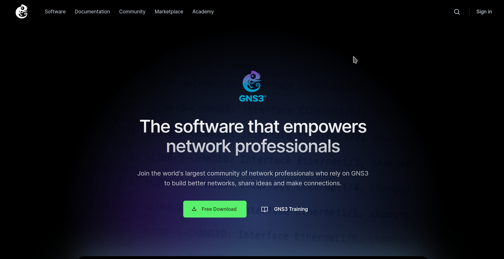
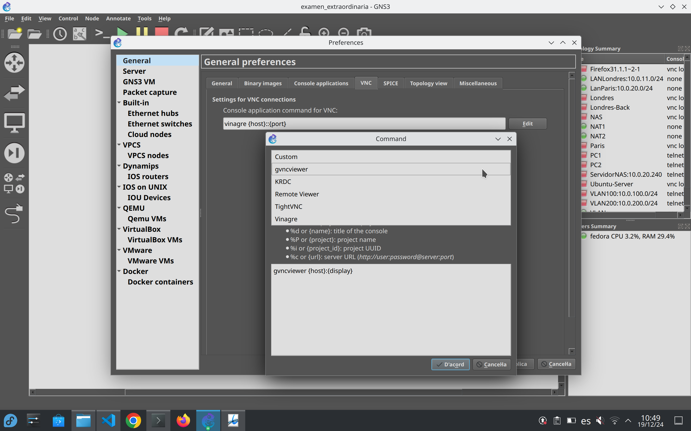
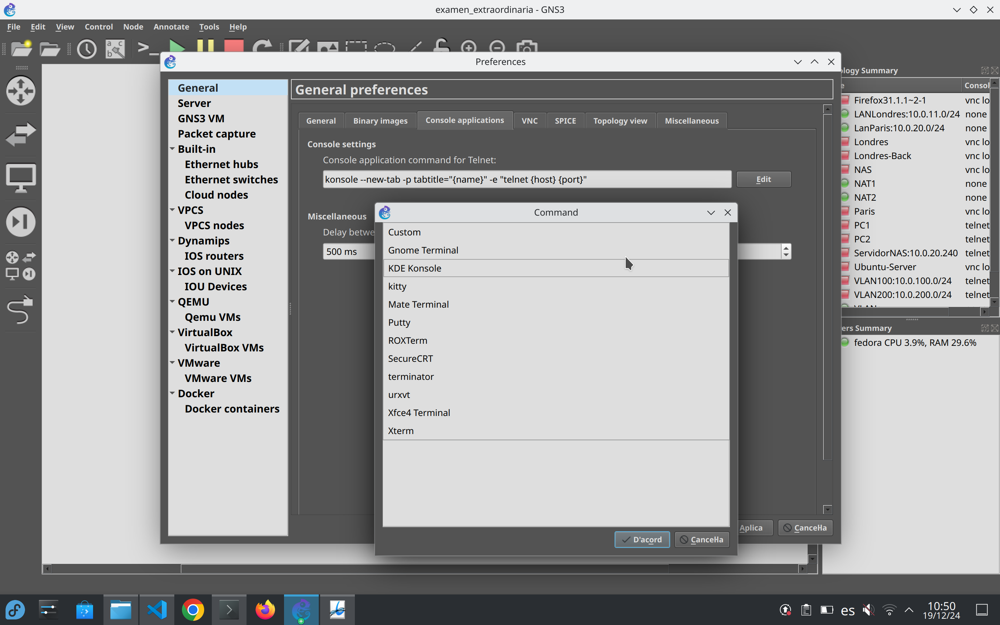
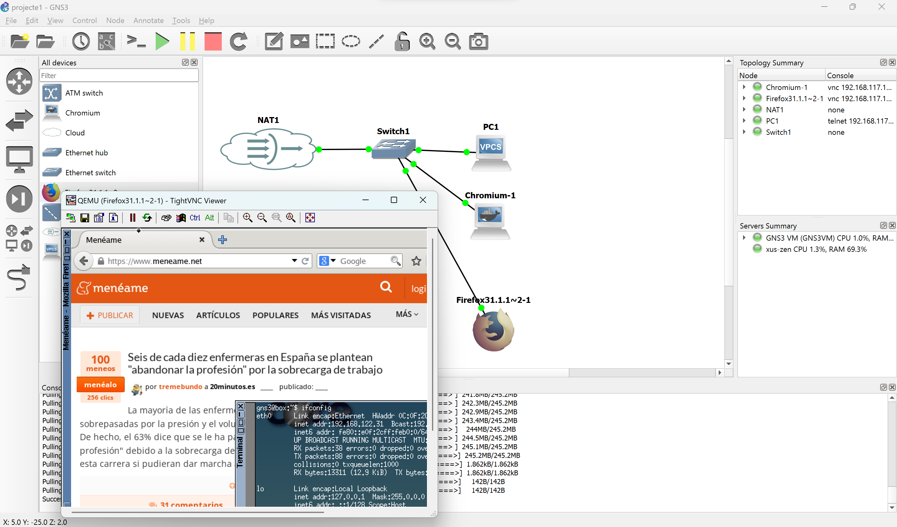
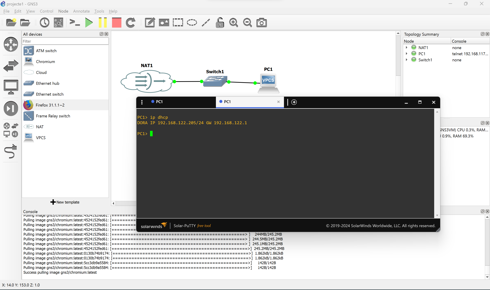

# PR301 - Primera topología básica en GNS3

## Objetivos de la Práctica

Al finalizar esta práctica se será capaz de:

1. Crear un proyecto básico de red en GNS3
2. Configurar Cloud y NAT para conectividad
3. Añadir y conectar dispositivos básicos (switches y VPCs)
4. Configurar direcciones IP en VPCs mediante DHCP
5. Probar conectividad entre dispositivos virtuales y con el PC real
6. Exportar el proyecto de forma portable para entrega

---

## Materiales Necesarios

### Dispositivos a utilizar

- **1 Cloud** - Para conectar con la red física del host
- **1 NAT** - Para conexión automática a Internet y red virtual
- **2 Switches genéricos** - Para interconectar dispositivos
- **2 VPC (Virtual PC)** - Para probar conectividad

### Requisitos del sistema

- GNS3 instalado y configurado
- Ubuntu Server o Linux con libvirt activo (para virbr0)
- Al menos 4GB de RAM disponible

---

## Estructura del Proyecto

La topología que se va a crear es la siguiente:

```
┌─────────┐         ┌─────────┐
│  Cloud  │         │   NAT   │
│(virbr0) │         │         │
└────┬────┘         └────┬────┘
     │                   │
┌────▼────┐          ┌───▼────┐
│ Switch1 │          │Switch2 │
└────┬────┘          └───┬────┘
     │                   │
┌────▼────┐          ┌───▼────┐
│  VPC1  │          │  VPC2  │
└────────┘          └────────┘
```

<!-- <figure>
  
  <figcaption><b>Figura 1:</b> Topología completa del proyecto PR301 mostrando Cloud, NAT, switches y VPCs conectados.</figcaption>
</figure> -->

### Conexiones

- **Switch1**: Conecta **Cloud** y **VPC1**
- **Switch2**: Conecta **NAT** y **VPC2**

---

## Guía Paso a Paso

### Paso 1: Iniciar GNS3 y Crear el Proyecto

#### 1.1 Abrir GNS3

- Abrir GNS3 desde el menú de aplicaciones o desde terminal: `gns3`
- Si es la primera vez, aparecerá el **Setup Wizard**

<!-- <figure>
  
  <figcaption><b>Figura 1b:</b> Pantalla inicial del Setup Wizard de GNS3.</figcaption>
</figure> -->

#### 1.2 Configurar el Setup Wizard

**Primera pantalla - Tipo de servidor:**

- Seleccionar **"Run appliances on my local computer"** (ejecutar aplicaciones en el ordenador local)
- Hacer clic en "Next"

**Segunda pantalla - Configuración local:**

- Verificar que el servidor esté configurado correctamente (normalmente `localhost` en el puerto 3080)
- Hacer clic en "Next" para continuar

**Tercera pantalla - Verificación:**

- GNS3 verificará que se tienen los emuladores necesarios instalados
- Si falta algo, se indicará qué se necesita instalar

#### 1.3 Crear Nuevo Proyecto

1. Ir a **File → New Blank Project** (o presionar `Ctrl+N`)
2. Dar un nombre descriptivo al proyecto: `PR301_TopologiaBasica` o `Practica01_Basica`
3. Seleccionar la ubicación donde guardarlo
4. Hacer clic en "OK"

---

### Paso 2: Añadir Dispositivos al Lienzo

#### 2.1 Localizar la Barra de Dispositivos

En el panel izquierdo de GNS3 se encuentran los dispositivos organizados por categorías:

- **Routers**
- **Switches**
- **End devices** - Aquí se encuentran Cloud, NAT, VPC
- **Security**
- **All devices**

#### 2.2 Añadir Cloud

1. Buscar en **"End devices"** → **Cloud**
2. **Arrastrar** el Cloud al lienzo (área de trabajo central)
3. **Configurar Cloud**: Hacer clic derecho en el Cloud → **"Configure"**
4. En la ventana de configuración:

   - **En Linux**: Seleccionar la interfaz **`virbr0`** (recomendado para prácticas)
   - **Nota**: `virbr0` es una interfaz virtual creada por libvirt que funciona siempre, incluso con Wi-Fi
   - Hacer clic en "OK"

<!-- <figure>
  
  <figcaption><b>Figura 2:</b> Ventana de configuración de Cloud mostrando la selección de virbr0.</figcaption>
</figure> -->

!!! Note "¿Por qué virbr0?"
    `virbr0` es adecuado para prácticas porque:
    - Funciona siempre (no depende de tener conexión Ethernet física)
    - Funciona con Wi-Fi
    - Crea una red predecible: 192.168.122.0/24
    - Permite comunicación bidireccional entre dispositivos virtuales y el PC real
    - Es seguro y no interfiere con la red física

#### 2.3 Añadir NAT

1. Buscar en **"End devices"** → **NAT**
2. **Arrastrar** el NAT al lienzo
3. **No requiere configuración manual** - NAT se configura automáticamente

#### 2.4 Añadir Switches

1. Buscar en **"Switches"** → **Ethernet switch** (switch genérico)
2. **Arrastrar 2 switches** al lienzo
3. Renombrarlos si se desea para mayor claridad:
   - Clic derecho en el primer switch → **"Configure"** → Cambiar el nombre a "Switch1"
   - Repetir para el segundo switch → "Switch2"

#### 2.5 Añadir VPCs

1. Buscar en **"End devices"** → **VPC** (Virtual PC)
2. **Arrastrar 2 VPCs** al lienzo
3. Renombrarlos si se desea: "VPC1" y "VPC2"

**Estado final del lienzo:**

<!-- <figure>
  
  <figcaption><b>Figura 3:</b> Lienzo de GNS3 mostrando todos los dispositivos añadidos: Cloud, NAT, switches y VPCs.</figcaption>
</figure> -->

---

### Paso 3: Realizar las Conexiones

#### 3.1 Activar el Modo de Conexión

1. Localizar el **botón de conectar** en la barra de herramientas (icono de cable/plugs)
2. Hacer **clic en el botón de conectar** o presionar **Shift + clic** para modo conexión rápida

#### 3.2 Conexión Switch1 (Cloud + VPC1)

**Conexión Cloud → Switch1:**

1. Con el modo conexión activo, hacer clic en **Cloud**
2. Luego hacer clic en **Switch1**
3. Se verá aparecer un cable conectando ambos dispositivos

**Conexión VPC1 → Switch1:**

1. Hacer clic en **Switch1**
2. Luego hacer clic en **VPC1**
3. Se debería ver otro cable conectando VPC1 a Switch1

**Resultado:**
```
┌──────────┐
│  Cloud   │
└────┬─────┘
     │
┌────▼───┐
│ Switch1│
└────┬───┘
     │
┌────▼────┐
│  VPC1   │
└─────────┘
```

#### 3.3 Conexión Switch2 (NAT + VPC2)

**Conexión NAT → Switch2:**

1. Hacer clic en **NAT**
2. Luego hacer clic en **Switch2**
3. Se verá aparecer un cable

**Conexión VPC2 → Switch2:**

1. Hacer clic en **Switch2**
2. Luego hacer clic en **VPC2**
3. Se debería ver otro cable

**Resultado:**
```
┌──────────┐
│   NAT    │
└────┬─────┘
     │
┌────▼───┐
│ Switch2│
└────┬───┘
     │
┌────▼────┐
│  VPC2   │
└─────────┘
```

#### 3.4 Verificación de Conexiones

Verificar que se tengan exactamente **4 conexiones**:

- Cloud → Switch1
- VPC1 → Switch1
- NAT → Switch2
- VPC2 → Switch2

---

### Paso 4: Iniciar los Dispositivos

#### 4.1 Método Individual

1. **Clic derecho** en cada dispositivo
2. Seleccionar **"Start"**
3. Esperar a que el círculo del dispositivo se vuelva **verde** (indica que está activo)

#### 4.2 Método Masivo (Recomendado)

1. Presionar **Ctrl+A** (seleccionar todos los dispositivos)
2. **Clic derecho** → **"Start"**
3. Esperar a que **todos** los dispositivos tengan el círculo verde

**Estado esperado:**
```
Cloud   🟢
NAT     🟢
Switch1 🟢
Switch2 🟢
VPC1    🟢
VPC2    🟢
```

!!! Warning "Advertencia"
    Esperar hasta que TODOS los dispositivos estén activos (círculo verde) antes de continuar.

---

### Paso 5: Abrir Consolas de los VPCs

#### 5.1 Abrir Consola de VPC1

1. **Clic derecho** en VPC1 → **"Console"**
2. Se abrirá una ventana de terminal con el prompt del VPC:
```
VPCS[1]> _
```

#### 5.2 Abrir Consola de VPC2

1. **Clic derecho** en VPC2 → **"Console"**
2. Se abrirá otra ventana de terminal:
```
VPCS[2]> _
```

---

## Pruebas de Conectividad

### Paso 6: Verificar IPs Asignadas

#### 6.1 Verificar IP del PC Real (Host)

Desde la terminal en Ubuntu (fuera de GNS3):

```bash
ip addr show virbr0 | grep inet
```

Debería verse algo como:
```
inet 192.168.122.1/24 brd 192.168.122.255 scope global virbr0
```

**Anotar esta IP**: `192.168.122.1` (este es el gateway)

#### 6.2 Obtener IP en VPC1 (Conectado a Cloud)

**En la consola de VPC1:**

1. Ejecutar el comando para obtener IP por DHCP:
```
VPCS[1]> ip dhcp
```

2. Debería verse algo como:
```
DDORA IP 192.168.122.206/24 GW 192.168.122.1
```

**Anotar la IP asignada a VPC1** (ejemplo: 192.168.122.206)

**Qué significa:**

- **DDORA**: Proceso DHCP (Discover, Offer, Request, Acknowledge)
- **IP**: Dirección IP asignada
- **GW**: Gateway (puerta de enlace)

<!-- <figure>
  
  <figcaption><b>Figura 4:</b> Consola de VPC1 mostrando la IP obtenida mediante DHCP.</figcaption>
</figure> -->

#### 6.3 Obtener IP en VPC2 (Conectado a NAT)

**En la consola de VPC2:**

1. Ejecutar el comando:
```
VPCS[2]> ip dhcp
```

2. Debería verse algo como:
```
DDORA IP 192.168.122.207/24 GW 192.168.122.1
```

**Anotar la IP asignada a VPC2** (ejemplo: 192.168.122.207)

!!! Note "Nota"
    Ambos VPCs deberían estar en la red 192.168.122.0/24

---

### Paso 7: Pruebas de Ping

#### 7.1 Ping desde VPC1 al Gateway (PC Real)

**En la consola de VPC1:**

```
VPCS[1]> ping 192.168.122.1
```

**Salida esperada:**
```
84 bytes from 192.168.122.1 icmp_seq=1
84 bytes from 192.168.122.1 icmp_seq=2
84 bytes from 192.168.122.1 icmp_seq=3
^C
```

**Debería responder correctamente** (el gateway de virbr0)

#### 7.2 Ping entre VPCs (VPC1 ↔ VPC2)

**Desde VPC1 a VPC2:**

En la consola de VPC1, usar la IP de VPC2 (ejemplo: 192.168.122.207):
```
VPCS[1]> ping 192.168.122.207
```

**Salida esperada:**
```
84 bytes from 192.168.122.207 icmp_seq=1
84 bytes from 192.168.122.207 icmp_seq=2
^C
```

**Debería funcionar** ya que ambos están en la misma red

**Desde VPC2 a VPC1:**

En la consola de VPC2, usar la IP de VPC1 (ejemplo: 192.168.122.206):
```
VPCS[2]> ping 192.168.122.206
```

**También debería funcionar**

<!-- <figure>
  
  <figcaption><b>Figura 5:</b> Pruebas de ping entre VPC1 y VPC2 mostrando conectividad exitosa.</figcaption>
</figure> -->

#### 7.3 Ping desde el PC Real a los VPCs

**Desde la terminal de Ubuntu (fuera de GNS3):**

```bash
# Ping a VPC1 (usar la IP que se le asignó, ejemplo: 192.168.122.206)
ping -c 3 192.168.122.206

# Ping a VPC2 (usar la IP que se le asignó, ejemplo: 192.168.122.207)
ping -c 3 192.168.122.207
```

**Salida esperada:**
```
PING 192.168.122.206 (192.168.122.206) 56(84) bytes of data.
64 bytes from 192.168.122.206: icmp_seq=1 ttl=64 time=0.348 ms
64 bytes from 192.168.122.206: icmp_seq=2 ttl=64 time=0.778 ms
^C
--- 192.168.122.206 ping statistics ---
2 packets transmitted, 2 received, 0% packet loss
```

**Debería responder correctamente**

#### 7.4 (Opcional) Ping desde VPC2 a Internet

Si el PC tiene acceso a Internet, se puede probar:

**En la consola de VPC2:**
```
VPCS[2]> ping 8.8.8.8
```

**Debería funcionar si NAT tiene acceso a Internet** (a través del PC)

---

## Comandos Útiles para VPC

### Configuración IP

```bash
# Obtener IP por DHCP
ip dhcp

# Configurar IP manualmente
ip 192.168.122.10/24 192.168.122.1

# Ver configuración IP actual
show ip
```

### Comandos de Red

```bash
# Ping
ping [IP_DESTINO]

# Ver tabla de rutas
ip route

# Guardar configuración (para que persista)
save
```

---

## Paso 8: Exportar el Proyecto

### 8.1 Verificación Previa

Antes de exportar, asegurarse de que:

- Todos los dispositivos están correctamente conectados
- Cloud configurado con virbr0 (o interfaz apropiada)
- NAT añadido
- Todos los dispositivos pueden iniciarse sin errores
- Las pruebas de ping funcionan correctamente

### 8.2 Guardar el Proyecto

1. **File → Save** (o `Ctrl+S`)
2. Asegurarse de que el proyecto esté guardado correctamente

### 8.3 Exportar Proyecto Portable

1. **File → Export portable project**
2. En la ventana de exportación:

   - **Marcar "Include images"** - OBLIGATORIO
   - Seleccionar la ubicación donde guardarlo
   - Dar un nombre descriptivo: `PR301_TopologiaBasica.gns3project`
   - Hacer clic en **"Export"**

!!! Warning "Importante"
    - El proceso puede tardar varios minutos si incluye imágenes
    - El archivo puede ocupar varios GB dependiendo de las imágenes
    - No cerrar GNS3 durante la exportación
    - Se puede verificar el progreso observando el tamaño del archivo en el explorador

### 8.4 Verificar el Archivo Exportado

Verificar que:

- El archivo existe en la ubicación seleccionada
- Tiene extensión `.gns3project`
- Tiene un tamaño razonable (no está vacío)
- Incluye imágenes (tamaño considerable si se incluyeron)

---

## Diferencias entre Cloud y NAT

### Cloud

- **Conexión directa** con la red física del host (mediante virbr0 u otra interfaz)
- **IP asignada** por el DHCP de la red seleccionada (virbr0 = 192.168.122.x)
- **Bidireccional**: permite tráfico entrante y saliente
- **Requiere configuración manual** de interfaz (virbr0 recomendado)
- **Acceso a Internet**: Sí, si la interfaz tiene acceso

### NAT

- **Configuración automática** (no requiere configuración manual)
- **IP privada** en la red 192.168.122.0/24
- **Solo tráfico saliente** (NAT unidireccional)
- **Acceso a Internet**: Sí, automáticamente
- **No permite** que dispositivos externos inicien conexiones

---

## Solución de Problemas

### Problema: VPC no obtiene IP

**Soluciones:**

1. Verificar que el dispositivo esté iniciado (círculo verde)
2. Verificar que el cable esté conectado correctamente
3. Intentar `ip dhcp` varias veces
4. Verificar que NAT/Cloud estén iniciados
5. Verificar que virbr0 esté activo: `ip addr show virbr0`

### Problema: Ping no funciona

**Soluciones:**

1. Verificar que ambos dispositivos tengan IP asignada (`show ip` en VPC)
2. Verificar que estén en la misma red (192.168.122.0/24)
3. Verificar el firewall: `sudo ufw status`
4. Probar primero ping al gateway (192.168.122.1)

### Problema: Cloud no se configura

**Soluciones:**

1. En Linux, asegurarse de usar **virbr0** para Cloud
2. Verificar que libvirtd esté activo: `sudo systemctl status libvirtd`
3. Si se necesita iniciarlo: `sudo systemctl start libvirtd`
4. Si no existe virbr0, puede que se necesite iniciar una VM con VirtualBox o instalar libvirt

### Problema: NAT no funciona

**Soluciones:**

1. NAT se configura automáticamente, no requiere configuración manual
2. Verificar que el dispositivo esté iniciado (círculo verde)
3. Verificar conectividad de Internet en el host
4. Verificar que no haya conflictos de red

---
<!-- 
## Checklist de Verificación

### Antes de Entregar - Verificar que se Tiene:

**Dispositivos:**

- [ ] 1 Cloud añadido y configurado (virbr0 para Linux)
- [ ] 1 NAT añadido
- [ ] 2 Switches genéricos añadidos
- [ ] 2 VPCs añadidos

**Conexiones:**

- [ ] Switch1 conecta **Cloud** y **VPC1**
- [ ] Switch2 conecta **NAT** y **VPC2**

**Funcionamiento:**

- [ ] Todos los dispositivos iniciados (círculos verdes)
- [ ] VPC1 obtiene IP (mediante `ip dhcp`)
- [ ] VPC2 obtiene IP de NAT (192.168.122.x)

**Pruebas de Conectividad:**

- [ ] Ping entre VPCs funciona (VPC1 ↔ VPC2)
- [ ] Ping desde VPCs al PC real funciona
- [ ] Ping desde PC real a VPCs funciona

**Preparación para Entrega:**

- [ ] Proyecto guardado (Ctrl+S o File → Save)
- [ ] Proyecto exportado en formato portable
- [ ] **"Include images" marcado** en la exportación (OBLIGATORIO)
- [ ] Archivo `.gns3project` creado correctamente -->

<!-- --- -->

## Documentación Requerida

Para la entrega, documentar con capturas de pantalla:

1. **Topología completa** en GNS3 mostrando todos los dispositivos conectados
2. **Configuración de Cloud** (mostrando que está configurado con virbr0)
3. **Consola de VPC1** mostrando la IP obtenida (`show ip`)
4. **Consola de VPC2** mostrando la IP obtenida (`show ip`)
5. **Prueba de ping entre VPCs** (captura de ambas consolas)
6. **Prueba de ping desde VPCs al PC real** (192.168.122.1)
7. **Prueba de ping desde PC real a VPCs** (desde terminal de Ubuntu)
8. **Proceso de exportación** del proyecto

---
<!-- 
## Objetivos de Aprendizaje

Al finalizar esta práctica se habrá aprendido:

1. Crear proyectos básicos en GNS3
2. Diferencias entre Cloud y NAT
3. Configurar dispositivos de red virtuales
4. Conectar dispositivos mediante switches
5. Configurar direcciones IP mediante DHCP
6. Probar conectividad básica (ping)
7. Exportar proyectos portables
8. Configurar Cloud en entornos Linux (virbr0)

---

## Notas Finales

- En **Linux**, Cloud funciona mejor con **virbr0** o interfaz Ethernet cableada
- NAT es más sencillo de usar para accesos a Internet básicos
- La red NAT por defecto es **192.168.122.0/24** en Ubuntu
- Los VPC son útiles para pruebas rápidas sin necesidad de SO completo
- **Siempre exportar el proyecto con imágenes** para compartirlo correctamente
- Documentar los problemas que se encuentren y cómo se solucionaron -->
