# PR303 - Virtualización servidor/cliente, enrutamiento y NAT

## Objetivo
Montar un entorno servidor/cliente aislado de la red física en GNS3, configurando un servidor Ubuntu con dos interfaces (una hacia Cloud/NAT y otra hacia una red interna), habilitar enrutamiento y NAT con iptables, y verificar conectividad desde un cliente Ubuntu Desktop. Opcionalmente, desplegar Apache y una appliance WordPress.

## Requisitos previos
- GNS3 instalado y operativo (local o con GNS3 VM).
- Imágenes/appliances básicas disponibles (Ubuntu Server 24.04, Ubuntu Desktop, NAT/Cloud, switch genérico).
- Conocimientos de C03 (direcciones IP, puerta de enlace, DNS, enrutamiento, NAT, SSH e iptables).

## Escenario

Componentes:

- Un dispositivo Cloud o NAT según el sistema anfitrión.
- Un switch genérico.
- Un servidor Ubuntu (24.04) con dos interfaces: `ens3` (externa, DHCP) y `ens4` (interna, estática: 10.10.1.1/24).
- Un cliente Ubuntu Desktop en la red interna (`10.10.1.0/24`).

<figure>
  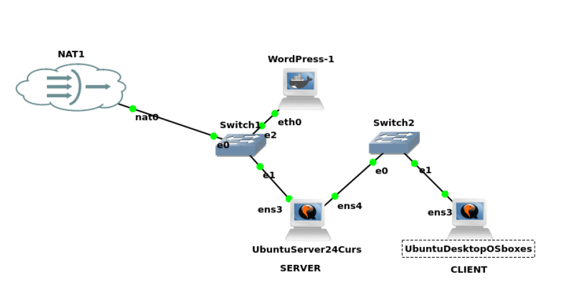
  <figcaption>Topología detallada en GNS3 para PR303.</figcaption>
</figure>

> **Topología de red para la práctica:**  
> El diagrama ilustra la arquitectura para PR303, compuesta por:

> - **NAT1**: proporciona acceso externo simulando la salida a Internet.
> - **Switch1**: conecta el NAT y los dispositivos internos.
> - **WordPress-1**: opcional, servidor WordPress.
> - **Servidor Ubuntu** (`UbuntuServer24Curs`): tiene dos interfaces:
>    - `ens3`: red hacia el NAT (externa, DHCP)
>    - `ens4`: red interna (estática, 10.10.1.1/24)
> - **Switch2**: conecta la red interna.
> - **Cliente Ubuntu Desktop** (`UbuntuDesktopOSboxes`): conectado a la red interna (10.10.1.0/24), puerta de enlace 10.10.1.1.


!!! tip "Referencia gráfica"
    La imagen refleja claramente la separación entre red externa (NAT) y red interna (cliente-servidor), así como la función de cada interfaz. Puedes usar este diagrama como referencia visual en la documentación de la práctica.

## Entrega de la práctica

El informe entregable debe incluir, al menos:

- Captura de la topología final en GNS3.
- Salidas de `ip a` y `ip route` del servidor y del cliente.
- Capturas de pings internos y externos.
- Capturas de acceso a Apache y al panel de administración de WordPress.
- Breve descripción de los problemas encontrados y cómo se han resuelto (errores de red, iptables, DNS, etc.).


## Pasos

### 1. Importar proyecto base 
- File → Import portable project.
- Esperar a que finalice la copia (puede tardar varios minutos).

<figure>
  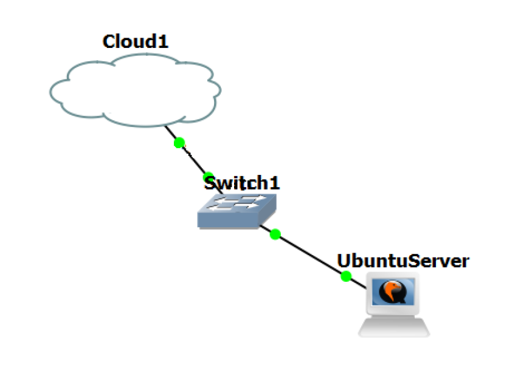
  <figcaption>Topología inical en GNS3 para PR303.</figcaption>
</figure>


### 2. Crear plantilla a partir de una existente (QEMU)
- Preferences → QEMU → New template → Copy una VM de referencia (p. ej. Ubuntu Desktop/Guest).
- Editar y sustituir el disco por el `*.vmdk` del servidor importado.
- Ajustar nombre, RAM y consola si procede.


<figure>
  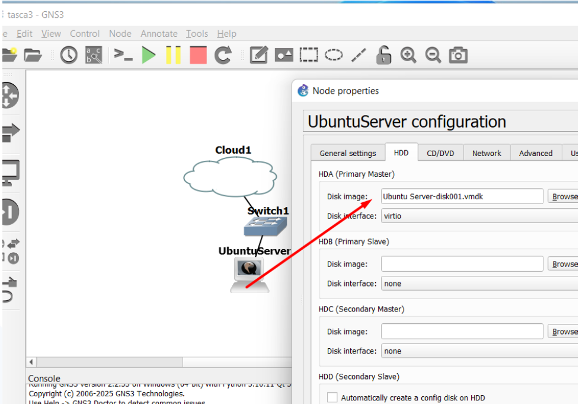
  <figcaption>
    Proceso de edición de la plantilla UbuntuServer en GNS3: selecciona la máquina, accede a las propiedades, y adjunta el disco <code>Ubuntu Server-disk01.vmdk</code> en la pestaña correspondiente (<b>HDD Primary Master</b>).
  </figcaption>
</figure>

<figure>
  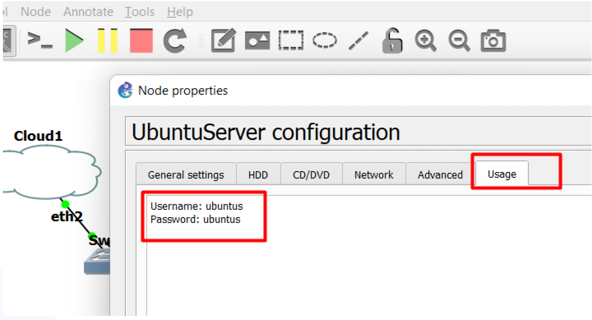
  <figcaption>
     Credenciales predeterminadas (usuario: <code>ubuntu</code>, contraseña: <code>ubuntu</code>), necesarias para el acceso inicial al sistema operativo tras el despliegue en la topología virtual.
  </figcaption>
</figure>


### 3. Adaptar el dispositivo Cloud/NAT
- Linux recomendado: dispositivo NAT (red 192.168.122.0/24 mediante `virbr0`).
- Windows recomendado: Cloud en modo Bridge (o NAT por defecto) para integrarse con la red física.
- Conectar Cloud/NAT ↔ switch.

!!! tip "Nota"
    Es **recomendable eliminar el dispositivo Cloud/NAT importado y volver a crearlo** en GNS3, en lugar de reutilizar el que viene en el proyecto base. Esto evita posibles errores de configuración o incompatibilidades con la red del anfitrión.


### 4. Configurar el servidor Ubuntu
1) Dos adaptadores en la plantilla VM. Renombrar interfaces personalizadas a `ens3` y `ens4`.

<figure>
  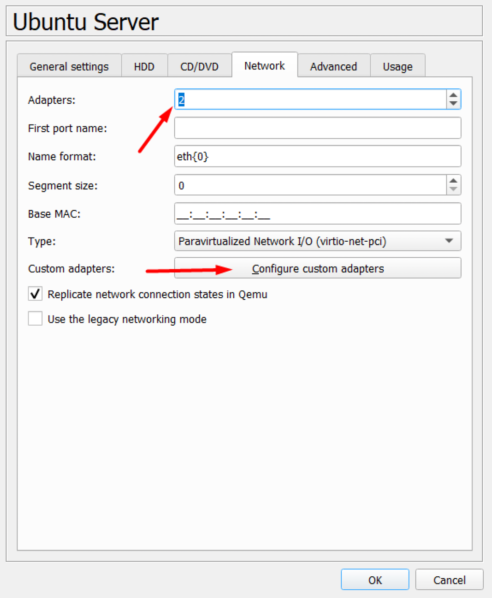
  <figcaption>
    Configuración de red de la máquina virtual 
  </figcaption>
</figure>

<figure>
  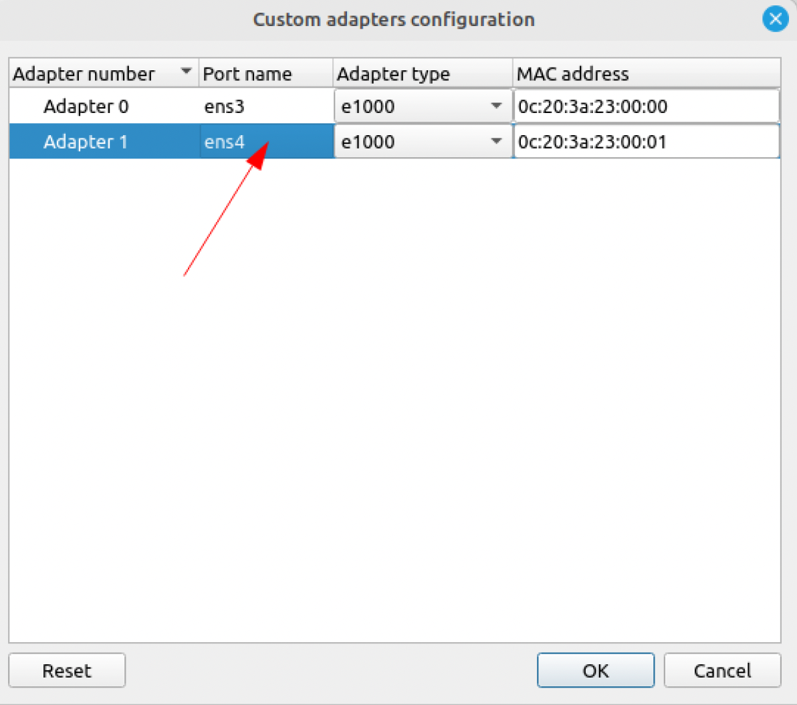
  <figcaption>
    Configuración personalizada de los adaptadores del servidor Ubuntu en GNS3.
  </figcaption>
</figure>


> **Configuración de adaptadores de red en el *Ubuntu Server* de GNS3**
>
> Es imprescindible seleccionar **2 adaptadores de red** desde el menú desplegable de la plantilla de la máquina virtual. Además, se recomienda utilizar la opción **"Configure custom adapters"** para asignar nombres personalizados y reconocibles a las interfaces, empleando por ejemplo `<code>ens3</code>` para la interfaz externa (conectada a NAT/Cloud) y `<code>ens4</code>` para la interfaz interna (red privada).
>
> **Asegúrate** siempre de que ambos adaptadores estén correctamente configurados **antes de iniciar la máquina virtual**, para poder distinguir con claridad cada interfaz y evitar problemas posteriores.
>
> Los nombres asignados a las interfaces, como `<code>ens3</code>` y `<code>ens4</code>`, deben coincidir exactamente con los que se usarán en la configuración de red de Netplan dentro del sistema operativo. Esto es fundamental para garantizar la conectividad y evitar errores relacionados con la correspondencia de nombres de puertos.

Por ello, es recomendable visualizar los nombres de las interfaces en el diagrama de GNS3 para asegurar un cableado correcto y facilitar la identificación de cada conexión.

<figure>
  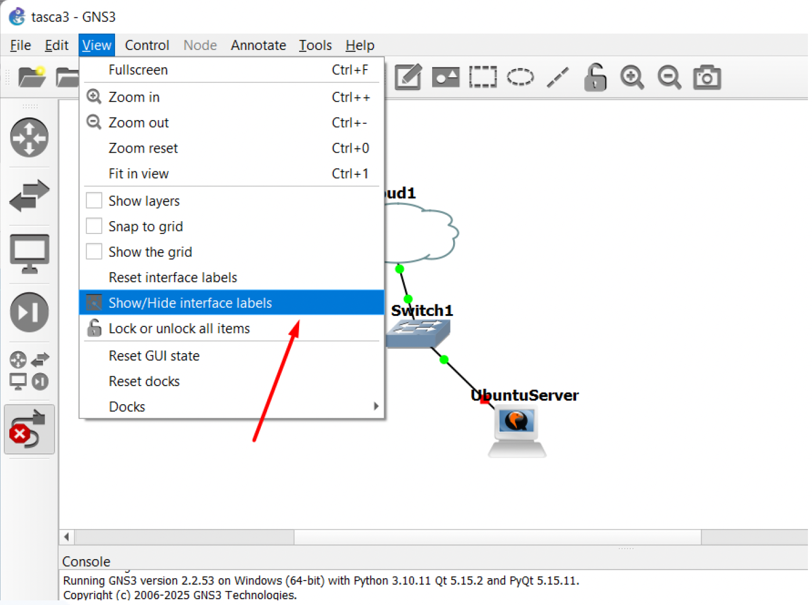
  <figcaption>
    <b>muestraInterfaces.</b> 
  </figcaption>
</figure>

!!! tip "Mostrar nombres de interfaces en GNS3"
    En GNS3, para visualizar los nombres de las interfaces en la topología, ve al menú <b>View</b> y selecciona <b>Show/Hide interface labels</b>. Esto es crucial para evitar errores de cableado entre dispositivos, ya que permite identificar visualmente cada interfaz conectada.


2) Instalar SSH y habilitar acceso remoto:
```bash
sudo apt update && sudo apt install -y openssh-server
```
1) Configurar Netplan:

- `ens3`: DHCP (lado externo)
- `ens4`: estática `10.10.1.1/24`

Ejemplo `50-cloud-init.yaml`:
```yaml
network:
  version: 2
  renderer: networkd
  ethernets:
    ens3:
      dhcp4: yes
    ens4:
      dhcp4: no
      addresses:
        - 10.10.1.1/24
```
Aplicar y verificar:
```bash
sudo netplan apply
ip a
ip route show
```

### 5. Enrutamiento y NAT con iptables
1) Habilitar reenvío IP:
```bash
echo 1 | sudo tee /proc/sys/net/ipv4/ip_forward
```
2) Reglas básicas (ejemplo mínimo):
```bash
# Limpiar
sudo iptables -F
sudo iptables -X
sudo iptables -t nat -F
sudo iptables -Z

# NAT hacia la interfaz externa (ajustar si no es ens3)
sudo iptables -t nat -A POSTROUTING -o ens3 -j MASQUERADE

# Permitir forward entre interfaces
sudo iptables -A FORWARD -i ens3 -o ens4 -j ACCEPT
sudo iptables -A FORWARD -i ens4 -o ens3 -j ACCEPT
```

> **Nota:** Todo este proceso también se puede automatizar usando el script `firewall.sh` que se adjunta en la tarea de Aules. Para emplearlo, primero cópialo a la máquina virtual (por ejemplo, utilizando `scp`):

```bash
scp firewall.sh usuario@IP_MV:/home/usuario/
```

Luego dale permisos de ejecución y ejecútalo con privilegios de superusuario:

```bash
chmod +x firewall.sh
sudo ./firewall.sh
```

De esta forma se aplican todas las reglas y configuraciones necesarias de forma automática.


### 6. Persistencia (recomendado)
- Instalar `iptables-persistent` y guardar reglas:
```bash
sudo apt update && sudo apt install -y iptables-persistent
sudo netfilter-persistent save
sudo systemctl enable netfilter-persistent
```

!!! note "NOTA"
    Durante la instalación, aparecerá un mensaje preguntando si deseas guardar las reglas actuales. Selecciona **Sí**.

<figure>
  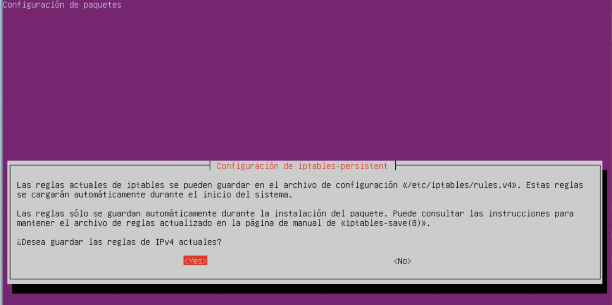
  <figcaption>Pantalla de confirmación para guardar las reglas actuales con <code>iptables-persistent</code>.</figcaption>
</figure>


- Persistir el reenvío IP en `/etc/sysctl.conf`:

Asegúrate de que las reglas se cargan en cada reinicio:

1. Activa el servicio para que se inicie automáticamente:
   ```bash
   sudo systemctl enable netfilter-persistent
   ```
2. Puedes iniciarlo manualmente con:
   ```bash
   sudo systemctl start netfilter-persistent
   ```
3. Si editas manualmente las reglas, vuelve a cargarlas con:
   ```bash
   sudo netfilter-persistent reload
   ```

Solo nos quedaría hacer persistente el reenvío entre las tarjetas de red.

Para ello, debemos editar el archivo de configuración de sysctl:
```bash
sudo nano /etc/sysctl.conf
```
Descomenta o añade esta línea para habilitar el reenvío de IPv4:

```text
net.ipv4.ip_forward=1
```
- Guarda el archivo y aplica los cambios inmediatamente sin reiniciar:
```bash
sudo sysctl -p
```


### 7. Configurar el cliente Ubuntu Desktop

- Añadir la máquina Ubuntu Desktop al diseño conectada al switch interno. Primero añadiremos el cliente Ubuntu Desktop al diseño, conectado al switch interno. Hemos escogido este cliente para configurar una dirección IP de forma estática desde el entorno gráfico. Sin embargo, puede ser cualquier cliente; también se podría añadir un cliente Windows o una appliance de Firefox, como ya se hizo en la PR302.

Además, para unir el servidor y el cliente añadiremos también al diseño otro switch.

<figure>
  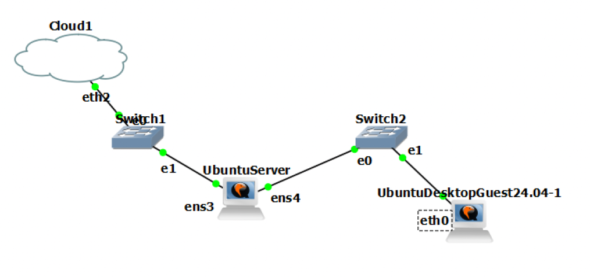
  <figcaption>Cliente Ubuntu Desktop añadido al diseño y conectado al nuevo switch interno.</figcaption>
</figure>

- Encenderla e iniciar sesión en el entorno gráfico.
- Abrir la configuración de red (Network Manager) y editar la conexión cableada:
  - IP: `10.10.1.10/24` (o similar en la red 10.10.1.0/24)
  - Puerta de enlace: `10.10.1.1` (servidor Ubuntu)
  - DNS: `8.8.8.8` u otro servidor de tu elección.

<figure>
  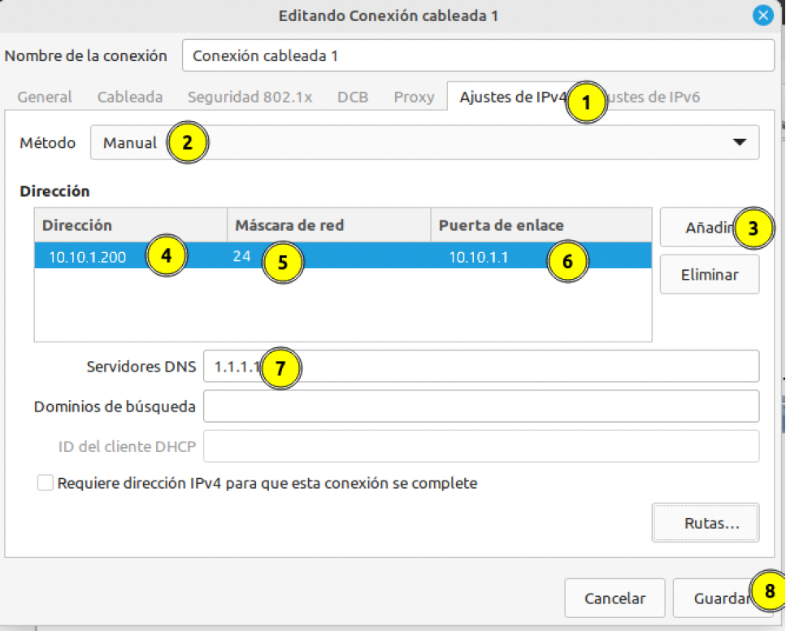
  <figcaption>Configuración de red estática en el cliente Ubuntu Desktop (Network Manager) 
 </figcaption>
</figure>

!!! note
    Aplica los cambios y reinicia la conexión de red si es necesario para que la nueva configuración tenga efecto.

- Comprobar en un terminal:
```bash
ip a
ping 10.10.1.1        # hacia el servidor
ping 8.8.8.8          # salida a Internet
```

<figure>
  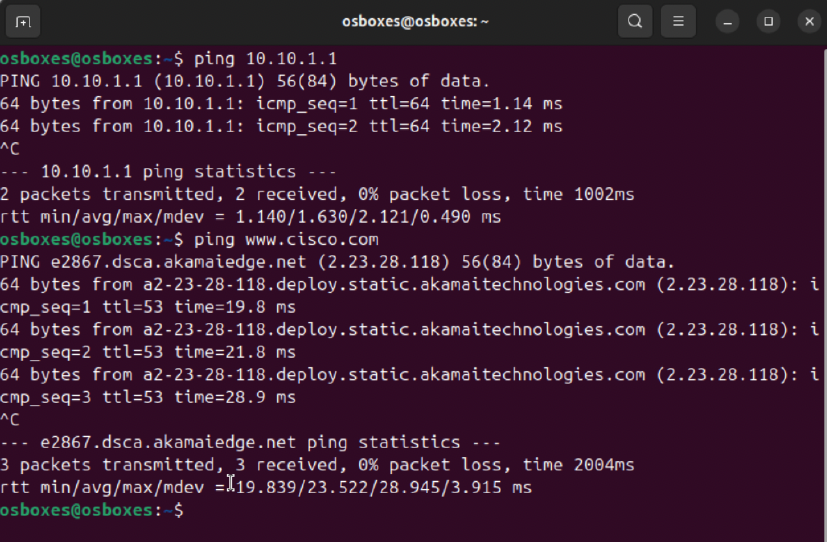
  <figcaption>Comprobación de conectividad desde el cliente.</figcaption>
</figure>


### 8. Servidor Apache (opcional pero recomendado)

En el servidor Ubuntu:
```bash
sudo apt update
sudo apt install -y apache2
```

- Verificar que el servicio está en marcha:
```bash
systemctl status apache2
```
- Desde el cliente Ubuntu Desktop, abrir el navegador y acceder a `http://10.10.1.1/` para comprobar que se muestra la página por defecto de Apache.

### 9. Pruebas de funcionamiento

Con todos los elementos encendidos:

1. Comprobar que el cliente navega hacia el exterior (por ejemplo, `http://www.cisco.com`).
2. Verificar acceso HTTP al servidor Apache interno.
3. Confirmar que los pings entre cliente y servidor funcionan correctamente.
4. Comprobar que, tras un reinicio del servidor, las reglas de iptables siguen activas si se ha configurado la persistencia.

<figure>
  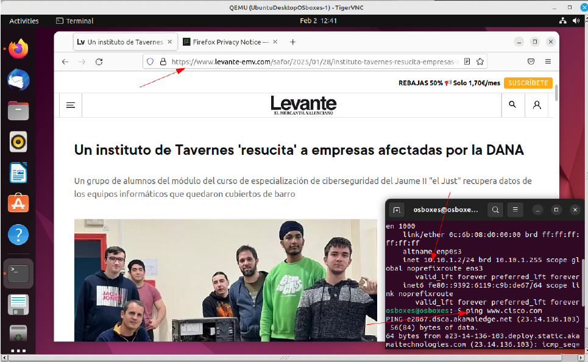
  <figcaption>
    Comprobaciones de conectividad en el cliente Ubuntu Desktop.
  </figcaption>
</figure>


### 10. WordPress (Ocional)

- Importar la appliance WordPress desde el Marketplace (`New Template → Guests → WordPress`).
- Conectarla al switch interno para que obtenga IP (ya sea por DHCP o configurando IP estática).

<figure>
  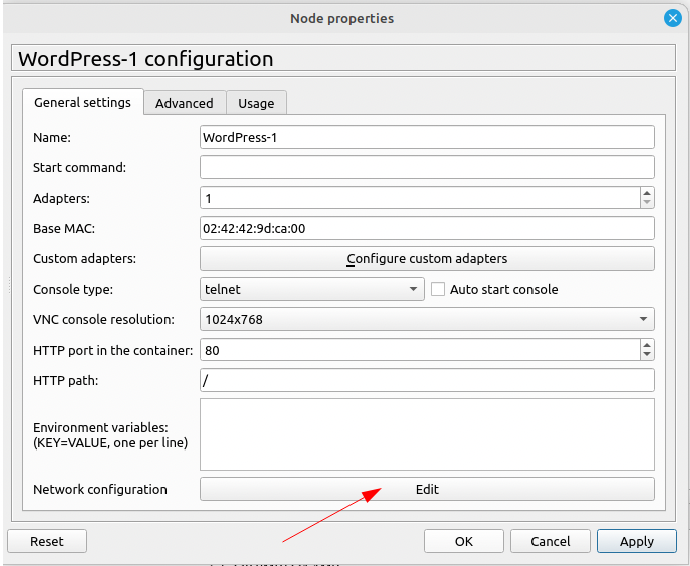
  <figcaption>
    Topología con la appliance WordPress conectada a la red interna.
  </figcaption>
</figure>

!!! note
    Podríamos poner una dirección IP manualmente o descomentar la parte de DHCP.

<figure>
  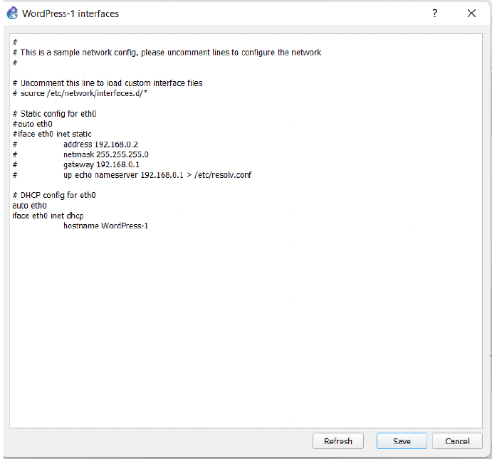
  <figcaption>
    Acceso del cliente Ubuntu Desktop a WordPress desplegado en la red interna.
  </figcaption>
</figure>


- Seguir el asistente de inicialización de WordPress (crear usuario administrador, contraseña, etc.).

#### Inicialización de WordPress

El servicio de WordPress está instalado dentro de un contenedor Docker. Al arrancar la máquina, el servicio todavía no está inicializado y obtiene una dirección IP, que suele mostrarse en pantalla. Además, se genera una contraseña aleatoria para el usuario root de la instancia de WordPress.

1. Lo primero que debemos hacer es establecer una nueva contraseña de root accediendo al terminal de la máquina WordPress.

   - Abrimos una consola en la propia máquina WordPress (puede ser mediante consola directa desde GNS3 o por SSH si está disponible).
   - Usamos el comando adecuado para cambiar el password del usuario root según las instrucciones del sistema o del asistente de WordPress.
   - Es importante anotar la nueva contraseña configurada, ya que nos servirá en los siguientes pasos de la instalación.

<figure>
  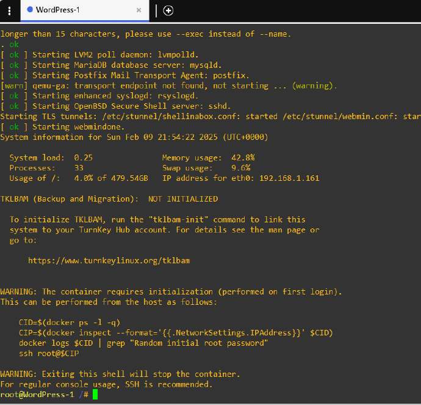
  <figcaption>
    Pantalla inicial del asistente de configuración de WordPress tras acceder por primera vez desde el navegador.
  </figcaption>
</figure>

<figure>
  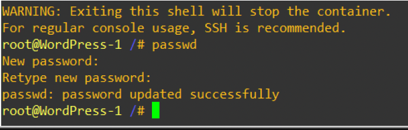
  <figcaption>
    Página para establecer la nueva contraseña de root al inicializar WordPress.
  </figcaption>
</figure>

1. Desde el cliente Ubuntu Desktop, acceder vía navegador a la IP de la máquina WordPress para validar el despliegue.

<figure>
  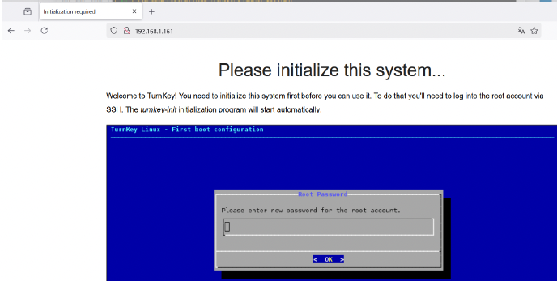
  <figcaption>
    Acceso al panel de administración de WordPress desde el cliente Ubuntu Desktop.
  </figcaption>
</figure>

3. Al acceder, indica que WordPress no está inicializado y que solo se puede completar la configuración a través de SSH. Entonces, abrimos un terminal y nos conectamos con el usuario root y la contraseña que le hemos asignado previamente.


<figure>
  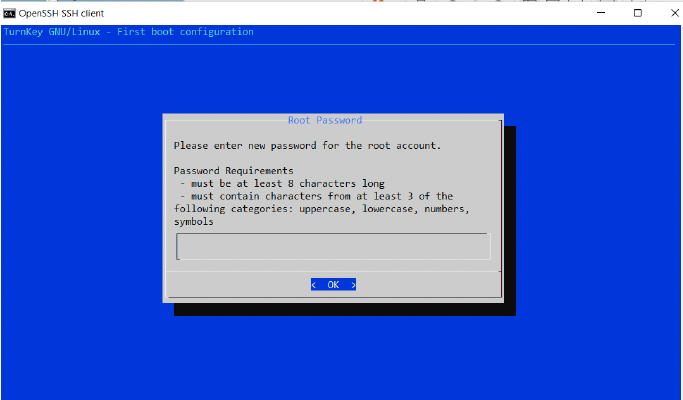
  <figcaption>
    Cambio de contraseña del usuario root en la máquina WordPress desde la terminal.
  </figcaption>
</figure>

4. Después, comienza una serie de ventanas de configuración que nos piden la contraseña de root, la de la base de datos, una cuenta de correo… Vamos rellenando los campos y seleccionamos "Saltar" (skip) en las opciones de seguridad, etc., ya que nuestro objetivo es solo tener un WordPress funcionando.

<figure>
  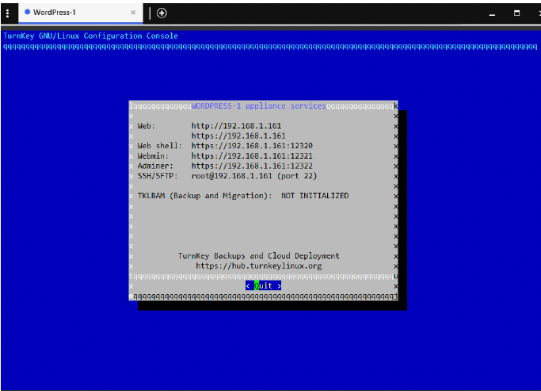
  <figcaption>
    Visualización de la IP asignada a la máquina WordPress tras el arranque.
  </figcaption>
</figure>

<figure>
  
  <figcaption>
    Pantalla donde se puede seleccionar "Saltar" (skip) las opciones de seguridad durante la configuración de WordPress.
  </figcaption>
</figure>

1. Al finalizar, salimos de la consola de configuración y, si volvemos a introducir la dirección del equipo en el navegador, ya nos aparece el panel de administración de WordPress.

<figure>
  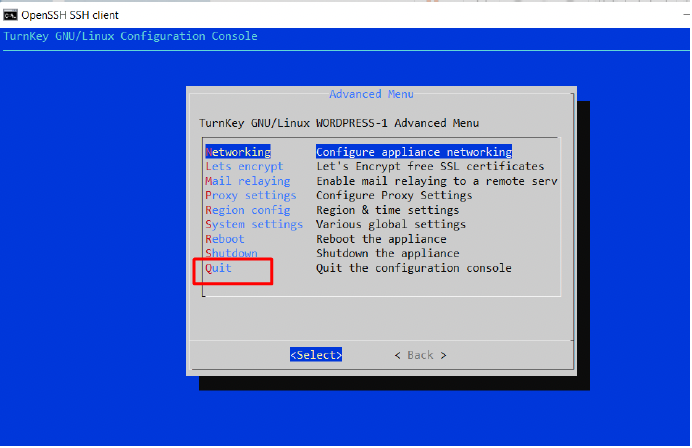
  <figcaption>
    Salida de la consola de configuración de WordPress, dejando la máquina lista para su uso en el navegador.
  </figcaption>
</figure>

1. Introducimos el usuario admin y la contraseña que hemos configurado y ya estaremos dentro del panel de administración de WordPress, listo para poder trabajar en él.

<figure>
  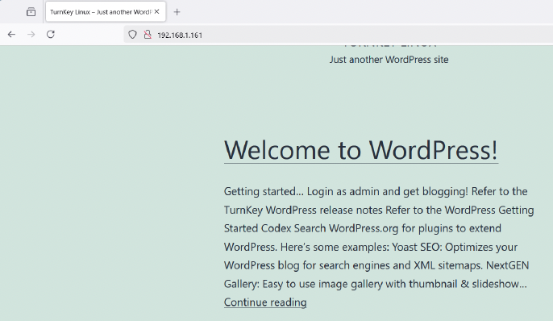
  <figcaption>
    Acceso al panel de administración de WordPress después de iniciar sesión con el usuario configurado.
  </figcaption>
</figure>


<figure>
  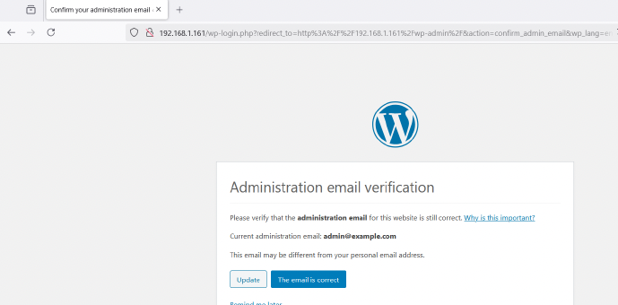
  <figcaption>
    Panel de administración de WordPress accesible desde el cliente una vez completada toda la configuración.
  </figcaption>
</figure>


<figure>
  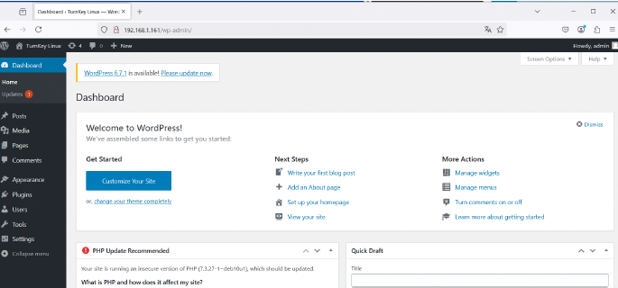
  <figcaption>
    Vista adicional del panel de administración de WordPress tras completar la configuración y personalizaciones.
  </figcaption>
</figure>


