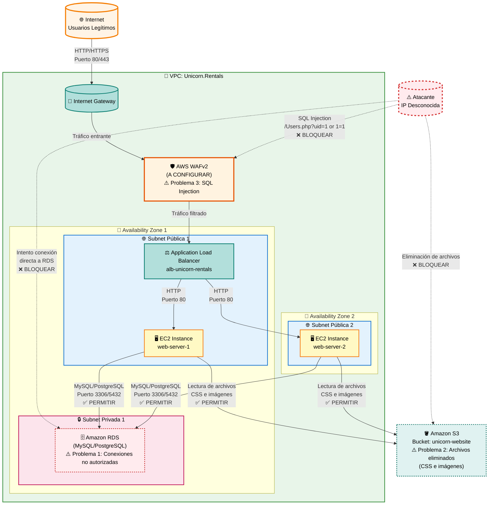

# Security 101 - Guía del Alumno

## Introducción

En este quest debes proteger la infraestructura de Unicorn.Rentals contra tres tipos de ataques:

1. **Ataques a la base de datos RDS**: Conexiones no autorizadas desde IPs desconocidas
2. **Eliminación de archivos en S3**: Alguien está borrando archivos CSS e imágenes
3. **Ataques SQL Injection**: Intentos de inyección SQL a través del ALB

> ⚠️ **IMPORTANTE**: No debes romper el sitio web. El sitio debe seguir funcionando después de aplicar las soluciones.

Durante el GameDay, tendrás acceso a un **Cloud IDE** y servidor Git (Gitea) para trabajar con repositorios. Consulta la guía de uso:

**[Cloud IDE Quest - Guía de Uso →](AWS_GameDay2025_CloudIDE.md)**

Esta guía incluye:

- Credenciales de acceso al Code Server IDE y Gitea
- Instrucciones para usar el IDE basado en web
- Comandos Git esenciales para trabajar en equipo
- Resolución de conflictos y troubleshooting
- Flujo de trabajo recomendado durante la competición


## Arquitectura de la Infraestructura



**Descripción de componentes y problemas de seguridad:**

| Componente | Descripción | Problema de Seguridad |
|:-----------|:------------|:---------------------|
| **Internet Gateway** | Puerta de enlace para comunicación con Internet | - |
| **AWS WAFv2** | Firewall de aplicación web (debe configurarse) | **Problema 3**: Bloquear ataques SQL injection como `/Users.php?uid=1%20or%201=1` |
| **Application Load Balancer** | Distribuye el tráfico HTTP/HTTPS entre servidores web | - |
| **EC2 Instances** | Servidores web que hospedan la aplicación PHP | - |
| **Amazon RDS** | Base de datos relacional (MySQL/PostgreSQL) | **Problema 1**: Recibe conexiones no autorizadas desde IPs desconocidas. Solo debe aceptar conexiones desde los servidores web |
| **Amazon S3** | Bucket con archivos estáticos (CSS, imágenes) | **Problema 2**: Alguien está eliminando archivos CSS e imágenes del bucket |

**Flujos de tráfico y problemas a resolver:**

1. **Tráfico legítimo entrante**: Internet → Internet Gateway → **WAF** (configurar) → ALB → EC2 → RDS
2. **Ataques SQL Injection**: Atacante → **WAF** (bloquear) → ALB ❌
3. **Conexiones no autorizadas a RDS**: Atacante → **RDS directamente** (bloquear mediante Security Groups) ❌
4. **Eliminación de archivos S3**: Atacante → **S3** (bloquear mediante Bucket Policies) ❌
5. **Acceso legítimo a S3**: EC2 → **S3** (lectura de CSS e imágenes) ✅

**Soluciones a implementar:**

1. **RDS**: Configurar Security Groups para permitir solo conexiones desde el Security Group de las instancias EC2
2. **S3**: Configurar Bucket Policies para prevenir eliminaciones no autorizadas y restaurar archivos eliminados
3. **WAF**: Crear Web ACL con reglas para bloquear SQL injection y asociarlo al ALB

---

## Parte 1: RDS Seguro - Bloquear Conexiones No Autorizadas

### Objetivo
Identificar la IP del atacante que intenta conectarse a la base de datos RDS y bloquear esas conexiones sin afectar el sitio web.

### Pasos a seguir

#### 1.1. Identificar la instancia RDS

1. Ve a la consola de AWS y navega a **Amazon RDS**
2. Identifica la instancia de base de datos en ejecución
3. Anota el **nombre de la instancia** y el **Security Group** asociado

#### 1.2. Revisar CloudWatch Logs para identificar la IP del atacante

Cuando el acceso a RDS se realiza a través de un Lambda, debes buscar la IP del atacante en diferentes lugares:

##### Opción A: Revisar logs de RDS directamente

Si RDS tiene logs habilitados, puedes ver las conexiones entrantes:

1. Ve a **CloudWatch** → **Log groups**
2. Busca logs relacionados con RDS (pueden llamarse `/aws/rds/instance/[nombre-instancia]/error` o similar)
3. Revisa los logs para encontrar intentos de conexión desde IPs que no pertenecen a tus servidores web
4. **Anota la dirección IP** del atacante (la que aparece múltiples veces en intentos fallidos)

##### Opción B: Revisar Security Groups para ver IPs con acceso (MÉTODO MÁS DIRECTO)

Si los logs del Lambda no muestran IPs, este es el método más directo y confiable:

1. Ve a **EC2** → **Security Groups**
2. Encuentra el Security Group asociado a tu instancia RDS:
   - Puedes identificarlo desde la página de RDS → Seleccionar tu instancia → Pestaña "Connectivity & security" → Security groups
3. Haz clic en el Security Group para abrir sus detalles
4. Ve a la pestaña **"Inbound rules"** (Reglas de entrada)
5. Revisa todas las reglas y busca:
   - ✅ Reglas que permitan acceso desde tus servidores web (estas son legítimas)
   - ❌ Reglas que permitan acceso desde `0.0.0.0/0` (permiten desde cualquier IP - **muy sospechoso**)
   - ❌ Reglas con IPs específicas que NO reconozcas (ej: `203.0.113.0/24` o similar)
   - ❌ Reglas con rangos IP que no sean de tu VPC (no empiecen con `10.`, `172.16-31.`, `192.168.`)
   
6. **La IP del atacante** aparecerá como:
   - Una IP única con `/32` al final (ej: `203.0.113.45/32`)
   - Un rango de IPs con `/24` o similar (ej: `203.0.113.0/24`)
   - La regla sospechosa generalmente permitirá acceso al puerto de la base de datos (3306 para MySQL, 5432 para PostgreSQL)
   
7. **Anota la IP o rango IP** de la regla sospechosa para el formulario del quest

!!! tip "Ejemplo de lo que buscar"
    En las Inbound Rules del Security Group de RDS, podrías ver algo como:
    ```
    Type: MySQL/Aurora
    Protocol: TCP
    Port: 3306
    Source: 203.0.113.45/32  ← Esta podría ser la IP del atacante
    ```
    Si ves una IP pública que no corresponde a tus servidores web, esa es la IP del atacante.

##### Opción C: Revisar VPC Flow Logs (si están habilitados)

Los VPC Flow Logs registran todo el tráfico de red, incluyendo intentos de conexión a RDS.

1. Ve a **CloudWatch** → **Log groups**
2. Busca logs relacionados con VPC Flow Logs (pueden llamarse `/aws/vpc/flowlogs` o similar)
3. Haz clic en el log group de VPC Flow Logs
4. Haz clic en **"View in Logs Insights"**
5. Usa CloudWatch Logs Insights para buscar conexiones a RDS:

**Consulta para encontrar la IP del atacante:**
```sql
fields @timestamp, srcaddr, dstaddr, dstport, action
| filter dstport = 3306 or dstport = 5432
| filter action = "ACCEPT" or action = "REJECT"
| stats count() by srcaddr
| sort count desc
```

6. Identifica IPs que aparezcan con frecuencia y que no sean de tus servidores web o del Lambda legítimo

**Interpretación de VPC Flow Logs:**

Los VPC Flow Logs tienen un formato estructurado. Un ejemplo de línea de log:

```
timestamp account-id interface-id srcaddr dstaddr srcport dstport protocol packets bytes windowstart windowend action flowlogstatus
```

**Campos importantes:**
- `srcaddr`: Dirección IP de origen (ej: `52.4.170.163`)
- `dstaddr`: Dirección IP de destino (ej: `10.0.3.170` - probablemente tu RDS)
- `dstport`: Puerto de destino (ej: `3306` para MySQL)
- `action`: Acción (`ACCEPT` o `REJECT`)

**Ejemplo de log:**
```
1764236665 831926611091 eni-0238e6a5827f56560 52.4.170.163 10.0.3.170 46674 3306 6 2 120 1764236665 1764236694 REJECT OK
```

Esto muestra un intento rechazado desde `52.4.170.163` hacia `10.0.3.170:3306`.

!!! warning "Nota sobre VPC Flow Logs"
    Los VPC Flow Logs **NO contienen el nombre del hacker**, solo registran el tráfico de red (IPs, puertos, acciones). Para encontrar el nombre del hacker, debes buscar en los **logs del Lambda** (Opción D) o en **CloudTrail**.

##### Opción D: Revisar logs del Lambda (MÉTODO RECOMENDADO)

El Lambda que interactúa con RDS puede registrar las IPs origen. Para encontrar la IP del atacante:

1. Ve a **CloudWatch** → **Log groups**
2. Busca logs relacionados con Lambda (el nombre puede empezar por `/aws/lambda/` o contener `gdQuests` o `CreateIdCInstanceFunction`)
3. Haz clic en el log group del Lambda (ejemplo: `/aws/lambda/gdQuests-...-CreateIdCInstanceFunction-...`)
4. Haz clic en **"View in Logs Insights"** (botón azul)
5. Ejecuta una consulta para buscar IPs en los logs:

**Consulta 1: Buscar todas las IPs en los logs (si no funciona, prueba las siguientes):**
```sql
fields @timestamp, @message
| parse @message /(?<ip>\d+\.\d+\.\d+\.\d+)/ 
| stats count() by ip
| sort count desc
```

**Consulta 2: Ver todos los mensajes primero para entender la estructura:**
```sql
fields @timestamp, @message
| sort @timestamp desc
| limit 50
```
*Esta consulta te mostrará los mensajes reales para ver qué información contienen.*

**Consulta 3: Buscar por términos relacionados con conexiones o RDS:**
```sql
fields @timestamp, @message
| filter @message like /rds/ or @message like /RDS/ or @message like /database/ or @message like /mysql/ or @message like /postgres/
| sort @timestamp desc
| limit 50
```

**Consulta 4: Buscar por patrones de error o conexión:**
```sql
fields @timestamp, @message
| filter @message like /error/ or @message like /Error/ or @message like /failed/ or @message like /Failed/ or @message like /timeout/
| sort @timestamp desc
| limit 50
```

**Consulta 5: Buscar cualquier número que parezca una IP (más amplio):**
```sql
fields @timestamp, @message
| parse @message /(\d{1,3}\.\d{1,3}\.\d{1,3}\.\d{1,3})/ as ip
| filter ip != null
| stats count() by ip
| sort count desc
```

!!! warning "Si ninguna consulta muestra IPs"
    Si ninguna de estas consultas muestra IPs en los logs del Lambda, la IP del atacante probablemente esté en los **Security Groups** de RDS. Ve a la Opción B (Revisar Security Groups) que está más abajo.

6. **Revisa los resultados cuidadosamente:**
   - Si las consultas no muestran IPs, primero ejecuta la **Consulta 2** para ver qué información realmente contienen los logs
   - Los logs pueden tener la IP en diferentes formatos o campos
   - La IP puede estar en el contexto del evento (no en el mensaje)

7. **Si no encuentras IPs en los logs del Lambda:**
   - Ve directamente a revisar los **Security Groups** de RDS (Opción B)
   - La IP del atacante probablemente esté configurada en las reglas de entrada del Security Group
   - O puede estar en los **VPC Flow Logs** si están habilitados

**Alternativa: Buscar directamente en el log group**

1. Haz clic en **"Search log group"** (botón amarillo)
2. Busca términos como: `connect`, `connection`, `IP`, o busca directamente una IP si sospechas de alguna
3. Revisa los eventos de log para encontrar intentos de conexión

**Pasos detallados en CloudWatch Logs Insights:**

1. En la página de detalles del log group del Lambda, haz clic en **"View in Logs Insights"**
2. Se abrirá la página de Logs Insights con el log group ya seleccionado
3. En el editor de consultas, escribe o pega una de estas consultas:

**Consulta básica para encontrar IPs:**
```sql
fields @timestamp, @message
| parse @message /(?<ip>\d+\.\d+\.\d+\.\d+)/ 
| stats count() by ip
| sort count desc
```

4. Haz clic en **"Run query"** (o presiona Ctrl+Enter)
5. Revisa los resultados en la tabla:
   - La columna `ip` mostrará todas las direcciones IP encontradas en los logs
   - La columna `count` mostrará cuántas veces aparece cada IP
   - Las IPs que aparecen con más frecuencia y son IPs públicas (externas) son sospechosas
6. Identifica la IP del atacante:
   - **NO será** una IP privada (10.x.x.x, 172.16-31.x.x, 192.168.x.x)
   - **SERÁ** una IP pública externa que aparece intentando conectarse
   - Generalmente aparecerá múltiples veces con intentos de conexión

**Si no encuentras IPs, primero ve qué hay en los logs:**

```sql
fields @timestamp, @message
| sort @timestamp desc
| limit 20
```

Esta consulta te mostrará los mensajes reales para entender qué información contienen. Luego puedes adaptar las consultas según lo que veas.

**Si los logs del Lambda no contienen IPs:**

Los logs del Lambda pueden no registrar las IPs de origen directamente. En ese caso, **ve directamente a revisar los Security Groups** (Opción B más abajo), que es el método más confiable para encontrar la IP del atacante.

**Alternativa: Usar CloudWatch Insights para buscar en todos los logs**

1. En CloudWatch, ve a **Logs Insights**
2. Selecciona múltiples log groups (RDS, Lambda, VPC Flow Logs si están disponibles)
3. Ejecuta una consulta como:

```sql
fields @timestamp, @message, @logStream
| filter @message like /connection/ or @message like /connect/ or @message like /IP/
| sort @timestamp desc
| limit 100
```

4. Busca IPs que aparezcan repetidamente y que no sean de tus servidores web

!!! tip "Consejo: Dónde encontrar la IP del atacante más rápido"
    **⚠️ Si los logs del Lambda no muestran IPs, usa este método:**
    
    **Método 1 - Security Groups (MÁS DIRECTO Y CONFIABLE):**
    1. EC2 → Security Groups
    2. Selecciona el Security Group de tu instancia RDS (puedes encontrarlo en RDS → Instancia → Pestaña "Connectivity & security")
    3. Pestaña **"Inbound rules"**
    4. Busca reglas sospechosas que permitan acceso desde:
       - IPs externas que NO sean de tus servidores web
       - `0.0.0.0/0` (permite desde cualquier IP)
       - Rangos IP públicos (no privados como `10.x.x.x`, `172.16-31.x.x`, `192.168.x.x`)
    5. La IP puede estar en formato CIDR (ej: `203.0.113.5/32`) - usa esa IP para el formulario
    6. **Esa es la IP del atacante**
    
    **Método 2 - Logs del Lambda (si contienen IPs):**
    1. CloudWatch → Log groups → Busca el Lambda
    2. Haz clic en **"View in Logs Insights"**
    3. Primero ejecuta: `fields @timestamp, @message | sort @timestamp desc | limit 20` para ver qué hay
    4. Si ves IPs, usa las consultas de extracción de IPs
    5. Si no ves IPs, vuelve al Método 1 (Security Groups)
    
!!! warning "Importante"
    - La IP del atacante será una IP pública externa (NO una IP privada como `10.x.x.x`, `172.16-31.x.x`, o `192.168.x.x`)
    - Si la IP está en formato CIDR con `/32`, usa esa IP completa para el formulario
    - Si está como rango (ej: `/24`), la IP base del rango suele ser la del atacante

### Troubleshooting: No encuentro la IP en los logs

Si las consultas en CloudWatch Logs Insights no muestran resultados o no encuentras IPs:

1. **Primero, verifica qué hay realmente en los logs:**
   ```sql
   fields @timestamp, @message
   | sort @timestamp desc
   | limit 20
   ```
   Esto te mostrará los mensajes reales para entender qué información contienen.

2. **Si los logs no contienen IPs**, es normal. Los logs del Lambda pueden no registrar las IPs de origen directamente.

3. **Solución: Ve directamente a Security Groups:**
   - Los Security Groups son el lugar más confiable para encontrar la IP del atacante
   - El atacante debe tener una regla en el Security Group de RDS que le permita acceder
   - Sigue la **Opción B: Revisar Security Groups** que está más abajo

4. **Alternativa: Revisa VPC Flow Logs:**
   - Si están habilitados, pueden contener información detallada sobre conexiones
   - Ve a la **Opción C: Revisar VPC Flow Logs** más abajo

#### 1.3. Revisar y modificar Security Groups

> 💡 **Nota**: Si ya revisaste los Security Groups en el paso anterior (Opción B), puedes proceder directamente a modificarlos.

1. Ve a **EC2** → **Security Groups**
2. Encuentra el Security Group asociado a tu instancia RDS
3. Revisa las **Inbound Rules** (Reglas de entrada)
4. Identifica qué IPs o rangos tienen acceso actualmente
   - Busca reglas que permitan acceso desde `0.0.0.0/0` (todo internet) ❌
   - Busca IPs específicas sospechosas que no sean de tus servidores web ❌
   - Anota la IP del atacante si la encuentras aquí

#### 1.4. Modificar el Security Group de RDS

> 🎯 **Estrategia**: Permitir conexiones SOLO desde los servidores web y recursos legítimos (como Lambda si aplica), bloqueando todas las demás.

1. Edita el Security Group de RDS
2. **Modifica o elimina** las reglas que permitan acceso desde:
   - `0.0.0.0/0` (todo internet) ❌
   - IPs específicas sospechosas que identificaste ❌
3. **Añade nuevas reglas** que permitan conexiones solo desde:
   - El Security Group de tus instancias EC2 (servidores web) ✅
   - El Security Group del Lambda (si hay un Lambda legítimo que accede a RDS) ✅
   - O las IPs específicas de tus servidores web ✅
   
   **Configuración sugerida para servidores web:**
   - **Type**: MySQL/Aurora (puerto 3306) o PostgreSQL (puerto 5432) según tu base de datos
   - **Source**: Selecciona el Security Group de tus instancias EC2
   - **Description**: "Allow access only from web servers"
   
   **Si hay un Lambda legítimo:**
   - **Type**: MySQL/Aurora (puerto 3306) o PostgreSQL (puerto 5432)
   - **Source**: Selecciona el Security Group del Lambda o usa VPC endpoints si está configurado
   - **Description**: "Allow access from Lambda function"

4. **Guarda los cambios**

!!! warning "Importante"
    Si identificaste la IP del atacante en el paso anterior, asegúrate de eliminarla o bloquearla explícitamente en las reglas del Security Group. NO añadas reglas que permitan acceso desde esa IP.

#### 1.5. Verificar que el sitio web sigue funcionando

1. Obtén la URL del ALB (Application Load Balancer)
   - Ve a **EC2** → **Load Balancers**
   - Copia el DNS name del ALB
2. Abre el DNS en un navegador
3. Verifica que el sitio carga correctamente
4. Prueba el endpoint `/Users.php?uid=1` para verificar que la conexión a la base de datos funciona

#### 1.6. Encontrar el nombre del hacker asociado a la IP

Una vez que hayas identificado la IP del atacante (ejemplo: `52.4.170.163`), necesitas encontrar el **nombre del hacker** asociado a esa IP.

> 💡 **IP encontrada**: Si ya tienes la IP `52.4.170.163`, sigue estos pasos para encontrar el nombre del hacker.

!!! tip "Pista importante - EMPIEZA AQUÍ"
    La pista indica que busques **solicitudes HTTPS rechazadas**. Estas se registran en los **logs de acceso del Application Load Balancer (ALB)**. 
    
    **👉 Empieza directamente por la Opción 2 (más abajo) para buscar en los logs del ALB.**

**Método rápido - Consulta directa con tu IP:**

Reemplaza `52.4.170.163` con la IP que encontraste en esta consulta:

```sql
fields @timestamp, @message
| filter @message like /52.4.170.163/
| sort @timestamp desc
| limit 20
```

Revisa el contenido completo del campo `@message` - el nombre del hacker debería aparecer en el mismo mensaje que contiene la IP.

##### Opción 1: Buscar en los logs del Lambda usando la IP (MÉTODO ALTERNATIVO)

1. Ve a **CloudWatch** → **Log groups**
2. Busca el log group del Lambda (puede empezar con `/aws/lambda/` y contener `gdQuests` o `CreateIdCInstanceFunction`)
3. Haz clic en **"View in Logs Insights"**

**Paso 1: Buscar mensajes que contengan la IP del hacker**

Reemplaza `52.4.170.163` con la IP que encontraste y ejecuta esta consulta:

```sql
fields @timestamp, @message
| filter @message like /52.4.170.163/
| sort @timestamp desc
| limit 50
```

**Paso 2: Revisar los mensajes completos**

Los mensajes que contengan la IP `52.4.170.163` probablemente también incluyan el nombre del hacker. 

1. Revisa el contenido completo del campo `@message` en cada resultado
2. El nombre del hacker puede aparecer:
   - Junto a la IP en el mismo mensaje
   - En formato JSON como `"user": "nombre"` o `"hacker": "nombre"`
   - Como texto plano cerca de la IP
   - En el nombre del log stream o en otros campos

**Paso 3: Si no encuentras el nombre directamente, extrae todos los campos**

Si los logs están estructurados, intenta extraer todos los campos:

```sql
fields @timestamp, @message, @logStream, @log
| filter @message like /52.4.170.163/
| sort @timestamp desc
| limit 50
```

Esto te mostrará más información que puede contener el nombre del hacker.

**Paso 4: Buscar patrones comunes de nombres**

Si el nombre no aparece directamente, busca patrones comunes en los logs alrededor de los eventos con esa IP:

```sql
fields @timestamp, @message
| filter @timestamp >= @timestamp - 1h
| filter @message like /52.4.170.163/ or @message like /hacker/ or @message like /user/ or @message like /attacker/ or @message like /name/
| sort @timestamp desc
| limit 100
```

Esto buscará eventos relacionados en un período de tiempo reciente.

**Paso 5: Buscar en el log stream name o en todos los campos**

El nombre del hacker puede estar en el nombre del log stream o en otros campos del evento:

```sql
fields @timestamp, @message, @logStream, @log
| filter @message like /52.4.170.163/
| sort @timestamp desc
| limit 20
```

Revisa también el campo `@logStream` - a veces el nombre del hacker aparece ahí.

**Consulta alternativa - extraer información estructurada:**

Si los logs tienen un formato estructurado, prueba:

```sql
fields @timestamp, @message
| filter @message like /52.4.170.163/
| parse @message /(?<hacker_name>[\w\-]+).*52\.4\.170\.163/
| filter hacker_name != null
| stats count() by hacker_name
```

**Paso 3: Si no aparece directamente, busca patrones**

Si el nombre del hacker no aparece en los mismos mensajes que la IP, busca patrones comunes:

```sql
fields @timestamp, @message
| filter @message like /52.4.170.163/
| sort @timestamp desc
| limit 10
```

Luego busca en otros logs del mismo período temporal con:

```sql
fields @timestamp, @message
| filter @timestamp > timestamp("2025-11-27 00:00:00") and @timestamp < timestamp("2025-11-27 23:59:59")
| filter @message like /hacker/ or @message like /attacker/ or @message like /user/
| sort @timestamp desc
| limit 50
```

!!! tip "Importante"
    El nombre del hacker generalmente aparece en el mismo log event que contiene la IP `52.4.170.163`. Revisa cuidadosamente el mensaje completo de cada evento que contenga esa IP.

##### Opción 2: Buscar en los logs de acceso del ALB - Solicitudes HTTPS rechazadas ⭐ (EMPEZAR AQUÍ - SEGÚN PISTA)

> 🔍 **Pista clave**: Buscar solicitudes HTTPS rechazadas puede revelar el nombre del hacker.

El Application Load Balancer tiene logs de acceso que registran todas las solicitudes HTTP/HTTPS, incluyendo las rechazadas o bloqueadas.

**Paso 1: Encontrar los logs de acceso del ALB**

1. Ve a **CloudWatch** → **Log groups**
2. Busca log groups relacionados con el ALB:
   - Pueden llamarse `/aws/elasticloadbalancing/...` o `/aws/alb/...`
   - O buscar log groups que contengan el nombre del ALB `gdQues-Appli-`
   - También pueden estar en formato: `/aws/elasticloadbalancing/us-east-1/ACCOUNT-ID/alb/ALB-ID/..._access`

**Paso 2: Buscar solicitudes HTTPS rechazadas desde la IP del hacker**

Una vez que encuentres el log group del ALB:

1. Haz clic en el log group
2. Haz clic en **"View in Logs Insights"**
3. Ejecuta esta consulta para buscar solicitudes rechazadas desde la IP `52.4.170.163`:

**Consulta 1: Buscar todas las solicitudes desde la IP maliciosa (incluyendo rechazadas):**

```sql
fields @timestamp, @message
| filter @message like /52.4.170.163/
| sort @timestamp desc
| limit 50
```

**Consulta 2: Buscar solicitudes HTTPS rechazadas (códigos de error 4xx, 5xx):**

Los logs de ALB tienen un formato específico. Esta consulta parsea el formato estándar de ALB access logs:

```sql
fields @timestamp, @message
| parse @message /(?<type>[^ ]+) (?<time>[^ ]+) (?<client_ip>[^ ]+) (?<target_ip>[^ ]+) (?<request_processing_time>[^ ]+) (?<target_processing_time>[^ ]+) (?<response_processing_time>[^ ]+) (?<elb_status_code>[^ ]+) (?<target_status_code>[^ ]+) (?<received_bytes>[^ ]+) (?<sent_bytes>[^ ]+) "(?<request>[^"]+)" "(?<user_agent>[^"]+)"/
| filter client_ip = "52.4.170.163"
| filter (elb_status_code >= 400 or target_status_code >= 400)
| sort @timestamp desc
| limit 50
```

**Consulta 3: Versión simplificada - buscar la IP y códigos de error:**

```sql
fields @timestamp, @message
| filter @message like /52.4.170.163/
| filter (@message like /" 4/ or @message like /" 5/)
| sort @timestamp desc
| limit 50
```

**Consulta 4: Buscar en el campo user_agent (donde puede estar el nombre del hacker):**

```sql
fields @timestamp, @message
| parse @message /.*"(?<user_agent>[^"]+)"\s*$/
| filter @message like /52.4.170.163/
| filter user_agent != "-"
| sort @timestamp desc
| limit 50
```

**Consulta 5: Extraer el nombre del hacker del user_agent o request:**

```sql
fields @timestamp, @message
| filter @message like /52.4.170.163/
| parse @message /.*(?<hacker_name>[a-zA-Z0-9_-]+).*52\.4\.170\.163.*/
| filter hacker_name != null
| stats count() by hacker_name
| sort count desc
```

!!! tip "Dónde buscar el nombre del hacker"
    El nombre del hacker puede aparecer en:
    - El campo `user_agent` del log (ejemplo: `Mozilla/5.0 (compatible; hacker_name/1.0)`)
    - En la URL de la `request` (ejemplo: `/api/user/hacker_name`)
    - Como parte del mensaje completo del log
    - Busca palabras clave relacionadas con el hacker en el campo `@message` completo

**Consulta 6: Buscar solicitudes SQL injection con transferencias de dinero (IMPORTANTE - NOMBRE DE USUARIO QUE RECIBE DINERO)**

El hacker está realizando SQL injection para transferir dinero a un usuario. Busca en las solicitudes SQL injection el parámetro que indica el nombre de usuario que recibe el dinero:

```sql
fields @timestamp, @message
| filter @message like /52.4.170.163/
| parse @message /.*"(?<request>[^"]+)"/
| filter request like /SELECT/ or request like /UPDATE/ or request like /INSERT/ or request like /DELETE/
| filter request like /money/ or request like /transfer/ or request like /balance/ or request like /account/ or request like /user/ or request like /to/ or request like /FROM/ or request like /SET/
| sort @timestamp desc
| limit 50
```

**Consulta 7: Parsear la URL completa para extraer parámetros SQL injection:**

```sql
fields @timestamp, @message
| filter @message like /52.4.170.163/
| parse @message /.*"(?<request>[^"]+)"/
| filter request like /52.4.170.163/ or request like /uid=/ or request like /user=/ or request like /id=/
| parse request /.*[?&](?:user|uid|to|account|recipient|beneficiary)=(?<recipient_user>[^&" ]+).*/
| filter recipient_user != null and recipient_user != "" and recipient_user != "52.4.170.163"
| stats count() by recipient_user
| sort count desc
| limit 20
```

**Consulta 8: Buscar patrones SQL injection con nombres de usuario en la query:**

```sql
fields @timestamp, @message
| filter @message like /52.4.170.163/
| parse @message /.*"(?<request>[^"]+)"/
| filter request like /'/ or request like /"/ or request like /;/ or request like /--/
| parse request /.*(?:FROM|TO|INTO|UPDATE|SET|VALUES|WHERE).*['"](?<username>[a-zA-Z0-9_]+)['"]/
| filter username != null
| stats count() by username
| sort count desc
| limit 20
```

**Consulta 9: Buscar específicamente transferencias de dinero en la query SQL:**

```sql
fields @timestamp, @message
| filter @message like /52.4.170.163/
| filter @message like /money/ or @message like /transfer/ or @message like /balance/ or @message like /amount/ or @message like /give/ or @message like /send/
| parse @message /.*(?:TO|to|user|username|recipient|account)[\s=:]+['"]?(?<recipient>[a-zA-Z0-9_]+)['"]?/
| filter recipient != null and recipient != "" and recipient != "money" and recipient != "transfer"
| stats count() by recipient
| sort count desc
| limit 20
```

!!! warning "Pista clave - VPC Flow Logs"
    Si encuentras VPC Flow Logs con la IP `52.4.170.163` (como el que te mostramos en la guía), confirman el tráfico pero **NO contienen el nombre de usuario**. 
    
    Los VPC Flow Logs están en el log group: `/aws/lambda/gdQuests-85bb2535-d851-48-CreateIdCInstanceFunctio-RyxEBkvJxATJ`
    
    **Para encontrar el nombre de usuario que recibe el dinero, debes buscar en los logs del ALB** las solicitudes HTTP/HTTPS que contengan las queries SQL injection con los parámetros de transferencia.

#### 1.7. Encontrar el nombre de usuario al que el hacker transfiere dinero

> 🎯 **Objetivo IMPORTANTE**: No busques el nombre del hacker. La pregunta es: **"Escriba el nombre de usuario al que el hacker que inyecta SQL le estaba dando dinero"**.
> 
> Necesitas encontrar **el nombre de usuario DESTINATARIO** que está recibiendo el dinero mediante SQL injection.

!!! warning "⚠️ IMPORTANTE - NO confundas:"
    - ❌ **NO busques el nombre del hacker** (quien está haciendo el ataque)
    - ✅ **SÍ buscas el nombre del USUARIO** al que el hacker está transfiriendo dinero mediante SQL injection
    
    El hacker (IP `52.4.170.163`) está usando SQL injection para transferir dinero a otro usuario. Necesitas encontrar el nombre de ese usuario destinatario.

Los VPC Flow Logs que encontraste confirman el tráfico desde la IP `52.4.170.163`, pero **no contienen el nombre del usuario destinatario**. El nombre del usuario destinatario aparece en las **solicitudes SQL injection** registradas en los **logs de acceso del ALB**.

**Paso 1: Entender qué contienen los VPC Flow Logs**

Si encuentras VPC Flow Logs como estos, confirman el tráfico pero **NO contienen el nombre del usuario destinatario**:

- Log group: `/aws/lambda/gdQuests-85bb2535-d851-48-CreateIdCInstanceFunctio-RyxEBkvJxATJ`
- Log stream: `eni-01c264626674f7763-all`
- IP origen: `52.4.170.163` (IP del hacker)
- IP destino: `10.0.2.150`
- Puerto: `80` (HTTP)

Estos logs solo muestran tráfico de red (source IP, destination IP, puertos, bytes). **NO contienen el contenido de las solicitudes HTTP**, por lo que **NO tienen el nombre del usuario destinatario**.

El **nombre del usuario destinatario está en las solicitudes HTTP/HTTPS** que pasan por el ALB, específicamente en las queries SQL injection que el hacker está ejecutando.

**Paso 2: Buscar en los logs del ALB las solicitudes SQL injection con el nombre del usuario destinatario**

Los logs de acceso del ALB contienen todas las solicitudes HTTP/HTTPS, incluyendo las queries SQL injection completas. Aquí es donde encontrarás el nombre del usuario destinatario.

1. Ve a **CloudWatch** → **Log groups**
2. Busca el log group del ALB (formato: `/aws/elasticloadbalancing/...` o contiene `gdQues-Appli-`)
3. Haz clic en el log group y luego en **"View in Logs Insights"**

**Consulta 1: Buscar todas las solicitudes desde la IP del hacker en el ALB:**

```sql
fields @timestamp, @message
| filter @message like /52.4.170.163/
| sort @timestamp desc
| limit 100
```

**Consulta 2: Parsear la URL de las solicitudes para encontrar parámetros SQL injection:**

Los logs del ALB tienen un formato específico. Necesitas extraer el campo `request` que contiene la URL completa con los parámetros SQL injection:

```sql
fields @timestamp, @message
| filter @message like /52.4.170.163/
| parse @message /(?<type>[^ ]+) (?<time>[^ ]+) (?<client_ip>[^ ]+) (?<target_ip>[^ ]+) (?<request_processing_time>[^ ]+) (?<target_processing_time>[^ ]+) (?<response_processing_time>[^ ]+) (?<elb_status_code>[^ ]+) (?<target_status_code>[^ ]+) (?<received_bytes>[^ ]+) (?<sent_bytes>[^ ]+) "(?<request>[^"]+)" "(?<user_agent>[^"]+)"/
| filter client_ip = "52.4.170.163"
| filter request like /uid=/ or request like /user=/ or request like /id=/ or request like /to=/ or request like /account=/
| sort @timestamp desc
| limit 50
```

**Consulta 3: Extraer el nombre de usuario DESTINATARIO de los parámetros de la URL (MÉTODO RECOMENDADO):**

Esta consulta busca específicamente el parámetro `to` o `user` que indica el destinatario del dinero:

```sql
fields @timestamp, @message
| filter @message like /52.4.170.163/
| parse @message /.*"(?<request>[^"]+)"/
| filter request like /uid=/ or request like /user=/ or request like /id=/ or request like /to=/ or request like /account=/ or request like /recipient=/ or request like /to_user=/
| parse request /.*[?&](?:to|user|uid|account|recipient|beneficiary|username|to_user|recipient_user)[=:](?<recipient_user>[^&" ]+)/
| filter recipient_user != null and recipient_user != "" and recipient_user != "52.4.170.163" and recipient_user != "-"
| stats count() by recipient_user
| sort count desc
| limit 20
```

**Consulta 3b: Buscar en queries SQL injection con UPDATE o INSERT (especialmente importante):**

El hacker está haciendo SQL injection, así que busca en las queries SQL completas:

```sql
fields @timestamp, @message
| filter @message like /52.4.170.163/
| parse @message /.*"(?<request>[^"]+)"/
| filter request like /UPDATE/ or request like /INSERT/ or request like /SET/ or request like /VALUES/
| parse request /.*(?:UPDATE|INSERT|SET|VALUES|WHERE|TO|to).*['"](?<recipient_username>[a-zA-Z0-9_]+)['"]/
| filter recipient_username != null and recipient_username != "" and recipient_username != "money" and recipient_username != "transfer" and recipient_username != "balance" and recipient_username != "amount" and recipient_username != "SET" and recipient_username != "UPDATE" and recipient_username != "INSERT" and recipient_username != "WHERE"
| stats count() by recipient_username
| sort count desc
| limit 20
```

**Consulta 4: Buscar en el cuerpo de la request (POST requests) si hay datos de transferencia:**

```sql
fields @timestamp, @message
| filter @message like /52.4.170.163/
| filter @message like /POST/ or @message like /PUT/ or @message like /PATCH/
| parse @message /.*(?<request_body>[a-zA-Z0-9_=&\-]+)/
| filter request_body like /user/ or request_body like /to/ or request_body like /account/ or request_body like /recipient/
| sort @timestamp desc
| limit 50
```

**Consulta 5: Buscar patrones SQL injection en la request (SELECT, UPDATE, INSERT con nombres de usuario):**

```sql
fields @timestamp, @message
| filter @message like /52.4.170.163/
| parse @message /.*"(?<request>[^"]+)"/
| filter request like /SELECT/ or request like /UPDATE/ or request like /INSERT/ or request like /SET/
| parse request /.*(?:TO|to|user|username|recipient|account|beneficiary)[\s=:]+['"]?(?<recipient>[a-zA-Z0-9_]+)['"]?/
| filter recipient != null and recipient != "" and recipient != "money" and recipient != "transfer" and recipient != "balance"
| stats count() by recipient
| sort count desc
| limit 20
```

**Consulta 6: Buscar específicamente transferencias de dinero con el nombre del usuario destinatario (MUY IMPORTANTE):**

```sql
fields @timestamp, @message
| filter @message like /52.4.170.163/
| filter @message like /money/ or @message like /transfer/ or @message like /balance/ or @message like /amount/ or @message like /give/ or @message like /send/ or @message like /UPDATE/ or @message like /INSERT/
| parse @message /.*(?:TO|to|user|username|recipient|account|beneficiary|to_user)[\s=:]+['"]?(?<recipient>[a-zA-Z0-9_]+)['"]?/
| filter recipient != null and recipient != "" and recipient != "money" and recipient != "transfer" and recipient != "balance" and recipient != "amount"
| stats count() by recipient
| sort count desc
| limit 20
```

**Consulta 6b: Extraer nombres de usuario de queries SQL UPDATE/INSERT específicamente (RECOMENDADO para SQL injection):**

```sql
fields @timestamp, @message
| filter @message like /52.4.170.163/
| parse @message /.*"(?<request>[^"]+)"/
| filter request like /UPDATE/ or request like /INSERT/ or request like /SET balance/ or request like /SET amount/ or request like /WHERE user/ or request like /WHERE username/
| parse request /.*(?:WHERE|SET|VALUES|TO|to|user|username).*['"](?<username>[a-zA-Z0-9_]+)['"]/
| filter username != null and username != "" and username != "UPDATE" and username != "INSERT" and username != "SET" and username != "WHERE" and username != "money" and username != "transfer"
| stats count() by username
| sort count desc
| limit 20
```

**Consulta 7: Versión simplificada - buscar cualquier parámetro con nombre que parezca un usuario:**

```sql
fields @timestamp, @message
| filter @message like /52.4.170.163/
| parse @message /.*"(?<request>[^"]+)"/
| filter request like /=/ and request like /[a-zA-Z]/
| parse request /[?&](?:to|user|uid|account|recipient|beneficiary|username|name)[=:](?<username>[a-zA-Z0-9_]+)/
| filter username != null and username != ""
| stats count() by username
| sort count desc
| limit 20
```

!!! tip "Dónde buscar el nombre del usuario DESTINATARIO (el que recibe el dinero)"
    El nombre del **usuario destinatario** (no el hacker) que recibe el dinero puede aparecer en:
    - **Parámetros de la URL** (ejemplo: `/transfer.php?to=nombre_usuario&amount=1000` o `/Users.php?uid=1 OR 1=1; UPDATE accounts SET balance=1000 WHERE user='nombre_usuario'`)
    - **En la query SQL injection** (ejemplo: `UPDATE accounts SET balance=1000 WHERE user='nombre_usuario'` o `INSERT INTO transfers (to_user, amount) VALUES ('nombre_usuario', 1000)`)
    - **En el cuerpo de la request** (POST/PUT) si hay datos de formulario
    - **En el campo `request` completo** del log del ALB que contiene la query SQL injection completa
    
    Busca palabras clave como: `to`, `user`, `uid`, `account`, `recipient`, `beneficiary`, `username`, `to_user`, `recipient_user`
    
    **Ejemplo de lo que buscas:**
    - En una URL: `/transfer?to=johndoe&amount=5000`
    - En SQL injection: `UPDATE users SET balance=balance+1000 WHERE username='johndoe'`
    - En SQL injection: `INSERT INTO transfers (to_user, amount) VALUES ('johndoe', 5000)`
    
    El nombre `johndoe` sería el **nombre de usuario destinatario** que debes ingresar en el formulario.

!!! warning "Formato de logs del ALB"
    Si las consultas anteriores no funcionan, prueba primero a ver el formato exacto de los logs:
    
    ```sql
    fields @timestamp, @message
    | filter @message like /52.4.170.163/
    | limit 5
    ```
    
    Esto te mostrará el formato exacto de los logs para ajustar las consultas de parseo.

##### Opción 3: Buscar en CloudTrail (si está habilitado)

1. Ve a **CloudTrail** en la consola de AWS
2. Ve a **Event history** (Historial de eventos)
3. Busca eventos que contengan la IP `52.4.170.163`
4. Revisa los detalles de los eventos para encontrar información del usuario/hacker

##### Opción 4: Buscar en los Security Groups o recursos asociados

1. Revisa los nombres de los Security Groups que tienen reglas permitiendo acceso desde esa IP
2. Revisa los nombres de las instancias EC2 o recursos que puedan estar usando esa IP
3. A veces el nombre del hacker aparece en los nombres de los recursos o en las descripciones

##### Opción 5: Buscar en todos los logs de CloudWatch

1. Ve a **CloudWatch** → **Logs Insights**
2. Selecciona **"Select log group(s)"** → Selecciona **múltiples log groups** (todos los relacionados con el quest)
3. Ejecuta esta consulta:

```sql
fields @timestamp, @message, @logStream
| filter @message like /52.4.170.163/
| sort @timestamp desc
| limit 100
```

4. Revisa cuidadosamente los mensajes - el nombre del hacker puede estar en:
   - El mensaje mismo
   - El nombre del log stream
   - Metadata asociada al evento

!!! tip "Consejo: Dónde encontrar el nombre del hacker"
    **Método más común:**
    1. El nombre del hacker generalmente aparece en el **mismo mensaje de log** que contiene la IP `52.4.170.163`
    2. Revisa el contenido completo del campo `@message` en los resultados de la consulta
    3. El nombre puede aparecer antes o después de la IP, o en el mismo contexto
    
    **Formato común en los logs:**
    - Puede aparecer como: `"user": "nombre_hacker"` junto con la IP
    - O como: `hacker_name: nombre` 
    - O simplemente como texto: `nombre_hacker` cerca de la IP
    - O como identificador en el nombre del log stream
    - Puede aparecer en formato JSON estructurado
    
    **Pasos específicos para IP `52.4.170.163`:**
    1. Ve a CloudWatch → Log groups → Lambda del quest
    2. View in Logs Insights
    3. Ejecuta: `fields @timestamp, @message | filter @message like /52.4.170.163/ | sort @timestamp desc | limit 20`
    4. **Revisa cada mensaje completo** - el nombre del hacker estará en el texto
    5. Busca palabras que NO sean números o IPs - esos serán nombres o identificadores
    
    **Si no aparece en los logs del Lambda:**
    - Busca en CloudTrail (si está habilitado) para eventos relacionados con esa IP
    - Revisa los nombres de recursos (instancias EC2, roles IAM) que puedan estar relacionados
    - El nombre podría estar en las descripciones de los Security Groups que permiten acceso desde esa IP
    - El nombre podría estar en el contexto del evento, no solo en el mensaje

#### 1.7. Registrar la IP y el nombre del hacker

1. En el formulario del quest "RDS seguro"
2. Ingresa la dirección IP del atacante (ejemplo: `52.4.170.163`)
3. Si el formulario también pide el nombre del hacker:
   - Busca el nombre usando los métodos de la sección 1.6
   - El nombre puede aparecer en los logs junto con la IP
   - Puede ser un identificador, un nombre de usuario, o un nombre descriptivo
4. Haz clic en **Enviar**

!!! warning "Nota importante"
    Si después de buscar en los logs no encuentras el nombre del hacker, es posible que el quest solo pida la IP. En ese caso, simplemente ingresa la IP `52.4.170.163` en el formulario y envía.

---

## Parte 2: Seguridad S3 - Proteger Archivos del Bucket

### Objetivo
Detener la eliminación de objetos en el bucket S3 y subir los archivos `unicorn.jpg` y `w3.css` al bucket `ctfbucket` sin que sean eliminados.

> 🎯 **Puntos por completar este punto de control: 300 puntos**

### Resumen de la tarea

El bucket S3 `ctfbucket` está perdiendo archivos importantes debido a un proceso automatizado. Debes:

1. ✅ **Detener las eliminaciones** usando una de las dos soluciones disponibles
2. ✅ **Subir los archivos** `unicorn.jpg` y `w3.css` al bucket
3. ✅ **Verificar** que el sitio web se ve correctamente

### Información del bucket

- **Nombre del bucket**: `ctfbucket` (bucket público)
- **Archivos a proteger/subir**:
  - `unicorn.jpg` (imagen de fondo)
  - `w3.css` (archivo de estilos CSS)

### Soluciones disponibles

Hay **2 formas** de resolver esta tarea. Puedes usar cualquiera de ellas:

- **Solución 1**: Crear una política de bucket que explícitamente deniegue la eliminación de objetos
- **Solución 2**: Eliminar el rol IAM "AccountGuardian" responsable de eliminar estos objetos

### Pasos a seguir

#### 2.1. Identificar el bucket S3

1. Ve a **Amazon S3** en la consola de AWS
2. Busca y selecciona el bucket **`ctfbucket`** (bucket público)

#### 2.2. Verificar archivos faltantes

1. Navega dentro del bucket `ctfbucket`
2. Busca los archivos:
   - `w3.css`
   - `unicorn.jpg`
3. Si faltan estos archivos, necesitarás subirlos después de implementar la solución de protección

---

### Solución 1: Crear política de bucket para denegar eliminaciones

Esta solución crea una política en el bucket que explícitamente deniega las acciones de eliminación de objetos.

#### Pasos para implementar la Solución 1:

1. En el bucket `ctfbucket`, ve a la pestaña **Permissions** (Permisos)
2. Desplázate hasta la sección **Bucket policy**
3. Haz clic en **Edit** (Editar)
4. Agrega la siguiente política JSON y guarda los cambios:

```json
{
    "Effect": "Deny",
    "Principal": "*",
    "Action": [
        "s3:DeleteObject",
        "s3:DeleteObjectVersion"
    ],
    "Resource": "arn:aws:s3:::ctfbucket/*"
}
```

> ⚠️ **Importante**: Esta política deniega TODAS las eliminaciones de objetos en el bucket, sin excepciones. Asegúrate de que esto es lo que necesitas.

5. Haz clic en **Save changes** (Guardar cambios)

---

### Solución 2: Eliminar el rol IAM "AccountGuardian"

Esta solución elimina el rol IAM que tiene permisos para eliminar objetos del bucket S3.

#### Pasos para implementar la Solución 2:

1. Navega a la consola de administración de **AWS IAM**
2. En el menú lateral, haz clic en **Roles** (Roles)
   - Esto mostrará todos los roles que se han creado en la cuenta
3. Busca el rol llamado **`AccountGuardian`**
   - Este rol tiene acceso completo a S3 y es responsable de eliminar los objetos
4. Para verificar que es el rol correcto:
   - Haz clic en el rol para ver sus detalles
   - Revisa las políticas asociadas (debería tener permisos de S3)
5. Para eliminar el rol:
   - Selecciona el rol `AccountGuardian`
   - Haz clic en el botón **Delete** (Eliminar)
   - Confirma la eliminación

> ⚠️ **Advertencia**: Asegúrate de que este rol no sea necesario para otras funcionalidades antes de eliminarlo.

---

### 2.3. Subir los archivos al bucket S3

Una vez que hayas implementado **cualquiera de las dos soluciones**, debes subir los archivos al bucket:

1. Ve a la pestaña **Objects** (Objetos) del bucket `ctfbucket`
2. Haz clic en **Upload** (Subir)
3. Haz clic en **Add files** (Añadir archivos) o **Add folder** (Añadir carpeta)
4. Selecciona y sube los siguientes archivos:
   - `unicorn.jpg` (imagen de fondo)
   - `w3.css` (archivo de estilos CSS)
5. Haz clic en **Upload** (Subir) para confirmar

> ✅ **Nota**: Después de implementar cualquiera de las soluciones, los objetos del bucket S3 ya no serán eliminados automáticamente.

---

### Política de bucket alternativa (Opcional - más granular)

Si prefieres una política más granular que permita excepciones para ciertos usuarios/roles específicos, puedes usar esta versión alternativa de la política de bucket:

```json
{
  "Version": "2012-10-17",
  "Statement": [
    {
      "Sid": "DenyPublicDelete",
      "Effect": "Deny",
      "Principal": "*",
      "Action": [
        "s3:DeleteObject",
        "s3:DeleteObjectVersion"
      ],
      "Resource": "arn:aws:s3:::ctfbucket/*",
      "Condition": {
        "StringNotEquals": {
          "aws:PrincipalArn": "arn:aws:iam::CUENTA-ID:user/ADMIN-USER"
        }
      }
    }
  ]
}
```

> 💡 **Nota**: Reemplaza `CUENTA-ID` con el ID de tu cuenta AWS. Puedes obtenerlo en la parte superior derecha de la consola.

#### 2.4. Verificar que el sitio web se ve correctamente

1. Accede al sitio web a través del ALB
   - Ve a **EC2** → **Load Balancers**
   - Copia el DNS name del ALB
   - Abre la URL en un navegador
2. Verifica que:
   - Los estilos CSS (`w3.css`) se cargan correctamente
   - La imagen de fondo (`unicorn.jpg`) se muestra correctamente
   - El sitio web tiene el aspecto visual esperado
3. Si algo no funciona:
   - Verifica que los archivos están en el bucket `ctfbucket`
   - Revisa los permisos de lectura del bucket (el sitio web debe poder LEER los archivos)
   - Verifica que no hay errores en la consola del navegador (F12)

---

## Parte 3: WAFv2 - Proteger ALB contra SQL Injection

### Objetivo
Implementar AWS WAF para bloquear intentos de SQL injection como `/Users.php?uid=1%20or%201=1` sin afectar el tráfico legítimo.

### Pasos a seguir

#### 3.1. Identificar el Application Load Balancer (ALB)

En tu cuenta hay **3 Application Load Balancers**. Debes identificar el ALB correcto asociado al sitio web de Unicorn.Rentals:

1. Ve a **EC2** → **Load Balancers**
2. Verás una tabla con 3 Application Load Balancers:
   - **`gdQues-Appli-PDYhlzu...`** (nombre truncado) ← **Este es el ALB del quest Security 101 que debes proteger**
   - `GiteaALB` (para el servidor Git - NO es este)
   - `CodeServerALB` (para el IDE - NO es este)
   
3. **Identifica el ALB correcto:**
   - Busca el ALB cuyo nombre empiece con **`gdQues-Appli-`** (el nombre puede estar truncado en la tabla)
   - Este es el Application Load Balancer del sitio web de Unicorn.Rentals que recibe los ataques SQL injection
   - Estado: **Active** ✓
   - Type: **application**
   - Scheme: **Internet-facing**
   
4. **Verificación opcional (para confirmar):**
   - Haz clic en el ALB `gdQues-Appli-...` para ver sus detalles
   - En la pestaña **"Description"** (Descripción), copia el **DNS name**
   - Abre el DNS name en un navegador
   - Debería mostrar el sitio web de Unicorn.Rentals
   - Prueba el endpoint: `/Users.php?uid=1` - debería funcionar
   
5. **Anota el ARN del ALB** (lo necesitarás para asociar el WAF):
   - En la pestaña **"Description"** (Descripción)
   - Busca el campo **"ARN"**
   - Tiene formato: `arn:aws:elasticloadbalancing:us-east-1:ACCOUNT-ID:loadbalancer/app/gdQues-Appli-.../ID`
   - Copia el ARN completo

!!! warning "Importante"
    **NO uses** `GiteaALB` ni `CodeServerALB`. Solo debes proteger el ALB del quest que empieza con `gdQues-Appli-`.

#### 3.2. Crear un Web ACL en AWS WAFv2

1. Ve a **AWS WAF** en la consola
   - Busca "WAF" en la barra de búsqueda o navega desde **Security, Identity & Compliance**
2. Selecciona **Web ACLs** en el menú lateral
3. Haz clic en **Create web ACL**
4. Configura los siguientes pasos:

   **Step 1: Name and resources**
   - **Name**: `UnicornRentals-ALB-Protection`
   - **Resource type**: Selecciona **Regional resources** (para ALB)
   - **CloudWatch metric name**: Déjalo por defecto o usa `UnicornRentalsALBProtection`
   - Haz clic en **Next**

   **Step 2: Add rules and rule groups**
   - Haz clic en **Add rules** → **Add managed rule groups**
   - Selecciona **AWS Managed Rule Groups**
   - Busca y activa:
     - ✅ **Core rule set** (incluye protección contra SQL injection)
     - ✅ **Known bad inputs** (opcional pero recomendado)
   - Haz clic en **Add rules**
   
   **Crear regla personalizada para SQL Injection específico:**
   - Haz clic en **Add rules** → **Add my own rules and rule groups** → **Rule builder**
   - **Name**: `Block-SQL-Injection`
   - **Type**: **Rule builder**
   - **Statement**: 
     - **Inspect**: Request URI (o All query parameters)
     - **Match type**: **Contains string**
     - **String to match**: Ingresa patrones comunes de SQL injection como:
       - `' or '1'='1`
       - `' or 1=1`
       - `UNION SELECT`
       - `DROP TABLE`
       - `' or 'x'='x`
   - **Action**: **Block**
   - Haz clic en **Add rule**

   - **Default web ACL action**: Selecciona **Allow** (permitir el resto del tráfico)
   - Haz clic en **Next**

   **Step 3: Configure metrics**
   - Revisa las métricas (puedes dejarlas por defecto)
   - Haz clic en **Next**

   **Step 4: Review and create**
   - Revisa la configuración
   - Haz clic en **Create**

#### 3.3. Asociar el Web ACL al ALB

1. Después de crear el Web ACL, verás la página de detalles
2. Ve a la pestaña **Associated resources**
3. Haz clic en **Add AWS resources**
4. Selecciona tu **Application Load Balancer**
5. Haz clic en **Add**

**Alternativa: Desde la página del ALB**
1. Ve a **EC2** → **Load Balancers**
2. Selecciona tu ALB
3. En la pestaña **Integrated services**, haz clic en **Associate web ACL**
4. Selecciona el Web ACL que creaste
5. Haz clic en **Associate**

#### 3.4. Verificar que el WAF está bloqueando ataques

1. Espera 1-2 minutos para que los cambios se propaguen
2. Intenta acceder a una URL con SQL injection desde un navegador:
   ```
   http://[DNS-ALB]/Users.php?uid=1%20or%201=1
   ```
3. Deberías recibir un error 403 (Forbidden) o un mensaje de bloqueo
4. Verifica que el sitio web normal sigue funcionando:
   ```
   http://[DNS-ALB]/
   ```

#### 3.5. Monitorear el WAF en CloudWatch

1. Ve a **CloudWatch** → **Metrics**
2. Busca métricas bajo **AWS/WAFV2**
3. Revisa:
   - **AllowedRequests**: Solicitudes permitidas
   - **BlockedRequests**: Solicitudes bloqueadas
   - **CountedRequests**: Solicitudes contadas

#### 3.6. Ajustar reglas si es necesario

Si el sitio web legítimo está siendo bloqueado:
1. Ve al Web ACL en **AWS WAF**
2. Edita las reglas
3. Ajusta las condiciones o cambia acciones de "Block" a "Count" temporalmente para depurar

---

## Verificación Final

Después de completar las tres partes, verifica:

1. ✅ **RDS**: El sitio web funciona y solo acepta conexiones desde servidores web
2. ✅ **S3**: Los archivos CSS e imágenes están presentes y protegidos contra eliminación
3. ✅ **WAF**: Los ataques SQL injection son bloqueados pero el sitio web normal funciona

---

## Troubleshooting

### El sitio web deja de funcionar después de aplicar cambios

- **RDS**: Verifica que el Security Group de RDS permite conexiones desde el Security Group de EC2
- **S3**: Verifica que el bucket tiene permisos de lectura públicos o que el sitio web tiene credenciales para leer
- **WAF**: Revisa las reglas del WAF, puede que estés bloqueando tráfico legítimo

### No encuentro la IP del atacante en los logs

- Revisa CloudWatch Logs Insights con diferentes consultas
- Revisa VPC Flow Logs si están habilitados
- Revisa los Security Groups para ver qué IPs tienen acceso actualmente

### Los archivos S3 siguen siendo eliminados

- Verifica que la Bucket Policy está correctamente configurada
- Revisa IAM users/roles que puedan tener permisos amplios
- Considera usar MFA Delete para requerir autenticación adicional

### El WAF no bloquea los ataques

- Verifica que el Web ACL está asociado al ALB correcto
- Espera unos minutos para que los cambios se propaguen
- Revisa que las reglas están en modo "Block" y no "Count"
- Verifica los patrones de SQL injection en las reglas

---

## Recursos Adicionales

- [Documentación AWS RDS Security Groups](https://docs.aws.amazon.com/AmazonRDS/latest/UserGuide/Overview.RDSSecurityGroups.html)
- [Documentación AWS S3 Bucket Policies](https://docs.aws.amazon.com/AmazonS3/latest/userguide/bucket-policies.html)
- [Documentación AWS WAFv2](https://docs.aws.amazon.com/waf/latest/developerguide/waf-chapter.html)

---

**¡Buena suerte en el GameDay! 🎮🛡️**

