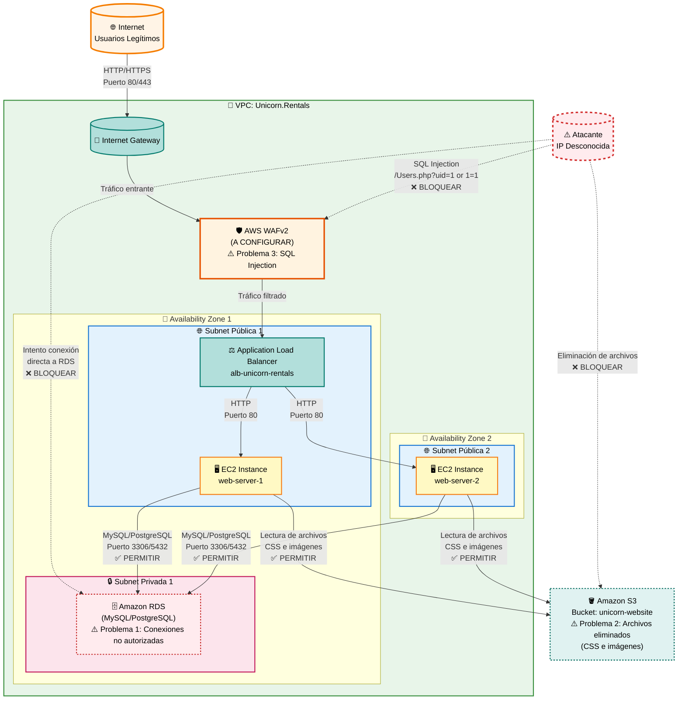

# Security 101 - Guía del Alumno

## Introducción

En este quest debes proteger la infraestructura de Unicorn.Rentals contra tres tipos de ataques:

1. **Ataques a la base de datos RDS**: Conexiones no autorizadas desde IPs desconocidas
2. **Eliminación de archivos en S3**: Alguien está borrando archivos CSS e imágenes
3. **Ataques SQL Injection**: Intentos de inyección SQL a través del ALB

> ⚠️ **IMPORTANTE**: No debes romper el sitio web. El sitio debe seguir funcionando después de aplicar las soluciones.

Durante el GameDay, tendrás acceso a un **Cloud IDE** y servidor Git (Gitea) para trabajar con repositorios. Consulta la guía de uso:

**[Cloud IDE Quest - Guía de Uso →](AWS_GameDay2025_CloudIDE.md)**

Esta guía incluye:

- Credenciales de acceso al Code Server IDE y Gitea
- Instrucciones para usar el IDE basado en web
- Comandos Git esenciales para trabajar en equipo
- Resolución de conflictos y troubleshooting
- Flujo de trabajo recomendado durante la competición


## Arquitectura de la Infraestructura



**Descripción de componentes y problemas de seguridad:**

| Componente | Descripción | Problema de Seguridad |
|:-----------|:------------|:---------------------|
| **Internet Gateway** | Puerta de enlace para comunicación con Internet | - |
| **AWS WAFv2** | Firewall de aplicación web (debe configurarse) | **Problema 3**: Bloquear ataques SQL injection como `/Users.php?uid=1%20or%201=1` |
| **Application Load Balancer** | Distribuye el tráfico HTTP/HTTPS entre servidores web | - |
| **EC2 Instances** | Servidores web que hospedan la aplicación PHP | - |
| **Amazon RDS** | Base de datos relacional (MySQL/PostgreSQL) | **Problema 1**: Recibe conexiones no autorizadas desde IPs desconocidas. Solo debe aceptar conexiones desde los servidores web |
| **Amazon S3** | Bucket con archivos estáticos (CSS, imágenes) | **Problema 2**: Alguien está eliminando archivos CSS e imágenes del bucket |

**Flujos de tráfico y problemas a resolver:**

1. **Tráfico legítimo entrante**: Internet → Internet Gateway → **WAF** (configurar) → ALB → EC2 → RDS
2. **Ataques SQL Injection**: Atacante → **WAF** (bloquear) → ALB ❌
3. **Conexiones no autorizadas a RDS**: Atacante → **RDS directamente** (bloquear mediante Security Groups) ❌
4. **Eliminación de archivos S3**: Atacante → **S3** (bloquear mediante Bucket Policies) ❌
5. **Acceso legítimo a S3**: EC2 → **S3** (lectura de CSS e imágenes) ✅

**Soluciones a implementar:**

1. **RDS**: Configurar Security Groups para permitir solo conexiones desde el Security Group de las instancias EC2
2. **S3**: Configurar Bucket Policies para prevenir eliminaciones no autorizadas y restaurar archivos eliminados
3. **WAF**: Crear Web ACL con reglas para bloquear SQL injection y asociarlo al ALB

---

## Parte 1: RDS Seguro - Bloquear Conexiones No Autorizadas

### Objetivo
Identificar la IP del atacante que intenta conectarse a la base de datos RDS y bloquear esas conexiones sin afectar el sitio web.

### Pasos a seguir

#### 1.1. Identificar la instancia RDS

1. Ve a la consola de AWS y navega a **Amazon RDS**
2. Identifica la instancia de base de datos en ejecución
3. Anota el **nombre de la instancia** y el **Security Group** asociado

#### 1.2. Revisar CloudWatch Logs para identificar la IP del atacante

Cuando el acceso a RDS se realiza a través de un Lambda, debes buscar la IP del atacante en diferentes lugares:

##### Opción A: Revisar logs de RDS directamente

Si RDS tiene logs habilitados, puedes ver las conexiones entrantes:

1. Ve a **CloudWatch** → **Log groups**
2. Busca logs relacionados con RDS (pueden llamarse `/aws/rds/instance/[nombre-instancia]/error` o similar)
3. Revisa los logs para encontrar intentos de conexión desde IPs que no pertenecen a tus servidores web
4. **Anota la dirección IP** del atacante (la que aparece múltiples veces en intentos fallidos)

##### Opción B: Revisar Security Groups para ver IPs con acceso

1. Ve a **EC2** → **Security Groups**
2. Encuentra el Security Group asociado a tu instancia RDS
3. Revisa las **Inbound Rules** (Reglas de entrada)
4. Identifica reglas que permitan acceso desde `0.0.0.0/0` o rangos IP específicos
5. Las IPs que NO sean de tus servidores web o del Lambda legítimo son sospechosas

##### Opción C: Revisar VPC Flow Logs (si están habilitados)

1. Ve a **CloudWatch** → **Log groups**
2. Busca logs relacionados con VPC Flow Logs (pueden llamarse `/aws/vpc/flowlogs` o similar)
3. Usa CloudWatch Logs Insights para buscar conexiones a RDS:

```sql
fields @timestamp, srcaddr, dstaddr, dstport, action
| filter dstport = 3306 or dstport = 5432
| filter action = "ACCEPT"
| stats count() by srcaddr
| sort count desc
```

4. Identifica IPs que aparezcan con frecuencia y que no sean de tus servidores web o del Lambda legítimo

##### Opción D: Revisar logs del Lambda (si el Lambda registra IPs origen)

1. Ve a **CloudWatch** → **Log groups**
2. Busca logs relacionados con Lambda (el nombre puede empezar por `/aws/lambda/`)
3. Busca funciones Lambda que puedan estar haciendo conexiones a RDS
4. Revisa los logs para encontrar:
   - Eventos que contengan información de IP origen
   - Invocaciones sospechosas o fuera de lo normal
   - Patrones de acceso inusuales

**Alternativa: Usar CloudWatch Insights para buscar en todos los logs**

1. En CloudWatch, ve a **Logs Insights**
2. Selecciona múltiples log groups (RDS, Lambda, VPC Flow Logs si están disponibles)
3. Ejecuta una consulta como:

```sql
fields @timestamp, @message, @logStream
| filter @message like /connection/ or @message like /connect/ or @message like /IP/
| sort @timestamp desc
| limit 100
```

4. Busca IPs que aparezcan repetidamente y que no sean de tus servidores web

!!! tip "Consejo"
    La IP del atacante generalmente aparecerá en los Security Groups de RDS como una regla que permite acceso desde un rango IP específico o desde `0.0.0.0/0`. Revisa primero los Security Groups antes de profundizar en los logs.

#### 1.3. Revisar y modificar Security Groups

> 💡 **Nota**: Si ya revisaste los Security Groups en el paso anterior (Opción B), puedes proceder directamente a modificarlos.

1. Ve a **EC2** → **Security Groups**
2. Encuentra el Security Group asociado a tu instancia RDS
3. Revisa las **Inbound Rules** (Reglas de entrada)
4. Identifica qué IPs o rangos tienen acceso actualmente
   - Busca reglas que permitan acceso desde `0.0.0.0/0` (todo internet) ❌
   - Busca IPs específicas sospechosas que no sean de tus servidores web ❌
   - Anota la IP del atacante si la encuentras aquí

#### 1.4. Modificar el Security Group de RDS

> 🎯 **Estrategia**: Permitir conexiones SOLO desde los servidores web y recursos legítimos (como Lambda si aplica), bloqueando todas las demás.

1. Edita el Security Group de RDS
2. **Modifica o elimina** las reglas que permitan acceso desde:
   - `0.0.0.0/0` (todo internet) ❌
   - IPs específicas sospechosas que identificaste ❌
3. **Añade nuevas reglas** que permitan conexiones solo desde:
   - El Security Group de tus instancias EC2 (servidores web) ✅
   - El Security Group del Lambda (si hay un Lambda legítimo que accede a RDS) ✅
   - O las IPs específicas de tus servidores web ✅
   
   **Configuración sugerida para servidores web:**
   - **Type**: MySQL/Aurora (puerto 3306) o PostgreSQL (puerto 5432) según tu base de datos
   - **Source**: Selecciona el Security Group de tus instancias EC2
   - **Description**: "Allow access only from web servers"
   
   **Si hay un Lambda legítimo:**
   - **Type**: MySQL/Aurora (puerto 3306) o PostgreSQL (puerto 5432)
   - **Source**: Selecciona el Security Group del Lambda o usa VPC endpoints si está configurado
   - **Description**: "Allow access from Lambda function"

4. **Guarda los cambios**

!!! warning "Importante"
    Si identificaste la IP del atacante en el paso anterior, asegúrate de eliminarla o bloquearla explícitamente en las reglas del Security Group. NO añadas reglas que permitan acceso desde esa IP.

#### 1.5. Verificar que el sitio web sigue funcionando

1. Obtén la URL del ALB (Application Load Balancer)
   - Ve a **EC2** → **Load Balancers**
   - Copia el DNS name del ALB
2. Abre el DNS en un navegador
3. Verifica que el sitio carga correctamente
4. Prueba el endpoint `/Users.php?uid=1` para verificar que la conexión a la base de datos funciona

#### 1.6. Registrar la IP del atacante

1. En el formulario del quest "RDS seguro"
2. Ingresa la dirección IP que identificaste del atacante
3. Haz clic en **Enviar**

---

## Parte 2: Seguridad S3 - Proteger Archivos del Bucket

### Objetivo
Detener la eliminación de objetos en el bucket S3 y subir los archivos `unicorn.jpg` y `w3.css` al bucket `ctfbucket` sin que sean eliminados.

> 🎯 **Puntos por completar este punto de control: 300 puntos**

### Resumen de la tarea

El bucket S3 `ctfbucket` está perdiendo archivos importantes debido a un proceso automatizado. Debes:

1. ✅ **Detener las eliminaciones** usando una de las dos soluciones disponibles
2. ✅ **Subir los archivos** `unicorn.jpg` y `w3.css` al bucket
3. ✅ **Verificar** que el sitio web se ve correctamente

### Información del bucket

- **Nombre del bucket**: `ctfbucket` (bucket público)
- **Archivos a proteger/subir**:
  - `unicorn.jpg` (imagen de fondo)
  - `w3.css` (archivo de estilos CSS)

### Soluciones disponibles

Hay **2 formas** de resolver esta tarea. Puedes usar cualquiera de ellas:

- **Solución 1**: Crear una política de bucket que explícitamente deniegue la eliminación de objetos
- **Solución 2**: Eliminar el rol IAM "AccountGuardian" responsable de eliminar estos objetos

### Pasos a seguir

#### 2.1. Identificar el bucket S3

1. Ve a **Amazon S3** en la consola de AWS
2. Busca y selecciona el bucket **`ctfbucket`** (bucket público)

#### 2.2. Verificar archivos faltantes

1. Navega dentro del bucket `ctfbucket`
2. Busca los archivos:
   - `w3.css`
   - `unicorn.jpg`
3. Si faltan estos archivos, necesitarás subirlos después de implementar la solución de protección

---

### Solución 1: Crear política de bucket para denegar eliminaciones

Esta solución crea una política en el bucket que explícitamente deniega las acciones de eliminación de objetos.

#### Pasos para implementar la Solución 1:

1. En el bucket `ctfbucket`, ve a la pestaña **Permissions** (Permisos)
2. Desplázate hasta la sección **Bucket policy**
3. Haz clic en **Edit** (Editar)
4. Agrega la siguiente política JSON y guarda los cambios:

```json
{
    "Effect": "Deny",
    "Principal": "*",
    "Action": [
        "s3:DeleteObject",
        "s3:DeleteObjectVersion"
    ],
    "Resource": "arn:aws:s3:::ctfbucket/*"
}
```

> ⚠️ **Importante**: Esta política deniega TODAS las eliminaciones de objetos en el bucket, sin excepciones. Asegúrate de que esto es lo que necesitas.

5. Haz clic en **Save changes** (Guardar cambios)

---

### Solución 2: Eliminar el rol IAM "AccountGuardian"

Esta solución elimina el rol IAM que tiene permisos para eliminar objetos del bucket S3.

#### Pasos para implementar la Solución 2:

1. Navega a la consola de administración de **AWS IAM**
2. En el menú lateral, haz clic en **Roles** (Roles)
   - Esto mostrará todos los roles que se han creado en la cuenta
3. Busca el rol llamado **`AccountGuardian`**
   - Este rol tiene acceso completo a S3 y es responsable de eliminar los objetos
4. Para verificar que es el rol correcto:
   - Haz clic en el rol para ver sus detalles
   - Revisa las políticas asociadas (debería tener permisos de S3)
5. Para eliminar el rol:
   - Selecciona el rol `AccountGuardian`
   - Haz clic en el botón **Delete** (Eliminar)
   - Confirma la eliminación

> ⚠️ **Advertencia**: Asegúrate de que este rol no sea necesario para otras funcionalidades antes de eliminarlo.

---

### 2.3. Subir los archivos al bucket S3

Una vez que hayas implementado **cualquiera de las dos soluciones**, debes subir los archivos al bucket:

1. Ve a la pestaña **Objects** (Objetos) del bucket `ctfbucket`
2. Haz clic en **Upload** (Subir)
3. Haz clic en **Add files** (Añadir archivos) o **Add folder** (Añadir carpeta)
4. Selecciona y sube los siguientes archivos:
   - `unicorn.jpg` (imagen de fondo)
   - `w3.css` (archivo de estilos CSS)
5. Haz clic en **Upload** (Subir) para confirmar

> ✅ **Nota**: Después de implementar cualquiera de las soluciones, los objetos del bucket S3 ya no serán eliminados automáticamente.

---

### Política de bucket alternativa (Opcional - más granular)

Si prefieres una política más granular que permita excepciones para ciertos usuarios/roles específicos, puedes usar esta versión alternativa de la política de bucket:

```json
{
  "Version": "2012-10-17",
  "Statement": [
    {
      "Sid": "DenyPublicDelete",
      "Effect": "Deny",
      "Principal": "*",
      "Action": [
        "s3:DeleteObject",
        "s3:DeleteObjectVersion"
      ],
      "Resource": "arn:aws:s3:::ctfbucket/*",
      "Condition": {
        "StringNotEquals": {
          "aws:PrincipalArn": "arn:aws:iam::CUENTA-ID:user/ADMIN-USER"
        }
      }
    }
  ]
}
```

> 💡 **Nota**: Reemplaza `CUENTA-ID` con el ID de tu cuenta AWS. Puedes obtenerlo en la parte superior derecha de la consola.

#### 2.4. Verificar que el sitio web se ve correctamente

1. Accede al sitio web a través del ALB
   - Ve a **EC2** → **Load Balancers**
   - Copia el DNS name del ALB
   - Abre la URL en un navegador
2. Verifica que:
   - Los estilos CSS (`w3.css`) se cargan correctamente
   - La imagen de fondo (`unicorn.jpg`) se muestra correctamente
   - El sitio web tiene el aspecto visual esperado
3. Si algo no funciona:
   - Verifica que los archivos están en el bucket `ctfbucket`
   - Revisa los permisos de lectura del bucket (el sitio web debe poder LEER los archivos)
   - Verifica que no hay errores en la consola del navegador (F12)

---

## Parte 3: WAFv2 - Proteger ALB contra SQL Injection

### Objetivo
Implementar AWS WAF para bloquear intentos de SQL injection como `/Users.php?uid=1%20or%201=1` sin afectar el tráfico legítimo.

### Pasos a seguir

#### 3.1. Identificar el Application Load Balancer (ALB)

1. Ve a **EC2** → **Load Balancers**
2. Identifica tu ALB (debería ser tipo "Application Load Balancer")
3. Anota el **ARN** del ALB (lo necesitarás para asociar el WAF)

#### 3.2. Crear un Web ACL en AWS WAFv2

1. Ve a **AWS WAF** en la consola
   - Busca "WAF" en la barra de búsqueda o navega desde **Security, Identity & Compliance**
2. Selecciona **Web ACLs** en el menú lateral
3. Haz clic en **Create web ACL**
4. Configura los siguientes pasos:

   **Step 1: Name and resources**
   - **Name**: `UnicornRentals-ALB-Protection`
   - **Resource type**: Selecciona **Regional resources** (para ALB)
   - **CloudWatch metric name**: Déjalo por defecto o usa `UnicornRentalsALBProtection`
   - Haz clic en **Next**

   **Step 2: Add rules and rule groups**
   - Haz clic en **Add rules** → **Add managed rule groups**
   - Selecciona **AWS Managed Rule Groups**
   - Busca y activa:
     - ✅ **Core rule set** (incluye protección contra SQL injection)
     - ✅ **Known bad inputs** (opcional pero recomendado)
   - Haz clic en **Add rules**
   
   **Crear regla personalizada para SQL Injection específico:**
   - Haz clic en **Add rules** → **Add my own rules and rule groups** → **Rule builder**
   - **Name**: `Block-SQL-Injection`
   - **Type**: **Rule builder**
   - **Statement**: 
     - **Inspect**: Request URI (o All query parameters)
     - **Match type**: **Contains string**
     - **String to match**: Ingresa patrones comunes de SQL injection como:
       - `' or '1'='1`
       - `' or 1=1`
       - `UNION SELECT`
       - `DROP TABLE`
       - `' or 'x'='x`
   - **Action**: **Block**
   - Haz clic en **Add rule**

   - **Default web ACL action**: Selecciona **Allow** (permitir el resto del tráfico)
   - Haz clic en **Next**

   **Step 3: Configure metrics**
   - Revisa las métricas (puedes dejarlas por defecto)
   - Haz clic en **Next**

   **Step 4: Review and create**
   - Revisa la configuración
   - Haz clic en **Create**

#### 3.3. Asociar el Web ACL al ALB

1. Después de crear el Web ACL, verás la página de detalles
2. Ve a la pestaña **Associated resources**
3. Haz clic en **Add AWS resources**
4. Selecciona tu **Application Load Balancer**
5. Haz clic en **Add**

**Alternativa: Desde la página del ALB**
1. Ve a **EC2** → **Load Balancers**
2. Selecciona tu ALB
3. En la pestaña **Integrated services**, haz clic en **Associate web ACL**
4. Selecciona el Web ACL que creaste
5. Haz clic en **Associate**

#### 3.4. Verificar que el WAF está bloqueando ataques

1. Espera 1-2 minutos para que los cambios se propaguen
2. Intenta acceder a una URL con SQL injection desde un navegador:
   ```
   http://[DNS-ALB]/Users.php?uid=1%20or%201=1
   ```
3. Deberías recibir un error 403 (Forbidden) o un mensaje de bloqueo
4. Verifica que el sitio web normal sigue funcionando:
   ```
   http://[DNS-ALB]/
   ```

#### 3.5. Monitorear el WAF en CloudWatch

1. Ve a **CloudWatch** → **Metrics**
2. Busca métricas bajo **AWS/WAFV2**
3. Revisa:
   - **AllowedRequests**: Solicitudes permitidas
   - **BlockedRequests**: Solicitudes bloqueadas
   - **CountedRequests**: Solicitudes contadas

#### 3.6. Ajustar reglas si es necesario

Si el sitio web legítimo está siendo bloqueado:
1. Ve al Web ACL en **AWS WAF**
2. Edita las reglas
3. Ajusta las condiciones o cambia acciones de "Block" a "Count" temporalmente para depurar

---

## Verificación Final

Después de completar las tres partes, verifica:

1. ✅ **RDS**: El sitio web funciona y solo acepta conexiones desde servidores web
2. ✅ **S3**: Los archivos CSS e imágenes están presentes y protegidos contra eliminación
3. ✅ **WAF**: Los ataques SQL injection son bloqueados pero el sitio web normal funciona

---

## Troubleshooting

### El sitio web deja de funcionar después de aplicar cambios

- **RDS**: Verifica que el Security Group de RDS permite conexiones desde el Security Group de EC2
- **S3**: Verifica que el bucket tiene permisos de lectura públicos o que el sitio web tiene credenciales para leer
- **WAF**: Revisa las reglas del WAF, puede que estés bloqueando tráfico legítimo

### No encuentro la IP del atacante en los logs

- Revisa CloudWatch Logs Insights con diferentes consultas
- Revisa VPC Flow Logs si están habilitados
- Revisa los Security Groups para ver qué IPs tienen acceso actualmente

### Los archivos S3 siguen siendo eliminados

- Verifica que la Bucket Policy está correctamente configurada
- Revisa IAM users/roles que puedan tener permisos amplios
- Considera usar MFA Delete para requerir autenticación adicional

### El WAF no bloquea los ataques

- Verifica que el Web ACL está asociado al ALB correcto
- Espera unos minutos para que los cambios se propaguen
- Revisa que las reglas están en modo "Block" y no "Count"
- Verifica los patrones de SQL injection en las reglas

---

## Recursos Adicionales

- [Documentación AWS RDS Security Groups](https://docs.aws.amazon.com/AmazonRDS/latest/UserGuide/Overview.RDSSecurityGroups.html)
- [Documentación AWS S3 Bucket Policies](https://docs.aws.amazon.com/AmazonS3/latest/userguide/bucket-policies.html)
- [Documentación AWS WAFv2](https://docs.aws.amazon.com/waf/latest/developerguide/waf-chapter.html)

---

**¡Buena suerte en el GameDay! 🎮🛡️**

