# Docker

> Docker es una herramienta clave para la **virtualización ligera mediante contenedores**, que permite desplegar servicios de forma rápida, portable y reproducible. En el contexto del **Proyecto Intermodular (PI)**, Docker facilita la integración de diferentes componentes del proyecto, asegurando entornos homogéneos y reduciendo problemas de compatibilidad.

---

## Propuesta didáctica

Esta herramienta se enmarca dentro del **módulo de Proyecto Intermodular** del CFGS ASIR, y contribuye a los siguientes **Resultados de Aprendizaje (RA)** definidos en la programación:

> **RA2.** *Planifica actividades, recursos, riesgos y cronograma del proyecto.*  
> **RA3.** *Desarrolla y valida la solución (iteraciones, pruebas y criterios de aceptación).*  
> **RA4.** *Documenta, versiona y despliega la solución y sus evidencias.*

### Criterios de evaluación (relacionados)

- **CE-RA2a**: Se han identificado las herramientas necesarias para el despliegue del proyecto.
- **CE-RA3b**: Se han configurado entornos de prueba utilizando contenedores.
- **CE-RA4c**: Se ha documentado el procedimiento de instalación y despliegue.

### Contenidos

**Bloque 1 — Introducción a Docker (Sesión 1)**  
- ¿Qué es Docker? Diferencias con máquinas virtuales.
- Conceptos básicos: imágenes, contenedores, volúmenes.
- Instalación en GNU/Linux (Ubuntu Server).
- Primer contenedor: `hello-world`.

**Bloque 2 — Comandos básicos (Sesión 2)**  
- `docker run`, `docker ps`, `docker stop`, `docker rm`.
- Gestión de imágenes: `docker image ls`, `docker pull`.
- Persistencia de datos: volúmenes y bind mounts.

**Bloque 3 — Primer servicio en contenedor**  
- Despliegue de NGINX en contenedor.
- Exposición de puertos (`-p` vs `-P`).
- Personalización de contenido con volúmenes.

**Bloque 4 — Nextcloud con docker**
- Práctica con volúmenes persistentes.

**Bloque 5 — Dockerfile y Docker-compose**
- Creación de imágenes personalizadas con Dockerfile.
- Despliegue de aplicaciones multi-contenedor con Docker-compose.
- Publicación de imágenes en Docker Hub.

**Bloque 6 — Docker compose con Samba**
- Despliegue de Samba con docker compose

!!! question "Actividades iniciales"
    1. Comprueba la versión instalada de Docker en tu sistema.
    2. Ejecuta el contenedor `hello-world` y explica qué hace.
    3. Lista los contenedores creados y las imágenes descargadas.
    4. Elimina un contenedor detenido y una imagen.
    5. Crea un contenedor NGINX y accede desde el navegador.

### Programación de Aula

| Sesión | Contenidos | Actividades | Criterios trabajados |
|--------|-----------|-------------|-----------------------|
| 1 | Introducción a Docker, Comandos básicos, Primer servicio | Cuestionario inicial, instalación | CE-RA2a, CE-RA3b, CE-RA4c |
| 2 | **Despliegue de NextCloud con Docker** | PR101. NextCloud con Docker | CE-RA3b, CE-RA4c |
| 3 | **Dockerfile y Docker-compose** | PR102. Dockerfile y Docker-compose | CE-RA3b, CE-RA4c |


---


## Definición

<figure style="float: right;">
    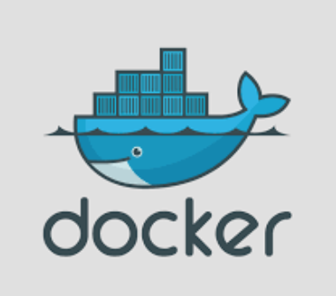
    <figcaption><b>Figura 1:</b> Logo Docker.</figcaption>
</figure>

**Docker** (estibador en inglés) es un **Sistema de Virtualización de Aplicaciones mediante contenedores**, creado por *Solomon Hykes* y su equipo de ingenieros.

* En **2013** se convirtió en un proyecto de **software libre (licencia Apache)** en el que participan cada vez más empresas. 
* La **versión 1.0** se publicó en **junio de 2014** y ha tenido un desarrollo muy rápido.
* En marzo de **2017**, Docker anunció un desarrollo todavía más rápido, **pasando a publicar una nueva versión cada mes**. La numeración de las versiones adoptó al formato AA.MM (la primera fue **Docker 17.03**).
* En **julio de 2018**, Docker anunció que volvían a un desarrollo más pausado. A partir de **Docker 18.09** habría una versión "estable" cada seis meses.

## Contenedores

En virtualización, el principal problema de los hipervisores y las máquinas virtuales es que cada máquina virtual es independiente de las demás. Al no reutilizarse ningún componente, se ocupa **mucho espacio tanto en disco como en memoria** y el **tiempo de ejecución siempre será mayor** que si sólo hubiera un sistema operativo (sobre todo en el caso de **hipervisores de tipo 2**).

Para resolver este problema se crearon los **contenedores** en los que se **utilizan mecanismos existentes en el sistema operativo para aislar las aplicaciones**, pero compartiendo el mayor número posible de componentes del sistema operativo o incluso de las aplicaciones.

* Como definición, **un contenedor** es el equivalente a una máquina virtual de la virtualización clásica, pero mucho **más ligera porque utiliza recursos del sistema operativo del host**. 
* Las aplicaciones de cada contenedor "ven" un sistema operativo, que puede ser diferente en cada contenedor, pero quien **realiza el trabajo es el sistema operativo común que hay por debajo**.

!!! Note
    * **Los contenedores** suelen ser elementos **efímeros**. La facilidad con la que pueden crearse y ponerse en marcha hace más fácil crear un nuevo contenedor que modificar uno ya existente. Por ello, los datos generados por las aplicaciones no se suelen guardar en los contenedores, sino fuera de ellos. 
    * Su ligereza hace más fácil tener varios contenedores con una aplicación en cada uno de ellos que tener un único contenedor con varias aplicaciones en él. Por ello, un **aspecto importante de los contenedores es su orquestación**, es decir, la administración simultánea de muchos contenedores, una de las herramientas más utilizadas es **[Kubernetes](https://kubernetes.io/es/)**.

## Máquinas Virtuales VS Contenedores

<figure>
  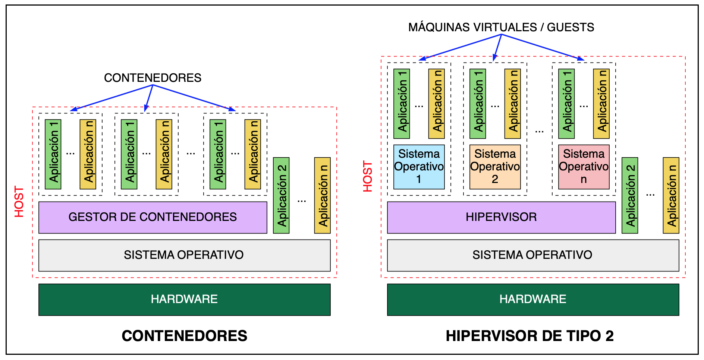
  <figcaption>Contenedores Vs Máquinas Virtuales.</figcaption>
</figure>

## Microservicios

Uno de los objetivos principales de la configuración e implantación de contenedores es solucionar los problemas de:

* **Errores de dependencias** entre diferentes Sistemas Operativos de los trabajadores y máquinas de puesta en marcha.
* Evitar la **Elevada carga y capacidad** de las Máquinas Virtuales.
* Caída de todos los servicios instalados de forma monolítica en los servidores.

* Tipos de despliegue:
    * **SOA (Service Oriented Architecture)** → Diferentes Máquinas una con cada Servicio conectadas.
    * **Monolítico** → Todos los servicios en la misma máquina.
    * **MicroServicios** → División más pequeña de los servicios.

<figure>
    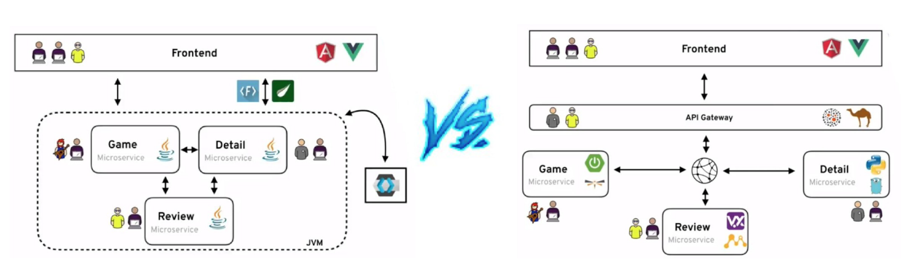
    <figcaption>Monolítico Vs Microservicios.</figcaption>
</figure>

## Características principales Contenedores

En resumen los contenedores:

* Consisten en **Agrupar y Aislar Aplicaciones o grupos de aplicaciones que se ejecutan sobre un mismo núcleo de sistema operativo**.
* Su característica principal se basa en su **propio sistema de archivos ejecutable en cualquier Sistema Operativo**.
* No es necesario emular el *HW* y *SW* completo como en las máquinas virtuales, por lo tanto son mucho más **ligeros**, comparten el máximo de componentes con el sistema operativo host, y su rapidez, ya que gracias a que apenas añaden capas adicionales consiguen casi velocidades nativas.
* Soluciona problemas de **espacio y compatibilidades a la hora de puesta en marcha** en servidores de producción.
* Los contenedores suelen ser elementos **efímeros**.

## Características y definición de Docker

**Docker** se puede definir como un proyecto de **código abierto que automatiza el despliegue de aplicaciones dentro de contenedores de software**, proporcionando una capa adicional de abstracción y automatización de virtualización de aplicaciones en múltiples sistemas operativos.

Sus principales características son:

* Docker es una API amigable del tipo **Open Source**.
* Genera un **proceso aislado** del resto de los procesos de la máquina gracias a: Ejecutar sobre su propio sistema de ficheros, con su propio espacio de usuarios y procesos, y sus propias interfaces de red... 
* Es **Modular** ya que esta dividido en varios componentes.
* Es **portable e inmutable** utilizando la plataforma **DockerHub**.
* Su es lema ***“Build, Ship and Run, any app,”***.

<figure>
    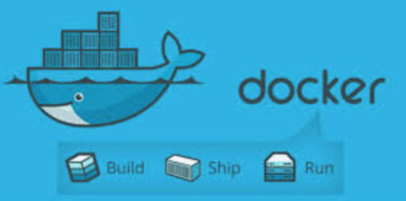
    <figcaption>Lema Docker.</figcaption>
</figure>


!!! Note "Nota"
    Aunque un contenedor puede incluir cualquier número de aplicaciones, lo habitual es que un contenedor **contenga una sola aplicación** (y los programas necesarios para ponerse en marcha). 

## Arquitectura Docker

1. **Docker Engine ("Motor" del Gestor Docker)**: el cual basado en la arquitectura de **Cliente-Servidor** (que pueden estar en la misma máquina, o en distintas), y realizada por mediante una **API de REST** que utiliza **HTTP**.
    * **API REST**: interfaz de programación con un estilo de arquitectura software para sistemas hipermedia distribuidos como la *World Wide Web*.
2. **"Daemon Docker" (Servicio)**: lleva a cabo Gestión y enlace de los componentes del gestor.
3. **Imágenes**: Las imágenes son una especie de plantillas que contienen como mínimo todo el software que necesita la aplicación para ponerse en marcha. están formadas por una colección ordenada de: *Sistemas Archivos*, *Repositorios*, *Comandos*, *Parámetros*, *Aplicaciones*.
4. **Contenedores**: son el conjunto de procesos que encapsulan e identifican a una Imagen. Pueden ser:
    * Creado, inicializado, parado, vuelto a ejecutar y destruido.
5. **Registros** son imágenes guardadas en repositorios para: Almacenar o Distribuir.
    * Se almacenan en **Docker Hub** y pueden ser  Públicos o Privados.

<figure>
    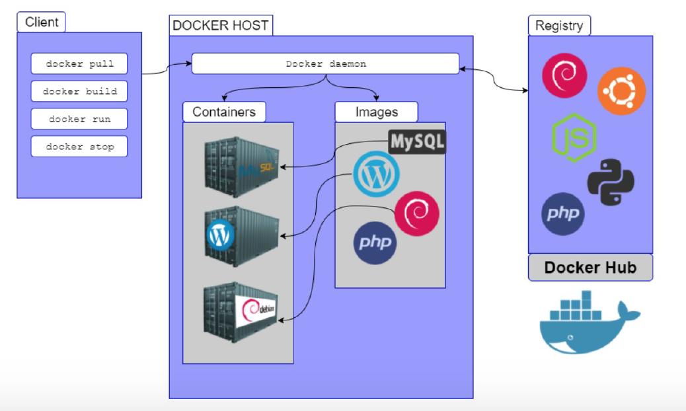
    <figcaption>Componentes de Docker.</figcaption>
</figure>

!!! Note "Nota"
    * El componente básico de Docker es el **Docker Engine**, pero Docker ofrece también una serie de herramientas para administrar, distribuir e instalar contenedores: **Docker Compose**, **Docker Swarm**.
    * Las **imágenes** se pueden crear a partir de otras imágenes más básicas incluyendo software adicional en forma de capas. Todos los contenedores creados a partir de una imagen contienen el mismo software, aunque en el momento de su creación se pueden personalizar algunos detalles

## Instalación

Para la Instalación de **Docker** es recomendable seguir la documentación oficial. Además se recomienda Instalar máquina Ubuntu Server última versión e instalar Docker en ella.

* Docker for Mac:
    * **[Instalación Mac](https://docs.docker.com/docker-for-mac/install/)**
* Docker for Windows:
    * **[Instalación Windows](https://docs.docker.com/docker-for-windows/install/)**
* Docker for ubuntu:
    * **[Instalación Ubuntu](https://docs.docker.com/engine/installation/linux/docker-ce/ubuntu/)**

!!! Warning "Advertencia"
    * **Docker** empezó estando disponible solamente para distribuciones GNU/Linux, pero desde **junio de 2016** también está disponible como aplicación nativa en Windows Server 2016 y Windows 10.
    * **Docker** utiliza la virtualización ofrecida por el sistema operativo. En el caso de Windows 10, eso significa que para usar Docker de forma nativa hay que activar **Hyper-V** que, por desgracia, es incompatible con VirtualBox. Para poder utilizar Docker en Windows 7 o en Windows 10 sin **Hyper-V**, Docker ofrece desde agosto de 2015 **[Docker Toolbox](https://github.com/docker-archive/toolbox)**, que realmente es una máquina virtual (que se ejecuta en VirtualBox) que contiene Docker.
    * Otra opción sería utilizar [Podman](https://podman.io)

## Ejemplo Instalación en Ubuntu server

- A continuación se muestra la instalación aconsejada para Ubuntu Server utilizando el método de repositorios:

1. En primer lugar se actualizan los paquetes y se instalan los paquetes para utilizar el repositorio sobre HTTPS:

``` bash
sudo apt-get update
apt-get install ca-certificates curl gnupg lsb-release
```

2. Se añade la clave GPG oficial de Docker:

``` bash
mkdir -p /etc/apt/keyrings
curl -fsSL https://download.docker.com/linux/ubuntu/gpg | sudo gpg --dearmor -o /etc/apt/keyrings/docker.gpg
```

3. Se configura el repositorio:

``` bash
echo "deb [arch=$(dpkg --print-architecture) signed-by=/etc/apt/keyrings/docker.gpg] https://download.docker.com/linux/ubuntu $(lsb_release -cs) stable" | sudo tee /etc/apt/sources.list.d/docker.list > /dev/null
```

- Se realiza de nuevo una actualización.

``` bash
sudo apt-get update
```

4. Instalación propia del Engine de Docker y Docker Compose:

``` bash
apt-get install docker-ce docker-ce-cli containerd.io docker-compose-plugin
```

5. Comprobamos que está correctamente bien instalado ejecutando el contenedor "Hello World"

``` bash
docker run hello-world
```

## Guía de instalación

La siguiente guía se basa en el ejemplo de instalación anterior realizándose la instalación de Docker en una máquina virtual de Ubuntu 22.04 siguiendo el método [Install using the repository](https://docs.docker.com/engine/install/ubuntu/#install-using-the-repository)

1. Se realiza una actualización y se instalan los paquetes necesarios para usar el repositorio sobre HTTPS:

- Código para la actualización de paquetes:

``` bash
sudo apt-get update
```
- Resultado:

<figure>
  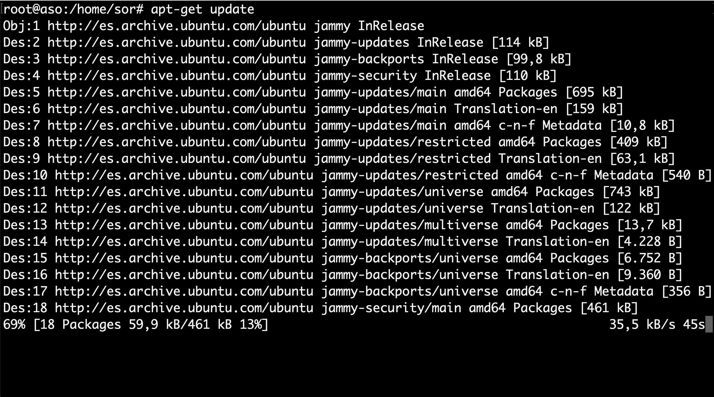
  <figcaption>Actualización repositorios</figcaption>
</figure>

<div style="page-break-before:always;"></div>

- Código para instalar los paquetes necesarios para usar el repositorio sobre HTTPS:

``` bash
sudo apt-get install ca-certificates curl gnupg lsb-release
```
- Resultado:

<figure>
  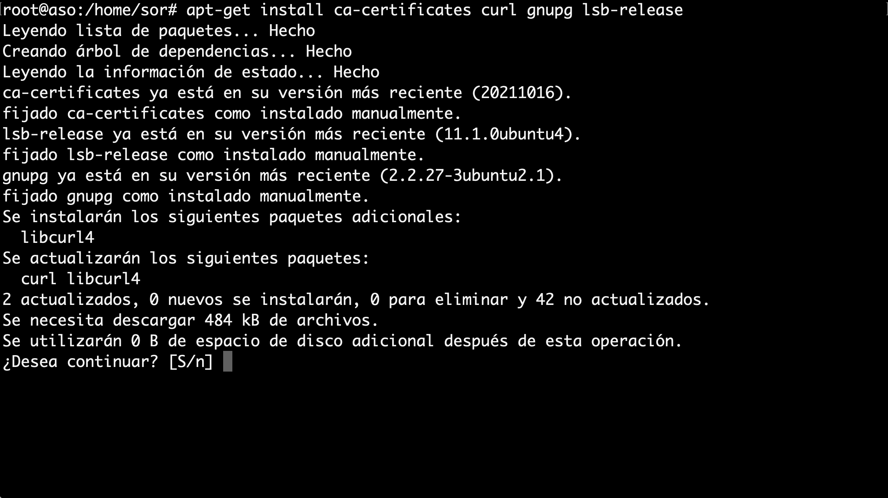
  <figcaption>Instalación repositorios necesarios</figcaption>
</figure>

<div style="page-break-before:always;"></div>

2. Se añade la clave GPG oficial de Docker y el comando para configurar el repositorio:

- Código para los objetivos comentados en este punto:

``` bash
sudo mkdir -p /etc/apt/keyrings
curl -fsSL https://download.docker.com/linux/ubuntu/gpg | sudo gpg --dearmor -o /etc/apt/keyrings/docker.gpg
echo "deb [arch=$(dpkg --print-architecture) signed-by=/etc/apt/keyrings/docker.gpg] https://download.docker.com/linux/ubuntu $(lsb_release -cs) stable" | sudo tee /etc/apt/sources.list.d/docker.list > /dev/null
```
- Resultado:

<figure>
  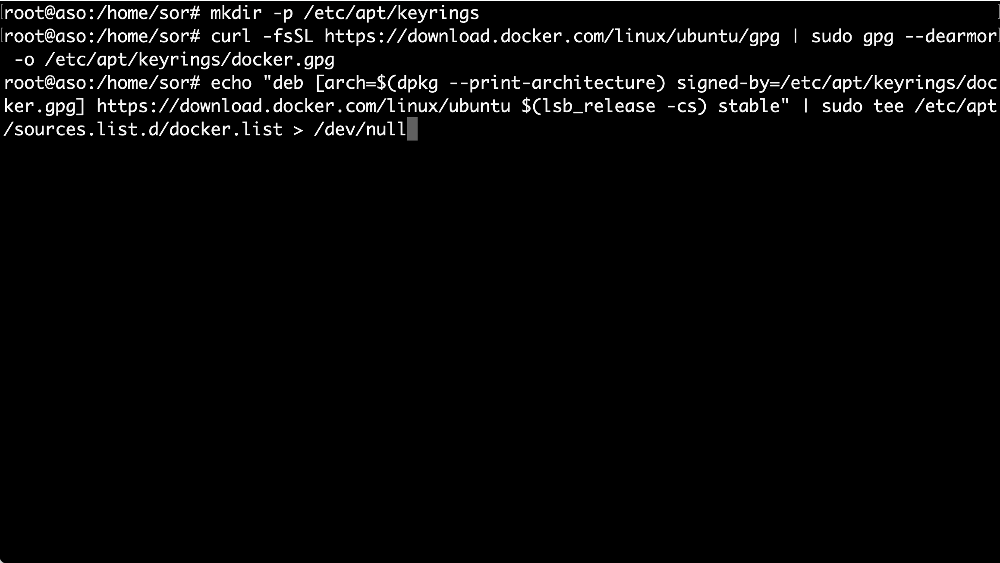
  <figcaption>Clave GPG y configuración repositorio</figcaption>
</figure>

<div style="page-break-before:always;"></div>

3. Se realiza otra actualización:

- Código para la nueva actualización de paquetes, debido a la configuración realizada:

``` bash
sudo apt-get update
```

- Resultado:

<figure>
  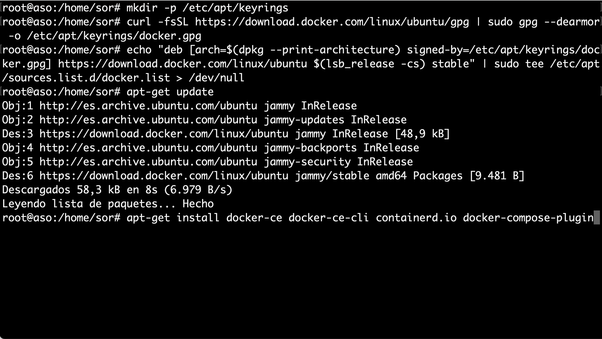
  <figcaption>Nueva actualización</figcaption>
</figure>

<div style="page-break-before:always;"></div>

4. Se instala Docker Engine, containerd y Docker Compose:

- Código para la instalación de paquetes Docker:

``` bash
sudo apt-get install docker-ce docker-ce-cli containerd.io docker-compose-plugin
```

- Resultado:

<figure>
  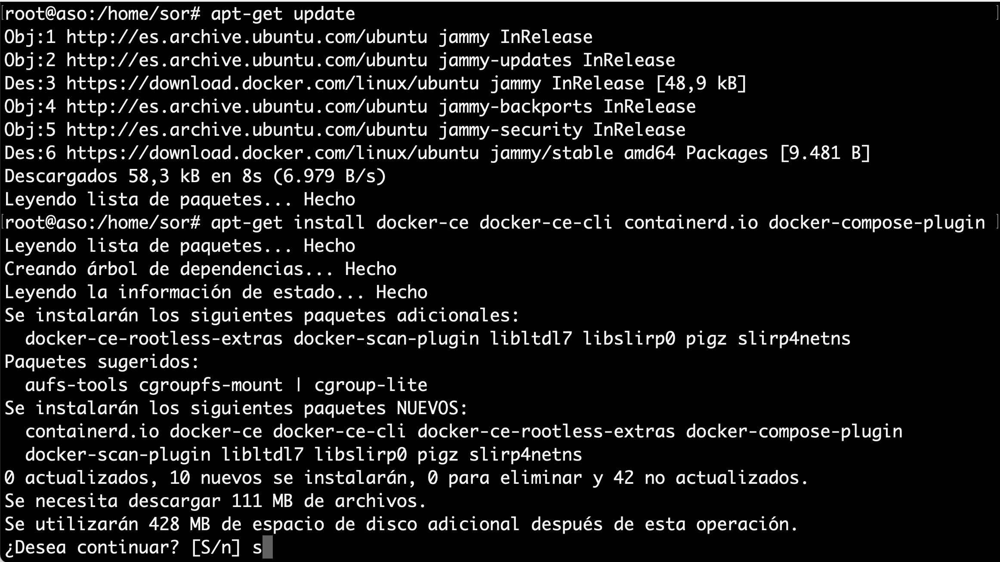
  <figcaption>Instalación Docker</figcaption>
</figure>

<div style="page-break-before:always;"></div>

5. Comprobación de que la instalación del motor Docker sea correcta ejecutando la imagen **hello-world**:

- Código para la comprobación de Docker, mediante la ejecución de un contenedor:

``` bash
sudo docker run hello-world
```
- Resultado:

<figure>
  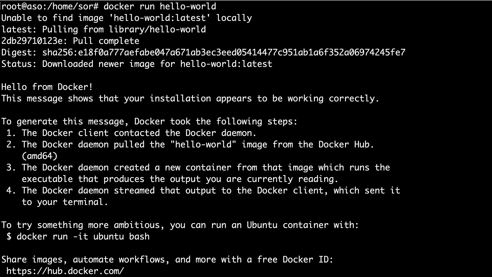
  <figcaption>Comprobación</figcaption>
</figure>

<div style="page-break-before:always;"></div>

## Principales Comandos

A continuación se muestran los comandos más utilizados:

| Comando      | Acción                               | Comando      | Acción                                  |
| ------------ | ------------------------------------ | ------------ | --------------------------------------- |
|`docker info`| obtener información relativa a docker | `docker start`| (docker container start) inicia la ejecución|
|`docker run`| (docker container run) crea y ejecuta el contenedor|`docker rm` |(docker container eliminar) elimina el contenedor|
|`docker build`| crea una imagen|`docker cp` |(docker container copiar)|
|`docker ps` |muestra la lista de contenedores creados|`docker logs` |(docker container logs) muestra los errores|
|`docker inspect` |(docker container inspect) información detallada de los contenedores|`docker stats` |(docker container stats) muestra el estado|
|`docker stop`| (docker container stop) detiene la ejecución del contenedor|`docker system prune`|limpiar todo el sistena de contenedores imágenes y volumenes|

* **[Chuleta de Comandos](https://github.com/sergarb1/CursoIntroduccionADocker/raw/main/FuentesCurso/Docker%20CheatSheet%20COMPLETA.pdf)**

<figure>
    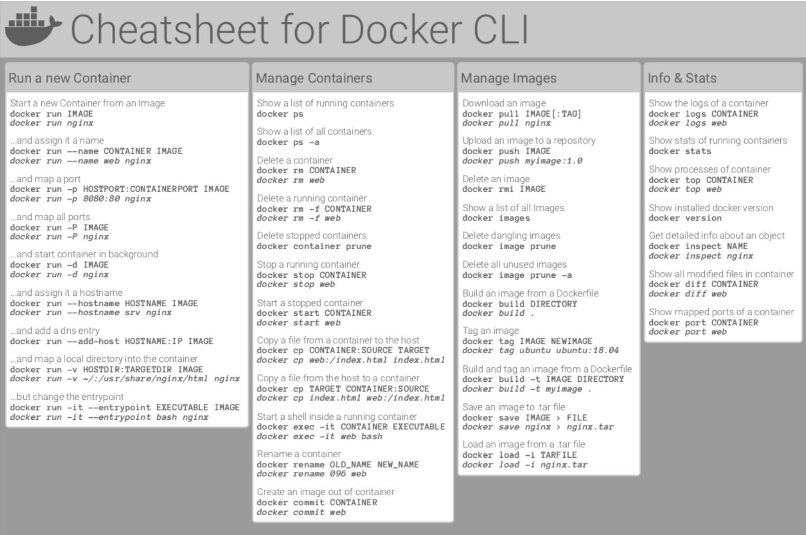
    <figcaption>Chuleta Docker.</figcaption>
</figure>

## Primer Contenedor

A continuación se muestra un ejemplo guiado de la creación del contenedor **"Hello World"**

1. Comprobación de que inicialmente no hay ningún contenedor creado (la opción `-a` hace que se muestren también los contenedores detenidos, sin ella se muestran sólo los contenedores que estén en marcha):

``` bash
sudo docker ps -a
```
o también

``` bash
sudo docker container ls -a
```

2. Comprobación de que inicialmente tampoco disponemos de ninguna imagen:

``` bash
sudo docker image ls
```

!!! Note "Nota"
    **Docker** crea los contenedores a partir de imágenes locales (ya descargadas), pero si al crear el contenedor no se dispone de la imagen local, Docker descarga la imagen de su repositorio.

3. La orden más simple para crear un contenedor sigue esta estructura:

``` bash
sudo docker run IMAGEN
```

!!! Example "Ejemplo"
    ``` bash
    sudo docker run hello-world
    ```

!!! Note "Nota"
    Como no tenemos todavía la imagen en nuestro ordenador, **Docker** descarga la imagen, crea el contenedor y lo pone en marcha. En este caso, la aplicación que contiene el contenedor **hello-world** simplemente escribe un mensaje de salida al arrancar e inmediatamente se detiene el contenedor.

Si listamos de nuevo imagenes y contenedores, las veremos creadas.

* Cada contenedor tiene un **identificador (ID)** y un nombre distinto. Docker "bautiza" los contenedores con un "**nombre peculiar**", compuesto de un adjetivo y un apellido.
* Podemos crear **tantos contenedores como queramos** a partir de una imagen. Una vez la imagen está disponible localmente, Docker no necesita descargarla y el proceso de creación del contenedor es inmediato (aunque en el caso de **hello-world** la descarga es rápida, con imágenes más grandes la descarga inicial puede tardar un rato).

!!! Tip
    * Normalmente se aconseja usar siempre la opción `-d`, que arranca el contenedor en segundo plano (**detached**) y permite seguir teniendo acceso a la shell (aunque con hello-world no es estrictamente necesario porque el contenedor hello-world se detiene automáticamente tras mostrar el mensaje).
    * Al crear el contenedor hello-world con la opción `-d` no se muestra el mensaje, simplemente muestra el identificador completo del contenedor.

* Los contenedores se pueden destruir mediante el comando rm, haciendo referencia a ellos mediante su nombre o su id. **No es necesario indicar el id completo**, basta con escribir los primeros caracteres (de manera que no haya ambigüedades).

* Además podemos dar nombre a los contenedores al crearlos:

``` bash
sudo docker run -d --name=hola-1 hello-world
```

## Volúmenes

Docker simplifica enormemente la creación de contenedores, y eso lleva a tratar los contenedores como un **elemento efímero**, que se crea cuando se necesita y que no importa que se destruya puesto que puede ser reconstruido una y otra vez a partir de su imagen.

!!! warning "Advertencia"
    Pero si la aplicación o aplicaciones incluidas en el contenedor generan datos y esos datos se guardan en el propio contenedor, en el **momento en que se destruyera el contenedor perderíamos esos datos**.

* **El objetivo principal** de los volúmenes es **no perder datos si borro el contenedor y mejorar rendimiento del Docker**.  Para conseguir la persistencia de los datos, se pueden emplear dos técnicas:

    1. **Los directorios enlazados (bind)**, en la que la información se guarda fuera de Docker, en la máquina host (por ejemplo si lo ejecutamos en la máquina virtual de Ubuntu o la máquina física de Lliurex en clase).

    2. **Los volúmenes**, en la que la información se guarda mediante Docker, pero en unos elementos llamados ***volúmenes***, independientes de las imágenes y los contenedores. Además los volúmenes se pueden catalogar en dos tipos.

        1. **Volúmenes de Datos**: es como si montará un disco en el contenedor y por defecto se realizan en un path temporal.
        2. **Volúmenes de Host**: Mismo concepto pero indicándole el path.

!!! Tip
    Aconsejable utilizar la técnica de ***volúmenes***, ya que, La ventaja frente a los directorios enlazados es que pueden ser gestionados por Docker. Otro detalle importante es que el acceso al contenido de los volúmenes sólo se puede hacer a través de algún contenedor que utilice el volumen.

### Ventajas Volúmenes

Los volúmenes tienen varias ventajas sobre los directorios enlazados:

* Los volúmenes son más fáciles de respaldar o migrar que enlazar montajes.
* Puede administrar volúmenes mediante los comandos de la CLI de Docker o la API de Docker.
* Los volúmenes funcionan tanto en contenedores de Linux como de Windows.
* Los volúmenes se pueden compartir de forma más segura entre varios contenedores.
* Los controladores de volumen le permiten almacenar volúmenes en hosts remotos o proveedores en la nube, para cifrar el contenido de los volúmenes o para agregar otras funciones.
* Los nuevos volúmenes pueden tener su contenido precargado por un contenedor.
* Los volúmenes en Docker Desktop tienen un rendimiento mucho mayor que los directorios enlazados de hosts de Mac y Windows.

!!! Note "Nota"
    Además, los volúmenes suelen ser una mejor opción que los datos persistentes en la capa de escritura de un contenedor, porque un volumen no aumenta el tamaño de los contenedores que lo usan y el contenido del volumen existe fuera del ciclo de vida de un contenedor determinado.

<figure>
    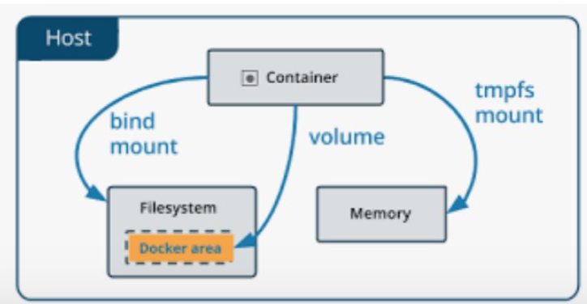
    <figcaption>Gráfico técnicas de persistencia de datos.</figcaption>
</figure>

!!! Note "Nota"
    Los volúmenes son independientes de los contenedores, por lo que también podemos conservar los datos aunque se destruya el contenedor, reutilizarlos con otro contenedor, etc.

### Opciones

* Opciones:

``` bash
`Docker volume (create|Is|inspect|rm)`
```

* para crear el volumen a la vez que creamos y ejecutamos un contenedor se utilizan las opciones `v` o `--mount`

En general, `--mount` más explícito y detallado. La mayor diferencia es que la sintaxis de `-v` combina todas las opciones juntas en un campo, mientras que la sintaxis `--mount`  las separa. A continuación se muestra una comparación de la sintaxis de cada "flag".

* `-v` o `--volume` : consta de tres campos, separados por dos puntos ( :). Los campos deben estar en el orden correcto y el significado de cada campo no es inmediatamente obvio.
    * En el caso de volúmenes con nombre, el primer campo es el nombre del volumen y es único en una máquina host determinada. Para volúmenes anónimos, se omite el primer campo.
    * El segundo campo es la ruta donde se monta el archivo o directorio en el contenedor.
    * El tercer campo es opcional y es una lista de opciones separadas por comas, como `ro` (readonly). 

* `--mount`: Consta de varios pares clave-valor, separados por comas (cada uno formado por una <key>=<value> dupla). La sintaxis de `--mount` es más detallada que `-v` o `--volume`; además el orden de las claves no es significativo, por lo tanto el valor de las "flags" son más fáciles de entender. 
* Valores de las duplas:
    * **type**: puede ser `bind`, `volume` o `tmpfs`.
    * **source**: Para volúmenes con nombre, este es el nombre del volumen. Para volúmenes anónimos, este campo se omite. Puede especificarse como source o src.
    * **destination**: toma como valor de la ruta en el archivo o directorio está montado en el contenedor. Puede ser especificado como destination, `dst` o `target`.
    * **readonly**: si está presente, hace que el montaje de enlace se monte en el contenedor como de solo lectura. Puede especificarse como `readonly` o `ro`.
    * **volume-opt** se puede especificar más de una vez, toma un par clave-valor que consta del nombre de la opción y su valor. Ejemplo: `volume-opt=type=nfs`

!!! Note "Nota"
    Todas las opciones de volúmenes están disponibles para los indicadores `--mount` y `-v`, por lo que a la hora de elegir uno u otro depende del técnico para su facilidad de configuración donde por su sintaxis a priori sería mejor `--mount`.

### Ejemplo

A continuación se muestra un ejemplo de creación del servidor web NGINX.

!!! Example "Ejemplo"
    ```bash
    docker run -d \
    --name nginx1 -p 8080:80 \
    --mount type=volume,source=myvol1,target=/usr/share/nginx/html \
    nginx:latest
    ```

!!! Note "Nota"
    * Si en lugar de la opción `-p 8080:80` se utiliza la opción `-P` hace que Docker asigne de forma aleatoria un puerto de la máquina virtual al puerto asignado a Nginx en el contenedor.

* Si se creara una página de inicio del apache diferente a la de defecto podríamos copiarla en el volumen y esta cambiaría:

```bash
nano index.html
```

* Nueva página de inicio:

``` bash
<!DOCTYPE html>
<html lang="es">
<head>
  <meta charset="utf-8">
  <title>Apache en Docker</title>
  <meta name="viewport" content="width=device-width, initial-scale=1.0">
</head>

<body>
  <h1>¡Hola Mundo!</h1>
</body>
</html>
```

* Para cambiar la página de inicio del nginx se debe copiar dentro del volumen creado.
```bash
docker cp index.html nginx1:/usr/share/nginx/html
```

* Si accedemos al servidor nginx aparecerá la nueva página. 

!!! warning "Advertencia"
    Si aparece el error forbidden 403, es debido a permisos del index.html, debemos entrar en container y cambiar los permisos.

``` bash
docker exec -it nginx1 /bin/bash
```

``` bash
cd /usr/share/nginx/html
chown -R root:root index.html
```

* Además podemos crear un nuevo contenedor con este volumen:
``` bash
docker run -d \
    --name nginx2 -p 8080:80 \
    --mount type=volume,source=myvol1,target=/usr/share/nginx/html \
    nginx:latest
```

* Se comprueba que el nuevo contenedor muestra la nueva página index.html

!!! Warning "Advertencia" 
    Si se intenta borrar el volumen del ejemplo anterior mientras los contenedores están en marcha, Docker muestra un **mensaje de error que indica los contenedores afectados**.

## Herramientas Docker

Existen dos opciones destacables en Docker para agilizar el despliegue de imágenes y contenedores: Dockerfile y Docker Compose

* **Dockerfile**: es un archivo de texto plano que contiene una serie de instrucciones necesarias para crear una imagen que, posteriormente, se convertirá en una sola aplicación utilizada para un determinado propósito.

!!! Summary
    Imágenes → docker build → Dockerfile

* **Docker Compose**: es una herramienta que permite simplificar el uso de Docker. A partir de archivos `yaml` es más sencillo crear contenedores, conectarlos, habilitar puertos, volúmenes, etc.

!!! Summary
    Contenedores → docker compose up → docker-compose.yml

### Dockerfile

Las instrucciones principales que pueden utilizarse en un Dockerfile son:

<figure>
    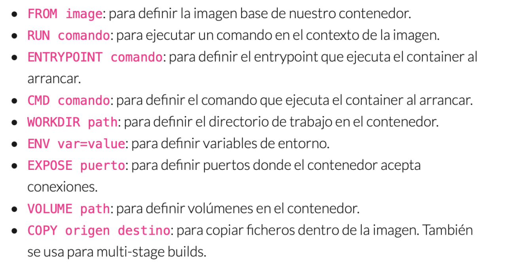
</figure>

* Ver también: [Best practices for writing Dockerfiles](https://docs.docker.com/develop/develop-images/dockerfile_best-practices/)

!!! Example "Ejemplo"
    A continuación se muestra un ejemplo para la realización de la práctica de ampliación extraído de [Apache oficial de Docker](https://hub.docker.com/_/httpd).

1. **Primer paso**: generar imagen con un **Dockerfile**.

* Se crea el archivo de texto Dockerfile.
```bash
touch Dockerfile
nano Dockerfile
```

* Ejemplo de edición del Dockerfile.

``` bash
# syntax=docker/dockerfile:1
FROM nginx:alpine
RUN apk update
COPY index.html/ /usr/share/nginx/html/
```

!!! Note "Nota"
    Se puede probar a introducir el volumen en el Dockerfile: `VOLUME /myvol1`

* Se crea la imagen y el contenedor.
``` bash
docker build -t fcojavierhernandez/my-nginx-alpine .
docker run -dit --name my-nginx-alpine -p 8081:80 fcojavierhernandez/my-nginx-alpine
```

!!! Warning "Advertencia"
    * **Mucho cuidado** con el último punto de la instrucción de build, tiene un espacio antes. El último argumento (y el único imprescindible) es el nombre del archivo Dockerfile que tiene que utilizar para generar la imagen. Como en este caso se encuentra en el mismo directorio y tiene el nombre predeterminado Dockerfile, se puede escribir simplemente punto (`.`).
    * Para indicar el nombre de la imagen se debe añadir la opción `-t`. El nombre de la imagen debe seguir el patrón `nombre-de-usuario/nombre-de-imagen`. Si la imagen sólo se va a utilizar localmente, el nombre de usuario y de la imagen pueden ser cualquier palabra.

2. **Segundo paso**: subir imagen al Docker Hub.

* Se debe generar una cuenta de Docker Hub con la cuenta corporativa de Office 365: [Sign Up](https://hub.docker.com/signup)
* Con el comando `docker login`, se realiza el acceso a la plataforma desde el terminal, introduciendo usuario y contraseña.
``` bash
docker login
```

!!! Warning "Advertencia"
    Se debe acceder con el nic no con la cuenta de correo.

* Con el comando `docker push`, se realiza el "Upload" de la imagen.

``` bash
docker push fcojavierhernandez/my-nginx-alpine
```

* Por último, se debe comprobar accediendo a la plataforma de Docker Hub.

<figure>
    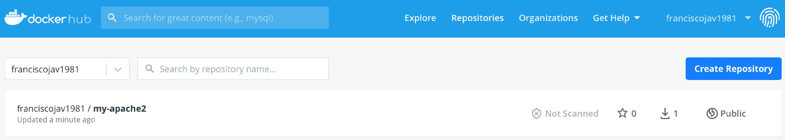
</figure>

### Docker Compose

* **Docker Compose** es otro proyecto open source que permite definir aplicaciones multi-contenedor de una manera sencilla y declarativa.

* Es una alternativa más cómoda al uso de los comandos docker run y docker build, que resultan un tanto tediosos cuando trabajamos con aplicaciones de varios componentes.

* Se define un fichero `docker-compose.yml` que se puede observar en el ejemplo realizado en la práctica en el último apartado.

!!! Example "Ejemplo"
    A continuación se muestra un ejemplo para la realización de la práctica de ampliación: [Instalación Wordpress](https://docs.docker.com/samples/wordpress/)

1. **Primer paso**: instalación de Docker Compose.

* [Install Docker Compose](https://docs.docker.com/compose/install/)

```bash
apt-get install docker-compose-plugin
```

2. **Segundo paso**: crear directorio del proyecto y dentro el archivo `yaml`.

```bash
mkdir my_wordpress
touch docker-compose.yml
nano docker-compose.yml
```

3. **Tercer paso**: se edita el archivo `yaml`.

``` yaml
version: "3.9"
    
services:
  db:
    image: mysql:5.7
    volumes:
      - db_data:/var/lib/mysql
    restart: always
    environment:
      MYSQL_ROOT_PASSWORD: somewordpress
      MYSQL_DATABASE: wordpress
      MYSQL_USER: wordpress
      MYSQL_PASSWORD: wordpress
    
  wordpress:
    depends_on:
      - db
    image: wordpress:latest
    volumes:
      - wordpress_data:/var/www/html
    ports:
      - "8000:80"
    restart: always
    environment:
      WORDPRESS_DB_HOST: db:3306
      WORDPRESS_DB_USER: wordpress
      WORDPRESS_DB_PASSWORD: wordpress
      WORDPRESS_DB_NAME: wordpress
volumes:
  db_data: {}
  wordpress_data: {}
```

4. **Cuarto paso**: en la carpeta creada del proyecto se ejecuta el comando `docker compose up -d`

``` bash
docker compose up -d
```

!!! tip "Comprobación"
    Se comprueba que se han creado los contenedores y se abre el navegador para comprobar que está disponible la instalación de WordPress.

---
## Redes

Cuando se crean diferentes servicios o aplicaciones en contenedores distintos (siguiendo la premisa de microservicios), estos no están conectados entre sí por defecto. Para que los contenedores puedan comunicarse entre ellos se utilizan las redes Docker. Este mecanismo funciona de manera distinta según el tipo de red docker donde estén conectados los contenedores.

<figure>
    
    <figcaption>Representación Redes Docker.</figcaption>
</figure>

### Opciones y tipos

Los comandos básicos para gestionar redes son:

``` bash
docker network (create | ls | inspect | rm)
```

A continuación se introducen los distintos tipos de redes que nos ofrece docker:

* **Bridge** → Red por defecto. Todos los contenedores están en la misma red, separada del Host. Es la red más común para aplicaciones multi-contenedor.
* **Host** → Los contenedores comparten la pila de red del host directamente, sin aislamiento de red.
* **None** → Contenedores completamente aislados, sin conectividad de red.

<figure>
    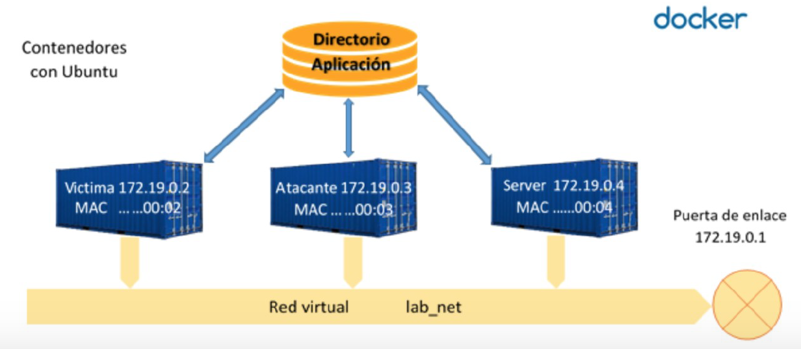
    <figcaption>Escenario de ejemplo de una Red Docker.</figcaption>
</figure>

### Red Bridge por defecto

Cuando se crea un contenedor sin especificar una red, Docker lo conecta automáticamente a la red bridge por defecto. Esta red tiene limitaciones importantes:

* Todos los contenedores comparten la misma red, lo que puede causar conflictos.
* La comunicación entre contenedores se realiza mediante direcciones IP, no por nombres.
* No se recomienda para entornos de producción.

!!! warning
    El uso de contenedores conectados a la red por defecto no está recomendado en entornos de producción. Se podrían enlazar contenedores con el bridge por defecto con el flag `--link`, pero esta opción está deprecada y no se recomienda su uso.

### Redes Bridge personalizadas

La opción recomendable es definir una red bridge personalizada y crear los contenedores conectados a dicha red. Las ventajas principales son:

* Aislamiento de servicios: cada red es independiente.
* Resolución DNS automática: los contenedores pueden comunicarse usando sus nombres.
* Control de la configuración de red: se puede definir el rango de IP, gateway, etc.
* Mejor organización: diferentes aplicaciones pueden usar redes diferentes.

Para crear una red bridge personalizada:

``` bash
docker network create mired
```

Si necesitamos especificar un rango de IP personalizado:

``` bash
docker network create --subnet=172.20.0.0/16 --gateway=172.20.0.1 mired
```

Para verificar que la red se ha creado correctamente:

``` bash
docker network ls
docker network inspect mired
```

### Conectar contenedores a una red

Una vez creada la red, se pueden crear contenedores conectados a dicha red de dos formas:

**Opción 1: Al crear el contenedor**

``` bash
docker run -d --name servidor_mysql --network mired \
-e MYSQL_DATABASE=bd_wp -e MYSQL_USER=user_wp -e MYSQL_PASSWORD=asdasd \
-e MYSQL_ROOT_PASSWORD=asdasd mariadb

docker run -d --name servidor_web --network mired \
-p 8080:80 javierhernandez/aplicacionweb:v1
```

**Opción 2: Conectar un contenedor existente**

``` bash
docker network connect mired nombre_contenedor
```

### Resolución DNS en redes Docker

Una de las ventajas principales de usar redes personalizadas es la resolución DNS automática. Los contenedores pueden comunicarse entre sí usando el nombre del contenedor en lugar de la dirección IP.

Por ejemplo, si tenemos un contenedor de base de datos llamado `servidor_mysql` y un contenedor web llamado `servidor_web`, desde el contenedor web podemos conectarnos a la base de datos usando:

```
servidor_mysql:3306
```

En lugar de tener que usar la IP del contenedor, que puede cambiar cada vez que se recrea.

### Redes en Docker Compose

Docker Compose facilita mucho la gestión de redes. Por defecto, cuando se define un archivo `docker-compose.yml`, Docker Compose crea automáticamente una red para todos los servicios definidos en ese archivo. Todos los servicios pueden comunicarse entre sí usando sus nombres de servicio.

Ejemplo básico:

``` yaml
version: "3.9"

services:
  db:
    image: mysql:5.7
    environment:
      MYSQL_ROOT_PASSWORD: rootpass
      MYSQL_DATABASE: wordpress
      MYSQL_USER: wordpress
      MYSQL_PASSWORD: wordpress
    volumes:
      - db_data:/var/lib/mysql

  wordpress:
    image: wordpress:latest
    ports:
      - "8000:80"
    environment:
      WORDPRESS_DB_HOST: db:3306
      WORDPRESS_DB_USER: wordpress
      WORDPRESS_DB_PASSWORD: wordpress
      WORDPRESS_DB_NAME: wordpress
    depends_on:
      - db

volumes:
  db_data: {}
```

En este ejemplo, el servicio `wordpress` puede conectarse a la base de datos usando `db:3306` como host, ya que `db` es el nombre del servicio de base de datos.

### Redes personalizadas en Docker Compose

Si necesitamos más control sobre la configuración de red, podemos definir redes personalizadas en el archivo `docker-compose.yml`:

``` yaml
version: "3.9"

services:
  db:
    image: mysql:5.7
    networks:
      - backend
    environment:
      MYSQL_ROOT_PASSWORD: rootpass
      MYSQL_DATABASE: wordpress
      MYSQL_USER: wordpress
      MYSQL_PASSWORD: wordpress
    volumes:
      - db_data:/var/lib/mysql

  wordpress:
    image: wordpress:latest
    networks:
      - frontend
      - backend
    ports:
      - "8000:80"
    environment:
      WORDPRESS_DB_HOST: db:3306
      WORDPRESS_DB_USER: wordpress
      WORDPRESS_DB_PASSWORD: wordpress
      WORDPRESS_DB_NAME: wordpress
    depends_on:
      - db

  nginx:
    image: nginx:alpine
    networks:
      - frontend
    ports:
      - "80:80"
    depends_on:
      - wordpress

volumes:
  db_data: {}

networks:
  frontend:
    driver: bridge
    ipam:
      config:
        - subnet: 172.25.0.0/16
  backend:
    driver: bridge
    ipam:
      config:
        - subnet: 172.26.0.0/16
```

En este ejemplo se crean dos redes:

* **frontend**: Para servicios que necesitan ser accesibles desde el exterior (nginx, wordpress).
* **backend**: Para servicios internos (base de datos).

El servicio `wordpress` está conectado a ambas redes, permitiéndole comunicarse tanto con nginx (frontend) como con la base de datos (backend). La base de datos solo está en la red backend, lo que proporciona un mayor nivel de seguridad al no estar expuesta directamente.

### Aislamiento de servicios

El uso de redes personalizadas permite aislar servicios según sus necesidades:

* **Servicios públicos**: Conectados a una red frontend, accesibles desde el exterior.
* **Servicios internos**: Conectados a una red backend, solo accesibles desde otros contenedores de la misma red.
* **Servicios de administración**: Pueden tener su propia red para tareas de mantenimiento.

Este aislamiento mejora la seguridad al limitar la exposición de servicios sensibles como bases de datos.

### Gestión de redes

Para listar todas las redes:

``` bash
docker network ls
```

Para inspeccionar una red específica y ver qué contenedores están conectados:

``` bash
docker network inspect nombre_red
```

Para desconectar un contenedor de una red:

``` bash
docker network disconnect nombre_red nombre_contenedor
```

Para eliminar una red (solo si no tiene contenedores conectados):

``` bash
docker network rm nombre_red
```

Para eliminar todas las redes no utilizadas:

``` bash
docker network prune
```

!!! Note
    Cuando se usan redes personalizadas, cada contenedor mantiene sus propias variables de entorno. No se comparten variables de entorno entre contenedores, lo que es una ventaja para la seguridad y el aislamiento de configuraciones.
---

# Actividades

<a name="PR101"></a>

* :simple-neutralinojs: **PR101** (RA2, RA3, RA4 // CE2a, CE3b, y CE4c // 1-10p). [Despliegue de NextCloud con Docker y persistencia de datos](01NextCloudDocker.md)

> **Criterios de evaluación asociados:**

- **CE-RA2a**: Identificación y justificación de la herramienta Docker y sus componentes (redes, volúmenes).
- **CE-RA3b**: Configuración correcta del contenedor NextCloud y comprobación funcional.
- **CE-RA4c**: Documentación clara del procedimiento, incluyendo evidencias (capturas, comandos).

> **Tareas:**

1. Crear una red interna en Docker con un rango de IP definido.
2. Crear un volumen llamado `volNextCloud` para almacenar datos persistentes.
3. Desplegar un contenedor NextCloud con:
   
   - IP fija en la red creada.   
   - Montaje del volumen en `/var/www/html/data`.   
   - Exposición del servicio en el puerto 80.
4. Comprobar:
   
   - Acceso a la interfaz web de NextCloud.   
   - Subida de un archivo y su persistencia tras eliminar y recrear el contenedor.
5. Documentar todo el proceso con capturas y comandos utilizados, y sobre todo el resultado, los problemas encontrados durante la práctica y como se han solucionado.

!!! note "**NOTA**"
    No se trata de documentar el proceso tal cual como la guía, hay que documentar los resultados, los problemas encontrados y su solución.

---

<a name="PR102"></a>

* :simple-neutralinojs: **PR102** (RA2, RA3, RA4 // CE2a, CE3b, y CE4c // 1-10p). **Dockerfile y Docker Compose: Aplicación web personalizada**

> **Criterios de evaluación asociados:**

- **CE-RA2a**: Identificación y justificación de las herramientas Dockerfile y Docker Compose.
- **CE-RA3b**: Configuración correcta de imagen personalizada y aplicación multi-contenedor.
- **CE-RA4c**: Documentación clara del procedimiento, incluyendo evidencias (capturas, comandos).

> **Tareas:**

1. **Crear un Dockerfile personalizado** para una aplicación web:

   - Usar imagen base `nginx:alpine`.
   - Copiar una página HTML personalizada.
   - Exponer el puerto 80.
   - Construir la imagen con nombre `mi-aplicacion-web`.

2. **Crear un docker-compose.yml** para una aplicación LAMP:

   - Servicio web: usar la imagen personalizada creada.
   - Servicio base de datos: MySQL 8.0.
   - Configurar volúmenes persistentes para ambos servicios.
   - Configurar variables de entorno para la base de datos.
   - Exponer puertos apropiados.

3. **Desplegar la aplicación**:

   - Ejecutar `docker compose up -d`.
   - Verificar que ambos contenedores estén funcionando.
   - Acceder a la aplicación web desde el navegador.

4. **Publicar en Docker Hub**:

   - Crear cuenta en Docker Hub.
   - Hacer login desde terminal.
   - Subir la imagen personalizada.
   - Verificar la publicación.

5. **Documentar el proceso**:

   - Capturas de pantalla de cada paso.
   - Comandos utilizados.
   - Problemas encontrados y soluciones aplicadas.
   - URL de la imagen en Docker Hub.

> **Archivos a entregar:**

- Dockerfile
- docker-compose.yml
- index.html (página personalizada)
- Documentación con capturas y explicaciones
- URL de la imagen en Docker Hub

!!! tip "**Consejos**"
    - Revisa la documentación oficial de Docker para Dockerfile y Docker Compose.
    - Prueba cada paso antes de continuar con el siguiente.
    - Asegúrate de que los nombres de imagen sigan el formato `usuario/nombre-imagen`.
    - Verifica que los puertos no estén en conflicto con otros servicios.

<!-- ---

<a name="PR103"></a>

* **PR103** (RA2, RA3, RA4 // CE2a, CE3b, y CE4c // 1-10p). [Infraestructura completa con Docker Compose: WordPress, MySQL y redes personalizadas](PR103_Solucion.md)

> **Criterios de evaluación asociados:**

- **CE-RA2a**: Identificación y justificación de la arquitectura Docker con redes personalizadas y aislamiento de servicios.
- **CE-RA3b**: Configuración correcta de aplicación multi-contenedor con WordPress, MySQL, volúmenes persistentes y redes Docker personalizadas.
- **CE-RA4c**: Documentación completa de la arquitectura Docker, incluyendo docker-compose.yml, configuración de redes, volúmenes y variables de entorno.

> **Contexto:**

Esta práctica está orientada a implementar una infraestructura completa de TI mediante Docker, simulando un entorno de producción profesional. Se desplegará una aplicación WordPress con base de datos MySQL, utilizando redes Docker personalizadas para aislar servicios y garantizar la seguridad, volúmenes persistentes para la persistencia de datos, y variables de entorno para la configuración.

> **Tareas:**

1. **Preparación del entorno:**

   - Crear directorio del proyecto con estructura organizada.
   - Crear archivo `.env` para variables de entorno sensibles (contraseñas, nombres de base de datos).
   - Crear archivo `docker-compose.yml` con la arquitectura completa.

2. **Configuración de redes Docker personalizadas:**

   - Definir red `frontend` con subnet `172.25.0.0/16` para servicios accesibles desde el exterior.
   - Definir red `backend` con subnet `172.26.0.0/16` para servicios internos (base de datos).
   - Verificar la creación de las redes con `docker network ls` y `docker network inspect`.

3. **Configuración del servicio de base de datos (MySQL):**

   - Usar imagen `mysql:8.0` o `mariadb:latest`.
   - Conectar solo a la red `backend` para aislamiento de seguridad.
   - Configurar volúmenes persistentes para datos (`/var/lib/mysql`).
   - Configurar variables de entorno desde archivo `.env`:
     - `MYSQL_ROOT_PASSWORD`
     - `MYSQL_DATABASE`
     - `MYSQL_USER`
     - `MYSQL_PASSWORD`
   - No exponer puertos al host, solo comunicación interna.

4. **Configuración del servicio WordPress:**

   - Usar imagen `wordpress:latest` o `wordpress:apache`.
   - Conectar a ambas redes: `frontend` y `backend`.
   - Exponer puerto `8080:80` para acceso desde el host.
   - Configurar volúmenes persistentes para:
     - Contenido de WordPress (`/var/www/html`)
     - Configuraciones personalizadas (opcional)
   - Configurar variables de entorno para conexión a base de datos:
     - `WORDPRESS_DB_HOST: db:3306` (usando resolución DNS)
     - `WORDPRESS_DB_USER`
     - `WORDPRESS_DB_PASSWORD`
     - `WORDPRESS_DB_NAME`
   - Configurar dependencia con el servicio de base de datos (`depends_on`).

5. **Despliegue y verificación:**

   - Ejecutar `docker compose up -d` para levantar los servicios.
   - Verificar que todos los contenedores estén en ejecución con `docker compose ps`.
   - Verificar la conectividad de red:
     - Comprobar que WordPress puede resolver el nombre `db` mediante DNS.
     - Verificar que la base de datos solo está accesible desde la red backend.
   - Acceder a WordPress desde el navegador en `http://localhost:8080`.
   - Completar la instalación de WordPress.

6. **Pruebas de persistencia:**

   - Crear contenido en WordPress (páginas, entradas, plugins).
   - Detener los contenedores con `docker compose down`.
   - Volver a levantar los servicios con `docker compose up -d`.
   - Verificar que el contenido creado se mantiene (persistencia de volúmenes).

7. **Pruebas de aislamiento de red:**

   - Intentar conectarse a la base de datos desde el host (debe fallar, no está expuesta).
   - Verificar que WordPress puede comunicarse con la base de datos usando el nombre del servicio.
   - Comprobar las IPs asignadas a cada contenedor en sus respectivas redes.

8. **Documentación de la arquitectura:**

   - Crear diagrama de la arquitectura de red (frontend/backend).
   - Documentar la configuración de volúmenes y su propósito.
   - Documentar las variables de entorno utilizadas (sin mostrar valores sensibles).
   - Incluir capturas de:
     - Estructura de directorios del proyecto.
     - Salida de `docker compose ps`.
     - Salida de `docker network inspect` para cada red.
     - Acceso a WordPress funcionando.
     - Verificación de persistencia de datos.

> **Archivos a entregar:**

- `docker-compose.yml` completo y funcional
- Archivo `.env.example` (plantilla sin valores sensibles)
- Documentación completa con:
  - Explicación de la arquitectura de red
  - Justificación de las decisiones de diseño
  - Capturas de pantalla de cada paso
  - Comandos utilizados
  - Problemas encontrados y soluciones aplicadas
  - Diagrama de la arquitectura

> **Requisitos técnicos:**

- Docker y Docker Compose instalados y funcionando.
- Al menos 2GB de RAM disponible.
- Puertos 8080 y 3306 libres (o cambiar a otros puertos).

!!! warning "**Importante**"
    - No incluyas contraseñas reales en la documentación entregada.
    - Usa el archivo `.env` para valores sensibles y añádelo al `.gitignore` si usas control de versiones.
    - Verifica que los rangos de subred no entren en conflicto con otras redes Docker existentes.

!!! tip "**Consejos**"
    - Revisa la documentación oficial de Docker Compose para la sintaxis correcta.
    - Usa `docker compose logs` para ver los logs de los servicios si hay problemas.
    - Verifica la conectividad entre contenedores usando `docker compose exec wordpress ping db`.
    - Para desarrollo, puedes usar `docker compose up` sin `-d` para ver los logs en tiempo real. -->