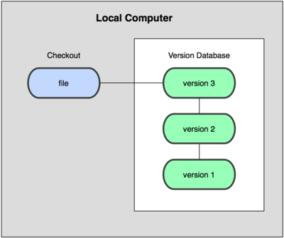
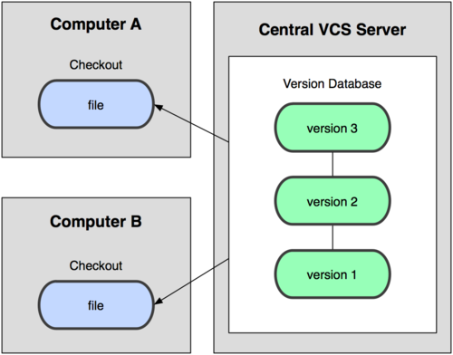
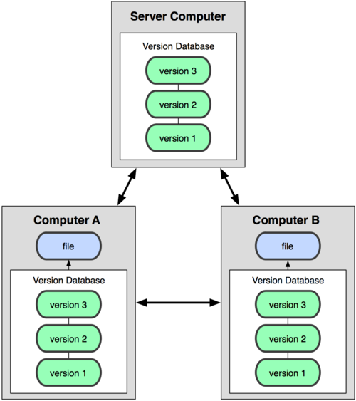
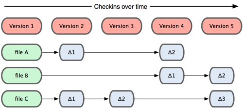
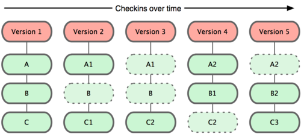
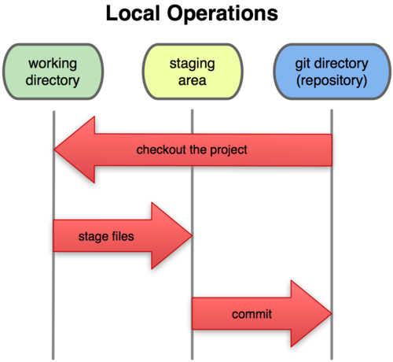
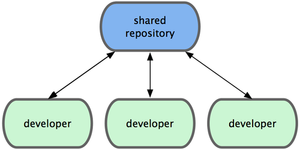
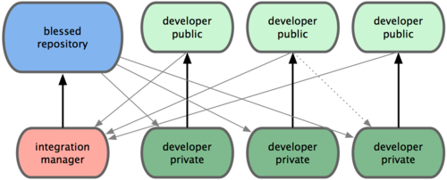
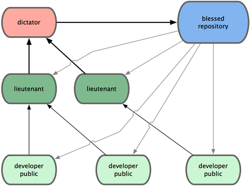

--- 
title: Git - Sistemas de control de versiones
description: Apuntes de Git para el Proyecto Intermodular de ASIR por Francisco Javier Hernández Illán. Explicación de sistemas de control de versiones, Git, repositorios, comandos básicos y avanzados.
---

# Git - Sistemas de control de versiones

> [Git](https://git-scm.com/) es un **sistema de control de versiones distribuido** desarrollado por Linus Torvalds para el kernel de Linux.
>
> - Breve historia: en **2005**, tras un cambio en las herramientas usadas para gestionar el código del kernel, Linus Torvalds creó Git con objetivos claros de **rapidez**, **integridad** y **trabajo distribuido**. Poco después, la comunidad lo adoptó ampliamente y hoy es el estándar de facto del desarrollo de software y la infraestructura.
> 
> - A diferencia de otros sistemas de control de versiones, Git modela los datos como un conjunto de instantáneas de un mini sistema de archivos, proporcionando **velocidad, integridad y flexibilidad** para proyectos de cualquier tamaño. 
> 
> - En el contexto del **ciclo ASIR**, Git es esencial para la gestión de configuraciones de servidores, scripts de automatización, documentación técnica y colaboración en proyectos de infraestructura.

---

## Propuesta didáctica

Esta herramienta se enmarca dentro del **módulo de Proyecto Intermodular** del CFGS ASIR, y contribuye a los siguientes **Resultados de Aprendizaje (RA)** definidos en la programación:

> **RA4.** *Documenta, versiona y despliega la solución y sus evidencias.*

### Criterio de evaluación (relacionado)

> **CE-RA4c.** *Se ha documentado el procedimiento de versionado y colaboración.*

### Relación con otros módulos del ciclo ASIR

Git como herramienta de control de versiones es fundamental en el desarrollo profesional de administradores de sistemas, siendo especialmente relevante para:

- **ASO (Administración de Sistemas Operativos)**: Automatización de tareas administrativas, scripts de configuración y gestión de infraestructura.
- **SAD (Seguridad y Alta Disponibilidad)**: Control de versiones de configuraciones de seguridad y respaldos de políticas.
- **SGBD (Sistemas de Gestión de Bases de Datos)**: Versionado de esquemas de base de datos y scripts de migración.
- **IAW (Implantación de Aplicaciones Web)**: Gestión de código fuente de aplicaciones web y despliegue continuo.

### Contenidos

**Bloque 1 — Sistemas de control de versiones (Sesión 1)**

- Definición y clasificación de sistemas de control de versiones
- Terminología fundamental (repositorio, revisión, rama, commit, merge, etc.)
- Arquitecturas: locales, centralizados y distribuidos
- Ventajas de los sistemas distribuidos

**Bloque 2 — Introducción a Git (Sesión 2)**

- Historia y características de Git
- Instalación y configuración inicial
- Configuración de identidad y entorno
- Primer repositorio: `git init`

**Bloque 3 — Uso básico de Git (Sesión 3)**

- Comandos fundamentales: `git add`, `git commit`, `git status`
- Trabajando con el historial: `git log`, `git diff`
- Archivos `.gitignore` y gestión de archivos temporales
- Etiquetado de versiones

**Bloque 4 — Repositorios remotos y Git Clone (Sesión 4)**

- Introducción a repositorios remotos
- Comando `git clone` y sus opciones
- Configuración de remotos: `git remote`
- URLs y protocolos de acceso
- Casos de uso en administración de sistemas

**Bloque 5 — Uso avanzado y ramas (Sesión 5)**

- Concepto de ramas y su utilidad
- Creación, cambio y fusión de ramas
- Resolución de conflictos
- Flujos de trabajo colaborativo

**Bloque 6 — GitHub y colaboración (Sesión 6)**

- Configuración de GitHub
- Comandos remotos: `git push`, `git pull`
- Pull requests y revisión de código
- Colaboración en equipos de infraestructura

!!! question "Actividades iniciales"
    1. Configura tu identidad en Git (nombre y email) para el entorno ASIR.
    2. Crea tu primer repositorio local con `git init` para gestionar scripts de administración.
    3. Realiza tu primer commit con un archivo README.md que documente tu proyecto.
    4. Explora el historial con `git log` y crea etiquetas para versiones estables.
    5. Crea una cuenta en GitHub y conecta tu repositorio local.
    6. Clona un repositorio de scripts de administración usando `git clone`.

### Programación de Aula

| Sesión | Contenidos | Actividades | Criterios trabajados |
|--------|-----------|-------------|-----------------------|
| 1 | Sistemas de control de versiones, Introducción a Git | AC201. Configurar la identidad de Git (ASIR) | CE-RA4c |
<!-- | 2 | **Uso básico de Git** | PR201. Primer repositorio Git | CE-RA3b, CE-RA4c |
| 3 | **Ramas y colaboración** | PR202. Trabajo colaborativo con GitHub | CE-RA3b, CE-RA4c | -->

---

## Sistemas de control de versiones

### Definición, clasificación y funcionamiento

**Control de versiones** es la gestión de los diversos cambios que se realizan sobre los elementos de algún producto o configuración. Una **versión, revisión o edición** es el estado en el que se encuentra dicho producto en un momento dado de su desarrollo o modificación.

### ¿Por qué usar herramientas de control de versiones?

Aunque puede realizarse de forma manual, **es muy aconsejable disponer de herramientas especializadas** que faciliten esta gestión, dando lugar a los llamados **Sistemas de Control de Versiones (SCV)**.

**Ventajas de los SCV:**

- **Trazabilidad**: seguimiento completo del historial de cambios
- **Colaboración**: múltiples desarrolladores trabajando simultáneamente
- **Recuperación**: posibilidad de volver a versiones anteriores
- **Especialización**: gestión de variantes para diferentes clientes o entornos
- **Automatización**: integración con herramientas de despliegue y CI/CD

### Herramientas populares

Ejemplos de sistemas de control de versiones incluyen:

- **Centralizados**: CVS, Subversion, SourceSafe, ClearCase, Perforce
- **Distribuidos**: Git, Mercurial, Darcs, Bazaar, Plastic SCM

### Terminología

| Término | Definición |
|---------|------------|
| **Repositorio ("repository")** | Almacén de todo el historial y metadatos del proyecto (carpeta `.git`). Puede estar local o en un remoto (GitHub, GitLab). |
| **Revisión ("revision")** | Estado concreto del proyecto identificado por un hash único. Cada commit crea una revisión, que permite comparar cambios y volver a ese punto cuando sea necesario. |
| **Etiqueta ("tag")** | Marcador inmutable que apunta a una revisión importante (por ejemplo `v1.0.0`). Útil para versiones y despliegues. |
| **Rama ("branch")** | Línea de trabajo con su propio puntero a commits. Permite desarrollar en paralelo sin afectar a la rama principal. Ej.: `feature/api`. |
| **Cambio ("change")** | Modificación de uno o varios archivos respecto a una revisión previa; se ve como un diff (líneas añadidas/eliminadas). |
| **Desplegar ("checkout")** | Acción de cambiar tu directorio de trabajo a una rama o revisión (`git checkout main` o un commit/tag). |
| **Confirmar ("commit")** | Crear una nueva revisión con los cambios preparados (staged), incluyendo autor, fecha y mensaje descriptivo. |
| **Conflicto ("conflict")** | Ocurre cuando dos cambios afectan a la misma zona de un archivo y Git no puede elegir. Requiere resolución manual y nuevo commit. |
| **Cabeza ("head")** | Último commit de una rama (punta). `HEAD` suele apuntar al commit actual sobre el que estás trabajando. |
| **Tronco ("trunk")** | Rama principal del proyecto (también llamada `main` o `master`) desde la que se versiona y se liberan versiones estables. |
| **Fusionar, integrar, mezclar ("merge")** | Una fusión o integración es una operación en la que se aplican dos tipos de cambios en un archivo o conjunto de archivos.  |

<!-- #### Ejemplos de "merge" -->

<!-- Algunos escenarios de ejemplo son los siguientes:

- Un usuario, trabajando en un conjunto de archivos, actualiza o sincroniza su copia de trabajo con los cambios realizados y confirmados por otros usuarios en el repositorio.
- Un usuario intenta confirmar archivos que han sido actualizados por otros usuarios desde el último despliegue (`checkout`), y el software de control de versiones integra automáticamente los archivos (por lo general, después de preguntar si se debe proceder con la integración automática, y en algunos casos solo si la fusión puede ser clara y razonablemente resuelta).
- Un conjunto de archivos se bifurca, un problema que existía antes de la ramificación se trabaja en una nueva rama, y la solución se combina luego en la otra rama.
- Se crea una rama, el código de los archivos es editado de forma independiente, y la rama actualizada se incorpora más tarde en un único tronco unificado. -->

## Clasificación

Podemos clasificar los sistemas de control de versiones atendiendo a la arquitectura utilizada para el almacenamiento del código: **locales, centralizados y distribuidos**.

### Locales

Los cambios son guardados localmente y no se comparten con nadie. Esta arquitectura es la antecesora de las dos siguientes.

<figure>
  
  <figcaption>Sistema de control de versiones local.</figcaption>
</figure>

### Centralizados

Existe un repositorio centralizado de todo el código, del cual es responsable un único usuario (o conjunto de ellos). Se facilitan las tareas administrativas a cambio de reducir flexibilidad, pues todas las decisiones fuertes (como crear una nueva rama) necesitan la aprobación del responsable. Algunos ejemplos son CVS y Subversion.

<figure>
  
  <figcaption>Sistema de control de versiones centralizado.</figcaption>
</figure>

### Distribuidos

Cada usuario tiene su propio repositorio. Los distintos repositorios pueden intercambiar y mezclar revisiones entre ellos. Es frecuente el uso de un repositorio, que está normalmente disponible, que sirve de punto de sincronización de los distintos repositorios locales. Ejemplos: Git y Mercurial.

<figure>
  
  <figcaption>Sistema de control de versiones distribuido.</figcaption>
</figure>

#### Ventajas de sistemas distribuidos

- No es necesario estar conectado para guardar cambios.
- Posibilidad de continuar trabajando si el repositorio remoto no está accesible.
- Se necesitan menos recursos para el repositorio remoto.
- Más flexibles al permitir gestionar cada repositorio personal como se quiera.
- El repositorio central está más libre de ramas de pruebas.
 
!!! note "**NOTA**"
    Esta última ventaja permite que las ramas experimentales y pruebas personales no saturen el repositorio principal, facilitando una gestión más limpia y ordenada del proyecto.


---

## Introducción a Git

Git es un sistema de control de versiones distribuido que se diferencia del resto en el modo en que modela sus datos. La mayoría de los demás sistemas almacenan la información como una lista de cambios en los archivos, mientras que Git modela sus datos más como un conjunto de instantáneas de un mini sistema de archivos.

<figure>
  
  <figcaption>Modelo de datos de los sistemas distribuidos tradicionales.</figcaption>
</figure>

<figure>
  
  <figcaption>Modelo de datos de Git.</figcaption>
</figure>

> **¿Qué significa que Git modela sus datos como instantáneas?**

Cuando decimos que **"Git modela sus datos como un conjunto de instantáneas de un mini sistema de archivos"**, nos referimos a que **cada vez que confirmas cambios con un commit, Git guarda una fotografía completa del estado de todos los archivos del proyecto en ese momento**.  
> Es decir, aunque generalmente almacena sólo los archivos que han cambiado, Git puede **reconstruir el proyecto entero en cualquier commit**.

Esto **contrasta con otros sistemas** de control de versiones, que normalmente almacenan únicamente las diferencias (deltas) o cambios línea a línea respecto a versiones anteriores.

!!! tip "Modelo de instantáneas en Git"
    - En Git, **cada commit representa un estado completo y consistente del conjunto de archivos del proyecto**.
    - Si un archivo **no ha sido modificado** en un commit, Git simplemente **apunta a la versión anterior** de ese archivo, lo que evita duplicados y hace el almacenamiento muy eficiente.
    - En resumen, **puedes imaginar Git como una colección de fotografías del proyecto a lo largo del tiempo**, en lugar de una simple lista de instrucciones para rehacer los pasos desde el principio.
    - De este modo, **volver a cualquier estado anterior es muy sencillo y rápido**, ya que cada snapshot (instantánea) mantiene toda la información necesaria.

<!-- ### Resumen de conceptos clave

- **Repositorios centralizados:** Un único repositorio principal gestionado por uno o varios responsables. Ejemplos: CVS, Subversion.
- **Repositorios distribuidos:** Cada usuario tiene copia completa del repositorio y puede intercambiar cambios con otros. Ejemplos: Git, Mercurial.
- **Ventajas de sistemas distribuidos:** No requiere conexión constante, mayor flexibilidad y eficiencia de almacenamiento, separación clara de ramas experimentales.
- **Modelo de datos de Git:** Git guarda instantáneas completas del proyecto en cada commit, no sólo diferencias línea a línea.
- **Eficiencia de almacenamiento:** Los archivos no cambiados en un commit apuntan a la versión anterior, evitando duplicación.
- **Recuperación de estados:** Git facilita volver a cualquier estado anterior rápidamente gracias a su modelo de instantáneas. -->


### Los tres estados

Git tiene tres estados principales en los que se pueden encontrar tus archivos:

- **Modificado (modified)**: has cambiado el archivo en tu directorio de trabajo, pero Git aún no lo rastrea para el próximo commit. Puedes descartarlo con `git restore <archivo>` o prepararlo con `git add`.
- **Preparado (staged)**: el cambio está en el área de preparación (index) y se incluirá en el próximo commit. Puedes des-prepararlo con `git restore --staged <archivo>` o confirmarlo con `git commit`.
- **Confirmado (committed)**: los datos están almacenados de manera segura en tu base de datos local (dentro de `.git`). Forma parte del historial y puedes recuperar ese estado cuando quieras. Normalmente llegas aquí con `git commit`.

Esto nos lleva a las tres secciones principales de un proyecto de Git: el directorio de Git (Git directory), el directorio de trabajo (working directory), y el área de preparación (staging area).

<figure>
  
  <figcaption>Directorio de trabajo, área de preparación, y directorio de Git.</figcaption>
</figure>


Cada área de Git está asociada a uno de los tres estados principales, y entender esta relación ayuda a mejorar tu flujo de trabajo y control sobre el proyecto:

- **Directorio de trabajo (Working directory)** → **Modificado (modified):**  
  Aquí es donde desarrollas y editas archivos. Cada cambio que hagas pasa primero por el directorio de trabajo. Mejorar el uso de esta área significa mantener solo los archivos realmente en desarrollo y evitar mezclar cambios no relacionados, lo que facilita identificar y organizar tus modificaciones.

- **Área de preparación (Staging area)** → **Preparado (staged):**  
  Cuando añades archivos a la *staging area* (`git add`), seleccionas exactamente qué cambios formarán parte del siguiente commit. Aprovechar este estado te permite preparar commits más limpios, revisar exactamente qué será incluido y dividir el trabajo en etapas lógicas y documentadas. Así, tus confirmaciones serán más comprensibles y útiles para todo el equipo.

- **Directorio de Git (.git directory)** → **Confirmado (committed):**  
  Una vez confirmados los cambios (`git commit`), estos se almacenan de forma segura en el historial del repositorio. Mejorar el uso de esta área implica hacer commits frecuentes y descriptivos, permitiendo regresar fácilmente a cualquier punto seguro del proyecto, identificar errores rápidamente y facilitar la colaboración.

En resumen, al comprender y aprovechar cada área y su estado asociado, mejorarás tanto la organización interna de tu trabajo como la colaboración y trazabilidad en el proyecto.

### Flujos de trabajo distribuidos con Git

Hemos visto en qué consiste un entorno de control de versiones distribuido, pero más allá de la simple definición, existe más de una manera de gestionar los repositorios. Estos son los flujos de trabajo más comunes en Git.

#### Flujo de trabajo centralizado

Existe un único repositorio o punto central que guarda el código y todo el mundo sincroniza su trabajo con él. Si dos desarrolladores clonan desde el punto central, y ambos hacen cambios; tan solo el primero de ellos en enviar sus cambios de vuelta lo podrá hacer limpiamente. El segundo desarrollador deberá fusionar previamente su trabajo con el del primero, antes de enviarlo, para evitar el sobreescribir los cambios del primero.

<figure>
  
  <figcaption>Flujo de trabajo centralizado.</figcaption>
</figure>

#### Flujo de trabajo del Gestor-de-Integraciones

Al permitir múltiples repositorios remotos, en Git es posible tener un flujo de trabajo donde cada desarrollador tenga acceso de escritura a su propio repositorio público y acceso de lectura a los repositorios de todos los demás. Habitualmente, este escenario suele incluir un repositorio canónico, representante "oficial" del proyecto.

<figure>
  
  <figcaption>Flujo de trabajo del Gestor-de-Integraciones.</figcaption>
</figure>

!!! info "Información"
    Este modelo ganó popularidad especialmente con la llegada de plataformas como GitHub, que se explicará más adelante.

#### Flujo de trabajo con Dictador y Tenientes

Es una variante del flujo de trabajo con múltiples repositorios. Se utiliza generalmente en proyectos muy grandes, con cientos de colaboradores. Un ejemplo muy conocido es el del kernel de Linux. Unos gestores de integración se encargan de partes concretas del repositorio; y se denominan tenientes. Todos los tenientes rinden cuentas a un gestor de integración; conocido como el dictador benevolente. El repositorio del dictador benevolente es el repositorio de referencia, del que recuperan (pull) todos los colaboradores.

<figure>
  
  <figcaption>Flujo de trabajo con Dictador y Tenientes.</figcaption>
</figure>

### Características principales de Git

- **Distribuido**: Cada desarrollador tiene una copia completa del historial del proyecto.
- **Velocidad**: Optimizado para proyectos grandes como el kernel de Linux.
- **Integridad**: Usa checksums SHA-1 para verificar la integridad de los datos.
- **Flexibilidad**: Soporta múltiples flujos de trabajo y estrategias de branching.

---

## Aspectos básicos de Git

### Instalación

#### Instalando en Linux

Si quieres instalar Git en Linux a través de un instalador binario, en general puedes hacerlo a través de la herramienta básica de gestión de paquetes que trae tu distribución. Si estás en Fedora, puedes usar yum:

```bash
$ yum install git-core
```

O si estás en una distribución basada en Debian como Ubuntu, prueba con apt-get:

```bash
$ apt-get install git
```

#### Instalando en Windows

Instalar Git en Windows es muy fácil. El proyecto msysGit tiene uno de los procesos de instalación más sencillos. Simplemente descarga el archivo exe del instalador desde la página de GitHub, y ejecútalo:

**Enlace**: http://msysgit.github.com/

Una vez instalado, tendrás tanto la versión de línea de comandos (incluido un cliente SSH que nos será útil más adelante) como la interfaz gráfica de usuario estándar. Se recomienda no modificar las opciones que trae por defecto el instalador.

#### Instalando en MacOS

En MacOS se recomienda tener instalada la herramienta [homebrew](https://brew.sh/). Después, es tan fácil como ejecutar:

```bash
$ brew install git
```

### Configuración

#### Tu identidad

Lo primero que deberías hacer cuando instalas Git es establecer tu nombre de usuario y dirección de correo electrónico. Esto es importante porque las confirmaciones de cambios (commits) en Git usan esta información, y es introducida de manera inmutable en los commits que envías:

```bash
# --global: aplica para el usuario actual (se guarda en ~/.gitconfig)

# Nombre que aparecerá como autor en tus commits
$ git config --global user.name "John Doe"

# Correo asociado a tus commits (usado por plataformas como GitHub)
$ git config --global user.email johndoe@example.com
```

También se recomienda configurar el siguiente parámetro:

```bash
# Hace que 'git push' envíe solo la rama actual a su rama remota homónima
# y falle si la rama no tiene upstream configurado (comportamiento seguro)
$ git config --global push.default simple
```

#### Bash Completion

*Bash completion* permite el autocompletado inteligente de comandos, opciones y nombres de archivo al pulsar `Tab`. Para Git, sugiere subcomandos (`commit`, `checkout`, `cherry-pick`…), ramas, etiquetas y archivos rastreados, reduciendo errores de tecleo y acelerando el flujo.

¿Por qué usarlo?

- **Velocidad**: menos tecleo en comandos largos u opciones complejas.
- **Exactitud**: evita fallos por nombres de rama/archivo mal escritos.
- **Descubrimiento**: sugiere opciones disponibles al escribir `--` y tabular.

Cómo habilitarlo en Ubuntu/Debian:

```bash
# Instala los scripts de completion
sudo apt-get update && sudo apt-get install bash-completion

# Activa bash-completion en tu sesión (normalmente basta con este include)
echo '[[ $PS1 && -f /usr/share/bash-completion/bash_completion ]] && \
    . /usr/share/bash-completion/bash_completion' >> ~/.bashrc

# Habilita auto-completado específico de Git (si no se carga automáticamente)
if [ -f /usr/share/bash-completion/completions/git ]; then
  echo 'source /usr/share/bash-completion/completions/git' >> ~/.bashrc
fi

# Recarga la configuración
source ~/.bashrc
```

!!! note "**NOTA**"
    En muchas distribuciones modernas, basta con instalar `bash-completion`: el resto de la configuración se carga automáticamente en shells interactivos.

macOS (Homebrew):

```bash
# Instala bash-completion v2 (para Bash 4+)
brew install bash-completion@2

# Añade la carga automática a tu shell (ARM/Apple Silicon)
echo 'if [ -f /opt/homebrew/etc/profile.d/bash_completion.sh ]; then\n  . /opt/homebrew/etc/profile.d/bash_completion.sh\nfi' >> ~/.bash_profile

# Para Intel Macs, usa /usr/local en lugar de /opt/homebrew
echo 'if [ -f /usr/local/etc/profile.d/bash_completion.sh ]; then\n  . /usr/local/etc/profile.d/bash_completion.sh\nfi' >> ~/.bash_profile

# Recarga
source ~/.bash_profile
```

Windows (Git Bash):

```bash
# Git for Windows ya incluye scripts de completion y prompt.
# Actívalos añadiendo estas líneas a ~/.bashrc

if [ -f /mingw64/share/git/completion/git-completion.bash ]; then
  . /mingw64/share/git/completion/git-completion.bash
fi

# (Opcional) Prompt enriquecido con estado de Git
if [ -f /mingw64/share/git/completion/git-prompt.sh ]; then
  . /mingw64/share/git/completion/git-prompt.sh
fi

# Recarga la configuración
source ~/.bashrc
```

---

---
## Uso básico de git

Antes de empezar, te recomendamos ver el siguiente video introductorio sobre el uso básico de Git:

<div style="position: relative; padding-bottom: 56.25%; height: 0; overflow: hidden; max-width: 100%;">
  <iframe 
    style="position: absolute; top: 0; left: 0; width: 100%; height: 100%;" 
    src="https://www.youtube.com/embed/uwqvuJ5lrIs?list=PLQg_Bl-6Gfo9k0KQg5vaaV9r6Hg--nMA7" 
    frameborder="0" 
    allow="accelerometer; autoplay; clipboard-write; encrypted-media; gyroscope; picture-in-picture" 
    allowfullscreen>
  </iframe>
</div>

### Creación de repositorios
Para crear un repositorio hay que situarse en la carpeta deseada y ejecutar:
```bash
git init
```

### Ciclo de vida


### Revisando el estado
```bash
git status
```

Esquema de colores:

- **Rojo**: Identifica los archivos **modificados o nuevos**. Si se crean archivos dentro de carpetas nuevas, `git status` solo mostrará el nombre de la carpeta, no su contenido. Si se desea ver el contenido de las carpetas nuevas se deberá ejecutar `git status -u`.
- **Verde**: Identifica los archivos en el **área de preparación**.

### Visualizar cambios
```bash
git diff
git diff <archivo_o_ruta>
```

Este es uno de los comandos más utilizados en `git`. Nos permite ver los cambios en los archivos del repositorio o en una ruta específica.

### Añadir archivos al área de preparación (stage)
```bash
git add <archivo> # Añadir archivos individuales
git add .         # Añadir todos los archivos nuevos o modificados
```

El **área de preparación** contiene los **cambios que se añadirán a la nueva versión** cuando ejecutemos un `commit`. Es posible la siguiente situación:

- Modificar un fichero (aparecerá en color rojo al hacer un `git status`)
- Añadir el fichero al área de preparación mediante `git add FICHERO`
- El fichero aparecerá en color **verde** al hacer un `git status`
- Volver a modificar el fichero
- El fichero aparecerá **dos veces** al hacer un `git status`:
  - En color **verde**, indicando que se ha añadido el **primer cambio** al área de preparación
  - En color **rojo**, indicando que hay un **segundo cambio** posterior que **no se ha incluido** en el área de preparación
- Si se ejecuta un `git commit` en este momento **solamente se incorporará el primer cambio** al repositorio como nueva versión. El segundo cambio seguirá existiendo (el archivo no habrá cambiado), pero no estará guardado en el commit
- Si se desea agregar el segundo cambio se deberá ejecutar nuevamente `git add` para añadirlo al área de preparación

### Visualizar cambios de los archivos en el área de preparación
```bash
git diff --staged
git diff --staged <archivo>
```

Este comando muestra los cambios que se han agregado al área de preparación (diferencia entre la última versión guardada en el repositorio y el área de preparación).

### Confirmar cambios (commit)
```bash
git commit -m "MENSAJE"
```

Un commit equivale a una nueva **versión** en el repositorio. Cada commit tiene un **identificador único**, denominado `hash`. Los commits están relacionados entre sí mediante una **red de tipo grafo**.

En la siguiente sesión estudiaremos como volver atrás en la historia para acceder a una versión anterior del repositorio si se desea.

### Ignorar archivos
- Archivo `.gitignore`
- Plantillas de archivos [.gitignore](https://github.com/github/gitignore).

Las rutas y nombres de archivo que aparezcan en el fichero `.gitignore` serán ignoradas por `git` **siempre que no hayan sido añadidas previamente al área de preparación o al repositorio**. Por ejemplo, si añadimos un archivo al área de preparación mediante `git add` y a continuación lo añadimos al fichero `.gitignore`, `git` lo seguirá manteniendo en el área de preparación, por lo que será incluido en el repositorio si ejecutamos un `git commit`.

De igual manera, si previamente hemos guardado un archivo en el repositorio mediante `git commit` y a continuación lo incluimos en el fichero `.gitignore`, git no lo borrará: será necesario borrarlo del sistema de ficheros (a través de la consola o el navegador de archivos) y añadir los cambios (`git add` y `git commit`) para que se borre del repositorio. Una vez borrado, si lo volvemos a crear veremos que `git` sí que lo ignora si está incluido en el fichero `.gitignore`.

### Historial de cambios
```bash
git log
git log --graph
```

Este comando muestra el histórico de los commits del repositorio. Se puede navegar en el listado mediante los cursores y la barra espaciadora. Para salir hay que pulsar la tecla `q`.

### Ver cambios realizados en anteriores commits
```bash
git show <commit>
```

Este comando nos permite mostrar los cambios que se introdujeron en un determinado commit. En primer lugar se puede ejecutar `git log` para buscar el hash del commit que nos interese y a continuación ejecutar `git show` indicando después el hash del commit correspondiente.

Los hash de los commits tienen 40 caracteres, pero no es necesario copiarlos enteros: basta con indicar entre los [8 y 10 primeros caracteres](http://git-scm.com/book/en/v2/Git-Tools-Revision-Selection#Short-SHA-1) para identificar un commit correctamente.

### Quitar archivo del área de preparación
```bash
git reset <archivo>
```

En ocasiones nos encontramos con que hemos añadido cambios al área de preparación que no queremos incorporar al commit. Para ello podemos utilizar este comando, que elimina los cambios del fichero correspondiente del área de preparación. **Los cambios no se pierden** en ningún caso.

### Eliminar las modificaciones con respecto al último commit
```bash
# ¡PELIGRO! Todos los cambios que se hayan hecho al archivo desde el último commit se eliminarán
git checkout -- <archivo>
```

Este comando es peligroso, ya que **elimina todos los cambios del archivo** que no hayan sido guardados en el repositorio. Es decir, si el archivo tiene cambios y está en color **rojo**, se perderán dichos cambios. Este comando puede ser útil para dejar un archivo tal como estaba en la última versión guardada del repositorio.

### Etiquetado
```bash
git tag NOMBRE_TAG
```

Este comando crea un `tag` en el commit en que nos encontremos en este momento. Un `tag` es un **alias** que se utiliza para **hacer referencia a un commit** sin necesidad de saber su hash. Normalmente se utiliza para **indicar números o nombres de versiones** asociadas a un determinado commit. De esta manera podemos **identificar una versión de una manera más amable**.

El nombre de los `tag` se puede utilizar con los comandos de git: por ejemplo, `git show`.

### Guardado temporal
```bash
# Guardado temporal de cambios no añadidos al área de preparación
git stash

# Restaurar cambios guardados mediante git stash
git stash pop
```

En ocasiones se hacen cambios que se desea preservar para más adelante: por ejemplo, trabajamos en una modificación de un fichero y de repente nos avisan de que hay un bug en otro fichero que tiene que ser resuelto inmediatamente. Para no trabajar en ambas tareas a la vez podemos ejecutar `git stash`: los cambios que tenemos en ese momento y que no están en el área de preparación (es decir, los cambios que están en color rojo) se guardan en un área temporal; al ejecutar `git status` veremos que no hay ninguna modificación, el directorio de trabajo está limpio.

A continuación trabajamos en el bug, hacemos cambios y al terminar ejecutamos `git add` y `git commit` para resolverlo. Una vez resuelto, ejecutamos `git stash pop` y recuperamos los cambios que estábamos realizando antes de ser interrumpidos: veremos que `git status` nos muestra en color rojo los archivos que habíamos modificado al principio.

---

## Uso básico 2

Para profundizar en los conceptos fundamentales de Git, recomendamos consultar los apuntes de la [sesión 2 del curso de GitHub](https://github.com/pedroprieto/curso-github/blob/gh-pages/sesion-2.org), donde se trabajan aspectos como ramas, fusiones de ramas, conflictos, **repositorios remotos** (aspecto en el que especialmente queremos incidir) y flujos de trabajo con ramas (contenido más avanzado). Este material se distribuye bajo la licencia [Creative Commons Attribution-ShareAlike 4.0 (CC BY-SA 4.0)](https://creativecommons.org/licenses/by-sa/4.0/deed.es).

Para complementar la teoría, te recomendamos ver el siguiente vídeo de la sesión 3 sobre trabajo con repositorios remotos:

<div style="position: relative; padding-bottom: 56.25%; height: 0; overflow: hidden; max-width: 100%;">
  <iframe 
    style="position: absolute; top: 0; left: 0; width: 100%; height: 100%;" 
    src="https://www.youtube.com/embed/aYDyT85NOLg" 
    frameborder="0" 
    allow="accelerometer; autoplay; clipboard-write; encrypted-media; gyroscope; picture-in-picture" 
    allowfullscreen>
  </iframe>
</div>

### Comandos para trabajar con repositorios remotos

Aquí tienes los comandos más importantes que necesitas conocer para trabajar con repositorios remotos. Te resultarán imprescindibles cuando trabajes con proyectos en equipo o necesites sincronizar tu código local con servidores como GitHub o GitLab.

#### Ver y gestionar remotos

```bash
# Ver los remotos configurados (versión corta)
git remote

# Ver los remotos con sus URLs (fetch y push)
git remote -v

# Añadir un nuevo remoto (por defecto se suele llamar "origin")
git remote add origin <URL_del_repositorio>

# Ver información detallada de un remoto (ramas, configuración, etc.)
git remote show origin

# Renombrar un remoto
git remote rename origin nuevo_nombre

# Eliminar un remoto
git remote rm nombre_remoto
```

!!! note "Nota importante"
    Cuando clonas un repositorio con `git clone`, Git añade automáticamente ese repositorio remoto con el nombre `origin`. Esto significa que no necesitas añadirlo manualmente si trabajas desde un clon.

#### Clonar un repositorio remoto

```bash
# Clonar un repositorio remoto completo
git clone <URL_del_repositorio>

# Clonar en un directorio con nombre específico
git clone <URL_del_repositorio> <nombre_directorio>
```

#### Obtener cambios del remoto

Aquí hay dos comandos diferentes que debes conocer bien porque funcionan de forma distinta:

```bash
# Obtener cambios del remoto SIN fusionarlos automáticamente
git fetch origin

# Obtener y fusionar cambios del remoto en la rama actual (en un solo paso)
git pull origin <nombre_de_la_rama>

# Si tu rama local ya rastrea una rama remota (upstream), simplemente:
git pull

# Fusionar manualmente los cambios obtenidos con fetch
git merge origin/<nombre_de_la_rama>
```

**Diferencia importante entre `fetch` y `pull`**: `git fetch` solo descarga los cambios del remoto y actualiza las referencias remotas (como `origin/master`), pero no modifica tu código ni fusiona nada automáticamente. Por el contrario, `git pull` hace dos cosas: primero ejecuta `git fetch` y luego automáticamente fusiona los cambios con tu rama actual. 

Esto significa que `git pull` puede modificar tu código directamente, así que úsalo cuando estés seguro de que quieres fusionar los cambios. Si prefieres revisar primero qué cambios hay en el remoto antes de fusionarlos, usa `git fetch` seguido de `git merge` cuando estés listo.

#### Enviar cambios al remoto

```bash
# Enviar tus commits locales al remoto
git push origin <nombre_de_la_rama>

# Enviar y configurar el upstream (hace falta la primera vez)
git push -u origin <nombre_de_la_rama>

# Una vez configurado el upstream, puedes hacer simplemente:
git push

# Enviar todas las ramas locales al remoto
git push --all origin

# Enviar etiquetas (tags) al remoto
git push origin --tags
```

**Atención**: `git push` solo funciona si tienes permisos de escritura en el repositorio remoto y si nadie más ha enviado cambios en el mismo tiempo. Si alguien ha enviado cambios antes que tú, tu push será rechazado y tendrás que traerte primero sus cambios con `git pull` o `git fetch`, resolver posibles conflictos, y luego volver a intentar.

### Flujo de trabajo básico con remotos

Para trabajar cómodamente con repositorios remotos, sigue estos pasos:

1. **Inicializar la conexión con el remoto:**

   - Si vas a trabajar con un proyecto existente, clona el repositorio con `git clone <URL>`. Esto configura automáticamente "origin" como remoto.
   - Si ya tienes un repositorio local y quieres conectarlo a uno remoto (por ejemplo, en GitHub), añádelo con `git remote add origin <URL>`.
   - Verifica que todo esté bien con `git remote -v`.

2. **Trabajar localmente:**

   - Haz tus modificaciones normalmente.
   - Añade los cambios al área de preparación: `git add <archivo>` o `git add .`.
   - Confirma con `git commit -m "Mensaje descriptivo"`.

3. **Sincronizar antes de enviar:**

   - Antes de enviar tus cambios, es buena práctica obtener primero los cambios del remoto con `git pull` para asegurarte de estar al día.
   - Si hay conflictos, resuélvelos antes de continuar.

4. **Enviar tus cambios:**

   - Envía tus commits al remoto con `git push origin <rama>`.
   - La primera vez que envías una rama, usa `git push -u origin <rama>` para configurar el upstream (esto enlaza tu rama local con la rama remota y permite que después puedas hacer simplemente realizar `git push` sin argumentos).

5. **Mantener el repositorio actualizado:**

   - Siempre que empieces a trabajar, haz un `git pull` para tener la última versión.
   - Haz commits frecuentes y con mensajes claros.
   - Envía tus cambios regularmente con `git push` para no quedarte demasiado desincronizado.

---
## GitHub

GitHub es una plataforma de alojamiento de repositorios Git que combina control de versiones con herramientas colaborativas para gestionar proyectos de software y documentación. Según el material de la sesión 3 del curso de GitHub, su uso en el aula permite centralizar tareas, dar visibilidad al trabajo del alumnado y facilitar la retroalimentación continua gracias a funciones como Issues, Pull Requests y Proyectos Kanban.

- **Gestión académica**: Issues y Milestones convierten actividades en tareas rastreables, asignables y cerrables automáticamente desde los mensajes de commit (`Fixes #id`).  
- **Colaboración**: Forks, Pull Requests y permisos de colaboradores permiten revisar aportaciones, mantener el control sobre la rama principal y fomentar la participación del alumnado.  
- **Automatización y seguimiento**: Tableros de proyecto, comentarios en línea y flujos de pruebas automáticas ayudan a documentar evidencias, coordinar equipos y validar cambios antes de integrarlos.  
- **Administración de cuentas**: GitHub ofrece descuentos educativos, configuración granular de tokens personales y opciones de seguridad para proteger accesos institucionales.

Para profundizar en el trabajo con repositorios desde GitHub, revisa el siguiente vídeo complementario de la sesión 3:

<div style="position: relative; padding-bottom: 56.25%; height: 0; overflow: hidden; max-width: 100%;">
  <iframe 
    style="position: absolute; top: 0; left: 0; width: 100%; height: 100%;" 
    src="https://www.youtube.com/embed/GMH6hN8FKSU" 
    frameborder="0" 
    allow="accelerometer; autoplay; clipboard-write; encrypted-media; gyroscope; picture-in-picture" 
    allowfullscreen>
  </iframe>
</div>

<!-- [^github-sesion3]: [Sesión 3 del curso de GitHub – Pedro Prieto](https://raw.githubusercontent.com/pedroprieto/curso-github/gh-pages/sesion-3.org) -->


---

## Actividades

<a name="AC201"></a>

:simple-readdotcv: **AC201** (RA4 // CE4c // 1-5p). **Configurar la identidad de Git (ASIR)**

> **Criterio de evaluación asociado:**

- **CE-RA4c**: Documentación del procedimiento con evidencias (comandos y capturas).

> **Tareas:**

1. Instalar Git en el sistema (usa el gestor de paquetes de tu OS y verifica con `git --version`).
2. Configurar la identidad de Git (nombre y email) para el entorno ASIR.

> **NOTA:** Puedes configurar la identidad a nivel global o por repositorio:
    
- Global (para todo el usuario): `git config --global user.name "Tu Nombre"` y `git config --global user.email "tu@correo"`
- Local (solo para el repo actual): `git config user.name "Tu Nombre"` y `git config user.email "tu@correo"`
- Verifica con: `git config --list --show-origin | grep user\.`

<a name="PR202"></a>

::simple-neutralinojs: **PR202** (RA4 // CE4c // 1-10p). **Gestión de configuraciones de servidor con Git**

> **Criterio de evaluación asociado:**
>
> - **CE-RA4c**: Documentación clara del procedimiento, incluyendo evidencias (capturas, comandos).
>
> **Tareas:**
>
> 1. Configurar la identidad de Git (nombre y email) para el entorno ASIR usando `git config --global`.
> 2. Crear un directorio para el proyecto de configuraciones de servidor e inicializar un repositorio Git con `git init`.
> 3. Crear un archivo `README.md` con información del proyecto de infraestructura (estructura del repositorio, descripción de servicios).
> 4. Crear la estructura de directorios para configuraciones: `nginx/`, `apache/`, `mysql/`, `scripts/`, `backups/`, `docs/`.
> 5. Crear archivos de configuración de ejemplo apropiados para ASIR:
>    - `nginx/default.conf`: Configuración básica de NGINX con virtual host
>    - `apache/000-default.conf`: Configuración de Apache para virtual host
>    - `mysql/my.cnf`: Configuración básica de MySQL
>    - `scripts/backup.sh`: Script de respaldo de configuraciones
>    - `scripts/deploy.sh`: Script de despliegue automatizado
> 6. Utilizar `git status` para verificar el estado de los archivos antes y después de añadirlos al área de preparación.
> 7. Añadir los archivos al área de preparación usando `git add` (individualmente y con `git add .`).
> 8. Visualizar los cambios con `git diff` y `git diff --staged` antes de confirmar.
> 9. Realizar el primer commit con mensaje descriptivo usando `git commit -m`.
> 10. Crear un archivo `.gitignore` apropiado para configuraciones de servidor (excluir archivos temporales, logs, backups, certificados SSL, archivos sensibles).
> 11. Modificar algunas configuraciones y realizar commits descriptivos para cada cambio (por ejemplo: ajustar configuración de NGINX, añadir directiva de seguridad en Apache, modificar parámetros de MySQL).
> 12. Explorar el historial con `git log` y `git log --graph --oneline` para visualizar la estructura de commits.
> 13. Utilizar `git show <commit>` para ver los detalles de cambios en commits específicos.
> 14. Crear etiquetas (`git tag`) para versiones estables (ej: `v1.0.0`, `v1.1.0`) y visualizarlas con `git show`.
> 15. Practicar con `git stash` para guardar temporalmente cambios sin confirmar y restaurarlos con `git stash pop`.
> 16. Utilizar `git reset` para quitar archivos del área de preparación cuando sea necesario.
> 17. Documentar todo el proceso con capturas y comandos utilizados, incluyendo:
>     - Estructura final del repositorio (árbol de directorios)
>     - Historial de commits completo (`git log --oneline --graph`)
>     - Estados de archivos en diferentes momentos (`git status`)
>     - Resolución de problemas encontrados durante la práctica
>     - Diferencias entre commits (`git diff` y `git show`)

!!! note "**NOTA**"
    No se trata de documentar el proceso tal cual como la guía, hay que documentar los resultados, los problemas encontrados y su solución. Los archivos de configuración deben ser funcionales y apropiados para un entorno ASIR real. Esta práctica se enfoca en el uso básico local de Git, sin repositorios remotos.


<a name="PR203"></a>

* **PR203** (RA4 // CE4c // 1-10p). **Colaboración en infraestructura con GitHub**

> **Criterio de evaluación asociado:**

- **CE-RA4c**: Documentación clara del procedimiento, incluyendo evidencias (capturas, Pull Requests, comentarios).

> **Tareas (trabajo en equipo):**

1. Organizaos en grupos de 2-3 personas y cread un repositorio en GitHub (puede ser en una organización o cuenta individual) destinado a gestionar la infraestructura de un servicio del ciclo ASIR (por ejemplo, despliegue de un servidor web con copias de seguridad automatizadas).
2. Definid un `README.md` inicial con la lista de integrantes, el servicio ASIR elegido y el plan de trabajo; diseñad un tablero de `Projects` o documento compartido para repartir tareas (configuración del servicio, automatización, documentación).
3. Configurad los permisos del repositorio para que todo el grupo tenga acceso de escritura, activad la protección de la rama principal (`main`) y preparad un calendario de entregas parciales.
4. Cada integrante debe abrir una rama a partir de `main`, implementar parte de la configuración (scripts, plantillas, documentación técnica) y abrir un Pull Request donde explique el objetivo del cambio y cómo contribuye al servicio.
5. Revisad los Pull Requests en parejas usando comentarios en línea; resolved los cambios solicitados hasta su aprobación y fusión mediante Merge o Squash, asegurándoos de que el servicio ASIR queda funcional y versionado.
6. Capturad evidencias del tablero de trabajo, revisiones y merges; añadid las imágenes a la carpeta `capturas/` del repo y registradlas en el historial con commits descriptivos.
7. Elaborad un informe final en formato Markdown (dentro de `docs/`) que resuma organización del trabajo, incidencias encontradas, métricas obtenidas (Pull Requests revisados, aportaciones por integrante) y aprendizajes de la dinámica colaborativa aplicada al servicio ASIR. Para resolver dudas de formato podéis consultar la guía de [Markdown Guide](https://www.markdownguide.org) y su [chuleta rápida](https://www.markdownguide.org/cheat-sheet/).

!!! note "**NOTA**"
    La evaluación valorará especialmente la coordinación interna del equipo: uso coherente del tablero de trabajo, calidad de los Pull Requests y documentación de la retroalimentación entre integrantes, con énfasis en la viabilidad del servicio ASIR configurado.

---

## Referencias

- [Git - Documentación oficial](https://git-scm.com/doc)
- [GitHub - Plataforma de colaboración](https://github.com)
- [GitHub Gitignore templates](https://github.com/github/gitignore)
- [Pro Git Book - Scott Chacon](https://git-scm.com/book/es/v2)

<div class="center-block" markdown="1">

[](https://git-scm.com/book/es/v2)

*Consulta el [libro oficial de Git _Pro Git_ (2ª edición, español)](https://git-scm.com/book/es/v2) para una guía completa y actualizada sobre Git.*

</div>


<!-- ---


---


---

## Licencia

El material está publicado con licencia [Atribución-NoComercial 4.0 Internacional (CC BY-NC 4.0)](https://creativecommons.org/licenses/by-nc/4.0/deed.es)

### Agradecimientos

Este curso ha sido elaborado basándose en el material del Aula de Software Libre de la Universidad de Córdoba, impartido por:

- [Adrián López](https://github.com/AdrianLopezGue)
- [Héctor Romero](https://github.com/cyberh99)
- [Javier de Santiago](https://github.com/jdes01)
- [José Márquez](https://github.com/IronSenior)
- [Sergio Gómez](https://github.com/sgomez) -->