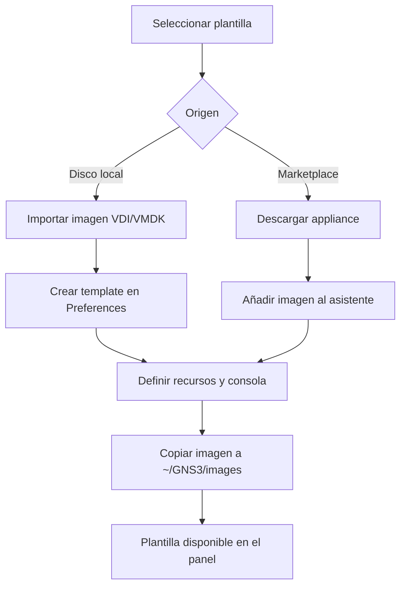

# GNS3 - Simulador de redes

> [GNS3](https://www.gns3.com/) (Graphical Network Simulator-3) es una herramienta de **emulación de redes de código abierto** que permite diseñar, configurar, probar y solucionar problemas en topologías de red complejas sin necesidad de hardware físico real.
>
> - GNS3 se creó inicialmente para **emular routers Cisco IOS** mediante Dynamips, pero ha evolucionado para soportar una amplia variedad de dispositivos de red virtuales y reales.
> 
> - La herramienta combina dispositivos virtuales y físicos, permitiendo crear **entornos de red realistas** que pueden conectarse a redes reales a través de interfaces de red del host.
> 
> - En el contexto del **ciclo ASIR**, GNS3 es fundamental para la práctica de configuraciones de red, protocolos de enrutamiento, conmutación, seguridad de red y pruebas de topologías antes de su despliegue en producción.

---

## Propuesta didáctica

Esta herramienta se enmarca dentro del **módulo de Proyecto Intermodular** del CFGS ASIR, y contribuye a los siguientes **Resultados de Aprendizaje (RA)** definidos en la programación:

> **RA3.** *Desarrolla y valida la solución (iteraciones, pruebas y criterios de aceptación).*

### Criterio de evaluación (relacionado)

> **CE-RA3b.** *Se han configurado topologías de red virtuales y se han realizado pruebas de conectividad.*

### Relación con otros módulos del ciclo ASIR

GNS3 como herramienta de simulación de redes es esencial para el desarrollo profesional de administradores de sistemas, siendo especialmente relevante para:

- **SRI (Servicios de Red e Internet)**: Simulación de protocolos de enrutamiento (OSPF, EIGRP, BGP), configuración de routers y switches, diseño de topologías LAN/WAN.
- **SAD (Seguridad y Alta Disponibilidad)**: Pruebas de configuraciones de firewalls, VPNs, ACLs, y topologías seguras antes del despliegue.
- **ASO (Administración de Sistemas Operativos)**: Configuración de interfaces de red, routing estático y dinámico, y pruebas de conectividad entre sistemas.

### Contenidos

**Bloque 1 — Introducción a GNS3 (Sesión 1)**

- ¿Qué es GNS3? Diferencias con otros simuladores de red.
- Conceptos básicos: topologías, nodos, conexiones, proyectos.
- Arquitectura de GNS3: GUI, Controlador, Cómputo y Emuladores.
- Instalación en GNU/Linux (Ubuntu Server).

**Bloque 2 — Interfaz y primeros pasos (Sesión 2)**

- Interfaz gráfica de GNS3: barras de herramientas, panel de dispositivos, área de trabajo.
- Creación del primer proyecto.
- Añadir dispositivos básicos: routers, switches, PCs.
- Conectar dispositivos mediante cables.

**Bloque 3 — Dispositivos y emuladores (Sesión 3)**

- Tipos de dispositivos disponibles: routers, switches, hubs, PCs.
- Emuladores: Dynamips (Cisco IOS), QEMU, VirtualBox.
- Importación de imágenes de dispositivos.
- Configuración de templates de dispositivos.

**Bloque 4 — Topologías básicas (Sesión 4)**

- Diseño de topologías simples (punto a punto, estrella).
- Configuración de routers mediante terminal.
- Configuración de direcciones IP e interfaces.
- Pruebas de conectividad básica.

**Bloque 5 — Topologías avanzadas (Sesión 5)**

- Diseño de topologías complejas (jerárquicas, mesh).
- Configuración de routing estático y dinámico.
- Integración con máquinas virtuales externas.
- Conexión a redes físicas.

**Bloque 6 — Aplicaciones prácticas ASIR (Sesión 6)**

- Simulación de infraestructura de red completa.
- Configuración de servicios de red (DNS, DHCP).
- Pruebas de seguridad y firewall.
- Documentación de topologías.

!!! question "Actividades iniciales"
    1. Instalar GNS3 en el sistema siguiendo la documentación oficial.
    2. Crear el primer proyecto y familiarizarse con la interfaz.
    3. Añadir un router básico y un PC a la topología.
    4. Conectar los dispositivos y configurar direcciones IP básicas.
    5. Realizar pruebas de conectividad usando ping entre dispositivos.
    6. Explorar los diferentes tipos de dispositivos disponibles en GNS3.

### Programación de Aula

| Sesión | Contenidos | Actividades | Criterio trabajado |
|--------|-----------|-------------|---------------------|
| 1 | Introducción a GNS3, Instalación, Interfaz básica | Cuestionario inicial, instalación | CE-RA3b |
| 2 | **Topologías básicas y configuración** | PR301. Primera topología en GNS3 | CE-RA3b |

---

## Definición y características

GNS3 es una herramienta de emulación de redes que permite ejecutar código real de los sistemas operativos de red (como Cisco IOS, IOSv, NX-OSv, etc.), no simulaciones. Esto significa que cuando se configura algo en GNS3, se comporta exactamente igual que si se hiciera en un router o switch físico real.

La diferencia principal con otros simuladores es que mientras Packet Tracer simula el comportamiento, GNS3 **emula** ejecutando el código real del dispositivo. Esto tiene ventajas y desventajas: comportamiento idéntico al hardware real, ideal para preparar certificaciones, pero requiere las imágenes reales (que necesitan licencias) y consume más recursos del sistema.

### Características principales

Las características principales que hacen que GNS3 sea útil en el entorno ASIR son las siguientes:

- **Emulación real**: Utiliza imágenes reales de sistemas operativos de red. Esto es crucial cuando se necesita probar configuraciones que luego se van a implementar en producción.

- **Dispositivos virtuales y reales**: Permite combinar dispositivos virtuales en GNS3 con hardware físico real. Esto es muy útil cuando se necesita conectar la topología virtual a una red física real para pruebas.

- **Multiplataforma**: Funciona en Windows, macOS y Linux. En el entorno ASIR se trabaja principalmente con Linux (Ubuntu Server), donde ofrece un rendimiento óptimo.

- **Extensible**: Soporta múltiples emuladores (Dynamips para routers Cisco antiguos, QEMU para dispositivos modernos, VirtualBox para integrar VMs completas). Esto proporciona gran flexibilidad.

- **Comunidad activa**: Existe una gran comunidad de usuarios compartiendo topologías, imágenes y soluciones a problemas. Esto resulta muy útil cuando se encuentran problemas o se necesitan ejemplos.

- **Gratuito y open source**: Es software libre, lo cual es importante para el entorno educativo.

### Arquitectura de GNS3

La arquitectura de GNS3 puede parecer compleja al principio, pero una vez que se entiende cómo funciona, tiene mucho sentido. GNS3 se divide en cuatro componentes principales:

<!-- <figure>
  
  <figcaption><b>Figura 2:</b> Componentes principales de la arquitectura GNS3: GUI, Controlador, Cómputo y Emuladores.</figcaption>
</figure> -->

1. **GUI (Graphical User Interface)**: Es la parte visual que se muestra al abrir GNS3. Aquí es donde se arrastran dispositivos, se conectan cables y se diseñan las topologías. Es la parte más intuitiva y la más utilizada inicialmente.

2. **Controlador (GNS3 Controller)**: Este componente gestiona el estado de cada proyecto y coordina todas las interacciones. Actúa como el "director de orquesta" que hace que la GUI y los servidores de cómputo se comuniquen correctamente.

3. **Cómputo (Compute Node)**: Aquí es donde realmente se ejecutan los dispositivos. Puede estar en la máquina local o en un servidor remoto más potente. Para topologías muy complejas que consumen muchos recursos, se puede ejecutar el cómputo en un servidor dedicado.

4. **Emuladores**: Son las herramientas que realmente ejecutan los dispositivos:

   - **Dynamips**: Para routers Cisco antiguos basados en MIPS (como las series 2600, 3600, 7200).
   - **QEMU**: Para dispositivos modernos basados en x86/x64 (IOSv, IOSvL2, etc.). Es el más utilizado actualmente.
   - **VirtualBox/VMware**: Para integrar máquinas virtuales completas en las topologías.

!!! Note "Nota"
    La arquitectura distribuida es una ventaja cuando se trabaja con topologías grandes. Se puede tener la GUI en un portátil y el cómputo corriendo en un servidor más potente en el laboratorio. Esto es especialmente útil en el entorno ASIR cuando varios alumnos trabajan con topologías complejas.

### Diferencias con otros simuladores

- **Packet Tracer (Cisco)**: Packet Tracer es un simulador que no ejecuta código real, sino que simula el comportamiento. GNS3 ejecuta código real de dispositivos.
- **EVE-NG / UNetLab**: Similar a GNS3, pero con enfoques diferentes en la arquitectura y gestión.
- **Cisco VIRL**: Solución oficial de Cisco, pero con licencias de pago.

GNS3 es especialmente valioso porque permite trabajar con código real sin necesidad de hardware físico costoso, ideal para aprendizaje y pruebas.

## Instalación

Para la instalación de **GNS3** se recomienda seguir la [documentación oficial](https://docs.gns3.com/docs/getting-started/installation/). GNS3 está disponible para Windows, macOS y Linux, aunque para el entorno ASIR se recomienda instalar en Ubuntu Server.

### Requisitos del sistema

- **RAM**: Mínimo 4GB, recomendado 8GB o más (depende de la complejidad de las topologías).
- **CPU**: Procesador moderno con soporte de virtualización (Intel VT-x o AMD-V).
- **Espacio en disco**: Al menos 10GB libres para imágenes y proyectos.
- **Sistema operativo**: Ubuntu 20.04 o superior (recomendado para servidores).

### Instalación en Ubuntu Server

Para la instalación en Ubuntu Server se recomienda usar el repositorio oficial de paquetes, ya que es más fiable y fácil de mantener actualizado. A continuación se muestra el método recomendado:

1. **Actualizar el sistema e instalar dependencias básicas:**

```bash
sudo apt-get update
sudo apt-get install -y python3-pip python3-pyqt5 python3-pyqt5.qtsvg qemu-kvm libvirt-daemon-system libvirt-clients bridge-utils
```

2. **Instalar GNS3 Server y GNS3 GUI:**

```bash
sudo pip3 install gns3-server gns3-gui
```

3. **Alternativa: Instalación mediante repositorio (método recomendado):**

```bash
# Añadir repositorio de GNS3
sudo add-apt-repository ppa:gns3/ppa
sudo apt-get update

# Instalar GNS3
sudo apt-get install gns3-gui gns3-server
```

4. **Verificar la instalación:**

```bash
gns3 --version
```

5. **Añadir usuario al grupo necesario (para QEMU/KVM):**

```bash
sudo usermod -aG libvirt $USER
sudo usermod -aG kvm $USER
```

!!! Warning "Advertencia"
    Después de añadir el usuario a los grupos `libvirt` y `kvm`, **se debe cerrar sesión y volver a iniciarla** para que los cambios surtan efecto. Si no se hace, puede haber problemas de permisos al ejecutar dispositivos virtuales.

### Instalación en Windows

Para Windows, se recomienda descargar el instalador oficial desde [la página de descargas de GNS3](https://www.gns3.com/software/download). El instalador incluye todas las dependencias necesarias.

### Instalación en macOS

En macOS, se puede instalar GNS3 mediante Homebrew:

```bash
brew install --cask gns3
```

O descargar el instalador directamente desde la página oficial.

## Primeros pasos

### Iniciar GNS3 por primera vez

Al iniciar GNS3 por primera vez, el asistente de configuración guiará a través de la configuración inicial:

1. **Configuración del servidor**: El servidor GNS3 puede ejecutarse localmente o en un servidor remoto. Para empezar, se debe elegir "Run the GNS3 server on this computer (local)".

2. **Configuración del controlador**: GNS3 utiliza un controlador para gestionar los proyectos. Normalmente se ejecuta localmente.

3. **Verificación del entorno**: GNS3 verificará que se tienen instalados los emuladores necesarios (QEMU, Dynamips, etc.).

### Crear el primer proyecto

Al crear un proyecto nuevo en GNS3, es importante darle un nombre descriptivo. Se recomienda usar nombres claros que indiquen el contenido del proyecto.

1. **Nuevo proyecto**: Haz clic en "File" → "New blank project" o usa el atajo `Ctrl+N`.

2. **Guardar proyecto**: Guarda el proyecto con un nombre descriptivo. Conviene usar nombres como "Practica01_Basica" o "Topologia_OSPF" para identificar el contenido de cada proyecto sin necesidad de abrirlo.

3. **Añadir dispositivos**:

   - Arrastra un router desde el panel izquierdo al área de trabajo.
   - Arrastra un PC (VPCS) también.

4. **Conectar dispositivos**:

   - Haz clic en el botón "Add a link" en la barra de herramientas.
   - Haz clic en el primer dispositivo y luego en el segundo.

5. **Iniciar dispositivos**:

   - Selecciona todos los dispositivos (Ctrl+A) y haz clic en el botón "Start/Resume" (▶) o presiona `Ctrl+I`.

### Interfaz de GNS3

La interfaz de GNS3 es bastante intuitiva una vez que se acostumbra a ella. Al abrirla por primera vez, se observa la siguiente estructura:

- **Barra de menú superior**: Archivo, Editar, Ver, Dispositivos, Topología, Herramientas, Ayuda. Aquí se encuentran todas las opciones principales.

- **Barra de herramientas**: Justo debajo del menú, hay accesos rápidos a las acciones más comunes: nuevo proyecto, abrir, guardar, iniciar/disparar dispositivos, conectar cables, etc. Se recomienda familiarizarse con estos iconos ya que se utilizarán frecuentemente.

- **Panel de dispositivos (lado izquierdo)**: Aquí se encuentran todos los dispositivos disponibles organizados por categorías (Routers, Switches, End devices como Cloud, NAT, VPCs, etc.). Para añadir un dispositivo, se arrastra al área de trabajo.

- **Área de trabajo (centro)**: Este es el lienzo donde se diseñan las topologías. Aquí se arrastran dispositivos, se conectan con cables, se mueven, etc.

- **Panel de información (lado derecho)**: Muestra las propiedades del dispositivo seleccionado, o información del proyecto en general.

<!-- <figure>
  
  <figcaption><b>Figura 1:</b> Interfaz principal de GNS3 mostrando los paneles principales. Se puede ver el panel de dispositivos a la izquierda, el área de trabajo en el centro y el panel de propiedades a la derecha.</figcaption>
</figure> -->

!!! Note "Nota sobre imágenes"
    Las imágenes de este documento están temporalmente comentadas. Se añadirán manualmente en breve con las URLs correctas de la documentación oficial de GNS3.

!!! Note "Nota"
    Si algún panel no es visible, se puede activar desde el menú "View". Es recomendable trabajar con todos los paneles visibles al principio, y luego ocultar algunos según se necesite.

<figure>
  
  <figcaption><b>Figura:</b> Asistente inicial de GNS3 para la configuración del entorno.</figcaption>
</figure>

## Dispositivos y emuladores

### Tipos de dispositivos

GNS3 soporta varios tipos de dispositivos:

#### Routers

- **Cisco IOS (Dynamips)**: Routers Cisco tradicionales emulados mediante Dynamips.
- **Cisco IOSv (QEMU)**: Versión virtual de IOS ejecutada en QEMU.
- **Cisco IOSvL2 (QEMU)**: Versión de switch layer 2.
- **VyOS**: Router/firewall de código abierto.
- **MikroTik**: RouterOS de MikroTik.

#### Switches

- **Ethernet Switch**: Switch básico de capa 2.
- **IOSvL2**: Switch Cisco virtual.
- **OpenvSwitch**: Switch virtual de código abierto.

#### Otros dispositivos

- **VPCS (Virtual PC Simulator)**: PCs virtuales ligeros para pruebas de conectividad.
- **Cloud**: Permite conectar la topología a redes físicas.
- **NAT**: Dispositivo NAT para conectividad a Internet.
- **Frame Relay Switch**: Para emular conexiones Frame Relay.

### Importar imágenes de dispositivos

Para usar dispositivos como routers Cisco IOS, se necesita tener las imágenes correspondientes:

1. **Obtener imágenes**:

   - Las imágenes de dispositivos comerciales (como Cisco IOS) deben obtenerse de fuentes oficiales si se tienen licencias válidas.
   - GNS3 ofrece algunas imágenes gratuitas y de evaluación.

2. **Añadir imagen en GNS3**:

   - Ir a "Edit" → "Preferences" → "Dynamips" (o el emulador correspondiente).
   - Hacer clic en "New" y seleccionar el archivo de imagen.
   - Configurar las opciones necesarias (memoria, plataforma, etc.).

3. **Crear template de dispositivo**:

   - Una vez añadida la imagen, se pueden crear templates personalizados.
   - Los templates definen cómo se comportará el dispositivo (cantidad de RAM, slots, interfaces, etc.).

!!! Note "Nota sobre licencias"
    Las imágenes de dispositivos comerciales como Cisco IOS requieren licencias válidas. Para fines educativos, Cisco ofrece imágenes de evaluación limitadas. Siempre se deben respetar los términos de licencia de las imágenes que se utilicen.

### Estructura de directorios de GNS3

A la hora de mantener un laboratorio estable conviene conocer dónde guarda GNS3 cada pieza. En Linux, la instalación por defecto crea varias rutas clave:

- **~/.config/GNS3/2.2/**: ficheros de configuración (`gns3_gui.conf`, `gns3_server.conf`) y preferencias de la interfaz.
- **~/GNS3/projects/**: un subdirectorio por proyecto guardado, con el identificador interno y la exportación si se renombra el proyecto.
- **~/GNS3/images/**: almacena las imágenes base de los dispositivos y se organiza por emulador (`IOS`, `QEMU`, `vIOS`, `Dynamips`, etc.).
- **/tmp/GNS3/**: ficheros temporales que se generan mientras las topologías están en marcha.

Para localizar estas carpetas en cada equipo basta con ejecutar:

```bash
ls ~/.config/GNS3/2.2/
ls ~/GNS3/projects/
ls ~/GNS3/images/
```

Si se ejecuta el servidor de GNS3 como servicio (`systemd`), su unidad suele guardarse en `/etc/systemd/system/gns3server.service`.

### Cómo gestiona GNS3 las imágenes y los discos

GNS3 no modifica las imágenes base (`.vdi`, `.vmdk`, `.qcow2`) que se importan. En su lugar crea discos derivados en formato **QCOW2** usando la técnica *copy-on-write*:

1. La imagen original se copia o referencia en la carpeta de `images`.
2. Cada vez que se arrastra un dispositivo al proyecto, GNS3 genera un QCOW2 nuevo que solo almacena los cambios del equipo virtual.
3. Este esquema permite ahorrar espacio y mantener una imagen base limpia para futuras plantillas.

Si la imagen base se actualiza, las instancias existentes siguen usando sus QCOW2 anteriores, mientras que las nuevas plantillas heredarán la actualización.

### Añadir nuevas plantillas (appliances)

GNS3 permite incorporar appliances tanto desde discos locales como desde el Marketplace oficial.

#### Desde un disco existente (VirtualBox o VMware)

1. Preparar el disco (`.vdi` o `.vmdk`) con el sistema operativo deseado.
2. En la GUI, abrir **Edit → Preferences → QEMU → New template**.
3. Indicar el nombre del dispositivo, la RAM y el tipo de consola que se utilizará (por ejemplo, VNC).
4. Seleccionar **New image** y elegir el disco preparado.
5. Cuando el asistente pregunte si se desea copiar la imagen al directorio de GNS3, responder que sí para evitar rutas rotas.
6. Finalizar el asistente y comprobar que la plantilla aparece en el panel de dispositivos.

#### Desde el Marketplace de GNS3

1. Abrir **File → Import appliance** o pulsar **New template** y escoger la opción del servidor de GNS3.
2. Seleccionar la categoría adecuada (por ejemplo, *Guests* para sistemas operativos de escritorio).
3. Elegir la versión del appliance y descargar la imagen cuando el asistente redirija a la web externa.
4. Descomprimir el archivo y colocar el disco en la carpeta de descargas o directamente en `~/GNS3/images/QEMU/`.
5. En el asistente, crear una versión nueva del appliance si la imagen descargada no coincide con las versiones sugeridas.
6. Confirmar la copia de la imagen al directorio de GNS3 y finalizar la importación.



!!! Tip "Duplicar instancias"
    Cuando se necesite reutilizar una máquina ya configurada en el mismo proyecto, es más rápido duplicarla desde el menú contextual (`Duplicate`) que volver a importar la imagen base.

## Topologías básicas

### Topología punto a punto

La topología más simple es la conexión punto a punto entre dos dispositivos. Es perfecta para empezar y entender cómo funcionan las conexiones básicas.

<!-- <figure>
  
  <figcaption><b>Figura 3:</b> Ejemplo de topología punto a punto con dos routers conectados.</figcaption>
</figure> -->

1. **Añadir dos routers** al proyecto.
2. **Conectarlos** con un cable (hacer clic en "Add a link", luego en cada router).
3. **Iniciar los dispositivos** (Ctrl+I).
4. **Configurar las interfaces**:

   - Abrir la consola de cada router (clic derecho → "Console").
   - Configurar direcciones IP en las interfaces conectadas.

Ejemplo de configuración en Router 1:
```
configure terminal
interface fastEthernet 0/0
ip address 192.168.1.1 255.255.255.0
no shutdown
exit
```

Ejemplo de configuración en Router 2:
```
configure terminal
interface fastEthernet 0/0
ip address 192.168.1.2 255.255.255.0
no shutdown
exit
```

5. **Verificar conectividad** con `ping` desde la consola.

### Topología en estrella

Una topología en estrella tiene un dispositivo central (hub o switch) al que se conectan varios dispositivos:

1. Añadir un switch o hub central.
2. Añadir varios PCs o routers alrededor.
3. Conectar todos los dispositivos al dispositivo central.
4. Configurar direcciones IP en la misma red.
5. Verificar la conectividad entre todos los dispositivos.

### Configuración de direcciones IP en VPCS

VPCS (Virtual PC Simulator) es muy útil para realizar pruebas rápidas. Es ligero y tiene comandos simples, por lo que se utiliza frecuentemente en las prácticas.

**Configuración manual de IP:**
```
ip 192.168.1.10/24 192.168.1.1
```

Donde:

- `192.168.1.10/24` es la dirección IP con su máscara de red (/24 significa 255.255.255.0).
- `192.168.1.1` es la puerta de enlace (opcional, pero necesaria si se quiere salir de la red local).

**Obtener IP por DHCP:**

Si se tiene Cloud o NAT configurado y funcionando, se puede usar:
```
ip dhcp
```

Esto hará que el VPC obtenga automáticamente una IP del servidor DHCP (normalmente 192.168.122.x si se usa virbr0 o NAT).

**Otros comandos útiles de VPCS:**
```
ping 192.168.1.1    # Hacer ping a una dirección
save               # Guardar configuración (para que persista al reiniciar)
show ip            # Mostrar configuración IP actual
ip route           # Ver tabla de rutas
```

!!! Note "Nota"
    Los VPCs son perfectos para pruebas rápidas, pero si se necesita un sistema operativo completo (para instalar servicios, hacer pruebas más avanzadas, etc.), es mejor usar una máquina virtual real conectada a la topología mediante Cloud.

<figure>
  
  <figcaption><b>Figura:</b> Consola de VPC configurando y mostrando dirección IP.</figcaption>

  
  <figcaption><b>Figura:</b> Prueba de conectividad (ping) entre VPCs.</figcaption>
</figure>

## Topologías avanzadas

### Routing estático

Para conectar múltiples redes, se necesita configurar routing. Empecemos con routing estático:

Ejemplo con tres routers (R1, R2, R3) en cadena:

1. **Configurar interfaces de cada router** con direcciones IP apropiadas.
2. **Configurar rutas estáticas** en cada router:

En R1:
```
ip route 192.168.3.0 255.255.255.0 192.168.2.2
```

En R2:
```
ip route 192.168.1.0 255.255.255.0 192.168.2.1
ip route 192.168.3.0 255.255.255.0 192.168.3.2
```

En R3:
```
ip route 192.168.1.0 255.255.255.0 192.168.3.1
```

### Routing dinámico (OSPF básico)

Para routing dinámico, se puede configurar OSPF (Open Shortest Path First):

En cada router:
```
router ospf 1
network 192.168.1.0 0.0.0.255 area 0
network 192.168.2.0 0.0.0.255 area 0
```

### Integración con máquinas virtuales

GNS3 permite integrar máquinas virtuales de VirtualBox o VMware:

1. **Configurar la integración** en "Edit" → "Preferences" → "VirtualBox" (o VMware).
2. **Añadir una máquina virtual** a la topología arrastrándola desde el panel.
3. **Conectar la VM** a la topología GNS3 mediante un cloud o switch.

Esto permite tener sistemas operativos completos (Linux, Windows, etc.) en la topología de red.

### Conexión a redes físicas: Cloud y NAT

Hay dos dispositivos muy útiles para conectar la topología GNS3 a redes físicas o a Internet: **Cloud** y **NAT**. Ambos se utilizan frecuentemente en las prácticas.

#### Cloud

El dispositivo **Cloud** permite conectar la topología GNS3 directamente a una interfaz física del ordenador. Esto es útil cuando se necesita que los dispositivos virtuales se comuniquen con el PC real o con la red física.

**Configuración en Linux:**

En Linux, Cloud **no funciona directamente con Wi-Fi**. Hay dos opciones disponibles:

1. **virbr0 (recomendado para prácticas)**: Es una interfaz virtual creada por libvirt. Funciona siempre, incluso con Wi-Fi, y crea una red 192.168.122.0/24. Es perfecto para prácticas porque es predecible y funciona en cualquier entorno.

2. **Interfaz Ethernet física** (eth0, enp0s3, etc.): Solo si se está conectado por cable. Los dispositivos obtendrían IP del router real.

Para configurar Cloud:

1. Añadir un dispositivo "Cloud" a la topología.
2. Clic derecho → "Configure".
3. Seleccionar la interfaz (se recomienda **virbr0** para empezar).
4. Conectar el Cloud a la topología mediante un switch.

<figure>
  
  <figcaption><b>Figura:</b> Configuración del dispositivo Cloud usando la interfaz virbr0 en Linux.</figcaption>
</figure>

#### NAT

El dispositivo **NAT** es más simple y automático. Proporciona conectividad a Internet para los dispositivos virtuales sin configuración manual. Es ideal cuando solo se necesita que los dispositivos tengan acceso a Internet.

**Características de NAT:**

- Se configura automáticamente (no requiere configuración manual).
- Los dispositivos obtienen IP de la red 192.168.122.0/24 (en Ubuntu).
- Permite tráfico saliente (los dispositivos pueden acceder a Internet).
- No permite que dispositivos externos inicien conexiones con los VPCs (es unidireccional).

**Cuándo usar cada uno:**

- **Cloud**: Cuando se necesita comunicación bidireccional con el PC real o la red física.
- **NAT**: Cuando solo se necesita acceso a Internet para los dispositivos virtuales.

!!! Warning "Precaución"
    Conectar topologías GNS3 a redes físicas puede causar problemas de red si no se configura correctamente. Se debe usar esta característica con cuidado, especialmente en redes de producción. Para prácticas, se recomienda usar **virbr0** que es seguro y predecible.

## Comandos y herramientas útiles

### Captura de paquetes

GNS3 permite capturar tráfico de red mediante Wireshark:

1. **Hacer clic derecho en un enlace** entre dispositivos.
2. Seleccionar "Start capture".
3. Se abrirá Wireshark mostrando el tráfico en ese enlace.
4. Para detener, hacer clic derecho en el enlace → "Stop capture".

### Exportación y compartición

- **Exportar topología**: "File" → "Export topology" (formato .gns3project).
- **Exportar configuración**: Se pueden exportar las configuraciones de los dispositivos.
- **Capturas de pantalla**: "File" → "Export to image" para crear imágenes de la topología.

### Scripts de automatización

GNS3 soporta scripts para automatizar tareas comunes. Se pueden crear scripts en Python usando la API de GNS3 para:

- Crear topologías programáticamente.
- Configurar dispositivos automáticamente.
- Realizar pruebas automatizadas.

---

## Virtualización de equipos y redes (Teoría)

A continuación se presenta la configuración de red de equipos linuxcon distribución debin para su uso en entornos virtualizados con GNS3.

## Configuración de red

### Ubuntu Server 24.04 (Netplan)

Ver interfaces:
```bash
ip a
```

Ficheros de Netplan:
```bash
ls /etc/netplan/
```

IP estática (ejemplo):
```yaml
network:
  version: 2
  renderer: networkd
  ethernets:
    ens3:
      dhcp4: no
      addresses:
        - 192.168.1.100/24
      nameservers:
        addresses:
          - 8.8.8.8
          - 8.8.4.4
      routes:
        - to: 0.0.0.0/0
          via: 192.168.1.1
```

IP por DHCP:
```yaml
network:
  version: 2
  renderer: networkd
  ethernets:
    ens3:
      dhcp4: yes
```

Aplicar/validar:
```bash
sudo netplan apply
sudo netplan try
```

Comprobar:
```bash
ip route show
# default via 192.168.1.1 dev ens3
```

Varias interfaces (ejemplo):
```yaml
network:
  version: 2
  renderer: networkd
  ethernets:
    ens3:
      dhcp4: no
      addresses: [192.168.1.100/24]
      routes:
        - to: 0.0.0.0/0
          via: 192.168.1.1
    ens4:
      dhcp4: no
      addresses: [10.10.1.10/24]
      routes:
        - to: 192.168.2.0/24
          via: 10.10.1.1
```

## Utilidades de red más usadas

- `ping`, `traceroute/tracert`, `ipconfig`/`ip`/`ifconfig`, `netstat`/`ss`, `nslookup`/`dig`, `arp`, `ssh`

## SSH: servicio y uso

Características: cifrado, autenticación por contraseña/clave, reenvío de puertos.

Uso básico:
```bash
ssh usuario@host
ssh -i /ruta/clave usuario@host
# Port forwarding
ssh -L 8080:destino:80 usuario@host
ssh -R 8022:destino:22 usuario@host
# Copias
scp fichero_local usuario@host:/ruta/destino
scp usuario@host:/ruta/origen fichero_local
```

---

## Buenas prácticas

Algunas prácticas recomendadas para trabajar eficientemente con GNS3 son las siguientes:

1. **Nombrado descriptivo**: Usar nombres claros para proyectos, dispositivos y redes. Se recomiendan convenciones como "Practica01_Basica" o "Topologia_OSPF" para identificar el contenido de cada proyecto sin necesidad de abrirlo.

2. **Documentación**: Documentar las topologías, especialmente las complejas. Se pueden usar notas en el proyecto o exportar imágenes, lo cual ahorra tiempo cuando se vuelve a trabajar con ellas.

3. **Guardado frecuente**: Guardar el trabajo regularmente. GNS3 no tiene autoguardado, por lo que conviene acostumbrarse a hacer Ctrl+S periódicamente.

4. **Recursos del sistema**: Monitorear el uso de CPU y RAM, especialmente con topologías grandes. Si hay muchos routers ejecutándose, pueden consumir bastantes recursos, por lo que conviene cerrar lo que no se esté utilizando.

5. **Limpieza**: Detener y eliminar dispositivos no utilizados para liberar recursos. No dejar dispositivos corriendo si no se están usando.

6. **Versionado**: Usar Git para versionar los proyectos GNS3. Los archivos .gns3project son texto plano (XML), por lo que funcionan perfectamente con Git. Es útil para ver qué cambios se han hecho y volver atrás si algo se rompe.

---

## Actividades

<a name="PR301"></a>

::simple-neutralinojs: **PR301** (RA3 // CE3b // 1-10p). **Primera topología básica en GNS3**

[→ Ver documentación detallada: PR301_TopologiaBasicaGNS3](PR301_TopologiaBasicaGNS3.md)

> **Tareas:**
>
> 1. Instalar GNS3 en el sistema siguiendo la documentación oficial y verificar la instalación.
> 2. Crear un nuevo proyecto en GNS3 con nombre descriptivo.
> 3. Añadir los siguientes dispositivos a la topología:
>    - 1 Cloud (configurado con virbr0 en Linux)
>    - 1 NAT
>    - 2 Switches genéricos (Ethernet Switch)
>    - 2 VPCs (Virtual PC Simulator)
> 4. Realizar las conexiones según la topología requerida:
>    - Switch1 conecta Cloud y VPC1
>    - Switch2 conecta NAT y VPC2
> 5. Iniciar todos los dispositivos y verificar que estén activos.
> 6. Configurar direcciones IP en los VPCs:
>    - VPC1: obtener IP mediante `ip dhcp` (conectado a Cloud)
>    - VPC2: obtener IP mediante `ip dhcp` (conectado a NAT)
> 7. Realizar pruebas de conectividad:
>    - Ping entre VPCs (VPC1 ↔ VPC2)
>    - Ping desde VPCs al PC real (gateway 192.168.122.1)
>    - Ping desde el PC real a los VPCs
> 8. Exportar el proyecto en formato portable incluyendo las imágenes.
> 9. Documentar todo el proceso con capturas de pantalla de:
>    - La topología completa en GNS3
>    - Las consolas de los VPCs con las configuraciones IP
>    - Las pruebas de ping realizadas
>    - El proceso de exportación del proyecto

!!! note "NOTA IMPORTANTE"
    Esta práctica se enfoca en familiarizarse con la interfaz de GNS3 y los conceptos básicos de Cloud y NAT. Se debe documentar especialmente los problemas que se encuentren y cómo se solucionaron. No se trata de copiar pasos, sino de entender qué se está haciendo y por qué.

<a name="PR302"></a>

::simple-neutralinojs: **PR302** (RA3 // CE3b // 1-10p). **Instalación de plantillas en GNS3**

[→ Ver documentación detallada: PR302_InstalacionPlantillasGNS3](PR302_InstalacionPlantillasGNS3.md)

> **Tareas:**
>
> 1. Crear un nuevo proyecto en GNS3 que utilice el servidor local y un nodo NAT como salida a Internet.
> 2. Importar desde el Marketplace el switch Cisco IOSvL2 y verificar que queda disponible en el panel de dispositivos.
> 3. Descargar la imagen de Ubuntu Desktop desde OSBoxes e incorporarla como plantilla manual en GNS3.
> 4. Añadir la appliance Firefox (Tiny Linux) y el contenedor Docker WebTerm para disponer de un navegador y una consola ligeros.
> 5. Construir la topología propuesta (NAT, switch Cisco, cliente Ubuntu, Firefox y WebTerm) interconectando todos los nodos al switch.
> 6. Iniciar la topología completa, obtener direcciones IP mediante DHCP y comprobar conectividad cruzada (ping y acceso web).
> 7. Ajustar recursos (RAM, CPU) cuando sea necesario y anotar los cambios realizados.
> 8. Capturar la topología en ejecución, recoger evidencias de conectividad y entregar un informe breve con los pasos seguidos.

<a name="PR303"></a>

::simple-neutralinojs: **PR303** (RA3 // CE3b // 1-10p). **Virtualización servidor/cliente, enrutamiento y NAT**

[→ Ver documentación detallada: PR303_VirtualizacionServidorCliente](PR303_VirtualizacionServidorCliente.md)

> **Tareas:**
>
> 1. Importar el proyecto portable de base (GNS3) y esperar a que finalice la copia.
> 2. Crear una plantilla (QEMU) a partir de la imagen importada copiando una appliance existente y sustituyendo el disco por el `*.vmdk` correcto.
> 3. En la plantilla del servidor Ubuntu:
>
>    - Configurar 2 adaptadores de red.
>    - Renombrar interfaces personalizadas a `ens3` y `ens4`.
> 4. Sustituir el Cloud importado por un dispositivo nuevo según el host:
> 
>    - Linux: usar NAT (red 192.168.122.0/24, comunicación bidireccional).
>    - Windows: usar Cloud en modo Bridge (o NAT por defecto si procede).
>    - Conectar Cloud ↔ switch y `ens3` (server) ↔ switch.
> 5. Mostrar nombres de interfaces en el diseño para evitar errores de cableado.
> 6. Instalar y habilitar SSH en Ubuntu Server (host): `openssh-server`. Probar acceso SSH desde el anfitrión (Linux/Windows).
> 7. Configurar Netplan en el servidor:
> 
>    - `ens3` por DHCP (lado Cloud/NAT)
>    - `ens4` estática (p. ej. `10.10.1.1/24`) para la red interna
>    - Aplicar (`netplan apply`) y comprobar IPs y rutas.
> 8. Configurar enrutamiento y NAT con iptables en el servidor:
> 
>    - Limpiar reglas, políticas por defecto, permitir loopback.
>    - Habilitar `MASQUERADE` en interfaz de salida (`ens3`).
>    - Activar reenvío IP (`net.ipv4.ip_forward=1`).
>    - Opcional: crear `firewall.sh` y ejecutarlo.
> 9. Hacer persistentes las reglas (opcional recomendado):
> 
>    - Instalar `iptables-persistent` y guardar reglas.
>    - Habilitar `netfilter-persistent` en cada arranque.
>    - Persistir `ip_forward` vía `sysctl`.
> 10. Añadir un cliente Ubuntu Desktop:
> 
>     - Configurar IP estática en la red interna (`10.10.1.0/24`), puerta de enlace el servidor Ubuntu (`10.10.1.1`) y DNS externo.
>     - Verificar conectividad a Internet (p. ej. `www.cisco.com`).
> 11. Instalar `apache2` en el servidor y comprobar acceso HTTP desde el cliente.
> 12. (Opcional) Añadir appliance WordPress, inicializarla y probar acceso.
> 13. Entrega: documento con capturas de escenario, IPs, conectividad externa, acceso a Apache y WordPress (si se añadió).
>

---

## Referencias

- [GNS3 - Documentación oficial](https://docs.gns3.com/docs/) - Documentación completa y actualizada sobre GNS3.
- [GNS3 - Página principal](https://www.gns3.com/)
- [GNS3 - Comunidad y foros](https://community.gns3.com/) - Útil para resolver problemas y ver ejemplos de otros usuarios.
- [GNS3 Academy](https://academy.gns3.com/) - Cursos y tutoriales oficiales con material de calidad.
- [Documentación de Dynamips](https://github.com/GNS3/dynamips)
- [Guía de QEMU para GNS3](https://docs.gns3.com/docs/emulators/qemu/)

